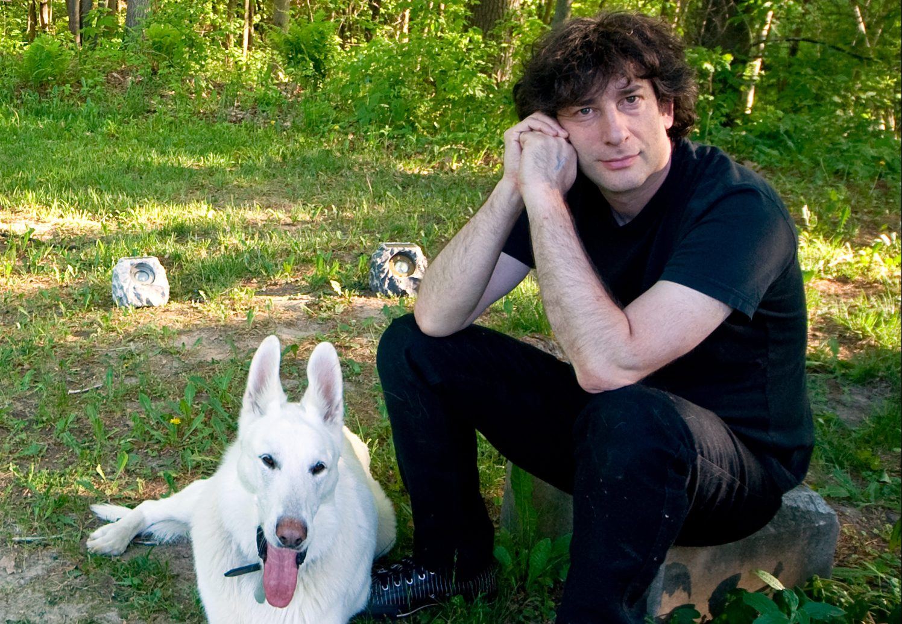

# Американские боги: герои и мифология сериала

> За свой роман «Американские боги» Нил Гейман получил важнейшие 
> фантастические премии. Книга стала культовой и обзавелась продолжениями и 
> ответвлениями, позволяющими говорить о существовании небольшой, но культурно 
> богатой вселенной «Американских богов».
>
> Фанаты давно мечтали об экранизации — и вот свершилось: 30 апреля на канале 
> Starz стартует сериал. Его создатели внушают уважение: продюсер Брайан 
> Фуллер (сериалы «Ганнибал» и «Мертвые, как я») и сценарист Майкл Грин, 
> превративший в «Логане» супергеройское кино в реалистичную драму.

Для тех, кто не читал книгу или хочет освежить воспоминания, мы расскажем, что 
собой представляет странный и интересный мир «Американских богов» и кто его 
населяет. Главные сюжетные повороты мы спрятали под спойлерами.

## Мифотворчество
Говоря об «американской мифологии», мы обычно представляем дядюшку Сэма в 
высоком цилиндре и пантеон супергероев. На заднем плане маячат индейские духи, 
а надо всем этим парит не имеющая физического воплощения «американская мечта». 
По сути, американская история, культура и мифология — почти одно и то же. 
Недаром самая известная певица называет себя Мадонной, а президент Линкольн в 
фильме 2012 года охотится на вампиров. А в главного бога тут верят на зелёных 
банкнотах.

Но у Нила Геймана об этой мифологии свои представления.|

|   |
|---|
||
|Нил Гейман, отец всех богов|

Вернее, у него та же «сборная солянка», но углубленная, переплетённая с чужими 
легендами и сдобренная фирменными сновидческими фантазиями писателя, 
прославившегося серией графических романов «Песочный человек». Поэтому не 
стоит удивляться, что путешествие Тени, главного героя «Американских богов», 
не только сопровождается аллегорическими и вещими снами, но и вовлекает 
читателя в литературное пространство на грани бреда, сна и забытья.

Судя по трейлерам сериала, его создатели постарались передать ирреальную 
атмосферу книги. Если им это удалось, нас ожидает погружение — не в здоровый 
сон, а в глубины коллективного бессознательного, где на людей строят планы 
питающиеся их верой боги. Американские и не только.

|   |
|---|
||
|Есть среди американских богов и русские|

Роман соединяет два пласта реальности: фантасмагорический и повседневный. 
Основное повествование постоянно перебивают «небылицы» (tall tales) — байки в 
традициях американского фольклора. Любопытно, появятся ли эти колоритные 
фрагменты в сериале и как создатели вплетут их в сюжет.

Но главная идея Геймана — противостояние Старых и Новых богов. Старые 
боги-иммигранты когда-то прибыли в Америку. Новых породило само течение жизни. 
Сейчас почти никто не молится Чернобогу и не верит в лепреконов. Люди 
поклоняются технологиям и верят СМИ.

Гейман не совершил великих открытий в области людских верований. Но с главным 
выводом «Американских богов» согласится каждый. Побеждает тот бог, которого 
кормишь.

## Кто есть кто

* [Мистер Среда](./Мистер%20Среда.md)
* [Тень Мун](./Тень%20Мун.md)
* [Лора Мун](./Лора%20Мун.md)
* [Сумасшедший Суини](./Сумасшедший%20Суини.md)
* [Чернобог](./Чернобог.md)
* [Мистер Нанси](./Мистер%20Нанси.md)
* [Пасха](./Пасха.md)
* [Билкис](./Билкис.md)
* [Техномальчик](./Техномальчик.md)
* [Медиа](./Медиа.md)
* [Зоря Полуночная](./Зоря%20Полуночная.md)
* [Лоу Ки Лайсмит](./Лоу%20Ки%20Лайсмит.md)
* [Мистер Мир](./Мистер%20Мир.md)
* [Мистер Шакал, Мистер Ибис](./Мистер%20Шакал.md)
* [Человек-бизон](./Человек-бизон.md)
