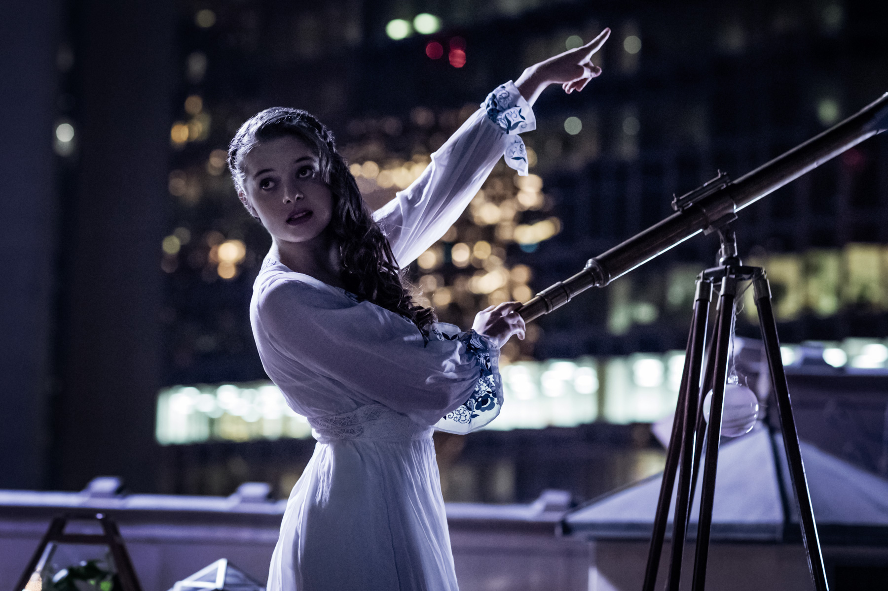

# Зоря Полуночная (актриса Мелисса Роксбур)

 

Три сестры-Зори живут со своим братом Чернобогом. Они олицетворяют разное 
время суток и, возможно, стадии человеческой жизни. В сюжете наибольшую роль 
играет самая молодая из них, Зоря Полуночная, которая дарит Тени особую 
монету. Белоснежные волосы книжной героини сменили в сериале на черные.
