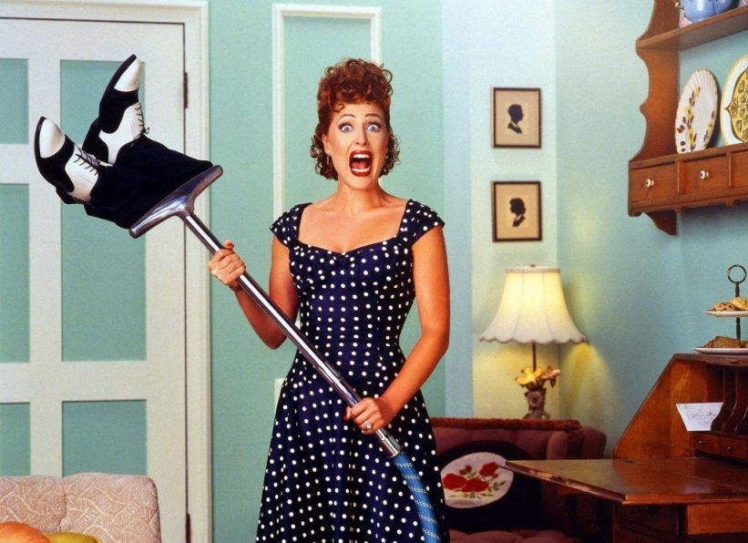

# Медиа (актриса Джиллиан Андерсон)

 

Добрый день, с вами разговаривает телевизор. А главное, что мы знаем о 
телевизоре, — у него бесчисленное количество лиц. Удачно, что все их будет 
представлять звезда «Секретных материалов», уже работавшая с Фуллером над 
сериалом «Ганнибал». Богиня СМИ поначалу, как и в книге, предстает перед Тенью 
в обличье заглавной героини шоу «Я люблю Люси». Но это лишь одна её ипостась. 
Всего их ожидается минимум четыре, включая бога музыки Дэвида Боуи, богиню 
секса Мэрилин Монро и легенду кинематографа Джуди Гарленд.
