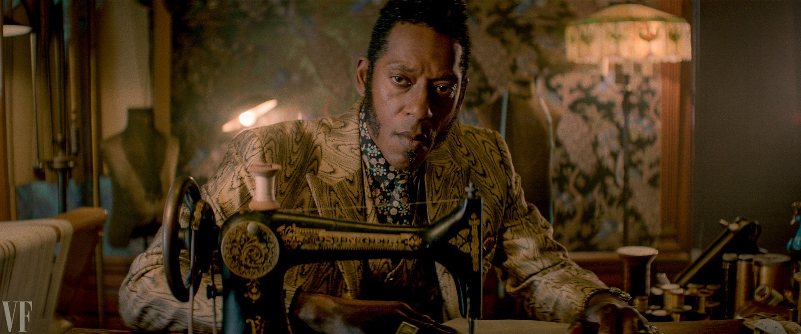

# Мистер Нанси (актер Джонс Орландо)

 

Бог-трикстер и человек-паук. Ананси — один из Старых богов, прибывших в 
Америку из Западной Африки. Колоритен во всем, от примечательного говора до 
яркого костюма. Получил отдельную историю в романе Геймана «Сыновья Ананси» 
2005 года, продолжающего тему плодовитых богов-отцов.

В сериале персонаж стал моложе, но остается внешне эффектным. Актер в интервью 
определил героя как «часть африканской диаспоры». Посмотрим, поднимет ли 
сериал этнические вопросы.
