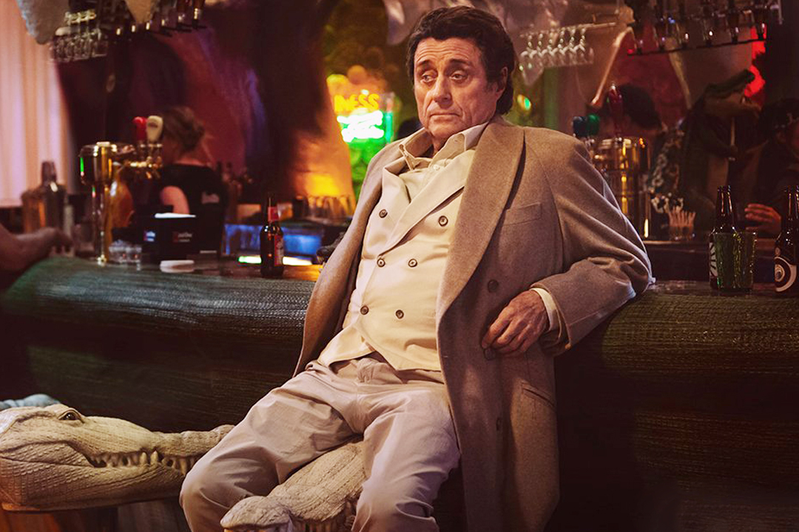

# Мистер Среда (актер Йен Макшейн)

 

Дедок пенсионного возраста с замашками гормонально нестабильного юнца. Не 
дурак выпить и признанный дамский негодник. По большому счету — мошенник, но с 
глобальными планами на людские умы и сердца. Много врёт и не краснеет. 
Вовлекает Тень в новую жизнь.

В экранизации Среда избавился от книжной внешности, но благодаря харизме 
опытного актера Макшейна не утратил загадочности и даже прибавил в обаянии. 
Серьёзная заявка на появление телевизионного секс-символа старше 70 лет.

> ## Спойлер: Кто на самом деле мистер Среда?
> Верховный бог древнескандинавской мифологии Один, он же Вотан и Всеотец. 
> Называет себя Средой, поскольку этот день считался посвященным Одину.
> 
> Среда — это лишь одно из воплощений бога, которых у него множество. С его 
> смертью Один не исчезнет из мира. На его личность намекает не только имя, но 
> и стеклянный глаз (Один в мифологии одноглазый) и серебряная булавка с 
> изображением дерева, которую он носит. Это дерево символизирует исполинский 
> ясень Иггдрасиль, на котором держатся все семь миров. Впоследствии на ясене 
> будет висеть тело Тени.
