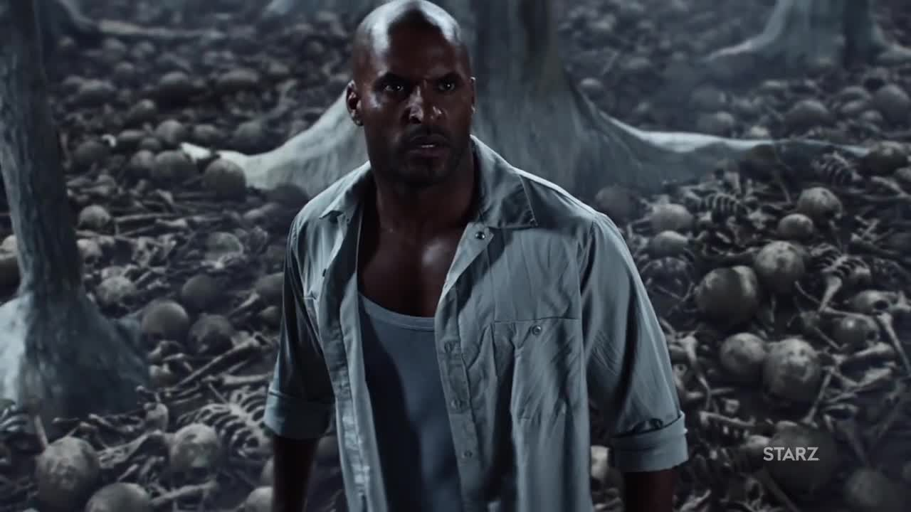

# Тень Мун (актер Рики Уиттл)

 

Молодой мужчина, на начало событий сидящий в тюрьме. Тих, добродушен, любит 
фокусы с монетами, свою жену и может ударом кулака свернуть вам шею. Когда 
терять уже нечего, получает деловое предложение от таинственного незнакомца. 
Из-за подчеркнутой обычности читателю и зрителю легко соотнести себя с Тенью. 
Герой соответствует своему имени: он словно играет второстепенную роль в 
собственной жизни. Но когда он оказывается во власти сверхъестественных сил, 
становится ясно, что боги хотят от Тени больше, чем он от них.

Спортивная фактура Рики Уиттла хорошо передает физическую силу Тени, высокого 
и молчаливого парня. Но пока из-за небольшой известности это самая тёмная 
лошадка сериала.

> ## Спойлер: Происхождение Тени
> Никогда не знавший отца Тень — родной сын Среды. Рождение мальчика было 
> заранее организовано. По миру у Одина разбросано немало детей. Среда — 
> ужасный отец, который готов пожертвовать сыном ради своих целей.
> 
> В повести Геймана «Хозяин долины» подтверждается то, на что намекают «Боги»: 
> Тень — воплощение светлого бога Бальдра из той же скандинавской мифологии. 
> Бальдр тоже пал жертвой козней Локи, умер и воскрес для лучшего мира. Герой 
> всю жизнь прожил как ни то ни сё, ни плохой, ни хороший, а теперь ему 
> предстоит сделать выбор и выйти из собственной тени.
