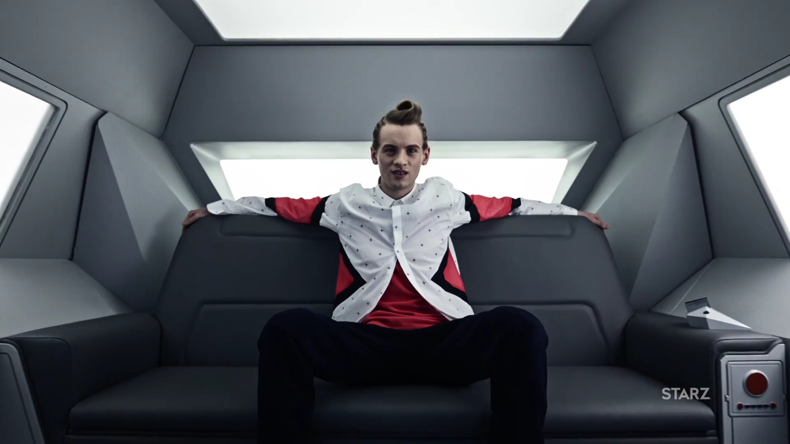

# Техномальчик (актер Брюс Лэнгли)

 

Один из Новых богов — воплощение интернета. Окружен футуристическим дизайном, 
состоит из пикселей и выглядит как миллионер-вундеркинд из Кремниевой долины, 
который с пяти лет пишет на коленке коды и взламывает Пентагон. Четкий и 
дерзкий. В сравнении с книгой, где он был жирным и неопрятным, Техномальчик 
изменился сильнее всего. Как справедливо замечает Брайан Фуллер, с 2001 года, 
когда вышел роман, технологии шагнули в другую эпоху. Скорее всего, у этого 
мальчика будут инстаграм, твиттер, фейсбук и свой канал на YouTube.
