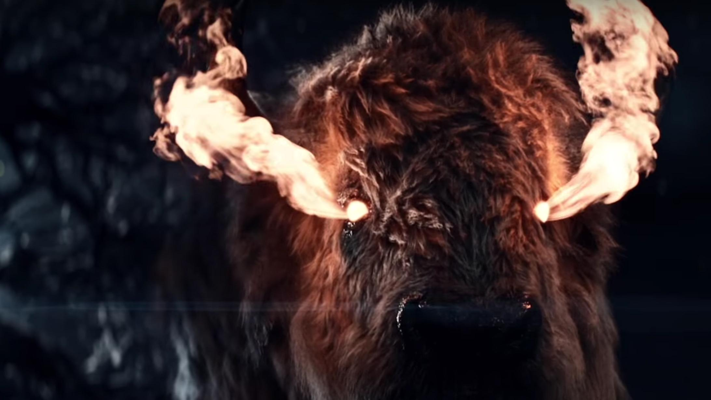

# Человек-бизон

 

Существо с мужским телом и бизоньей головой, которое регулярно является к Тени 
во сне. Незримо присутствует на протяжении всей истории, не принимая прямого 
участия в событиях. Однако складывается впечатление, что он — наибольшая сила, 
существующая в мире «Американских богов». Возможно, самый поэтичный и глубокий 
образ Геймана. Открывая Тени в финале, кто он такой, человек-бизон говорит: 
«Я — земля».
