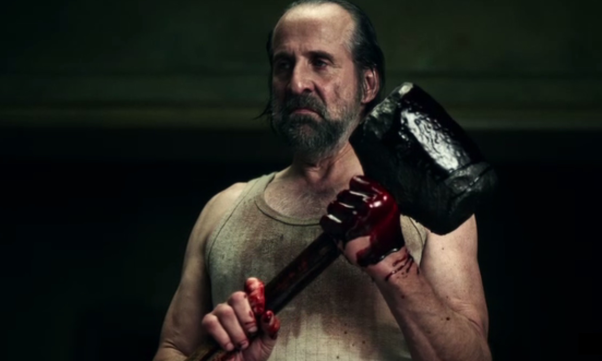

# Чернобог (актер Питер Стормаре)

 

Славянское божество и половина традиционного дуэта «боги-близнецы»: хороший и 
плохой. Прелесть в том, что метафизически это одно и то же существо, поэтому 
Чернобог суров, но справедлив. Работал на скотобойне. Играет с Тенью в шашки 
не на жизнь, а на смерть.

Великолепный Питер Стормаре щеголяет в окровавленной майке-алкоголичке, 
говорит с жутким акцентом и вызывает тёплые воспоминания о своей роли русского 
космонавта из фильма «Армагеддон». Ах, как он колотил молотком по приборной 
панели корабля с рыком: «Проклятая тайваньская техника!»
