# Старая сказка

> Первое правило магии: не дай никому узнать твоего имени. У имен есть сила.
>
> Нил Гейман, комикс «Книга магии»

**Вот говорят: «Раньше и деревья были выше, и трава зеленее». Действительно, с
перспективы, открывающейся ребенку, все казалось новым и значительным. Длинные
дороги, долгие часы. Но время меняет расстояния. Вещи, некогда восхищавшие нас,
сегодня кажутся глупыми и малозначительными. Любимые игрушки валяются на
чердаке, прежние товарищи остались лишь на фотографиях, а из старых сказок в
памяти удерживается лишь хрестоматийное «жили да были».**

## Ничто не возникает из ничего

Все знают, что детство — пора чудес. Но не все помнят, почему. Мало умеет, как
дети, видеть сказочное посреди обыденного. В темном чулане могут жить монстры,
Дед Мороз исправно приносит подарки (почему-то всегда добавляя к ним конфеты с
мандаринами), а пластиковая модель трансформера оживает в твоих руках для
продолжения экранных приключений. Все славим Мегатрона!

	
|   |
|---|
|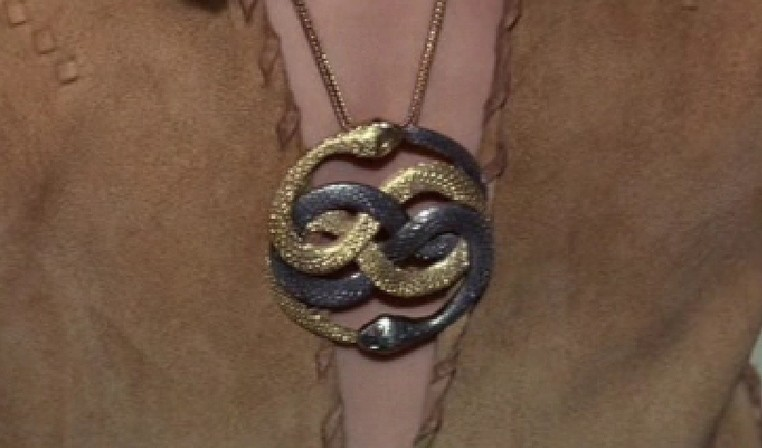 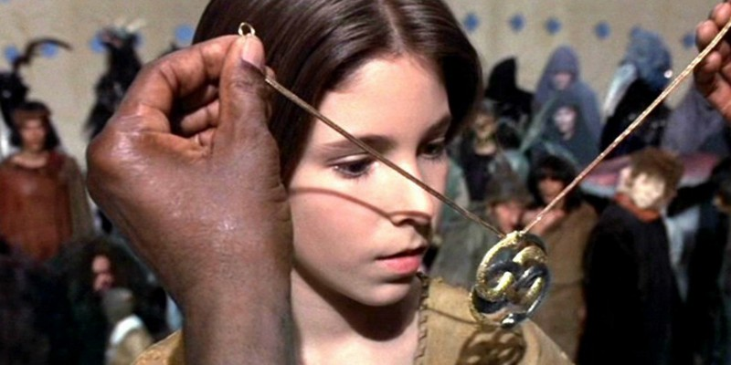|
|Амулет Императрицы сейчас хранится в рабочем кабинете Стивена Спилберга.|

Но связать все элементы детской фантазии воедино и построить некую волшебную
страну может лишь тот, от кого полностью отвернулся реальный мир. К примеру,
десятилетний Бальтазар Бастиан Букс, рано потерявший мать и воспитываемый
строгим отцом. Мальчик грезит наяву, что очень не нравится папе — ведь ребенок
должен расти приспособленным к этому жестокому миру. Отец не понимает, что
именно фантазии помогают сыну справиться с утратой матери и постепенно встать
на ноги, повзрослеть.

|   |
|---|
|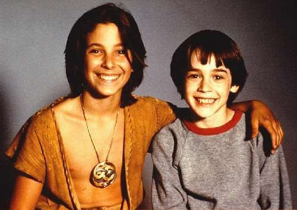|
|Атрейо и Бастиан, два воплощения одного и того же героя.|

Способность видеть за каждым деревом эльфа делает Бастиана изгоем среди
сверстников. В один день, называть который «прекрасным» было бы просто
нечестно, мальчик отправился в школу, но по дороге столкнулся с тремя
хулиганами. Последние, недолго думая, засунули мечтательного бедолагу в
мусорный контейнер, а когда тот выбрался наружу, начали гонять его — так, что
Бастиан вынужден спрятаться от задир в книжном магазине.

Там он встретил мистера Кореандра, читающего книгу под названием «Бесконечная
история». Библиотекарь отказывается дать ее мальчику под предлогом того, что
«книга опасная». Но мужчина отвлекается на телефонный звонок, и Бастиан
«одалживает» книгу, оставляя записку с обещанием вернуть ее. В школу он уже
опоздал (тем более что в классе идет экзамен по математике, заходить на который
совсем не хочется). Бастиан принимает соломоново решение и отправляется на
чердак читать загадочную книгу, совершенно не подозревая, к чему это приведет.

В ней рассказывается о волшебной стране Фантазия, которой угрожает злая сила
«Ничто», стирающая вещи из сказочной реальности. Инициативная группа из Тини
Уини с его гончей улиткой, Найтхоба с его «глупой» летучей мышью и каменного
гиганта Камнееда отправляются за помощью к Императрице Фантазии в Башню из
слоновой кости. Однако спасти волшебный мир девочка не может: она смертельно
больна.

**Как и любая сказка, Фантазия  — продукт человеческого воображения. В связи с
этим волшебная страна не имеет границ. А «Ничто» — это неверие, скука и апатия,
убивающие сказку.**

Для борьбы с «Ничто» Императрица вызывает юного Атрейо из племени охотников.
Ему предстоит пересечь Болота Горя в поисках мудрой черепахи Морлы,
познакомиться с собакоголовым драконом удачи Фалькором и схватиться в бою с
порождением зла — Гморком.

|   |
|---|
|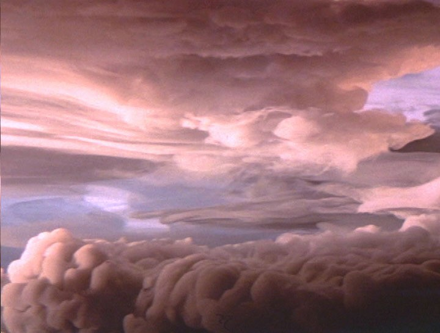|
|Ничто (она же «Пустота») — отснятая на пленку химическая реакция.|

> ### Это интересно
> * Михаэлю Энде не понравилась экранизация и он велел убрать свое имя из
>   титров.
> * Во время съемок Ной Хэтауэй (Атрейо) упал с лошади, после чего та наступила
>   на него, чуть не утонул в искусственном болоте и едва не потерял глаз от
>   тяжелой когтистой «руки» робота Гморка.
> * Императрицу сыграла иранская актриса Тами Стронах.
>
> |   |
> |---|
> |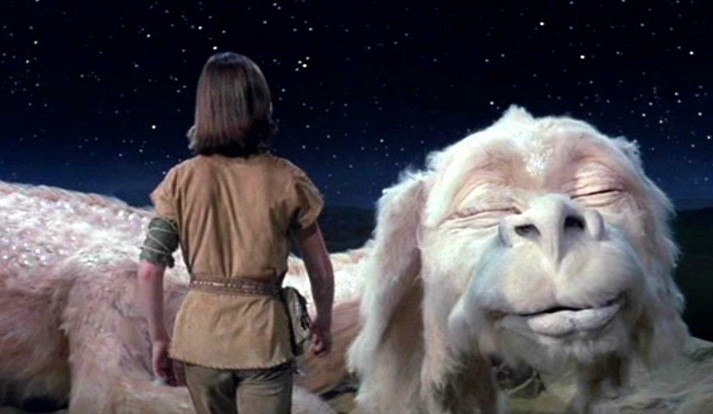|
> |Фалькор — двенадцатиметровый робот с шестью тысячами чешуек и розово-белым мехом.|

## Конец истории

В марте 2009 года на нашем диске выходит самый дорогой фильм восьмидесятых
годов прошлого века из сделанных за пределами США и СССР. Немецкий писатель
Михаэль Энде (1929—1995) опубликовал «Бесконечную историю» в 1979 году. По
популярности эту книгу и ее автора можно было сравнить с «поттерианой» Ролинг.
Неудивительно, что очень скоро подоспела экранизация.

|   |
|---|
|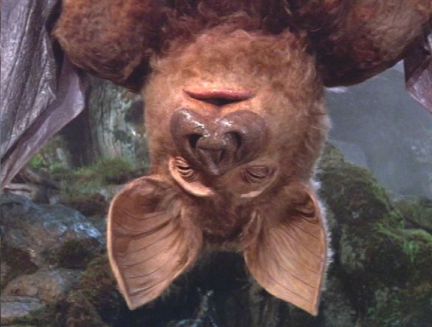 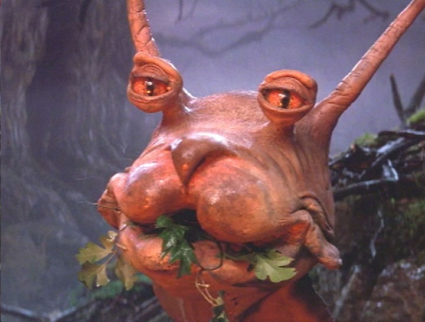 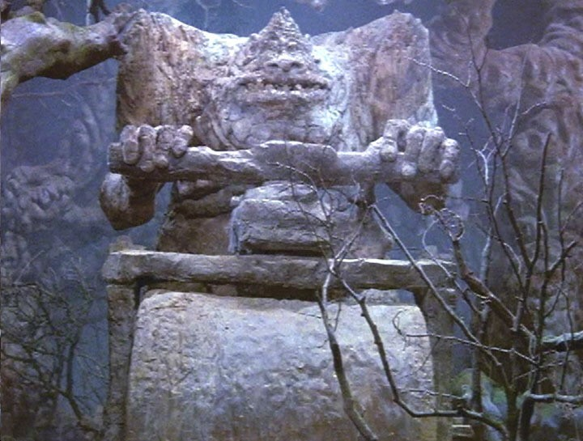|	
|Жители Фантазии.|

Фильм снят лишь по первой половине книги. Остальное досталось сиквелу (мягко
говоря, менее успешному), а третья часть, вышедшая в 1994 году, вообще была
сделана лишь по мотивам книги. Структура сюжета, казалось бы, проста — обычный
квест юного воина, призванного спасти мир от аморфного зла. Нечто вроде
«Конана», но со смешными животными и практически без крови.

|   |
|---|
|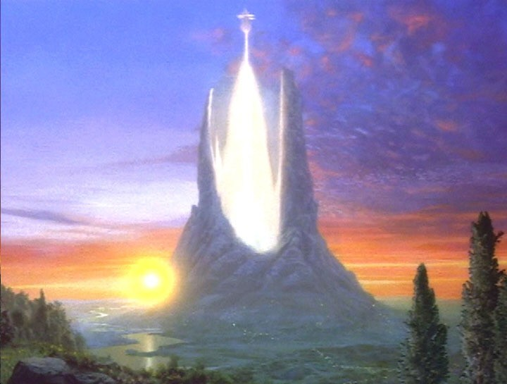    |
|Башня из слоновой кости.   |

Отличие в том, что у этой истории есть и второй уровень, делающей ее
действительно бесконечной. Книга живет своей собственной жизнью — Бастиан
читает про похождения Атрейо и постепенно осознает, что они гораздо реальнее
пейзажа за окном. Персонажи «Бесконечной истории» знают про существование
реального мира и даже про Бастиана. Самый закоренелый скептик поверит в мечту,
если герои книг будут обращаться к нему по имени и умолять спасти их страну.

Мы же читаем (или смотрим) историю Бастиана. Кто-то в другом мире, возможно,
читает про нас — а значит, быть может, череда упакованных друг в друга на манер
матрешек историй никогда не кончится. Невероятная история будет продолжаться
вечно. Это лишь вопрос веры. Никогда еще со времен диснеевского «Питера Пэна»
(где зрителей просили спасти фею Динь-Динь, поверив в нее) эффект «рассказа в
рассказе» не был реализован так ярко.

А поверить в магию Петерсена легко, ведь «Бесконечная история», помимо всего
прочего, еще и один из самых зрелищных фэнтези-фильмов своего десятилетия.
Десятилетия, когда львиная доля машинного времени в студиях расходовалась на
звездные крейсера и свист лазеров в космосе. Здесь же декораторы смогли
создать стопроцентно уникальный сказочный мир, который больше не увидишь ни в
одном фильме.

|   |
|---|
|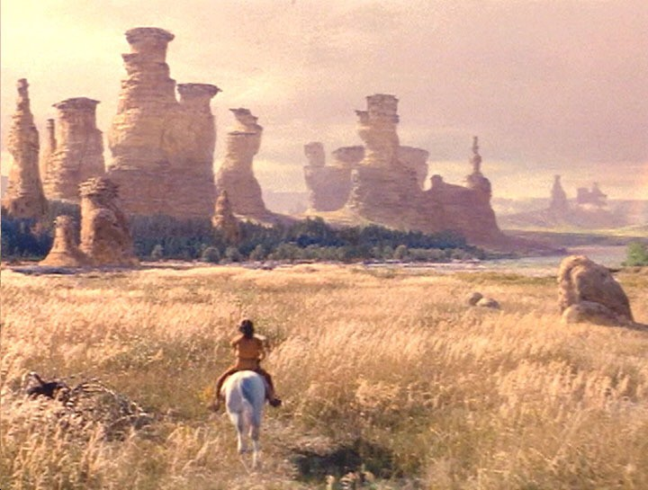 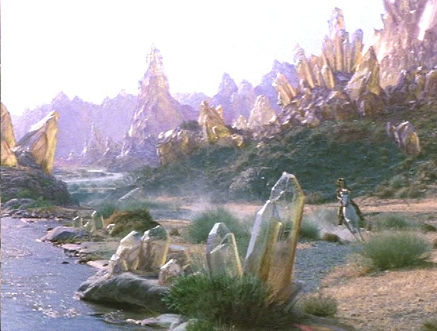|
|Пейзажи подобной красоты сумел создать лишь Питер Джексон, да и то много лет спустя.|

Кое-какие заимствования, впрочем, можно отследить. Кое-что явно взято из «Алисы
в стране чудес» — например, улитка с всадником, — а мохнатый собакоголовый дракон мог быть навеян некоторыми персонажами «Маппет-шоу». Почти весь сюжет предыдущего фильма Петерсена («Подводная лодка», 1981) развивался на субмарине. Здесь же режиссер во всю ширь расправил крылья фантазии  — своей и нашей.

В баварской студии до сих пор стоит Фалькор. На нем можно покататься.

Съемки проходили преимущественно в Западной Германии. Лишь для сцен с Бастианом
«из реальности» пришлось немного поработать в Канаде. Декорации воздвигли на
самой большой киностудии Европы — Bavaria Film Studios на окраинах Мюнхена. В
этом году ей, кстати, исполняется 90 лет. За это время здесь успели поработать
Хичкок, Кубрик, Бергман, труппа «Монти Пайтон», а Петерсен снял свою первую
кинофантастику «Враг мой», пользовавшуюся большой славой в СССР перестроечного
периода.

«Бесконечная история» получилась очень европейской — без чванливых звезд первой
величины и ненужной голливудской мишуры. Львиную долю съемочной группы
составили немцы, к которым в помощь были приданы английские и американские
специалисты. Саундтрек тоже делали в Германии — им занимался Клаус Дольдингер
из джаз-бэнда Passport. Для проката в США к музыке было добавлено немного
техно-попа, так что оригинальное звучание фильма мы уже никогда не услышим.

Картина ориентирована, конечно же, на детскую аудиторию, которую должна научить
ценить надежду и мечту. Но здесь есть некое лукавство. Ряд сцен можно без
колебаний отнести к «трудным» — взять хотя бы скакуна Атрейо, тонущего в
болоте, или сражение с кровожадным Гморком. Тех, кто ложится спать сразу после
«Спокойной ночи малыши», это может испугать. Правильнее было бы адресовать
фильм школьникам младших и средних возрастов, что существенно увеличивает
зрительскую аудиторию.

|   |
|---|
|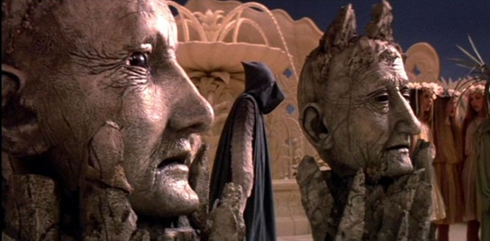|
|Во время съемок в Германии стояла очень жаркая погода, и одна из статуй в Башне слоновой кости попросту растаяла.|

Критики встретили ленту доброжелательно, но в прокате она, можно считать,
провалилась — собрала лишь 20 миллионов долларов при бюджете в 27. Для
сравнения, «Бандиты времени» Гиллиама (1981) заработали сорок два миллиона, а
«Темный кристалл» (1982) — сорок с лишним. Впрочем, досадная неприятность с
прибылью была скоро устранена, ведь релиз «Бесконечной истории» на видео стал
одним из самых продаваемых в истории фэнтези-кинематографа.

Здесь нет ничего удивительного, ведь, напомним, это был своеобразный «Гарри
Поттер» восьмидесятых. Фильм вышел таким же хорошим, как книга. При всей
простоте истории (обратите внимание, что большую часть сюжета Атрейо просто
бродит по Фантазии, изучая ее) внимание непоседливых детей приковывается
умопомрачительными куклами и устаревшими уже в то время «комбинированными
съемками». А пока юный зритель хлопает глазами, ему простыми и правильными
словами объясняют такие понятия, как «вера» и «добро».

А теперь немного попридираемся. Этическая гармония фильма (в отличие от книги)
нарушается финальной сценой. Банальная месть хулиганам — это пошло и нелогично.
Идейный конфликт с отцом, намеченный в самом начале ленты, остался (опять-таки
вопреки книге Энде) неразрешенным. Наконец, Бастиан оказывается мелким
воришкой — обещал вернуть книгу в магазин, но не сделал этого. В оригинале все
заканчивалось гораздо тоньше и мудрее.

|   |
|---|
|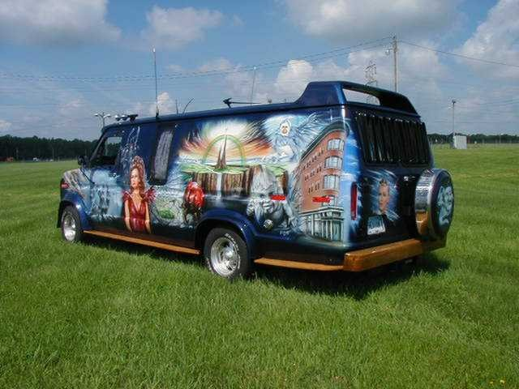 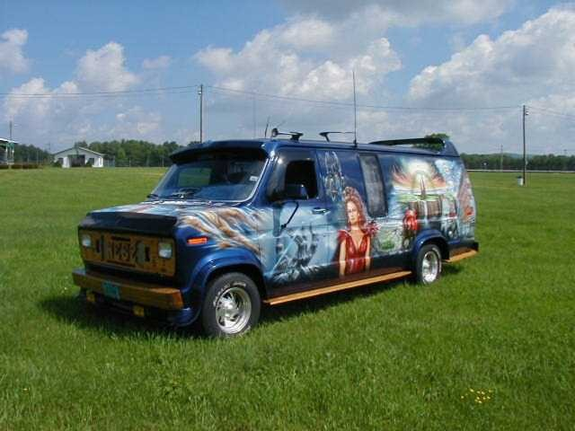|
|Фургон, раскрашенный фанатами по мотивам «Бесконечной истории».|

> ### Наше досье
> Бесконечная история
> 
> Neverending Story
>
> Производство: Neue Constantin Film, Bavaria Studios, WDR
>
> Жанр: фэнтези
>
> Режиссер: Вольфганг Петерсен («Враг мой», «Эпидемия», «Идеальный шторм», «Троя»)
>
> Сценарий: Михаэль Энде, Боб Истон, Вольфганг Петерсен
>
> В ролях: Барретт Оливер, Ной Хэтауэй, Тами Стронак, Джеральд Макрейни, Драм Гаррет
> 
> Продолжительность: 102 минуты
>
> Возрастной рейтинг: PG (некоторые материалы могут не подходить для детей)
>
> Бюджет: 27 миллионов долларов
>
> Премьера: 6 апреля 1984 года
>
> 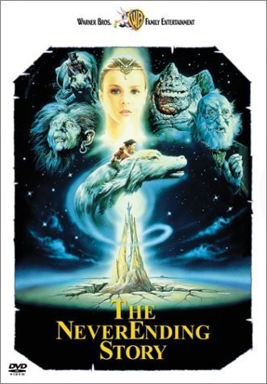

----

«Бесконечная история» никогда не устареет из-за мастерства, с которым она
рассказана. Мальчик сидит на чердаке и с замиранием сердца перелистывает
страницы книги. История не просто развивается, она зависит от его воображения.
Книгу легко можно превратить в ролевую игру, но в данном случае родственником
«Подземелий и драконов» становится кинофильм. Такое не каждый день увидишь.

**Судьбы исполнителей главных ролей увели их далеко от кинематографа. Баррет
Оливер так и не стал актером, предпочтя заниматься фотографией. Ной Хэтауэй
сейчас преподает рукопашный бой для экипажей авиалайнеров и гоняет на
мотоцикле. Тами Стронах посвятила жизнь танцам.**
