# Dark Sun: самый мрачный мир ролевых игр

> Стараясь удержать пылающий шар внутри своего разума, Тихиан посмотрел на арену. С крыши Золотой Башни он видел большую часть громадного поля, простиравшегося от башни до развалин построенной Калаком пирамиды. Вместо гладиаторов на бывшей Арене суетились купцы, горожане, крестьяне. Бойко шла торговля: ягоды, сладкое мясо ящериц, керамические сосуды, ножи, костяные ложки — чего тут только не было. Горячий ветер нёс из пустыни пыль и песок.
>
> **Трой Деннинг «Алый легион»**

Мир Тёмного Солнца родился в 1991 году, когда издательство TSR выпустило книгу правил к игровому сеттингу и роман Троя Деннинга «Охота на дракона». В середине девяностых Dark Sun переживал расцвет. Опалённый безжалостным солнцем мир жил и развивался на страницах полутора десятков фантастических романов.

В 1997 году TSR прекратило существование, и над миром Тёмного Солнца нависли тяжёлые тучи. Но, в отличие от многих полностью забытых сеттингов ролевых игр, Dark Sun ещё не ушёл в историю.

## Атас!

Создатели фантастических вселенных часто не могут противостоять соблазну объять необъятное. Многие из них пытаются уместить в своём мире все красоты и ужасы, которые придут на ум, все идеи, сочетающиеся и нет, и все штампы из произведений собратьев. Демиургам Тёмного Солнца, Трою Деннингу и Тиму Брауну, удалось этого избежать.

Связанный единой идеей мир Dark Sun удивительно компактен и целостен. Это даже не мир, а страна – Атас (Athas), площадью немного превосходящая Саудовскую Аравию и столь же пустынная. По форме это колоссальная, окружённая горами впадина, подобная Таримской котловине на северо-западе Китая.

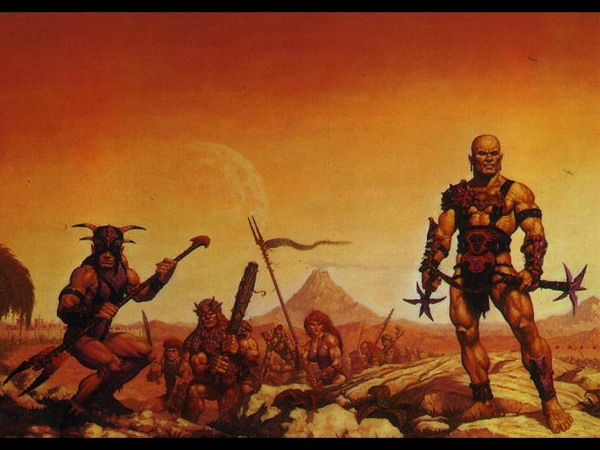

Атас – знойный, жестокий мир, где температура после полудня нередко достигает 50-60 градусов. Путника здесь ожидают песчаные бури, в течение которых день обращается в ночь; безжалостное солнце, вечно багровое, тонущее в тучах пыли; ветер, обжигающий, как дыхание раскалённой печи; серые, извивающиеся колонны пустынных смерчей… и жажда.

Влаги Атас практически лишён. Дождь проливается над пустыней раз в год, а кое-где и раз в десять лет. Ручьи звенят в предгорьях, но через два дня пути вглубь пустыни исчезают, бесследно растворяются в песках. Дальше тянутся лишь сухие русла некогда полноводных рек, кое-где пробегая под уцелевшими с древних времён каменными мостами. Оазисы с мутной водой из глубоких колодцев отделены друг от друга многими днями пути через бесплодное и безжизненное пространство.

Но пустыню нельзя назвать однообразной. Багровые каменистые пустоши, сюрреалистические нагромождения гранитных обломков то расчищаются бурями, то скрываются под волнами барханов высотой в сотни метров. Золотистые пески чередуются с чёрными пятнами вулканических полей и ослепительно белыми солончаками. Ближе к горам, именуемым Звенящими, раскинулись обширные равнины, поросшие кактусами и колючим кустарником, и причудливые лабиринты выветренных, рассыпающихся скал. На склонах гор можно встретить леса и озёра.

|   |
|---|
|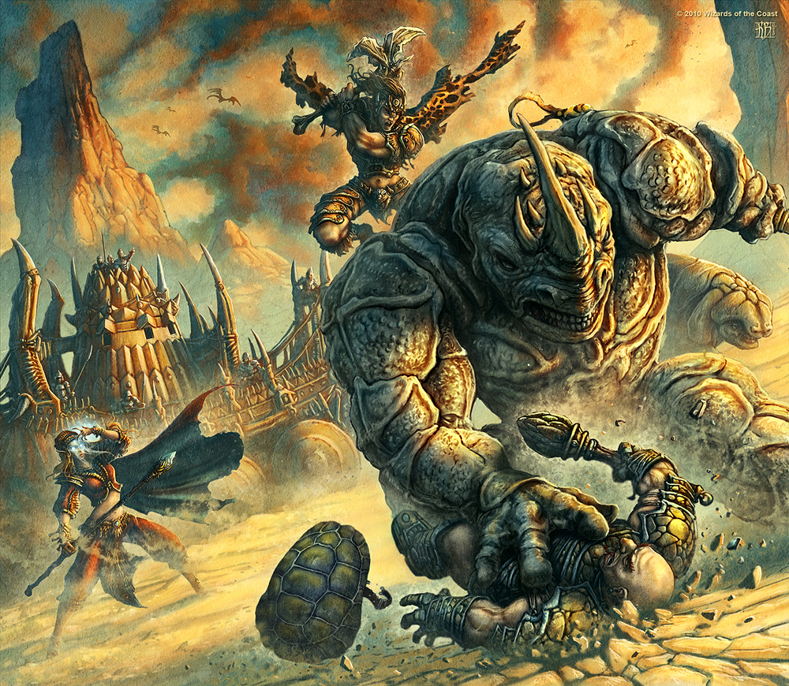|
|Если отвлечься от увлекательной батальной сцены, на заднем плане можно заметить колёсный парусник для путешествия по Морю Ила (худ. Kerem Beyit)|

Центр котловины занимает Море Ила — природная аномалия, аналогов которой нет на Земле. Семисоткилометровая серебристо-розовая равнина, то покрытая рябью застывших волн, то скрывающаяся в жемчужных клубах, поднятых ветром, некогда была дном моря. Сейчас она представляет собой скопление мельчайшей, сухой и скользкой пыли, куда более текучей, чем зыбучий песок. Даже дерево тонет в атасском «иле». Только песчаные парусники, перекатывающиеся на огромных колёсах, способны пересечь его гладь.

Мороз и лавины стерегут путников на неприступных перевалах Звенящих гор. Лишь немногим исследователям удавалось пройти неверными горными тропами и увидеть Дальнеземье – легендарную, таинственную страну по ту сторону склонов. Увы, там не оказалось ничего нового: и обычные для Атаса звери, и климат, немногим более влажный. Разница заключалась лишь в том, что от разумных рас там не было и следа. Только заброшенные постройки в предгорьях напоминают о попытках колонизировать страны за горами, предпринятых древним населением котловины.

|   |
|---|
|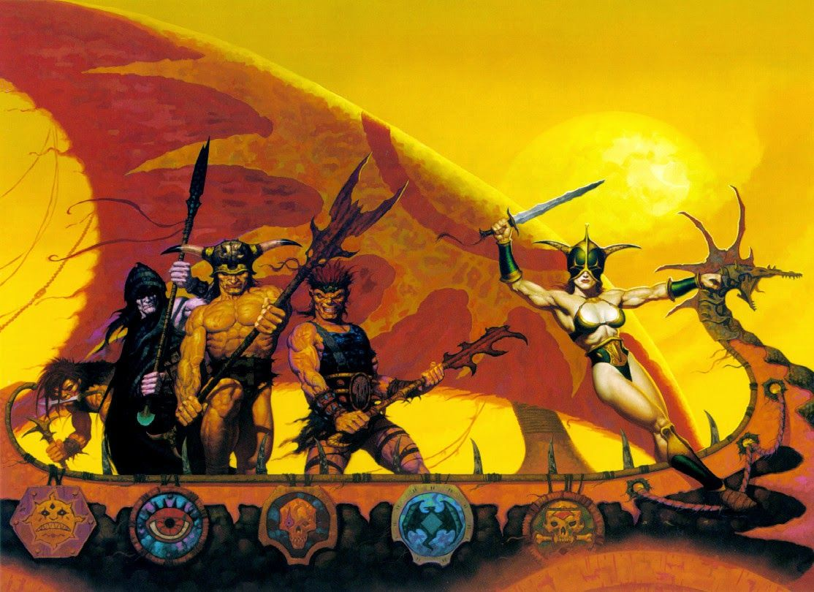|
|Грабители в Море Ила (худ. Brom)|

## Монстры пустыни

Атас полон руин. Отступая, пески открывают древние крепости и храмы. Каменные мосты соединяют берега пересохших рек. Пустыню пересекают никуда не ведущие дороги. На отрогах гор можно увидеть старые, давно выработанные рудники. Даже пыльную гладь Моря Ила пронзают затонувшие башни, а окаменевшие корпуса кораблей, некогда бороздивших здесь воды, всё ещё попадаются у берегов.

|   |
|---|
|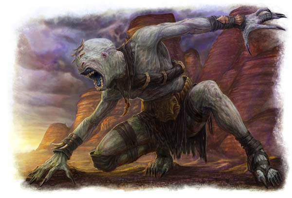|
|Зомби Атаса выпивают не только кровь, но и все прочие жидкости из тела жертвы, превращая её в мумию (худ. Michael Phillippi)|

Руины таят в себе сокровища. Но путь к ним опасен. На пути искателя приключений окажутся оазисы, населённые мертвецами, и коварные миражи, которые создаёт таинственная Дева песка. Покрытые соляной коркой зомби встретят его на солончаках. Хищные кактусы осыплют его ливнем иголок, каждый валун рискует оказаться хищной черепахой, а в каждом источнике может подстерегать добычу прозрачный водяной червь. И даже вдали от достопримечательностей не всегда безопасно: под барханами Атаса неслышно скользят песчаные черви-грабоиды, которые переползли в этот мир из фильма «Дрожь земли» (1989).

Много здесь гигантских насекомых. Даже простые муравьи достигают двух с половиной метров в длину. Охотится на них сорокаметровая многоножка — мегалопеда. Но страшнее всего гигантские осы, чьи колонии выдают себя невысокими глиняными куполами, возвышающимися над песком. В каждом из таких куполов – труп, пожираемый изнутри бледной личинкой.

|   |
|---|
|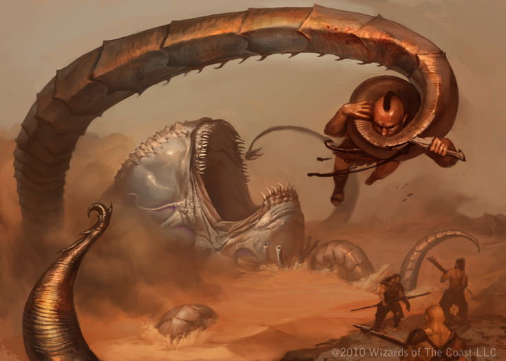|
|Охотясь, иловый ужас добывает не только пищу, но и воду. В пыльном море её можно извлечь лишь из тел живых существ (худ. Matias Tapia)|

Причудлива фауна Ильного моря. Парят над сухими волнами летающие медузы. Беззвучно левитирующий небесный скат отбрасывает на барханы шестидесятиметровую тень. Плоские крокодилы-руктои скользят по поверхности ила. Но куда больше чудовищ скрывается в толще пыли. Это и иловые змеи вдвое больше земной анаконды, и «пыльные ужасы» — гигантские каракатицы, щупальца которых настигают даже летающих ящеров.

Не страшатся «ужасов» лишь восьмиметровые чернокожие великаны, населяющие острова в Море Ила и пересекающие пыльные «воды» вброд (к их счастью, на глубине трёх-четырёх метров ил уплотняется). Мало кто из людей посещал их страну. Говорят, там над источниками склоняются плотоядные растения, а древние дворцы и башни соседствуют с грубыми постройками исполинов.

## Магия, убивающая природу

|   |
|---|
|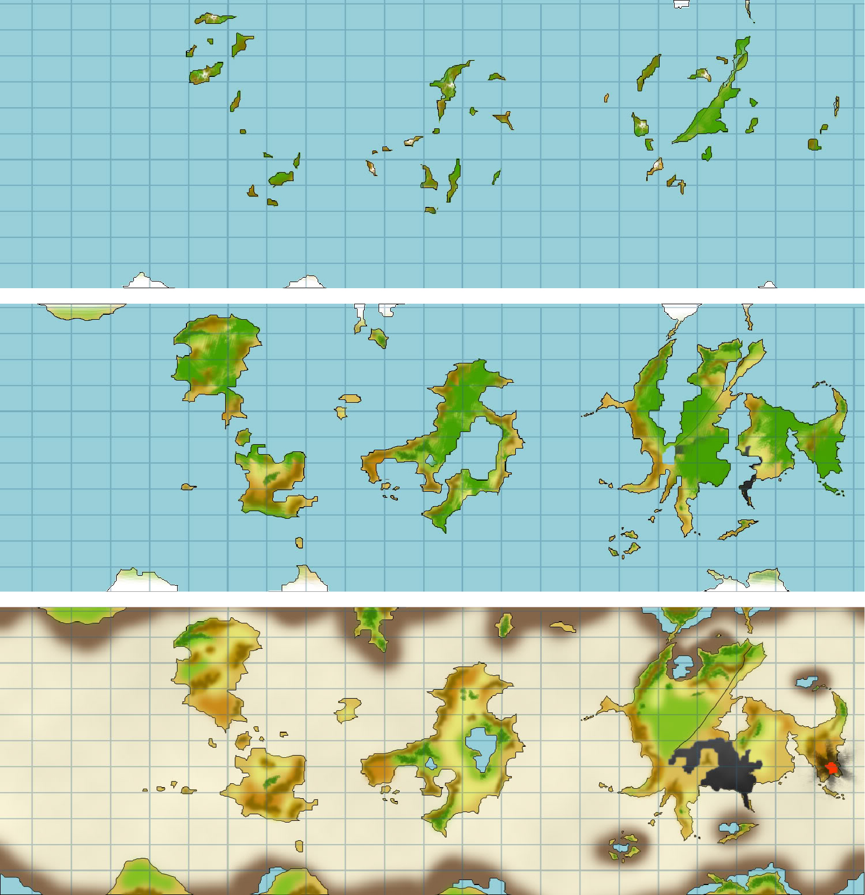|
|Голубой, Зелёный и Бурый века Атаса. Глобальное потепление случилось, но мир не затонул, а высох|

Атас не всегда был пустыней. Легенды народов Атаса рассказывают о давно ушедших веках: Голубом, когда бурные воды покрывали мир, а пышная растительность окутывала немногочисленные острова, и Зелёном — эпохе, когда моря уступили место лесам. Нынешний же бесплодный век, наступивший после того, как солнце стало багровым, именуется Бурым.

|   |
|---|
|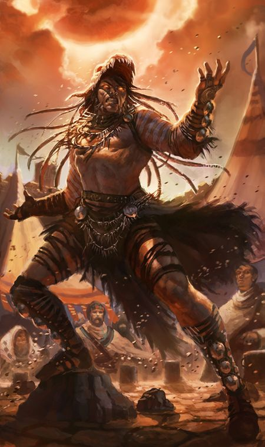|
|Во многих мирах магия лучше технологии тем, что не вредит природе. Про Dark Sun такого не скажешь (худ. Dave Rapoza)|

Эту экологическую катастрофу жители Атаса устроили себе сами, не учтя особенностей местной магии. Волшебство требует внешних источников силы, заклинатель лишь служит её проводником. Маги из мира Dark Sun используют для своих заклинаний стихию жизни. Проблема в том, что энергия при этом расходуется. Если брать её осторожно и помалу, источник не иссякает и жизнь воспроизводит сама себя. Но жадность мага сеет смерть. Растения у его ног высыхают, а почва становится бесплодной.

Каждое грубое применение волшебства оставляет на карте Атаса очередной круг выжженной земли. Лучи солнца накаляют обнажившийся грунт, горячий воздух устремляется вверх, отгоняя от границ страны редкие облака, сумевшие перевалить через горные цепи. Так заклинатели Атаса, уничтожив растительный покров, превратили свою землю в безводную пустыню.

Многие из магов умеют брать силу без ущерба для растений и даже превращать плоды в волшебные эликсиры. Такие колдуны называются хранителями. Но больше осквернителей, ведь выкачивание всей силы без остатка позволяет творить более мощные заклинания. Соблазн слишком велик.

Могущественнейшие из магов-осквернителей не только становятся здесь правителями городов – королями-колдунами — но и создают культы, предоставляя силы для чтения заклинаний жрецам-храмовникам. Настоящих богов Dark Sun лишён, так что жрецы, не желающие служить королям, вынуждены взывать к безличным Огню, Воздуху, Земле и Воде. Стихии им не отвечают, но элементалей на помощь всё-таки посылают и энергию заклинателям дают.

|   |
|---|
|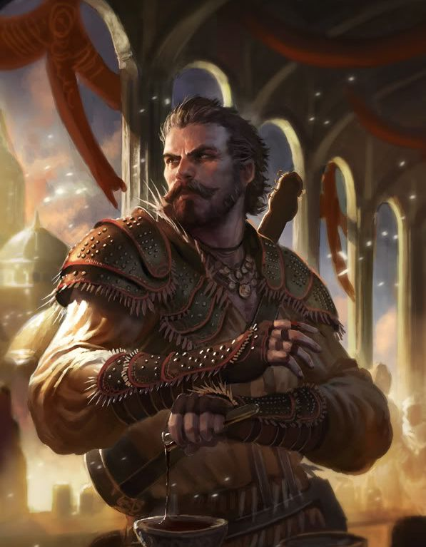|
|худ. Dave Rapoza|

Друиды же Атаса, напротив, больше походят на традиционных жрецов. Ибо служат не обезличенной Матери-природе, а её персонификациям – «духам земли», воплощающим ущелья, заросли, скалы, ползущие барханы и редкие родники. Каждый участок суши в этом мире имеет собственного духа-покровителя. Обычно он бесплотен и лишь при необходимости принимает облик огромной человекоподобной фигуры из песка и камня.

Но жестокий мир Dark Sun учит полагаться только на собственные силы. Жители Атаса часто становятся мастерами псионики: это тайное искусство позволяет творить чудеса, используя внутренние ресурсы своего тела. Псионика, в отличие от обычного колдовства, требует не только развитой воли, но и железного здоровья, поэтому лучше всего подходит для карликов-дварфов.

Не только гуманоиды владеют псионикой. Знакомы с этим искусством и монстры Dark Sun. Ящерица-мыследемон охотится, извлекая страхи из подсознания жертв, постепенно сводя их с ума и подталкивая к гибели. Жук-мучитель просто питается болью. Людоед-белгой, подчинив волю путников, заставляет их ночами покидать лагерь. А пигмеи из племени т’чуб воруют у спящих разум.

> ### Закрытый мир
>
> Попасть на Атас не так-то легко. Его обитателям известно о существовании лишь стихийных планов (Воды, Огня, Земли и Воздуха), а также о плане Тени. От других измерений, входящих в систему Planescape, Dark Sun отрезан загадочным «Серым миром» — обителью душ умерших. Исследователи отождествляют его кто с Эфиром, связывающим стихийные и материальные миры, кто с планом Негативной энергии — ибо из Серого плана черпают силу некроманты и волшебники-тенеплёты.
>
> Из-за этого препятствия даже боги в Атас не заглядывают — слишком трудно добраться и поживиться нечем. Магия королей-колдунов, правда, способна прорвать таинственный барьер: уже в «историческое» время они приводили на Атас армии воинов с других планет. Ценой ещё большего вреда для окружающей среды, разумеется.

## Эльфы-воры и хоббиты-людоеды

Как и полагается продуманному фантастическому миру, Атас дик, бесплоден, но при этом густо населён. Причём не только разбойниками и монстрами. Перепись аборигенов никогда не проводилась, но известно, что жителей в стране примерно пятнадцать миллионов, — и это считая лишь гуманоидов.

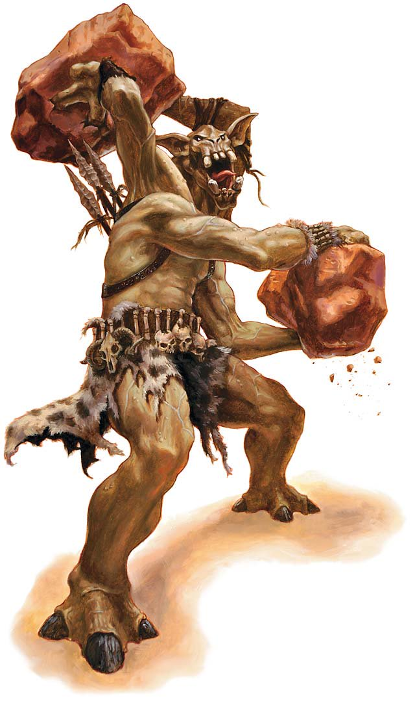

Помимо них, разумом обладают не меньше десятка видов атасских шестиногих рептилий и гигантских насекомых, из которых наиболее известны три-крины. Б’рогов, четвероруких зелёных кочевников, тоже никто не считал, но и их немало. Разработчики явно перенесли сюда этот народ из степей Барсума («Марсианский цикл» Эдгара Берроуза), где они известны под именем тарков. Б’роги отлично приспособились к пустыням, похожим на ржавые равнины берроузовского Марса.

Гуманоиды Атаса принадлежат к расам, распространённым в типичных фэнтези-мирах. Это люди, эльфы, карлики-дварфы, полурослики и великаны. Говорят, орки и «классические» D&D-шные гномы здесь тоже были, но не сумели выжить в мире Тёмного Солнца. Прочие расы приспособились, хотя и ценой чудовищных перемен.

|   |
|---|
|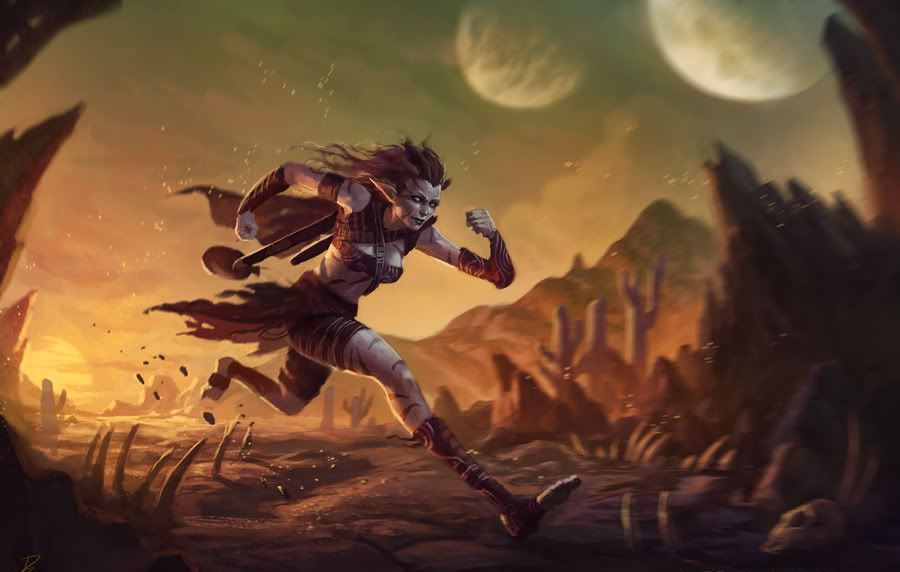|
|Человек, как известно, приспособится ко всему. Но что будет с эльфом, воспитанным вдали от леса?|

Эльфы стали кочевниками и пасут скот — быстроногих жуков-канков, несъедобных, но дающих ценный хитин и густой зелёный мёд. Высокие, больше двух метров ростом, болезненно худые, с грубой, сожжённой солнцем кожей, эльфы славятся склонностью к пирам, бесшабашному веселью и воровству. Они крадут всё. Даже невест из других эльфийских племён. Впрочем, эльфийки не допускают в этом деле половой дискриминации и тоже крадут себе женихов.

Всё краденое, кроме невесты, эльф продаёт. А если эльф продаёт не краденое, то оно наверняка протухшее или поддельное. Если украсть не получается, эльф грабит. Если хозяин вещи не даёт себя ограбить, эльф бежит – удивительно быстро. Если эльф бежит чуть медленнее, он умирает. После чего превращается в нежить – «дюнного бегуна» — и обречён уже вечно бежать по пустыне, лишая разума и увлекая за собой других эльфов, попавшихся на его пути.

|   |
|---|
|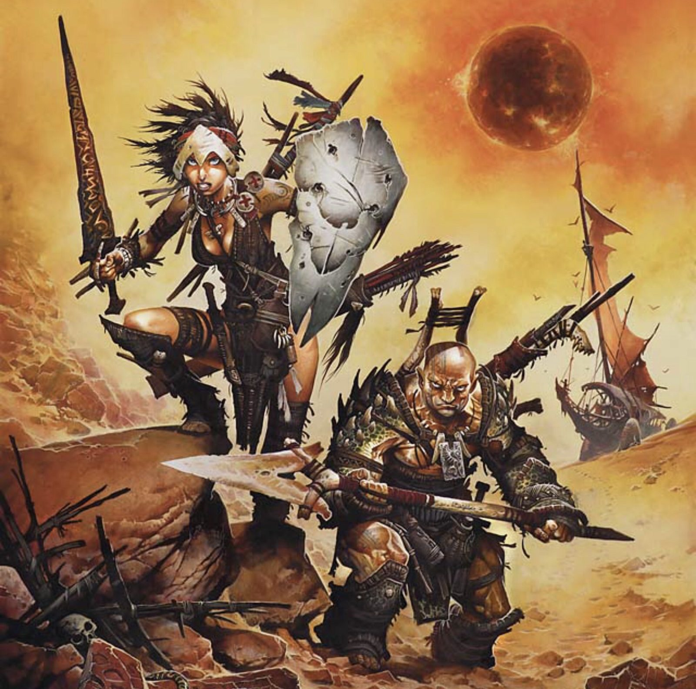| 
|худ. Kerem Beyit|

Очень сильно Атас изменил дварфов. Оставшись плотно сбитыми коротышками, они полностью лишились бород и волос, и такая потеря, похоже, пошатнула их рассудок. В человеческих поселениях дварфы преуспевают как трудолюбивые ремесленники, воины и чиновники, но такая жизнь кажется им пресной и бессмысленной.

Каждым карликом движет идея-«фокус». Следуя своему фокусу, он уходит в пустыню и пытается построить мост там, где нет дороги, или выкопать колодец там, где не может быть воды. И выкапывает, иногда достигая, вопреки всему, водоносного слоя. Если же дварф умирает, не успев совершить задуманное, он тоже превращается в нежить – становится баньши и досаждает окружающим до тех пор, пока мост на пустом и ровном месте не будет построен.

|   |
|---|
|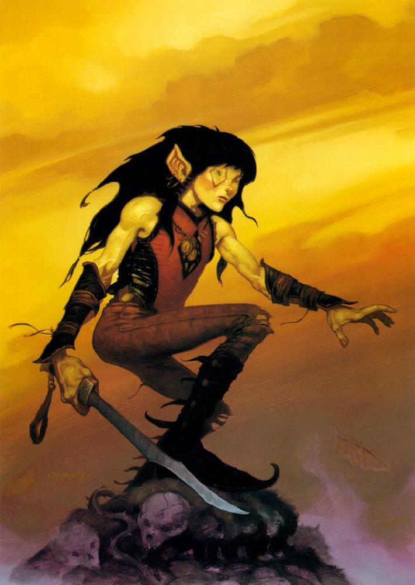|
|Худ. Brom|

Не пощадил жестокий Dark Sun и полуросликов, которые одними из первых, ещё во времена Голубого века, пришли на землю Атаса. К нашей эпохе миролюбивые земледельцы превратились в диких охотников. Они населяют горные леса и время от времени устраивают набеги на равнину. Племена коротышек, возглавляемые магами-хранителями, дружелюбны друг к другу и стремятся жить в гармонии с природой. Они уверены, что, избавившись от других рас с их магами-осквернителями, эру процветания можно вернуть. А чтобы поддержать экологический баланс, малыши употребляют в пищу не животных, а представителей разумных видов. Например, людей.

С людьми как раз ничего особенного не случилось. В этом мире, как и в прочих, они возделали землю, построили города, окружили их стенами и с тех пор воюют между собой за урожай. Трудно сказать, каким Атас был до катастрофы, но ныне цивилизация сохранилась лишь в крупных оазисах. Каждый из них — город-государство, возглавляемый бессмертным, а значит, и бессменным королём-колдуном.

Города различаются между собой. В Балике можно увидеть беломраморные колонны древнегреческих храмов и дворцов, а в Драже – мексиканские ступенчатые пирамиды, на вершинах которых жрецы вырезают пленникам сердца обсидиановыми ножами. Тир знаменит единственной в стране железорудной шахтой, а Урик славится добычей обсидиана. Есть города, захваченные пришельцами из других измерений, а есть и те, что полны нежити и управляются некромантами.

|   |
|---|
|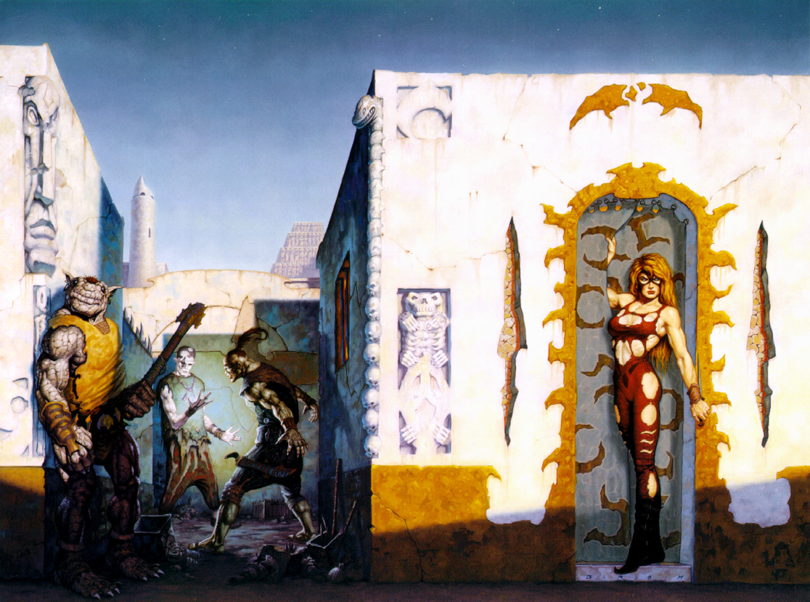|
|Худ. Brom|

Однако города многое объединяет. Всюду бессмертные цари правят, опираясь на администрацию и полицию, состоящую из храмовников. Этот орден объявил грамотность своей монополией и немедленно казнит любого, кто уличён в умении читать. Нет пощады и магам. Население не любит их, не отличая осквернителей от хранителей, правителям и храмовникам тоже не нужны конкуренты. Из всех кудесников-нелегалов только жрецам стихий дозволяют селиться в атасских городах

Обычно храмовники враждуют с аристократами – владельцами колодцев, полей и рабов, обрабатывающих эти поля. Свободная чернь занимается ремеслом и мелкой торговлей. В каждом городе есть арена, ведь гладиаторские бои – важнейшая часть культуры Атаса. И везде можно видеть укреплённые подворья могущественных купеческих домов, контролирующих торговлю между городами.

За пределами крупных оазисов нет ничего, кроме песка, древних руин и чудовищ. Но людей можно встретить и здесь. Там, где растёт кустарник и хоть изредка бывают дожди, племена пастухов-дуаров разводят овец и всеядных чешуйчатых «страусов» эрдлу. Эти птицы дают яйца, мясо, кожу и острые когти, пригодные для изготовления кинжалов. По дорогам из города в город тянутся купеческие караваны из колоссальных, подобных кораблям, фургонов «агросси», в которых запряжены огромные шестиногие мекиллоты — нечто среднее между черепахами и ящерицами.

|   |
|---|
|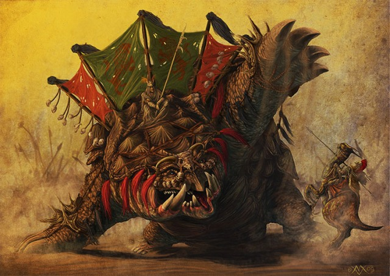|
|Для верховой езды жители Атаса используют ящеров-кродлу, а для грузов потяжелее — черепах-дриков|

А вдоль дорог караваны подстерегают банды разбойников и беглых рабов. Кое-где у колодцев, позволяющих оросить клочок земли, встречаются посёлки. У подножия гор торговцы создают фактории, чтобы обменивать ткани на драгоценную древесину. А в совсем уж глухих местах попадаются отшельники — друиды и псионики, как правило, достаточно могущественные, чтобы постоять за себя в одиночку.

Одинок и единственный — к счастью — дракон Атаса. Змей Тира по имени, как ни странно, Борис, покрыт чешуёй, но ходит на двух ногах. Его дыхание – вихрь раскалённого песка. Но не оно внушает ужас всем, кто завидит вдали его колоссальную фигуру. Борис – король-колдун, древний маг-осквернитель невероятной мощи, черпающий силу не только из растений, но и из тел людей и животных. Там, где колдует дракон, остаются вымершие посёлки, сухой кустарник и усеянные павшим скотом поля. Дракон Тира когда-то был простым смертным, и каждому из сильнейших осквернителей рано или поздно предстоит превратиться в подобную тварь.

|   |
|---|
|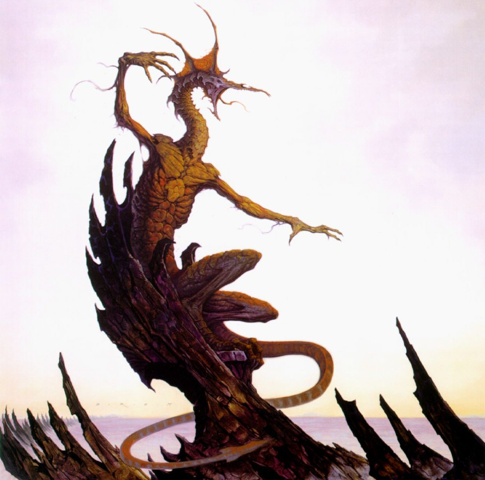|
|Дракон-король Тира, худ. Brom|

Дракон Тира сыграл огромную роль в истории Атаса. Именно он захватил в плен своего учителя, колдуна-полурослика Раджаата, который пытался истребить все «грязные» расы и вернуть Голубой век — попросту говоря, затопить мир. Борис много веков держал Раджаата в заключении, ежегодно принося в жертву тысячи рабов, чтобы иметь на это силы. Кончилось это для Дракона весьма неудачно.

> ### Три—крины
>
> 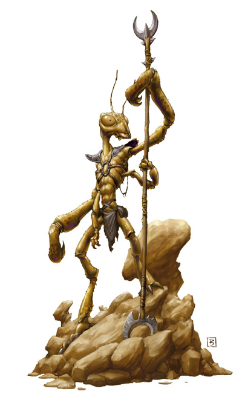
>
> Членистоногие три-крины могут считаться визитной карточкой мира Dark Sun. Стремясь подчеркнуть самобытность мира, разработчики не пошли проторенным путём и не стали создавать расу членистоногих на основе пауков или муравьёв. За образец был взят богомол. Помимо размера, от земных сородичей три-крины отличаются тем, что используют для передвижения только две ноги. Оставшиеся четыре конечности превратились в руки.
>
> Три-крины – общественные насекомые, не отделяющие свою личность от стаи. Поэтому они даже неуязвимы для магии, нацеленной на индивидуальное сознание. Они разумны, но не склонны к созданию цивилизации и остаются дикими охотниками. Гигантские богомолы обладают мощными челюстями, укус их ядовит, но добычу они предпочитают поражать при помощи рукотворного оружия.
>
> Трёхлучевая звезда чаткча используется ими как бумеранг, а в ближнем бою применяется лёгкая глефа — алебарда с короткими лезвиями на обоих концах. Имея четыре руки, три-крин обычно орудует двумя гитками сразу.
>
> Но интереснее всего не само оружие, а способ его изготовления. Три-крины не обрабатывают камень — они склеивают песок смесью собственной ядовитой слюны и сока одного из местных растений, получая прочную, похожую на вулканическое стекло массу под названием «дасл». Вылепив предмет нужной формы, прежде чем дасл застынет, богомол затачивает лезвия трением о камни.
>
> 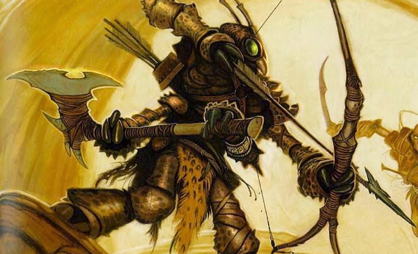

## Оружие из кости

Мир Тёмного Солнца очень беден металлами. Почти все месторождения, доступные киркам даже таких упорных и изощрённых строителей, как дварфы, истощились столетия назад. Единственная действующая шахта не способна обеспечить всю страну металлом. Как следствие, стальной клинок в Атасе стоит раз в сто дороже, чем в других мирах. В кишащих чудовищами руинах кладоискатели ищут не столько золото и камни, сколько драгоценное железо.

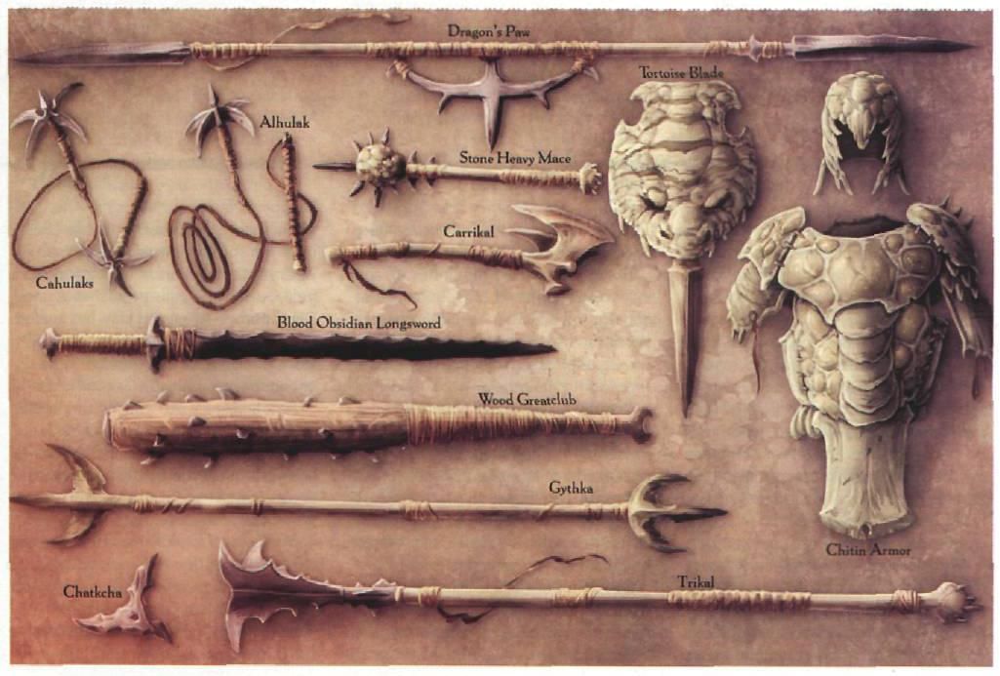

Медь, серебро и золото тоже очень редки, так что бронзовые мечи почти не встречаются. Обсидиановые кинжалы неплохи, но так сложны в изготовлении, что стоят немногим дешевле железных. Даже оружие из кости и дерева по карману лишь избранным, ведь для обработки твёрдых материалов не хватает металлических инструментов. В ходу здесь доспехи из кусков хитиновых панцирей членистоногих чудовищ. А дерутся в Dark Sun секирами и кистенями, на лезвия и крючья которых идут необработанные, но подходящие по форме и остроте кости ящеров. Широко используются пращи и дубины.

Удивительнее же всего монеты, изготовленные из обожжённой и покрытой глазурью глины. На Земле ни один народ не пользовался керамической валютой! Очень трудно поверить, что кто-нибудь согласится продавать товары за глиняные черепки. Сами народы Атаса не слишком верят в свои деньги, предпочитая натуральный обмен.

## Псионика или магия?

|   |
|---|
|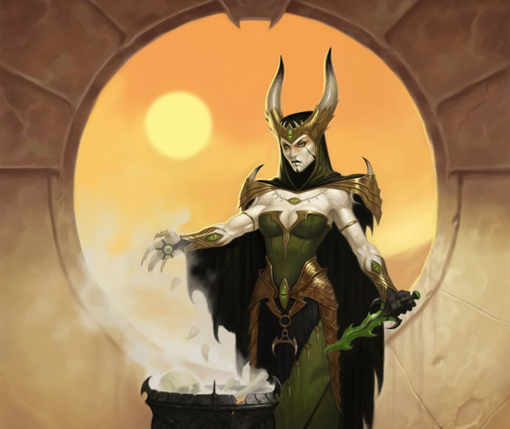|
|Худ. James Ryman|

Псионика – яркая и узнаваемая черта мира Dark Sun. Именно отсюда она начала наступление на другие фэнтези-вселенные. Издатели позиционировали новое искусство как дополнение к привычным возможностям магов и жрецов. И было бы замечательно, соответствуй это действительности.

На самом деле по первоначальной задумке псионика в пустынном Атасе ничего не дополняла. Задавшись целью создать мир, как можно менее похожий на толкиновское Средиземье, разработчики TSR ввели псионику как местный аналог магии, куда лучше гармонирующий с шестиногими ящерами и жестокими пустынями, чем традиционное волшебство. Псионика же по духу близка к научной фантастике вроде «Дюны» и связана с другим пластом современного фольклора – экстрасенсорикой и мистическими техниками, которыми якобы владеют мастера восточных единоборств.

Для нового тайного искусства была разработана особая игровая механика, более совершенная и убедительная. Во многих отношениях она была лучше, чем механика магии не только во второй редакции D&D, действовавшей тогда, но даже в третьей и четвёртой. Заклинания уже не набирались с бору по сосенке — появилось древо развития. И даже на самых высоких уровнях псионик не мог овладеть каждой из шести дисциплин: ясновидением, психокинетикой, позволяющей нагревать и перемещать предметы, целительной психометаболикой, психопортацией, телепатией и метапсионикой.

На свои трюки заклинатель расходовал силу, запасом которой мог распоряжаться на своё усмотрение, применяя те или иные способности. Каждая попытка использования «наук» и «посвящений» могла с определённой вероятностью провалиться. Эффекты требовали поддержания, а наличие груза увеличивало затраты на левитацию.

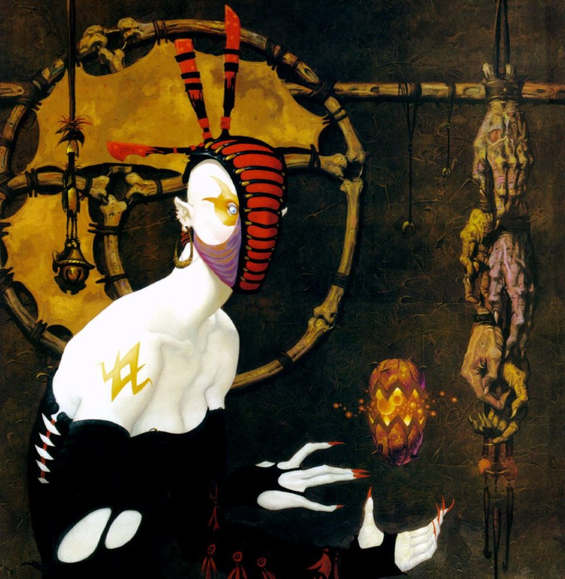

Система вышла сложноватой, её достоинства можно было реализовать и проще, но беда заключалась в другом. В TSR так и не решились исключить из сеттинга привычных игрокам жрецов, волшебников и друидов. В итоге псионика стала использоваться в Dark Sun, а позже и в других мирах, не вместо магии, а вместе с ней.

Две системы начали применяться одновременно. Причём одно и то же лицо могло сочетать способности псионика и колдуна, а эффект от псионических воздействий ничем особенным не отличался от действия магических и жреческих заклинаний. Так что параллельное использование двух игровых механик выглядело совершенно неоправданным.

----

В начале двухтысячных усилиями энтузиастов был осуществлён перевод Dark Sun на третью редакцию D&D, который даже получил официальное признание. Тем не менее монстры сеттинга в мануалы редакции 3,5 включены не были. Казалось, что сеттингу пришёл конец, но в 2010 году, после выхода четвёртой редакции, Wizards of the Coast решила оживить мир Тёмного Солнца. Были изданы книги правил. Увидели свет три новых романа по сеттингу.

Атас продолжает жить как образец благородного лаконизма и доказательство того, что успешная фэнтези-вселенная совсем не обязательно должна напоминать Средиземье.

### Что почитать?

* Трой Деннис «Изумрудный перевал»
* Эбби Линн «Медный гамбит»
* Симон Хоук «Изгнанник»
* Райар Хьюдж «Тьма перед рассветом»

### Во что поиграть?

* Dark Sun: Shattered Lands (1993)
* Dark Sun: Wake of the Ravager (1996)
* Dark Sun Online: Crimson Sands (1998)

### Художники

Джеральд Бром, несомненно, самый известный иллюстратор Dark Sun. Но далеко не единственный. Внимания заслуживают также Дэйв Рапоза, Михал Вондрачек, Керем Бейит, Матиас Тапиа, Уэйн Рейнольдс и Ральф Хорсли, работы которых украшают эту статью.
