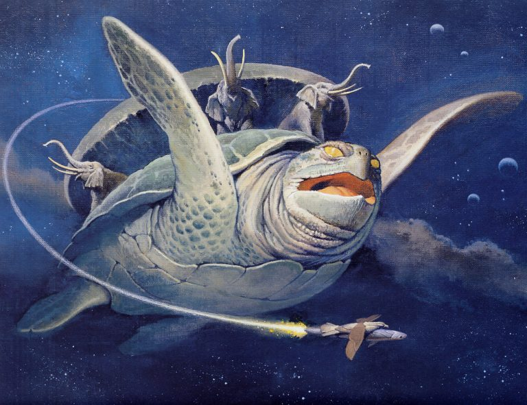
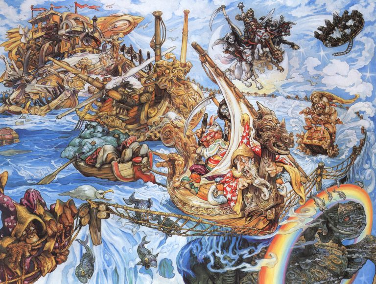
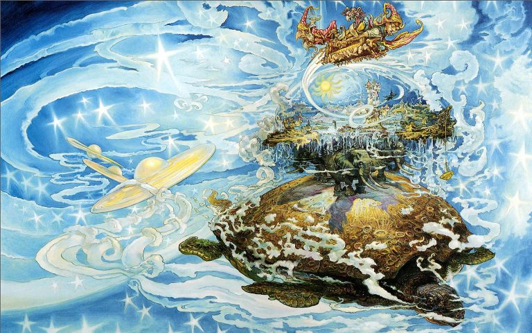
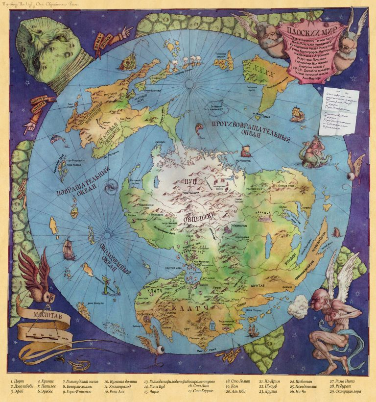
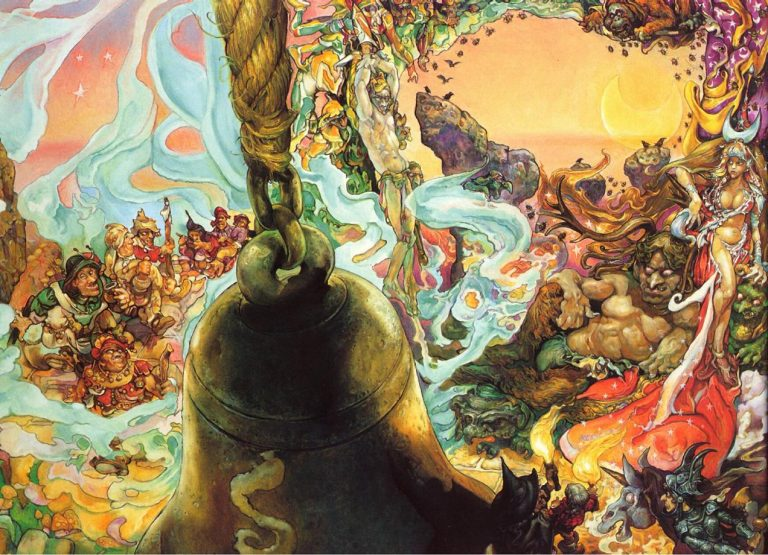
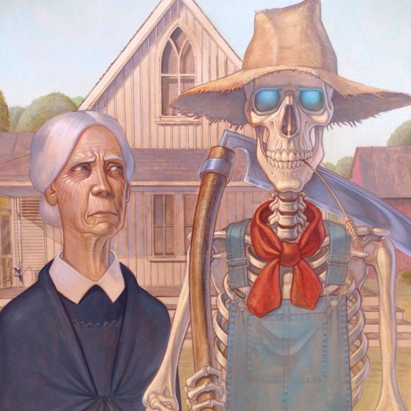

# Туристический путеводитель по Плоскому миру

Туристическое бюро «Мира фантастики» предлагает вам путеводитель по миру 
Диска! Это, быть может, самый весёлый из фантастических миров — и один из 
самых парадоксальных. Неудивительно, если учесть, что некоторые его части 
вообще не были досозданы местными богами. Кстати, боги на Диске абсолютно 
реальны и имеют привычку бить стёкла в домах атеистов.

Мы не можем гарантировать, что путешествия по Диску будут абсолютно безопасны, 
зато они точно не дадут заскучать — потому что произойти может вообще что 
угодно. Аномалии времени, пространства, магии, других миров — к вашим услугам!

## На великом А’Туине

> …Звёздная черепаха Великий А’Туин, чей панцирь покрыт коркой замёрзшего 
> метана, изрыт метеоритными кратерами и отшлифован астероидной пылью. Великий 
> А’Туин, чьи глаза похожи на древние моря, а мозг размером с континент, по 
> которому скользят маленькие сверкающие ледники-мысли. Великий А’Туин, 
> обладатель огромных, медлительных ласт и отполированного звёздами щитка, 
> медленно, с трудом плывущий сквозь галактическую ночь и несущий на себе всю 
> тяжесть Диска. Огромный, как миры. Древний, как Время. Безропотный, как 
> кирпич…
>
> Ну, вообще-то, тут философы заблуждаются. На самом деле Великий А’Туин 
> оттягивается на полную катушку.
>
> *Терри Пратчетт «Безумная звезда»*

Главная достопримечательность мира Диска — сам мир Диска.

Есть много миров, которые одиноко вращаются в космическом вакууме вокруг своих 
солнц, или не менее одиноко летят куда-то через Вселенную, или представляют 
собой  скопления обитаемых планет… Но, как правило, все они по устройству 
похожи — шарики разных цветов, населённые разумными, не особо разумными и 
совершенно неразумными расами. Иногда для разнообразия к шарикам прилагаются 
луны или звёзды смерти — но это не слишком меняет общую картину.

Совершенно иное дело с Диском.

Звёздная черепаха Великий А’Туин медленно, взбивая гигантскими ластами 
пространство, плывёт по межзвёздному проливу вдоль берегов Бесконечности, 
порой поворачивая огромную голову, чтобы щёлкнуть клювом в сторону пролетающей 
кометы. Зачем — сложно сказать: комета вряд ли испугается, да и пищевой 
ценности она не представляет… Возможно, носителю мира просто хочется 
поразвлечься. Не так уж часто это происходит, если большая часть твоих 
мыслей — о Бремени.

|   |
|---|
||
|Выглядит это примерно так (художник Джино д’Ачилле)|

Лишь изредка — и по весьма уважительной причине — Великий А’Туин покидает 
приятные космические глубины и направляется на солнечное мелководье. Причина 
эта понятна каждой уважающей себя черепахе, независимо от размеров. Именно 
там, на побережье света, где магия опасно слабеет и прогибается под 
реальностью (что становится нешуточной угрозой для Диска), из каменных сфер, 
долгое время круживших вокруг звезды, вылупляются маленькие черепашата — чуть 
крупнее астероида, ещё блестящие от желтка, но уже со своим вполне комплектным 
Бременем. Потомство надо сопроводить во взрослое плавание — так что пассажирам 
приходится потерпеть. В конце концов, должны же как-то создаваться новые миры.

Большую часть Бремени — действительно тяжёлого, даже для космической 
черепахи, — составляют четыре огромных, изрядно загорелых под звёздным светом 
слона: Берилия, Тубул, Великий Т’Фон и Джеракин. Которые, в свою очередь, 
работают подставкой для собственно Диска, имеющего диаметр десять тысяч миль и 
накрытого небесным куполом.

С Диска стекает бесконечный Краепад — это моря Диска переливаются через Край в 
космическое пространство. А в туманном воздухе над Краепадом висит Краедуга — 
восьмицветная радуга. Но мы, уроженцы немагического мира, увидим её как 
семицветную. Восьмой цвет — это октарин, и его способны видеть только 
волшебники, у которых в глазах, помимо привычных нам палочек и колбочек, есть 
ещё и восьмиугольники. Октарин образуется благодаря эффекту рассеивания 
солнечного света в интенсивном магическом поле и, по словам волшебников, 
напоминает светящийся зеленовато-жёлтый пурпур.

|   |
|---|
||
|На диске именно октарин — а отнюдь не чёрный — противоположен белому|

Впрочем, не факт, что увидеть Краедугу — к добру. У Края морские течения 
усиливаются и с какого-то момента повернуть корабль обратно уже не удастся. 
Будьте осторожны!

> #### Если посмотреть в небо диска
> 
> …там мы тоже увидим кое-что интересное.
>
> У диска есть своя луна — она находится ближе, чем солнце, и светит не 
> отражённым, а своим собственным светом. Относительно солнца она неподвижна, 
> так что её половина выжжена намертво и дочерна, — на другой же живут лунные 
> драконы, питающиеся серебристой травой. Когда луна повёрнута серебристой 
> стороной, на Диске наступает полнолуние, новолуние же означает, что на Диск 
> смотрит выжженная сторона.
>
> Зодиак Диска составляют шестьдесят четыре созвездия: Небесный Пастернак, 
> Корова Небес, Летучий Лось, Переплетённая Верёвка, Две Толстые Кузины, 
> Маленькая Скучная Группа Блёклых Звёзд и другие.

Благодаря тому, что местное крошечное солнце движется вокруг Диска, а сам Диск 
вращается со скоростью один оборот в восемьсот дней, времён года там не 
четыре, а восемь. Солнце всходит и заходит не на фиксированном «востоке» и 
«западе», а постоянно смещаясь и за год описывая полный круг. Средняя 
температура же зависит от того, насколько близко к Краю находится местность. 
Холода ожидают тех, кто живёт возле Пупа, то есть центра Диска; чем дальше от 
Пупземелья, тем теплее.

 

Этим аномалии не исчерпываются. Свет движется с дозвуковой скоростью — из-за 
того, что распространяется в сильном магическом поле. Вода — благодаря тому же 
магическому полю — бывает сухой: это можно наблюдать в Обезвоженном океане. В 
этом агрегатном состоянии она похожа на серебристый песок, но по ней могут 
ходить корабли. В Обезвоженном океане обитают даже рыбы — естественно, 
уникальных пород, не похожие на тех, что известны нам по содержимому 
океанариумов и тарелок.

Свет можно улавливать в резервуары из отполированного кварца и хранить, пока 
он не понадобится, — чем с успехом пользуются волхвы, обитающие у Великой 
пустыни Неф, что на материке Клатч. Говорят, такие резервуары после нескольких 
недель хорошей погоды представляют собой поистине потрясающее зрелище, 
особенно если наблюдать с высоты.

## Куда направиться?

Рассказывать о мире Диска можно вечно, но отпуск не бесконечен. Так что, 
прежде чем покупать билет, стоит выбрать, куда именно хочется отправиться. 
Четыре континента (с точки зрения географии вообще-то два, но Безымянный, 
Клатч и Противовесный принято считать по отдельности — как у нас Европу и 
Азию), множество островов и стран, самые разнообразные народы, населяющие 
их, — в общем, есть над чем призадуматься.

Мы опишем наиболее интересные места, ни в коей мере, конечно же, не претендуя 
на всеохватность огромного и интереснейшего мира Диска. А чтобы помочь 
определиться с выбором, предлагаем тест — в лучших традициях нашего мира, где 
все любят выяснять, какой вы йогурт в Средиземье.

 

* [Земля разумных груш и покорных людей: Агатовая империя](./Агатовая-империя.md)
* [Волна над краем: Крулл](./Крулл.md)
* [Дуракам полработы не показывают: континент ХХХХ](./Континент-ХХХХ.md)
* [Время в пирамидах: Джейлибейби](./Джейлибейби.md)
* [Рай рабов и философов: Эфеб](./Эфеб.md)
* [Жирная земля: Убервальд](./Убервальд.md)
* [Чудеса на карнизе: Ланкр](./Ланкр.md)
* [Обитель богов: Пуп](./Пуп.md)
* [Анк-Морпорк](./Анк-Морпорк.md)
* [Просто сказка: Орлея](./Орлея.md)

## Вам туда не надо!

Искренне надеемся, что вы никаким образом не попадёте из мира Диска в другие 
измерения (и не столкнётесь с теми, кто в них обитает). Почему? Ну, например, 
потому, что вернуться оттуда живым и не изменившим своей сущности не 
удавалось, кажется, никому из простых смертных. Даже тем, кто одарён 
способностью к магии, сгинуть там куда легче, чем выжить… Так что расскажем о 
мерах предосторожности в мире Диска.

|   |
|---|
||
|Дамы и господа глазами Джоша Кирби|

Во-первых, не думайте и уж тем более не говорите об эльфах, тем паче о 
королеве эльфов. Если в этом есть какая-то необходимость — употребляйте 
эвфемизмы вроде «дивный народ» или «дамы и господа»; не беспокойтесь, кому 
надо, вас поймут. Даже мысли о них помогают созданиям из Страны Фей — 
паразитного измерения, что прикрепляется к той или иной вселенной и питается 
ею, — проникнуть в мир Диска и там поразвлечься. А развлечения у тамошних 
эльфов достаточно незатейливы: разбои, грабежи и пытки.

К сожалению, из-за того, что эльфы умеют очаровывать и гипнотизировать людей, 
противостоять им сложно — а неподготовленному человеку невозможно. Так что 
лучше с ними просто не встречаться. И носите с собой что-нибудь железное, да 
покрупнее — это хоть как-то собьёт с толку врага.

Во-вторых, старайтесь избежать внимания Аудиторов — жителей ещё одного 
измерения, соприкасающегося с Диском. Это чрезвычайно неприятные сущности 
(впрочем, они о нас думают не лучше). Опасность Аудиторов даже не столько в 
том, что они любят во всём разбираться (точнее, разбирать на составляющие, до 
атомов включительно), а в том, что саму жизнь они полагают грязным пятном на 
простыне Вселенной. Ну и по мере возможностей — а кое-какие у них есть — 
стараются эту простыню почистить.

А в-третьих, берегите себя. Смерть, конечно, вдумчивый и вежливый собеседник 
(хотя он говорит ИСКЛЮЧИТЕЛЬНО КАПИТЕЛЬЮ), и побывать в его доме, тоже 
находящемся в отделённом от Диска пространстве, может быть небезынтересно (вы 
когда-нибудь видели ванную с трубами без отверстий и полотенца из камня? а 
светящуюся лошадь? а песочные часы-жизнеизмерители? да и вообще место, где 
время не течёт и где невозможно постареть?) Но всё-таки на встречу с ним лучше 
не торопиться.

|   |
|---|
||
|Смерть в отпуске, запечатлённый Полом Кидби|

----

|   |
|---|
||
|Кстати, эти карточки — с сайта [http://discworldemporium.com](http://discworldemporium.com)|

Мы, конечно, описали (и то весьма кратко) лишь несколько интересных мест в 
мире, что несёт на своей спине Великий А’Туин. К сожалению, объёмы буклета не 
позволяют рассказать обо всех достопримечательностях Диска. Нам пришлось 
обойти своим вниманием и Щеботан, родину величайшего изобретателя Леонарда 
Щеботанского, и тропики Говандоленда, где находится потерянный храм Оффлера, 
бога крокодилов, и воображаемых драконов из Червберга, и города равнины Сто…

Но, как известно, лучше один раз увидеть, чем сто раз услышать. Наше 
туристическое бюро гарантирует: после первой же поездки на Диск вам захочется 
возвращаться туда снова и снова. Откройте для себя мир Диска! Приятных 
путешествий!
