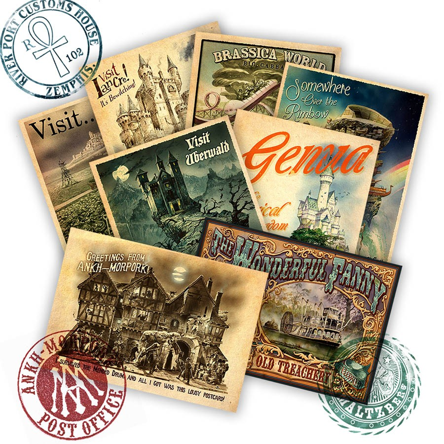

# Туристический путеводитель по Плоскому миру

Туристическое бюро «Мира фантастики» предлагает вам путеводитель по миру 
Диска! Это, быть может, самый весёлый из фантастических миров — и один из 
самых парадоксальных. Неудивительно, если учесть, что некоторые его части 
вообще не были досозданы местными богами. Кстати, боги на Диске абсолютно 
реальны и имеют привычку бить стёкла в домах атеистов.

Мы не можем гарантировать, что путешествия по Диску будут абсолютно безопасны, 
зато они точно не дадут заскучать — потому что произойти может вообще что 
угодно. Аномалии времени, пространства, магии, других миров — к вашим услугам!

 

 

## На великом А’Туине

> …Звёздная черепаха Великий А’Туин, чей панцирь покрыт коркой замёрзшего метана, изрыт метеоритными кратерами и отшлифован астероидной пылью. Великий А’Туин, чьи глаза похожи на древние моря, а мозг размером с континент, по которому скользят маленькие сверкающие ледники-мысли. Великий А’Туин, обладатель огромных, медлительных ласт и отполированного звёздами щитка, медленно, с трудом плывущий сквозь галактическую ночь и несущий на себе всю тяжесть Диска. Огромный, как миры. Древний, как Время. Безропотный, как кирпич…
>
> Ну, вообще-то, тут философы заблуждаются. На самом деле Великий А’Туин оттягивается на полную катушку.
>
> *Терри Пратчетт «Безумная звезда»*

Главная достопримечательность мира Диска — сам мир Диска.

Есть много миров, которые одиноко вращаются в космическом вакууме вокруг своих солнц, или не менее одиноко летят куда-то через Вселенную, или представляют собой  скопления обитаемых планет… Но, как правило, все они по устройству похожи — шарики разных цветов, населённые разумными, не особо разумными и совершенно неразумными расами. Иногда для разнообразия к шарикам прилагаются луны или звёзды смерти — но это не слишком меняет общую картину.

Совершенно иное дело с Диском.

Звёздная черепаха Великий А’Туин медленно, взбивая гигантскими ластами пространство, плывёт по межзвёздному проливу вдоль берегов Бесконечности, порой поворачивая огромную голову, чтобы щёлкнуть клювом в сторону пролетающей кометы. Зачем — сложно сказать: комета вряд ли испугается, да и пищевой ценности она не представляет… Возможно, носителю мира просто хочется поразвлечься. Не так уж часто это происходит, если большая часть твоих мыслей — о Бремени.

 
Выглядит это примерно так (художник Джино д’Ачилле)

Лишь изредка — и по весьма уважительной причине — Великий А’Туин покидает приятные космические глубины и направляется на солнечное мелководье. Причина эта понятна каждой уважающей себя черепахе, независимо от размеров. Именно там, на побережье света, где магия опасно слабеет и прогибается под реальностью (что становится нешуточной угрозой для Диска), из каменных сфер, долгое время круживших вокруг звезды, вылупляются маленькие черепашата — чуть крупнее астероида, ещё блестящие от желтка, но уже со своим вполне комплектным Бременем. Потомство надо сопроводить во взрослое плавание — так что пассажирам приходится потерпеть. В конце концов, должны же как-то создаваться новые миры.

Большую часть Бремени — действительно тяжёлого, даже для космической черепахи, — составляют четыре огромных, изрядно загорелых под звёздным светом слона: Берилия, Тубул, Великий Т’Фон и Джеракин. Которые, в свою очередь, работают подставкой для собственно Диска, имеющего диаметр десять тысяч миль и накрытого небесным куполом.

С Диска стекает бесконечный Краепад — это моря Диска переливаются через Край в космическое пространство. А в туманном воздухе над Краепадом висит Краедуга — восьмицветная радуга. Но мы, уроженцы немагического мира, увидим её как семицветную. Восьмой цвет — это октарин, и его способны видеть только волшебники, у которых в глазах, помимо привычных нам палочек и колбочек, есть ещё и восьмиугольники. Октарин образуется благодаря эффекту рассеивания солнечного света в интенсивном магическом поле и, по словам волшебников, напоминает светящийся зеленовато-жёлтый пурпур.

 
На диске именно октарин — а отнюдь не чёрный — противоположен белому

Впрочем, не факт, что увидеть Краедугу — к добру. У Края морские течения усиливаются и с какого-то момента повернуть корабль обратно уже не удастся. Будьте осторожны!

> #### Если посмотреть в небо диска
> 
> …там мы тоже увидим кое-что интересное.
>
> У диска есть своя луна — она находится ближе, чем солнце, и светит не отражённым, а своим собственным светом. Относительно солнца она неподвижна, так что её половина выжжена намертво и дочерна, — на другой же живут лунные драконы, питающиеся серебристой травой. Когда луна повёрнута серебристой стороной, на Диске наступает полнолуние, новолуние же означает, что на Диск смотрит выжженная сторона.
>
> Зодиак Диска составляют шестьдесят четыре созвездия: Небесный Пастернак, Корова Небес, Летучий Лось, Переплетённая Верёвка, Две Толстые Кузины, Маленькая Скучная Группа Блёклых Звёзд и другие.

Благодаря тому, что местное крошечное солнце движется вокруг Диска, а сам Диск вращается со скоростью один оборот в восемьсот дней, времён года там не четыре, а восемь. Солнце всходит и заходит не на фиксированном «востоке» и «западе», а постоянно смещаясь и за год описывая полный круг. Средняя температура же зависит от того, насколько близко к Краю находится местность. Холода ожидают тех, кто живёт возле Пупа, то есть центра Диска; чем дальше от Пупземелья, тем теплее.

 

Этим аномалии не исчерпываются. Свет движется с дозвуковой скоростью — из-за того, что распространяется в сильном магическом поле. Вода — благодаря тому же магическому полю — бывает сухой: это можно наблюдать в Обезвоженном океане. В этом агрегатном состоянии она похожа на серебристый песок, но по ней могут ходить корабли. В Обезвоженном океане обитают даже рыбы — естественно, уникальных пород, не похожие на тех, что известны нам по содержимому океанариумов и тарелок.

Свет можно улавливать в резервуары из отполированного кварца и хранить, пока он не понадобится, — чем с успехом пользуются волхвы, обитающие у Великой пустыни Неф, что на материке Клатч. Говорят, такие резервуары после нескольких недель хорошей погоды представляют собой поистине потрясающее зрелище, особенно если наблюдать с высоты.

## Куда направиться?

Рассказывать о мире Диска можно вечно, но отпуск не бесконечен. Так что, прежде чем покупать билет, стоит выбрать, куда именно хочется отправиться. Четыре континента (с точки зрения географии вообще-то два, но Безымянный, Клатч и Противовесный принято считать по отдельности — как у нас Европу и Азию), множество островов и стран, самые разнообразные народы, населяющие их, — в общем, есть над чем призадуматься.

Мы опишем наиболее интересные места, ни в коей мере, конечно же, не претендуя на всеохватность огромного и интереснейшего мира Диска. А чтобы помочь определиться с выбором, предлагаем тест — в лучших традициях нашего мира, где все любят выяснять, какой вы йогурт в Средиземье.

 

## Земля разумных груш и покорных людей: Агатовая империя

Агатовая империя (называемая в Анк-Морпорке и странах Безымянного континента также Ариенталией) — одна из самых могучих и богатых стран в мире Диска. Если судить по части изобретательства, она весьма прогрессивна: иконограф, очки, бумажные деньги и страхование были созданы именно здесь.

Исторически сложилось так, что Агатовая империя ещё и весьма закрытая страна. Но причиной тому служат не течения (как, допустим, в случае с Круллом и континентом ХХХХ), а политика властей — поддерживаемая, впрочем, большинством населения. Там, где правитель — в данном случае Император — приравнивается к богу, вечно происходит что-то подобное…

> Члены Красной Армии собрались на сходку. Собрание открыли пением революционных песен. Поскольку неповиновение властям нелегко даётся гражданам Агатовой империи, песни носили названия типа «Мы Планомерно Движемся Вперёд, При Этом Лишь Слегка Не Повинуясь И Следуя Правилам Хорошего Тона».
>
> *Терри Пратчетт «Интересные времена»*

 
Великая Стена в представлении Джоша Кидби

Агатовая империя занимает весь Противовесный континент. Это самая крупная страна в мире Диска. При этом на всё огромное по протяжённости побережье насчитывается ровно один порт — Бес Пеларгик. Во всех остальных местах Агатовая империя ограждена от прочего мира Великой стеной — абсолютно отвесной, в двадцать футов высотой. Что характерно, Великая Стена была построена даже на обрывах и по периметру входящих в состав империи островов.

Контакты иностранцев и подданных империи долгое время были максимально ограничены — а чтобы уменьшить сладость запретного плода, распускались слухи о том, что за Стеной вообще ничего нет. А моря, острова, континенты, люди, которые видны за стеной, — всего лишь иллюзии. И неважно, что из моря можно выловить рыбу, а с человеком поздороваться или подраться, — мало ли что случается в призрачном мире.

В агатском языке самоназвание страны — омоним слова «вселенная». Аналогично совпадают слова «иностранец» и «привидение», и они лишь чуть-чуть — на мазок кисти — отличаются от слова «жертва». Так что невинные записки путешественника Двацветка, озаглавленные «Как я провёл отпуск», стали величайшей диссидентской литературой Агатовой империи, самиздатом, который копировали от руки и распространяли внутри революционного подполья. П Двацветку, который ранее был скромным страховым агентом, пришлось часть своей биографии посвятить тюрьме. Но с тех пор, как власть захватил Коэн-варвар, карьера его стремительно пошла вверх, до великого визирства включительно.

 
Двацветок, первый турист Плоского мира

Порядки в Агатовой империи стали полиберальнее — что чрезвычайно кстати, учитывая, насколько страна интересна в туристическом плане. Так, большое количество октарина на Противовесном континенте породило весьма своеобразную флору. Знамениты ореховые лозы вул с западных плантаций провинции Реигрид — обратнолетние растения, которые, если их посадить в этом году, плодоносят в восьми предыдущих. Вино из орехов вул позволяет заглянуть в будущее — ведь с точки зрения ореха оно представляет собой прошлое.

Не менее известны и рощи из груши разумной, которая понимает человеческую речь, даже будучи срезанной и обработанной. Изделия из этой древесины будут следовать за своим хозяином сквозь пространство и время. Именно из груши разумной — чья древесина ещё и не восприимчива к магии — получаются наилучшие посохи для волшебников. Чаще всего они делаются с внушительным набалдашником, чьё применение весьма разнообразно, как гласит фольклор. (Текст песни «На волшебном посохе нехилый набалдашник» мы не приводим из цензурных соображений — однако вы сможете услышать её в любой таверне на Диске).

 
Сундук из груши разумной — куда больше чем просто багаж! Прачечная, телохранитель, плавсредство, питомец — применений не счесть!

Ещё одна особенность Агатовой империи связана с геологией Противовесного континента: изрядную часть его составляют золотоносные породы. Так что ценится золото там весьма дёшево, из него делают дождевые трубы и черепицу. Это способствует украшению городов, в том числе столицы Агатовой империи — Гункунга, одного из двух крупнейших городов Диска (второй — Анк-Морпорк).

Во всяком случае, он красив при взгляде сверху. Потому что с высоты человеческого роста Гункунг более всего напоминает огромный базар, где лавки сливаются с домами, а нечто, болтающееся на верёвках, может быть и товаром, и сушащимся бельём, и обедом. Впрочем, это лишь добавляет колорита.

 
Библиотекарь незримого университета — орангутан, однако родом он не с Бангбангдука. Он вообще исходно человек — просто с магами ещё и не такое случается

Интерес представляет и остров Бангбангдук, родина орангутанов (библиотекарь Незримого университета Анк-Морпорка, думаем, с нами согласится). Только берегитесь молотобоя — это хищное растение может напасть даже на человека, хотя обычно предпочитает мелких животных. Его особая примета — кувалда посреди листвы. Если увидите подобное, просто обойдите стороной эту недружелюбную флору.

Комфортнее всего в Ариенталии будут чувствовать себя жители Китая или Японии. Китайцам она напомнит о Нефритовой империи, особенно если посетить Закрытый город в столице или погулять вдоль Великой стены. Японцам — о времени «политического чуда» (надеемся, Агатовая империя пойдёт и в сторону «экономического чуда» — предпосылки к этому есть). Да и сама концепция туризма японцам очень близка, а нынешний великий визирь (второй человек государства) — первый в мире Диска турист.

## Волна над краем: Крулл

О существовании Крулла не всем известно даже на Диске. Это древнее королевство располагается на одноимённом острове, что по форме напоминает волну, и находится буквально на самом Краю — настолько, что самая высокая его часть, «гребень волны», немного выступает за Диск. Упускать такое зрелище было бы со стороны крулльцев невероятной глупостью — а это качество им не свойственно. Поэтому там, где остров свешивается за Край, построен огромный амфитеатр на несколько десятков тысяч человек.

 

Зрители могут любоваться не только космическими пейзажами. На арене амфитеатра находится чудо инженерной мысли — подъёмное устройство, позволяющее отправлять научно-исследовательские экспедиции за Край (и порой даже возвращать их обратно). Таким образом астрозоологи изучают особенности жизнедеятельности Великого А’Туина и стоящих на нём слонов.

Это не единственный масштабный проект крулльцев. Ещё больше впечатляет Окружносеть, опоясывающая весь Диск по периметру, — длина её составляет тридцать тысяч миль. Она улавливает все крупные объекты, что несут за Край воды Окружного океана. А далее моряки семи флотов, патрулирующих Окружносеть, сортируют добычу… и вот тут нельзя не сказать о, как бы повежливее, этической двусмысленности. В сеть попадают не только бочки с вином или тюки с материей, но и унесённые течениями корабли с людьми (а также гномами, троллями и другими жителями Диска). И основу процветания Крулла — страны сытости и праздности, управляемой мудрецами-философами, что стремятся постичь тайны мироздания, — составляет в том числе и рабство.

 
Никто не знает, куда вы попадёте, сорвавшись с диска. Это-то и пугает больше всего

У попавших в беду моряков (которых без Окружносети ждал бы исключительно полёт за Край) вариантов мало: либо покориться и дать вырвать себе язык, либо почти наверняка покончить с собой, перебравшись через Окружносеть и спрыгнув с Края (а это действительно очень страшно), либо попытаться сбежать на один из трёхсот восьмидесяти островов вокруг Крулла — что, на самом деле, лишь отсрочит выбор между первым и вторым вариантами.

> — Я не стану рабом! — крикнул Ринсвинд. — Да я скорее за Край прыгну!
>
> Волшебник сам изумился тому, как решительно прозвучал его голос.
>
> *Терри Пратчетт «Цвет волшебства»*

Так что рекомендуем хорошо всё просчитать, прежде чем отправляться в Крулл. Впрочем, сторонникам экстремального туризма — если всё вдруг пройдёт хорошо — будет о чём рассказать. Остров Крулл красив и сам по себе (горы, по большей части укрытые зелёными лесами, живописные белокаменные или созданные на базе кораблей дома, что поднимаются вверх, уступ за уступом) — а уж какие уникальные виды открываются с Края! Рубиновые глаза гигантских слонов напоминают алые звёзды, их бивни подобны исполинским скалам — и всё это великолепие меркнет перед мощью одного лишь плавника Великого А’Туина…

Чтобы комфортно себя чувствовать на Крулле, надо либо там родиться (причём в свободной семье) и принять такой уклад жизни как должное, либо каким-то образом сохранить или воспитать в себе древнегреческое мышление, а по прибытии на остров ухитриться не попасть в рабство. Нам кажется, что для туриста с нынешней Земли это фантастика.

## Дуракам полработы не показывают: континент ХХХХ

Континент ХХХХ (он же Четыре Икса, Форэкс, Террор Инкогнита или Ужастралия) — одно из самых загадочных мест на Диске. Причина этого в том, что он создан намного позже, чем остальной мир, другим богом (виден другой «авторский почерк»), а главное — не доделан. В буквальном смысле.

Миллионы лет назад его создали тридцатитысячелетним. Только, поскольку время там течёт как ему вздумается, он на самом деле всё ещё новенький. Его не подогнали под остальной Диск, не обстругали и тем более не ошкурили, и в ткани мироздания континент ХХХХ более всего напоминает кусочек паззла, положенный в общую картину не той стороной. А вертеть здоровенный континент (да ещё в девяти измерениях сразу) довольно трудно.

На происходящем в Ужастралии это отражается напрямую и весьма разнообразно. Прошлое, настоящее и будущее там причудливо перетекают друг в друга, порождая причудливые завихрения, парадоксы и прочее макраме. Для находящегося на Форэксе в порядке вещей увидеть среди древних наскальных рисунков свой портрет. И даже автопортрет.

 
Ринсвинд в XXXX в представлении Джоша Кирби

Такие аномалии не могли не сказаться на климате. Большую часть времени на континенте ХХХХ абсолютно сухо: там крутится гигантская облачная спираль антициклона, не дающая воде пролиться на сушу. И хотя в Форэксе много рек, воды там чаще всего нет. Внезапно пошедший дождь для ужастралийцев становится не только благом, но и источником проблем. Приходится отменять регату — если в Занудь-реке полно воды, как верблюды смогут тянуть яхты?

С водой у жителей ХХХХ отношения непростые. Отправиться оттуда в дальнее плавание затруднительно: опасные течения так и норовят отнести зазевавшееся судно к Краепаду. Но можно посмотреть на это иначе: ужастралийцы убеждены, что Террор Инкогнита — лучшее место в мире, и уплывать оттуда попросту незачем. Этот оптимизм достоин отдельного упоминания — ведь речь идёт о континенте, где почти всех ядовитых змей съели ядовитые пауки…

> Взяв наугад одну книгу, Смерть прочёл текст на обложке:
>
> — «АПАСНЫЕ МЛЕКАПИТАЮЩИЕ, РЕПТИЛЬИ, АМФИБЬИ, ПТИЦЫ, РЫБЫ, МЕДУЗЫ, НАСЕКОМЫЕ, ПАУКИ, РАКОБРАЗНЫЕ, ТРАВЫ, ДЕРЕВЬЯ, МХИ И ЛИШАЙНИКИ ТЕРРОР ИНКОГНИТА». — Его взгляд пробежался по корешку. — ТОМ 29, — добавил он. — ПОДТОМ В. ОТЛИЧНО.
>
>
> Он окинул взглядом притихшие полки.
>
> — ВОЗМОЖНО, БУДЕТ ПРОЩЕ, ЕСЛИ Я ЗАПРОШУ ИНФОРМАЦИЮ О БЕЗВРЕДНЫХ СУЩЕСТВАХ ВЫШЕНАЗВАННОГО КОНТИНЕНТА?
>
> …Смерть подхватил одинокий листок. Внимательно ознакомившись с его содержанием, он на секунду перевернул бумажку — на тот случай, если что-то написано на обороте.
>
> — Можно взглянуть? — спросил Альберт. Смерть передал ему листок.
>
> — «Отдельные овцы», — прочёл Альберт вслух.
>
> *Терри Пратчетт «Последний континент»*

Надеемся, это не отбило у вас охоту посетить Ужастралию. Ведь эта местность весьма интересна для любознательного туриста. Экстремалы вдоволь налюбуются красотами пустыни — там можно добраться до огромной Красной Скалы, где расположен источник времени, встретить говорящего кенгуру и найти под камнями сыр и пудинги.

А жаждущим культурного досуга можно смело рекомендовать столицу Форэкса — Пугалоу. Там есть Оперный театр, похожий одновременно на открытую коробку тканей и корабль, готовый к отплытию, есть свой собственный магический Незримый университет (чья башня снаружи не превышает по высоте двадцати футов, а изнутри возвышается над городом на полмили) и многочисленные сочинители баллад, всегда готовые воспеть подвиги очередного вора, приговорённого к смертной казни.

 

Ни в коем случае не пытайтесь украсть овцу! Более того, не дайте ни малейшего повода себя в этом заподозрить. Не удивляйтесь необычному виду ужастралийцев: помимо представителей обычных на Диске рас вроде людей, гномов или троллей, вы можете встретить крокодила-трактирщика или овцу в рабочем комбинезоне, рассказывающую о шардоне из Ржавой долины. Примите как факт: вы в порядке, помощь психиатра не требуется. И на всякий случай не говорите с аборигенами о погоде.

И ещё. В Ужастралии на удивление неплохое пиво! Думаем, жители Австралии и Новой Зеландии будут чувствовать себя на континенте ХХХХ почти как дома. Кстати, многие места Форэкса чрезвычайно киногеничны…

## Время в пирамидах: Джейлибейби

 
Джейлибейби глазами Джоша Кирби

Если вы устали от постоянно меняющегося мира, если у вас стресс от необходимости постоянно реагировать на что-то новое, истинно целебное воздействие на вас окажет Джейлибейби. Эта маленькая страна — всего лишь две мили в ширину и сто пятьдесят миль в длину — весьма своеобразно обходится со временем: фактически здесь оно течёт по кругу. И хотя люди в Джейлибейби, как и везде, рождаются и умирают, вокруг них, по большому счёту, ничего не меняется. Всё так же живительной илистой водой разливается река Джель, давшая название государству, всё так же крестьяне выращивают дыни и чеснок, всё так же фараоны, в которых джейлибейбцы верят, как и в своих (не известных более нигде на Диске) богов, обретают сверхспособности…

Правда, с экономикой тут неважно. Постройка многочисленных пирамид, благодаря которым и можно проделывать такие штуки со временем, дело чрезвычайно разорительное. А если не двигаться по пути прогресса, в конце концов окажешься банкротом. То, что ещё как-то мог позволить себе в древние времена наш земной Египет, в конце концов привело Джейлибейби к логичному итогу: а как иначе, если у соседей по миру уже вовсю новое и новейшее время, а тут оно всё дряхлеет и дряхлеет?..

## Рай рабов и философов: Эфеб

Крулл не единственная страна на Диске, где разрешено рабство. Правда, в городе-государстве Эфебе ситуация совсем другая. Как ни странно, Эфеб называют «колыбелью демократии», и это во многом правда: уже несколько тысячелетий в стране держится выборная власть. Раз в пять лет там избирают тирана, который обязан обладать безупречной репутацией и предоставить доказательства чистоты помыслов и деяний (а после избрания он, как правило, оказывается маньяком и преступником).

У тирана в течение этих пяти лет практически неограниченная власть… но кое-чего сделать он всё же не может. Например, отменить рабство — против этого слишком много протестов. Со стороны рабов.

Дело в том, что, согласно эфебским законам, хозяин должен кормить своих рабов три раза в день (причём один раз — качественным мясом), заботиться об их жильё, предоставлять им раз в неделю выходной, а раз в год — оплачиваемый двухнедельный побег… О том, чтобы бить раба или плохо с ним обращаться, и речи нет — это серьёзное преступление. Раб — это, знаете ли, собственность, а уважение к собственности — одна из основ государства. И хотя рабы имеют право освободиться после двадцати лет рабства, желающих воспользоваться этим не наблюдается.

 
Когда-то в Эфебе была великая Библиотека, но потом её сожлги, чтобы не досталась завоевателям

Поездку в Эфеб, в отличие от Крулла, наше турбюро рекомендует. Вы сможете полюбоваться на чудесные пейзажи Клатчианского побережья Круглого моря, живописные развалины и беломраморные дворцы, познакомиться с философами, живущими в бочках с саунами (не пугайтесь мокрых голых стариков, бегущих по улице с криком «Эврика!», — они обычно безобидны)…

Желающие могут пощекотать себе нервы, попытавшись пройти по Лабиринту (не советуем делать это без проводников! И помните: каждый проводник знает лишь свою часть Лабиринта). А для любителей литературы напоминаем: именно в Эфебе находится самая большая немагическая библиотека на Диске!

## Жирная земля: Убервальд

 
Это, судя по всему, самая крупная страна Безымянного континента: она простирается до самого Пупового пика горы Кори Челести. Но утверждать что-либо насчёт географии Убервальда можно лишь с оговорками. И вот почему.

Для начала, хотя Убервальд — вполне освоенная разумными жителями местность, точных карт её не существует. Поросший густыми вековыми лесами, иссечённый горными хребтами и быстрыми реками, что изобилуют водопадами, а также имеющий, по сути, две погодные опции — «жуткий холод» и «палящий зной», он не жалует заезжих картографов. Тот, кто не знает этой местности, уходит с известных троп на свой страх и риск — даже если им никто не заинтересуется с гастрономической точки зрения, блуждать в здешних чащобах можно долго. А местным жителям карты как-то без надобности.

К тому же Убервальд, строго говоря, не совсем страна — это множество отдельно стоящих городов и замков, между которыми нет границ. Кроме того, в Овцепикских горах живут кланы троллей, а под землёй, в своём королевстве, обитает множество гномов — но это всё равно не добавляет Убервальду внутреннего единства. А жаль, иногда это бы не помешало. Потому что в Убервальде могут возникнуть некоторые проблемы…

Проблема номер один — вервольфы. Хотя многие их семейства богаты и ведут свою родословную уже многие столетия, жить с такой особенностью, как оборотничество, нелегко — социальная адаптация вервольфов оставляет желать лучшего. Что может приобретать разные формы — от охоты на людей до убийства своих родственников, если они не соответствуют представлениям о правильных оборотнях.

 
Дельфина Ангва фон Убервальд — стражница из анк-морпоркской полиции. Эх, если бы все оборотни были настолько цивилизованными…

Проблема номер два — вампиры. К чести убервальдских упырей, многие из них «завязали» и перешли на кровь животных — хоть эта замена и похожа на замену виски лимонадом. Они торжественно носят чёрную ленту с надписью «Ни капли!» и входят в Лигу Воздержания. Но «многие» не значит «все». Кроме того, даже самый волевой и законопослушный вампир иногда может сорваться — хотя потом ему будет очень стыдно. Возможно.

Проблемой номер три могут стать гномы — но это вряд ли коснётся туристов. Вы же не собираетесь заниматься крупными торговыми сделками и заключать договоры о поставке полезных ископаемых? Хотя по их части Убервальд уникален. Железная руда, уголь, золото, серебро — это, конечно, важные составляющие благосостояния убервальдцев, но одно ископаемое не имеет аналогов не только в нашем мире, но и на Диске. Это жир земли.

> Разумеется, Ваймс знал эту легенду. Когда-то на панцире Великого А’Туина стояли пятеро, а не четверо слонов, но один то ли оступился, то ли был стряхнут в результате некоего катаклизма. Ссыпавшиеся в глубокую дыру валуны похоронили слоновью тушу глубоко под землёй. Дальше потянулись тысячелетия, а там, в глубине, что-то варилось и растапливалось. Такова история происхождения жира земли.
>
> *Терри Пратчетт «Пятый элефант»*

Мощнейшие месторождения топлёного жира, белого твёрдого жира, светлого нутряного жира… Освещение, моющие средства и даже еда! Даже если вы заблудитесь в бескрайних убервальдских лесах, голодная смерть вам почти наверняка не грозит. Жировые источники и жировые гейзеры к вашим услугам. Правда, иногда попадаются ГХТ (горелые хрусткие твари) — обычно это гигантские доисторические животные… но, во всяком случае, они хорошо прожарены! Да и дрова, если их сначала обмакнуть в масляный фонтанчик, будут гореть куда лучше.

 
Пятый элефант, запечатлённый Джошем Кирби за миг до столкновения

Так что — рекомендуем. Изумительной красоты пейзажи, туристические маршруты разной сложности, вкуснейший горный воздух и много мрачноватой романтики. Незабываемый отпуск гарантирован! Определённое сходство со своей родиной (хотя и не всегда с современной) в Убервальде найдут румыны, венгры, австрийцы и, конечно же, русские. Только присмотритесь к двуглавой летучей мыши — гербу Убервальда, к его знаменитым деревянным куклам, что вкладываются друг в друга, к его экономике…

## Чудеса на карнизе: Ланкр

Но и в малых странах Диска встречаются чрезвычайно интересные места. Таков, например, Ланкр — королевство с населением всего в шестьсот жителей (включая гномов и троллей, которые не признают Ланкрскую Корону). Самая населённая его часть располагается на узком карнизе над равнинами Сто, а всё остальное — это небольшой кусочек огромного массива Овцепикских гор.

 

Всей площади у Ланкра примерно 400 квадратных миль. Впрочем, число это достаточно приблизительное, и не только из-за трудностей измерения в негостеприимных скалистых местностях. Дело ещё и в том, что Овцепикские горы — особенно та часть, где находится Ланкр, — располагаются в русле мощного течения магических потоков. И сказывается это буквально на всём — включая расстояния и размеры помещений.

Благодаря этому же Ланкр славится на Диске как место происхождения большинства волшебников и ведьм. Самые знаменитые ведьмы нынешнего времени — Эсмеральда Ветровоск (уважительно именуемая Матушкой Ветровоск) и Гита Ягг (к которой принято обращаться Нянюшка Ягг) — тоже ланкрийки.

Гита Ягг известна не только магическими достижениями, но и литературными. Её перу принадлежат «Сказки Мамаши Ягг Для Маленьких (с картинками)», «Поваренная книга Нянюшки Ягг» и «Лакомая Отрада» (последняя была запрещена к изданию по соображениям цензуры). Самое же известное её поэтическое произведение — «Песня про ёжика». (Текст не приводится из цензурных соображений — но вы сможете её услышать в любой таверне на Диске). Впрочем, есть мнение, что песня исходно народная, а Нянюшка Ягг просто дополнила текст.

 
Вещие сестрички, аэрофотосъёмка Пола Кидби

Ланкр славится мастерами кузнечного дела. Развитию этого ремесла способствовали как залежи железной руды, так и угроза со стороны эльфов из параллельного мира — из-за парадоксов магического поля тут существовало минимум два прохода в другое измерение. Сейчас оба  запечатаны пломбами из метеоритного железа и местность считается безопасной. Изделия же местных искусных ковщиков, без сомнения, украсят ваш дом.

Любителям спелеотуризма можем порекомендовать обширные и живописные Ланкрские пещеры, простирающиеся под всем королевством. Правда, перемещение в них требует осмотрительности из-за хронопарадоксов: не удивляйтесь, если увидите самого себя (и уж тем паче не причиняйте себе вред!). А ценителям пейзажей наверняка придутся по душе прозрачные ледниковые озёра и изумрудные горные луга, на которых пасутся стада овец, — это тоже заслуженная гордость Ланкра. Трогательное сходство Ланкра со своей родиной обнаружат англичане, проживающие в сельских местностях вроде Ланкашира, и швейцарцы.

## Обитель богов: Пуп

 
Боги Плоского мира в представлении Пола Кидби

В Пупземелье, между горой Улсканраход (чьё название означает «Кто этот идиот, который не знает, что такое гора?») и Водоворотными равнинами, находится самая высокая часть Диска, Пуп. Её вершина — гора Кори Челести. Высота её составляет 10 миль, а на самом её верху находится дворец Данманифестин — что в переводе с божественного языка значит «Достало уже проявляться». Именно там и живут могущественнейшие боги Диска. Как несложно догадаться, к своим почитателям они спускаются с большой неохотой и крайне редко.

Это и неудивительно. На Диске бог остаётся богом, лишь пока в него верит достаточное количество народа. Как только вера слабеет, неудачник переходит в разряд малых богов, вынужденных жить там, где ещё можно собрать крохи почитания, то есть внизу. В особо же запущенных случаях бог попросту исчезает. Впрочем, нередко появляются и новые боги — в мире, насыщенном магией, вера творит чудеса.

Из-за такой неустойчивости нельзя сказать, что на Диске боги находятся в самом привилегированном положении. Ибо подлинным бессмертием — независимо от того, верят в них или нет, — обладают не они, а Сверхъестественные создания вроде Смерти или Времени.

## Анк-Морпорк

 
Анк-Морпорк, вид сверху. Особенно художнику удалась неповторимая фактура реки Анк

> В мире есть более крупные города. В мире есть более богатые города. В мире наверняка есть более красивые города. Но ни один город во множественной вселенной не может соперничать с Анк-Морпорком по части запаха.
>
> Великие и Древнейшие, которые знали о вселенных всё и вдыхали запахи Калькутты, !Ксрк-!а и центрального Марспорта, единодушно согласились, что даже эти великолепные образчики назальной поэзии — не более чем частушки в сопоставлении с одами пахнущего Анк-Морпорка.
>
> Можно говорить о козлах. Можно говорить о чесноке. Можно говорить о Франции. Валяйте. Но если вы не нюхали Анк-Морпорк в жаркую погоду, вы не нюхали ничего.
> 
> *Терри Пратчетт «Безумная звезда»*

 

Истинная жемчужина Диска — Анк-Морпорк, крупнейший порт, торговая и научно-магическая столица всего этого в высшей степени неплоского мира. Многие жители Земли — таллиннцы и нью-йоркцы, пражане и лондонцы — могут увидеть в нём сходство с родными городами, но на самом деле Анк-Морпорк чрезвычайно самобытен. Порой даже чересчур. Хотя что может быть чересчур для истинного любителя экзотики?

Анк-морпоркцы ласково называют свою родину «Большим Койхреном» — в честь известного очудноземельского овоща (который достигает двадцати футов в высоту, покрыт здоровенными колючками цвета ушной серы и пахнет муравьедом, пообедавшим в особо ароматном муравейнике).

Анк-Морпорк вольготно расположился в устье реки Анк — которая до того протекла через все равнины Сто и собрала оттуда изрядную часть глинистой взвеси. Впрочем, в месте её впадения в город — у Водных ворот — по ней ходить пешком ещё нельзя, а там, где она вытекает из города, у Речных ворот, уже вполне можно.

 
Подробная карта Анк-Морпорка

Кстати, один из девизов Анк-Морпорка гласит: «Merus in pectum et in aquam», что на старом лататинском наречии означает «Чист душой и водой». Два гиппопотама на гербе — дань истории города и той героической бегемотихе, что выкормила двух братьев-близнецов. По преданиям, впоследствии они и стали основателями Анк-Морпорка. Ныне же Медный мост украшают восемь статуй гиппопотамов, глядящих на море. Если городу будет угрожать опасность, они поведут себя как истинные патриоты Анк-Морпорка. То есть удерут со всех ног.

Река делит город на две примерно равные части: более богатый Анк и менее состоятельный Морпорк (включающий трущобный район под названием Тени). Следить за своим кошельком стоит везде, но в Морпорке рекомендуем как минимум удвоить бдительность. К чести Анк-Морпорка скажем: когда городскую стражу возглавил командор Сэмюэль Ваймс, преступлений в городе стало совершаться намного меньше.

 
Ночная стража Анк-Морпорка, запечатлённая Полом Кидби

Анк-Морпорку свойственны многие черты мегаполиса. Он многонационален — тут проживает наибольшая гномская диаспора на Диске, немало троллей, несколько меньше вервольфов и вампиров… Перечислять всех разумных жителей Анк-Морпорка будет чересчур долго — так мы дойдём и до говорящей дворняги по кличке Гаспод.

Это крупный промышленный центр, а благодаря близости к Круглому морю и наличию весьма востребованного порта — ещё и судостроительный. В городе множество лавок, рынков (особенно стоит отметить знаменитый Скотный рынок) и прочих заведений, где можно купить, продать и пообедать. Нельзя не попробовать знаменитые булочки с сосисками у Себя-Режу-Без-Ножа Достабля. Но запаситесь активированным углём или другими таблетками для желудка. И не надо пищать, гавкать или мяукать у его прилавка — столь прозрачные намёки считаются моветоном.

 
Клик-башни в окрестностях Анк-Морпорка. Но лучше воспользуйтесь почтой, её недавно возродили (как показано в телефильме «Опочтарение»)

О новостях как в Анк-Морпорке, так и в изрядной части Диска вы можете узнать из многочисленных газет. Благодаря тому, что сеть клик-башен — местного аналога телеграфа — ныне протянулась по всей равнине Сто, изрядной части Овцепикского региона и Убервальда и дотянулась до самой Орлеи, информационная изоляция вам не грозит. Правда, без вай-фая пока придётся обойтись.

Административная структура города  сложна: все сферы жизни находятся в руках представителей более чем трёхсот Гильдий. Сколько их точно — пожалуй, знает только патриций Хэвлок Ветинари, лучший правитель Диска (а может, и не только Диска). Складывается впечатление, что Ветинари знает о городе вообще всё — по крайней мере, всё, что ему требуется. Сам он закончил с отличием школу наёмных убийц в одноимённой гильдии и сейчас занимает в этой школе должность проректора. Кстати, это самое престижное учебное заведение в АнкМорпорке, дающее прекрасное образование — особенно в области гуманитарных наук.

 
Патриций Витинари: коварный и абсолютно незаменимый. Он ещё и в «Игре престолов» неплохую должность занимал!

Крупнейший центр научно-магической жизни на Диске — Незримый университет Анк-Морпорка. К сожалению, гарантировать, что вы сможете осмотреть этот выдающийся памятник архитектуры, мы не можем: своё имя он носит не зря. Вернее было бы назвать его «Университет, который виден только тогда, когда ему самому этого захочется или когда уже не отвертеться». 

Впрочем, если вам повезёт, вы сможете им полюбоваться — но только снаружи. Башенки, высокие стрельчатые окна, живописные арки, цветники и клумбы, изящные переходы между зданиями (всего их насчитывается одиннадцать) — это стоит того, чтобы потратить некоторое время и подкараулить удачный момент.

 
Впрочем, главную башню Университета трудно не увидеть

В городе бытуют две поговорки: «Все дороги ведут в Анк-Морпорк» и «Все дороги ведут из Анк-Морпорка». Спорить, какая из них правдивее, бессмысленно — лучше просто там побывать. Пожалуй, если где-то и можно узнать саму душу этого прекрасного мира, то именно в Анк-Морпорке. А к запаху придётся просто привыкнуть.

## Просто сказка: Орлея

 

Тем, кто в путешествиях отдаёт должное кулинарии, стоит посетить Орлею — город поваров и карнавалов. Как известно, изысканная кулинария процветает там, где не хватает обычных, простых продуктов, — а в Орлее, находящейся на побережье Болотного Моря в дельте реки Вьё, где большая часть земли занята тропическими болотами, не так-то много картошки или пшеницы. Поэтому орлейский повар, как говорят, способен приготовить незабываемый гастрономический шедевр даже из грязи, сухих листьев и приправ.

На самом деле про грязь — это, конечно, неправда. Чтобы создать воистину запоминающееся блюдо, за которым будут приезжать снова и снова, нужно огромное количество ползaющих, плaвaющих и летающих ингредиентов…

Карнавалы, лучше которых на Диске просто не найти, проводятся в Орлее дважды в году — это Жирный Вторник и Субботняя Ночь Мёртвых. Но если вы прибыли в Орлею в другое время — не беда. Насладитесь её сказочной — в буквальном смысле слова — архитектурой: аккуратными маленькими домиками, белоснежными особняками, великолепным изящным дворцом. Пройдитесь по безупречно чистым булыжным улицам, зайдите в таверну, где можно пропустить стаканчик изумительного бананового дайкири…

 
Вещие сестрички неплохо провели время в Орлее в романе «Ведьмы за границей» (рисунок Сэнди Найтингейл)

Нет, вы не попали в сказку. К счастью. Сказка некоторое время назад закончилась, так что Орлея стала практически безопасным местом. Да, в болотах живут крокодилы, — но это, согласитесь, такие пустяки по сравнению с Доброй Феей! Сказочная правительница — это чудовищно… К счастью, теперь у власти дочь Барона Субботы, что гораздо лучше, поверьте!

## Вам туда не надо!

Искренне надеемся, что вы никаким образом не попадёте из мира Диска в другие измерения (и не столкнётесь с теми, кто в них обитает). Почему? Ну, например, потому, что вернуться оттуда живым и не изменившим своей сущности не удавалось, кажется, никому из простых смертных. Даже тем, кто одарён способностью к магии, сгинуть там куда легче, чем выжить… Так что расскажем о мерах предосторожности в мире Диска.

 
Дамы и господа глазами Джоша Кирби

Во-первых, не думайте и уж тем более не говорите об эльфах, тем паче о королеве эльфов. Если в этом есть какая-то необходимость — употребляйте эвфемизмы вроде «дивный народ» или «дамы и господа»; не беспокойтесь, кому надо, вас поймут. Даже мысли о них помогают созданиям из Страны Фей — паразитного измерения, что прикрепляется к той или иной вселенной и питается ею, — проникнуть в мир Диска и там поразвлечься. А развлечения у тамошних эльфов достаточно незатейливы: разбои, грабежи и пытки.

К сожалению, из-за того, что эльфы умеют очаровывать и гипнотизировать людей, противостоять им сложно — а неподготовленному человеку невозможно. Так что лучше с ними просто не встречаться. И носите с собой что-нибудь железное, да покрупнее — это хоть как-то собьёт с толку врага.

Во-вторых, старайтесь избежать внимания Аудиторов — жителей ещё одного измерения, соприкасающегося с Диском. Это чрезвычайно неприятные сущности (впрочем, они о нас думают не лучше). Опасность Аудиторов даже не столько в том, что они любят во всём разбираться (точнее, разбирать на составляющие, до атомов включительно), а в том, что саму жизнь они полагают грязным пятном на простыне Вселенной. Ну и по мере возможностей — а кое-какие у них есть — стараются эту простыню почистить.

А в-третьих, берегите себя. Смерть, конечно, вдумчивый и вежливый собеседник (хотя он говорит ИСКЛЮЧИТЕЛЬНО КАПИТЕЛЬЮ), и побывать в его доме, тоже находящемся в отделённом от Диска пространстве, может быть небезынтересно (вы когда-нибудь видели ванную с трубами без отверстий и полотенца из камня? а светящуюся лошадь? а песочные часы-жизнеизмерители? да и вообще место, где время не течёт и где невозможно постареть?) Но всё-таки на встречу с ним лучше не торопиться.

 
Смерть в отпуске, запечатлённый Полом Кидби

----

 
Кстати, эти карточки — с сайта [http://discworldemporium.com](http://discworldemporium.com)

Мы, конечно, описали (и то весьма кратко) лишь несколько интересных мест в мире, что несёт на своей спине Великий А’Туин. К сожалению, объёмы буклета не позволяют рассказать обо всех достопримечательностях Диска. Нам пришлось обойти своим вниманием и Щеботан, родину величайшего изобретателя Леонарда Щеботанского, и тропики Говандоленда, где находится потерянный храм Оффлера, бога крокодилов, и воображаемых драконов из Червберга, и города равнины Сто…

Но, как известно, лучше один раз увидеть, чем сто раз услышать. Наше туристическое бюро гарантирует: после первой же поездки на Диск вам захочется возвращаться туда снова и снова. Откройте для себя мир Диска! Приятных путешествий!
