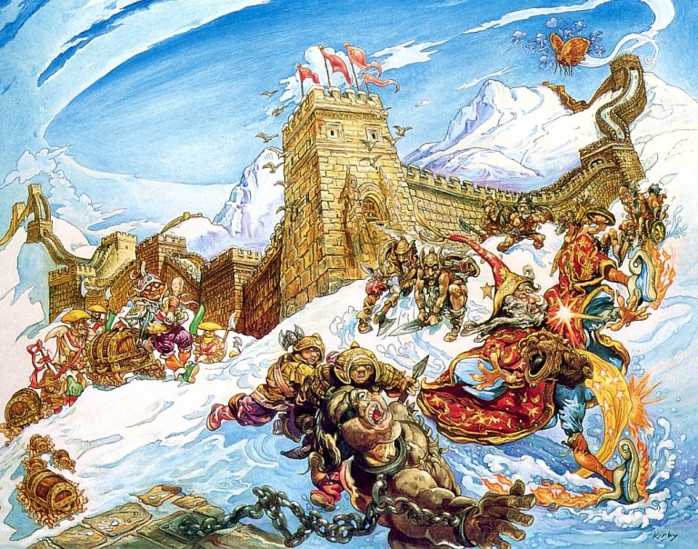
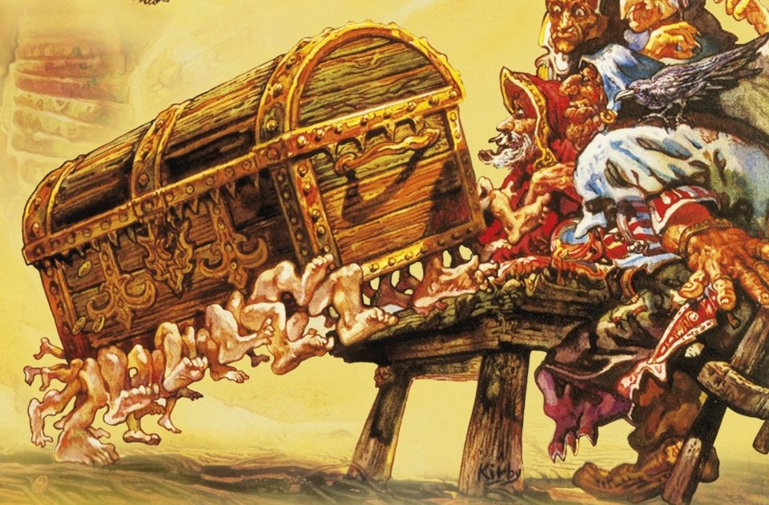

# Земля разумных груш и покорных людей: Агатовая империя

Агатовая империя (называемая в Анк-Морпорке и странах Безымянного континента 
также Ариенталией) — одна из самых могучих и богатых стран в мире Диска. Если 
судить по части изобретательства, она весьма прогрессивна: иконограф, очки, 
бумажные деньги и страхование были созданы именно здесь.

Исторически сложилось так, что Агатовая империя ещё и весьма закрытая страна. 
Но причиной тому служат не течения (как, допустим, в случае с Круллом и 
континентом ХХХХ), а политика властей — поддерживаемая, впрочем, большинством 
населения. Там, где правитель — в данном случае Император — приравнивается к 
богу, вечно происходит что-то подобное…

> Члены Красной Армии собрались на сходку. Собрание открыли пением 
> революционных песен. Поскольку неповиновение властям нелегко даётся 
> гражданам Агатовой империи, песни носили названия типа «Мы Планомерно 
> Движемся Вперёд, При Этом Лишь Слегка Не Повинуясь И Следуя Правилам 
> Хорошего Тона».
>
> *Терри Пратчетт «Интересные времена»*

||
|---|
||
|Великая Стена в представлении Джоша Кидби|

Агатовая империя занимает весь Противовесный континент. Это самая крупная 
страна в мире Диска. При этом на всё огромное по протяжённости побережье 
насчитывается ровно один порт — Бес Пеларгик. Во всех остальных местах 
Агатовая империя ограждена от прочего мира Великой стеной — абсолютно 
отвесной, в двадцать футов высотой. Что характерно, Великая Стена была 
построена даже на обрывах и по периметру входящих в состав империи островов.

Контакты иностранцев и подданных империи долгое время были максимально 
ограничены — а чтобы уменьшить сладость запретного плода, распускались слухи о 
том, что за Стеной вообще ничего нет. А моря, острова, континенты, люди, 
которые видны за стеной, — всего лишь иллюзии. И неважно, что из моря можно 
выловить рыбу, а с человеком поздороваться или подраться, — мало ли что 
случается в призрачном мире.

В агатском языке самоназвание страны — омоним слова «вселенная». Аналогично 
совпадают слова «иностранец» и «привидение», и они лишь чуть-чуть — на мазок 
кисти — отличаются от слова «жертва». Так что невинные записки путешественника 
Двацветка, озаглавленные «Как я провёл отпуск», стали величайшей диссидентской 
литературой Агатовой империи, самиздатом, который копировали от руки и 
распространяли внутри революционного подполья. П Двацветку, который ранее был 
скромным страховым агентом, пришлось часть своей биографии посвятить тюрьме. Но 
с тех пор, как власть захватил Коэн-варвар, карьера его стремительно пошла 
вверх, до великого визирства включительно.

||
|---|
||
|Двацветок, первый турист Плоского мира|

Порядки в Агатовой империи стали полиберальнее — что чрезвычайно кстати, 
учитывая, насколько страна интересна в туристическом плане. Так, большое 
количество октарина на Противовесном континенте породило весьма своеобразную 
флору. Знамениты ореховые лозы вул с западных плантаций провинции Реигрид — 
обратнолетние растения, которые, если их посадить в этом году, плодоносят в 
восьми предыдущих. Вино из орехов вул позволяет заглянуть в будущее — ведь с 
точки зрения ореха оно представляет собой прошлое.

Не менее известны и рощи из груши разумной, которая понимает человеческую 
речь, даже будучи срезанной и обработанной. Изделия из этой древесины будут 
следовать за своим хозяином сквозь пространство и время. Именно из груши 
разумной — чья древесина ещё и не восприимчива к магии — получаются наилучшие 
посохи для волшебников. Чаще всего они делаются с внушительным набалдашником, 
чьё применение весьма разнообразно, как гласит фольклор. (Текст песни «На 
волшебном посохе нехилый набалдашник» мы не приводим из цензурных 
соображений — однако вы сможете услышать её в любой таверне на Диске).

||
|---|
||
|Сундук из груши разумной — куда больше чем просто багаж! Прачечная, телохранитель, плавсредство, питомец — применений не счесть!|

Ещё одна особенность Агатовой империи связана с геологией Противовесного 
континента: изрядную часть его составляют золотоносные породы. Так что ценится 
золото там весьма дёшево, из него делают дождевые трубы и черепицу. Это 
способствует украшению городов, в том числе столицы Агатовой империи — 
Гункунга, одного из двух крупнейших городов Диска (второй — Анк-Морпорк).

Во всяком случае, он красив при взгляде сверху. Потому что с высоты 
человеческого роста Гункунг более всего напоминает огромный базар, где лавки 
сливаются с домами, а нечто, болтающееся на верёвках, может быть и товаром, и 
сушащимся бельём, и обедом. Впрочем, это лишь добавляет колорита.

||
|---|
||
|Библиотекарь незримого университета — орангутан, однако родом он не с Бангбангдука. Он вообще исходно человек — просто с магами ещё и не такое случается|

Интерес представляет и остров Бангбангдук, родина орангутанов (библиотекарь 
Незримого университета Анк-Морпорка, думаем, с нами согласится). Только 
берегитесь молотобоя — это хищное растение может напасть даже на человека, 
хотя обычно предпочитает мелких животных. Его особая примета — кувалда посреди 
листвы. Если увидите подобное, просто обойдите стороной эту недружелюбную 
флору.

Комфортнее всего в Ариенталии будут чувствовать себя жители Китая или Японии. 
Китайцам она напомнит о Нефритовой империи, особенно если посетить Закрытый 
город в столице или погулять вдоль Великой стены. Японцам — о времени 
«политического чуда» (надеемся, Агатовая империя пойдёт и в сторону 
«экономического чуда» — предпосылки к этому есть). Да и сама концепция туризма 
японцам очень близка, а нынешний великий визирь (второй человек государства) — 
первый в мире Диска турист.
