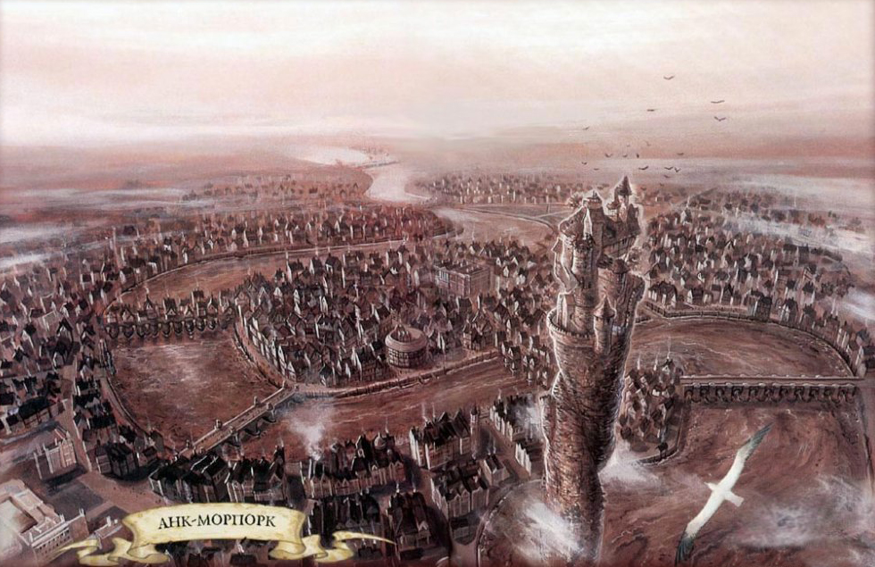
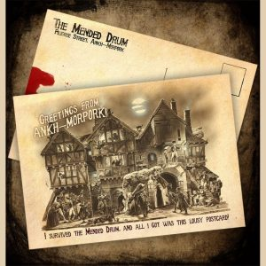
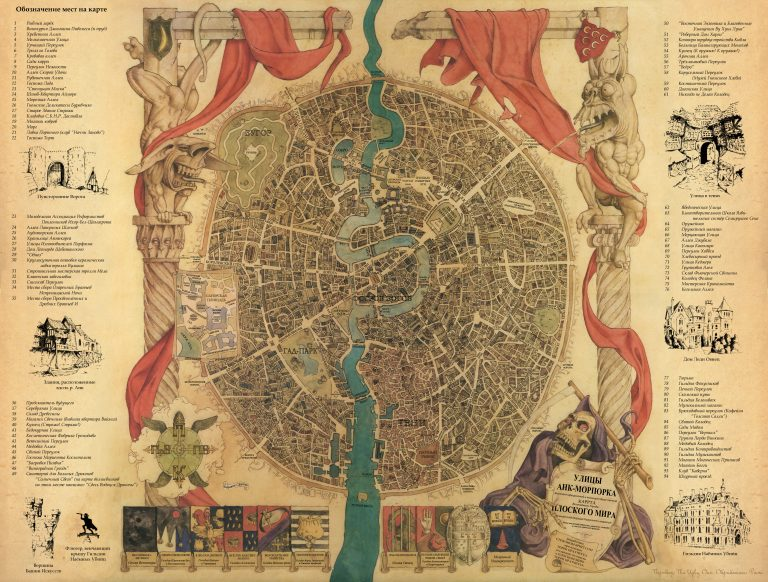
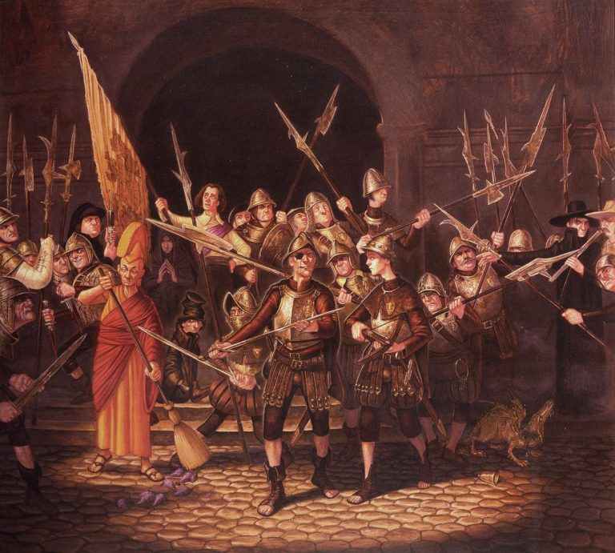
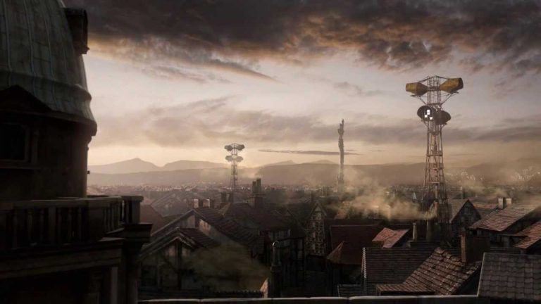
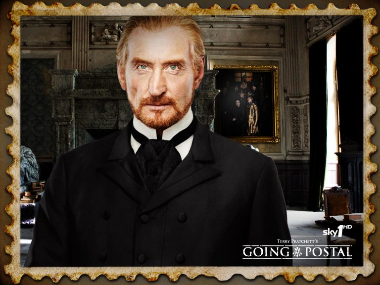
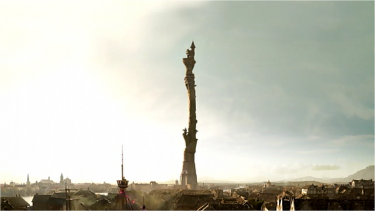

# Анк-Морпорк

|   |
|---|
||
|Анк-Морпорк, вид сверху. Особенно художнику удалась неповторимая фактура реки Анк|

> В мире есть более крупные города. В мире есть более богатые города. В мире 
> наверняка есть более красивые города. Но ни один город во множественной 
> вселенной не может соперничать с Анк-Морпорком по части запаха.
>
> Великие и Древнейшие, которые знали о вселенных всё и вдыхали запахи 
> Калькутты, !Ксрк-!а и центрального Марспорта, единодушно согласились, что 
> даже эти великолепные образчики назальной поэзии — не более чем частушки в 
> сопоставлении с одами пахнущего Анк-Морпорка.
>
> Можно говорить о козлах. Можно говорить о чесноке. Можно говорить о Франции. 
> Валяйте. Но если вы не нюхали Анк-Морпорк в жаркую погоду, вы не нюхали 
> ничего.
> 
> *Терри Пратчетт «Безумная звезда»*

 

Истинная жемчужина Диска — Анк-Морпорк, крупнейший порт, торговая и 
научно-магическая столица всего этого в высшей степени неплоского мира. Многие 
жители Земли — таллиннцы и нью-йоркцы, пражане и лондонцы — могут увидеть в 
нём сходство с родными городами, но на самом деле Анк-Морпорк чрезвычайно 
самобытен. Порой даже чересчур. Хотя что может быть чересчур для истинного 
любителя экзотики?

Анк-морпоркцы ласково называют свою родину «Большим Койхреном» — в честь 
известного очудноземельского овоща (который достигает двадцати футов в высоту, 
покрыт здоровенными колючками цвета ушной серы и пахнет муравьедом, 
пообедавшим в особо ароматном муравейнике).

Анк-Морпорк вольготно расположился в устье реки Анк — которая до того протекла 
через все равнины Сто и собрала оттуда изрядную часть глинистой взвеси. 
Впрочем, в месте её впадения в город — у Водных ворот — по ней ходить пешком 
ещё нельзя, а там, где она вытекает из города, у Речных ворот, уже вполне 
можно.

|   |
|---|
||
|Подробная карта Анк-Морпорка|

Кстати, один из девизов Анк-Морпорка гласит: «Merus in pectum et in aquam», 
что на старом лататинском наречии означает «Чист душой и водой». Два 
гиппопотама на гербе — дань истории города и той героической бегемотихе, что 
выкормила двух братьев-близнецов. По преданиям, впоследствии они и стали 
основателями Анк-Морпорка. Ныне же Медный мост украшают восемь статуй 
гиппопотамов, глядящих на море. Если городу будет угрожать опасность, они 
поведут себя как истинные патриоты Анк-Морпорка. То есть удерут со всех ног.

Река делит город на две примерно равные части: более богатый Анк и менее 
состоятельный Морпорк (включающий трущобный район под названием Тени). Следить 
за своим кошельком стоит везде, но в Морпорке рекомендуем как минимум удвоить 
бдительность. К чести Анк-Морпорка скажем: когда городскую стражу возглавил 
командор Сэмюэль Ваймс, преступлений в городе стало совершаться намного 
меньше.

|   |
|---|
||
|Ночная стража Анк-Морпорка, запечатлённая Полом Кидби|

Анк-Морпорку свойственны многие черты мегаполиса. Он многонационален — тут 
проживает наибольшая гномская диаспора на Диске, немало троллей, несколько 
меньше вервольфов и вампиров… Перечислять всех разумных жителей Анк-Морпорка 
будет чересчур долго — так мы дойдём и до говорящей дворняги по кличке Гаспод.

Это крупный промышленный центр, а благодаря близости к Круглому морю и наличию 
весьма востребованного порта — ещё и судостроительный. В городе множество 
лавок, рынков (особенно стоит отметить знаменитый Скотный рынок) и прочих 
заведений, где можно купить, продать и пообедать. Нельзя не попробовать 
знаменитые булочки с сосисками у Себя-Режу-Без-Ножа Достабля. Но запаситесь 
активированным углём или другими таблетками для желудка. И не надо пищать, 
гавкать или мяукать у его прилавка — столь прозрачные намёки считаются 
моветоном.

|   |
|---|
||
|Клик-башни в окрестностях Анк-Морпорка. Но лучше воспользуйтесь почтой, её недавно возродили (как показано в телефильме «Опочтарение»)|

О новостях как в Анк-Морпорке, так и в изрядной части Диска вы можете узнать 
из многочисленных газет. Благодаря тому, что сеть клик-башен — местного 
аналога телеграфа — ныне протянулась по всей равнине Сто, изрядной части 
Овцепикского региона и Убервальда и дотянулась до самой Орлеи, информационная 
изоляция вам не грозит. Правда, без вай-фая пока придётся обойтись.

Административная структура города  сложна: все сферы жизни находятся в руках 
представителей более чем трёхсот Гильдий. Сколько их точно — пожалуй, знает 
только патриций Хэвлок Ветинари, лучший правитель Диска (а может, и не только 
Диска). Складывается впечатление, что Ветинари знает о городе вообще всё — по 
крайней мере, всё, что ему требуется. Сам он закончил с отличием школу наёмных 
убийц в одноимённой гильдии и сейчас занимает в этой школе должность 
проректора. Кстати, это самое престижное учебное заведение в АнкМорпорке, 
дающее прекрасное образование — особенно в области гуманитарных наук.

|   |
|---|
||
|Патриций Витинари: коварный и абсолютно незаменимый. Он ещё и в «Игре престолов» неплохую должность занимал!|

Крупнейший центр научно-магической жизни на Диске — Незримый университет 
Анк-Морпорка. К сожалению, гарантировать, что вы сможете осмотреть этот 
выдающийся памятник архитектуры, мы не можем: своё имя он носит не зря. Вернее 
было бы назвать его «Университет, который виден только тогда, когда ему самому 
этого захочется или когда уже не отвертеться». 

Впрочем, если вам повезёт, вы сможете им полюбоваться — но только снаружи. 
Башенки, высокие стрельчатые окна, живописные арки, цветники и клумбы, изящные 
переходы между зданиями (всего их насчитывается одиннадцать) — это стоит того, 
чтобы потратить некоторое время и подкараулить удачный момент.

|   |
|---|
||
|Впрочем, главную башню Университета трудно не увидеть

В городе бытуют две поговорки: «Все дороги ведут в Анк-Морпорк» и «Все дороги 
ведут из Анк-Морпорка». Спорить, какая из них правдивее, бессмысленно — лучше 
просто там побывать. Пожалуй, если где-то и можно узнать саму душу этого 
прекрасного мира, то именно в Анк-Морпорке. А к запаху придётся просто 
привыкнуть.
