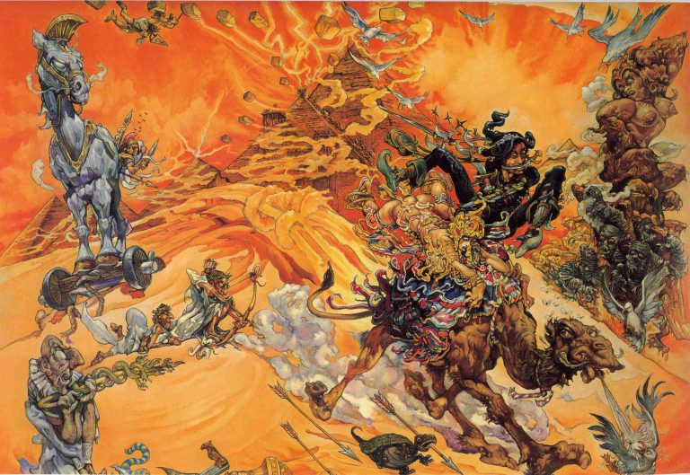

# Время в пирамидах: Джейлибейби

|   |
|---|
||
|Джейлибейби глазами Джоша Кирби|

Если вы устали от постоянно меняющегося мира, если у вас стресс от 
необходимости постоянно реагировать на что-то новое, истинно целебное 
воздействие на вас окажет Джейлибейби. Эта маленькая страна — всего лишь две 
мили в ширину и сто пятьдесят миль в длину — весьма своеобразно обходится со 
временем: фактически здесь оно течёт по кругу. И хотя люди в Джейлибейби, как 
и везде, рождаются и умирают, вокруг них, по большому счёту, ничего не 
меняется. Всё так же живительной илистой водой разливается река Джель, давшая 
название государству, всё так же крестьяне выращивают дыни и чеснок, всё так 
же фараоны, в которых джейлибейбцы верят, как и в своих (не известных более 
нигде на Диске) богов, обретают сверхспособности…

Правда, с экономикой тут неважно. Постройка многочисленных пирамид, благодаря 
которым и можно проделывать такие штуки со временем, дело чрезвычайно 
разорительное. А если не двигаться по пути прогресса, в конце концов окажешься 
банкротом. То, что ещё как-то мог позволить себе в древние времена наш земной 
Египет, в конце концов привело Джейлибейби к логичному итогу: а как иначе, 
если у соседей по миру уже вовсю новое и новейшее время, а тут оно всё 
дряхлеет и дряхлеет?..
