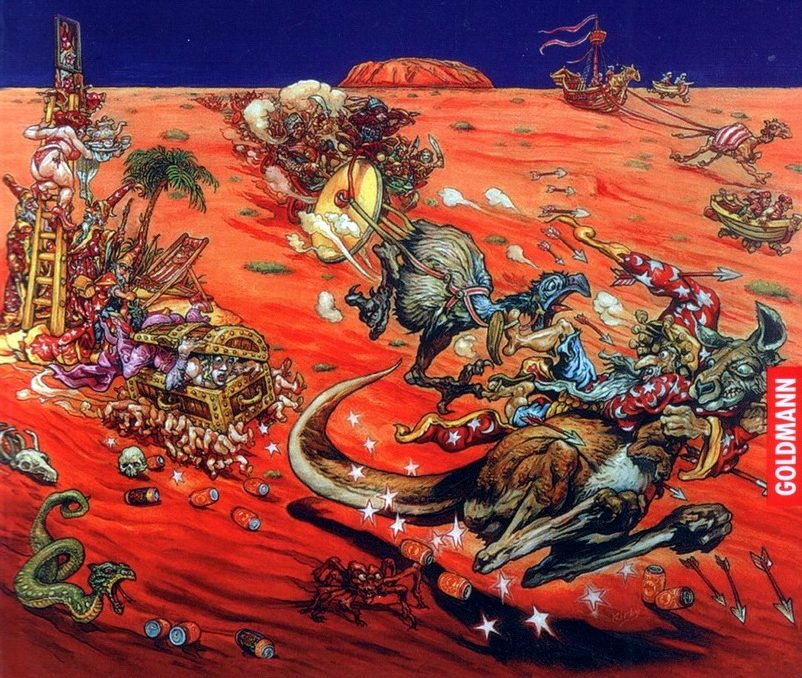
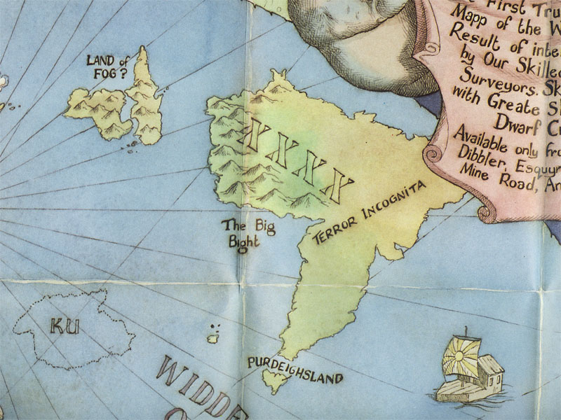

# Дуракам полработы не показывают: континент ХХХХ

Континент ХХХХ (он же Четыре Икса, Форэкс, Террор Инкогнита или Ужастралия) — 
одно из самых загадочных мест на Диске. Причина этого в том, что он создан 
намного позже, чем остальной мир, другим богом (виден другой «авторский 
почерк»), а главное — не доделан. В буквальном смысле.

Миллионы лет назад его создали тридцатитысячелетним. Только, поскольку время 
там течёт как ему вздумается, он на самом деле всё ещё новенький. Его не 
подогнали под остальной Диск, не обстругали и тем более не ошкурили, и в ткани 
мироздания континент ХХХХ более всего напоминает кусочек паззла, положенный в 
общую картину не той стороной. А вертеть здоровенный континент (да ещё в 
девяти измерениях сразу) довольно трудно.

На происходящем в Ужастралии это отражается напрямую и весьма разнообразно. 
Прошлое, настоящее и будущее там причудливо перетекают друг в друга, порождая 
причудливые завихрения, парадоксы и прочее макраме. Для находящегося на 
Форэксе в порядке вещей увидеть среди древних наскальных рисунков свой 
портрет. И даже автопортрет.

|   |
|---|
||
|Ринсвинд в XXXX в представлении Джоша Кирби|

Такие аномалии не могли не сказаться на климате. Большую часть времени на 
континенте ХХХХ абсолютно сухо: там крутится гигантская облачная спираль 
антициклона, не дающая воде пролиться на сушу. И хотя в Форэксе много рек, 
воды там чаще всего нет. Внезапно пошедший дождь для ужастралийцев становится 
не только благом, но и источником проблем. Приходится отменять регату — если в 
Занудь-реке полно воды, как верблюды смогут тянуть яхты?

С водой у жителей ХХХХ отношения непростые. Отправиться оттуда в дальнее 
плавание затруднительно: опасные течения так и норовят отнести зазевавшееся 
судно к Краепаду. Но можно посмотреть на это иначе: ужастралийцы убеждены, что 
Террор Инкогнита — лучшее место в мире, и уплывать оттуда попросту незачем. 
Этот оптимизм достоин отдельного упоминания — ведь речь идёт о континенте, где 
почти всех ядовитых змей съели ядовитые пауки…

> Взяв наугад одну книгу, Смерть прочёл текст на обложке:
>
> — «АПАСНЫЕ МЛЕКАПИТАЮЩИЕ, РЕПТИЛЬИ, АМФИБЬИ, ПТИЦЫ, РЫБЫ, МЕДУЗЫ, НАСЕКОМЫЕ, 
> ПАУКИ, РАКОБРАЗНЫЕ, ТРАВЫ, ДЕРЕВЬЯ, МХИ И ЛИШАЙНИКИ ТЕРРОР ИНКОГНИТА». — Его 
> взгляд пробежался по корешку. — ТОМ 29, — добавил он. — ПОДТОМ В. ОТЛИЧНО.
>
>
> Он окинул взглядом притихшие полки.
>
> — ВОЗМОЖНО, БУДЕТ ПРОЩЕ, ЕСЛИ Я ЗАПРОШУ ИНФОРМАЦИЮ О БЕЗВРЕДНЫХ СУЩЕСТВАХ 
> ВЫШЕНАЗВАННОГО КОНТИНЕНТА?
>
> …Смерть подхватил одинокий листок. Внимательно ознакомившись с его 
> содержанием, он на секунду перевернул бумажку — на тот случай, если что-то 
> написано на обороте.
>
> — Можно взглянуть? — спросил Альберт. Смерть передал ему листок.
>
> — «Отдельные овцы», — прочёл Альберт вслух.
>
> *Терри Пратчетт «Последний континент»*

Надеемся, это не отбило у вас охоту посетить Ужастралию. Ведь эта местность 
весьма интересна для любознательного туриста. Экстремалы вдоволь налюбуются 
красотами пустыни — там можно добраться до огромной Красной Скалы, где 
расположен источник времени, встретить говорящего кенгуру и найти под камнями 
сыр и пудинги.

А жаждущим культурного досуга можно смело рекомендовать столицу Форэкса — 
Пугалоу. Там есть Оперный театр, похожий одновременно на открытую коробку 
тканей и корабль, готовый к отплытию, есть свой собственный магический 
Незримый университет (чья башня снаружи не превышает по высоте двадцати футов, 
а изнутри возвышается над городом на полмили) и многочисленные сочинители 
баллад, всегда готовые воспеть подвиги очередного вора, приговорённого к 
смертной казни.

 

Ни в коем случае не пытайтесь украсть овцу! Более того, не дайте ни малейшего 
повода себя в этом заподозрить. Не удивляйтесь необычному виду ужастралийцев: 
помимо представителей обычных на Диске рас вроде людей, гномов или троллей, вы 
можете встретить крокодила-трактирщика или овцу в рабочем комбинезоне, 
рассказывающую о шардоне из Ржавой долины. Примите как факт: вы в порядке, 
помощь психиатра не требуется. И на всякий случай не говорите с аборигенами о 
погоде.

И ещё. В Ужастралии на удивление неплохое пиво! Думаем, жители Австралии и 
Новой Зеландии будут чувствовать себя на континенте ХХХХ почти как дома. 
Кстати, многие места Форэкса чрезвычайно киногеничны…
