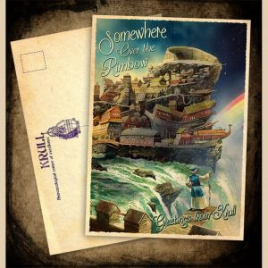
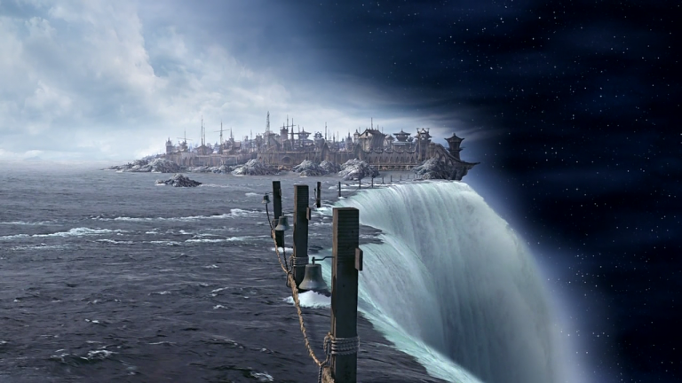

# Волна над краем: Крулл

О существовании Крулла не всем известно даже на Диске. Это древнее королевство 
располагается на одноимённом острове, что по форме напоминает волну, и 
находится буквально на самом Краю — настолько, что самая высокая его часть, 
«гребень волны», немного выступает за Диск. Упускать такое зрелище было бы со 
стороны крулльцев невероятной глупостью — а это качество им не свойственно. 
Поэтому там, где остров свешивается за Край, построен огромный амфитеатр на 
несколько десятков тысяч человек.

 

Зрители могут любоваться не только космическими пейзажами. На арене амфитеатра 
находится чудо инженерной мысли — подъёмное устройство, позволяющее отправлять 
научно-исследовательские экспедиции за Край (и порой даже возвращать их 
обратно). Таким образом астрозоологи изучают особенности жизнедеятельности 
Великого А’Туина и стоящих на нём слонов.

Это не единственный масштабный проект крулльцев. Ещё больше впечатляет 
Окружносеть, опоясывающая весь Диск по периметру, — длина её составляет 
тридцать тысяч миль. Она улавливает все крупные объекты, что несут за Край 
воды Окружного океана. А далее моряки семи флотов, патрулирующих Окружносеть, 
сортируют добычу… и вот тут нельзя не сказать о, как бы повежливее, этической 
двусмысленности. В сеть попадают не только бочки с вином или тюки с материей, 
но и унесённые течениями корабли с людьми (а также гномами, троллями и 
другими жителями Диска). И основу процветания Крулла — страны сытости и 
праздности, управляемой мудрецами-философами, что стремятся постичь тайны 
мироздания, — составляет в том числе и рабство.

|   |
|---|
||
|Никто не знает, куда вы попадёте, сорвавшись с диска. Это-то и пугает больше всего|

У попавших в беду моряков (которых без Окружносети ждал бы исключительно полёт 
за Край) вариантов мало: либо покориться и дать вырвать себе язык, либо почти 
наверняка покончить с собой, перебравшись через Окружносеть и спрыгнув с Края 
(а это действительно очень страшно), либо попытаться сбежать на один из 
трёхсот восьмидесяти островов вокруг Крулла — что, на самом деле, лишь 
отсрочит выбор между первым и вторым вариантами.

> — Я не стану рабом! — крикнул Ринсвинд. — Да я скорее за Край прыгну!
>
> Волшебник сам изумился тому, как решительно прозвучал его голос.
>
> *Терри Пратчетт «Цвет волшебства»*

Так что рекомендуем хорошо всё просчитать, прежде чем отправляться в Крулл. 
Впрочем, сторонникам экстремального туризма — если всё вдруг пройдёт хорошо — 
будет о чём рассказать. Остров Крулл красив и сам по себе (горы, по большей 
части укрытые зелёными лесами, живописные белокаменные или созданные на базе 
кораблей дома, что поднимаются вверх, уступ за уступом) — а уж какие 
уникальные виды открываются с Края! Рубиновые глаза гигантских слонов 
напоминают алые звёзды, их бивни подобны исполинским скалам — и всё это 
великолепие меркнет перед мощью одного лишь плавника Великого А’Туина…

Чтобы комфортно себя чувствовать на Крулле, надо либо там родиться (причём в 
свободной семье) и принять такой уклад жизни как должное, либо каким-то 
образом сохранить или воспитать в себе древнегреческое мышление, а по прибытии 
на остров ухитриться не попасть в рабство. Нам кажется, что для туриста с 
нынешней Земли это фантастика.
