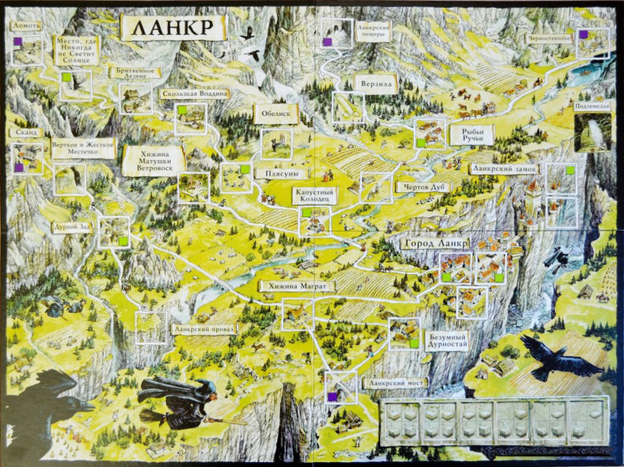
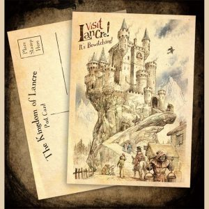
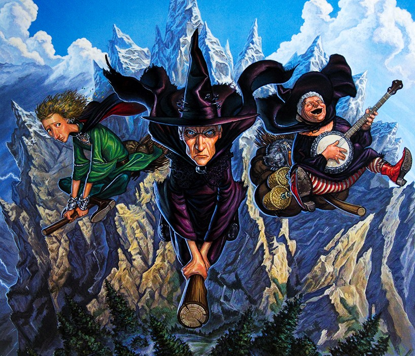

# Чудеса на карнизе: Ланкр

Но и в малых странах Диска встречаются чрезвычайно интересные места. Таков, 
например, Ланкр — королевство с населением всего в шестьсот жителей (включая 
гномов и троллей, которые не признают Ланкрскую Корону). Самая населённая его 
часть располагается на узком карнизе над равнинами Сто, а всё остальное — это 
небольшой кусочек огромного массива Овцепикских гор.

  

Всей площади у Ланкра примерно 400 квадратных миль. Впрочем, число это 
достаточно приблизительное, и не только из-за трудностей измерения в 
негостеприимных скалистых местностях. Дело ещё и в том, что Овцепикские горы — 
особенно та часть, где находится Ланкр, — располагаются в русле мощного 
течения магических потоков. И сказывается это буквально на всём — включая 
расстояния и размеры помещений.

Благодаря этому же Ланкр славится на Диске как место происхождения большинства 
волшебников и ведьм. Самые знаменитые ведьмы нынешнего времени — Эсмеральда 
Ветровоск (уважительно именуемая Матушкой Ветровоск) и Гита Ягг (к которой 
принято обращаться Нянюшка Ягг) — тоже ланкрийки.

Гита Ягг известна не только магическими достижениями, но и литературными. Её 
перу принадлежат «Сказки Мамаши Ягг Для Маленьких (с картинками)», «Поваренная 
книга Нянюшки Ягг» и «Лакомая Отрада» (последняя была запрещена к изданию по 
соображениям цензуры). Самое же известное её поэтическое произведение — «Песня 
про ёжика». (Текст не приводится из цензурных соображений — но вы сможете её 
услышать в любой таверне на Диске). Впрочем, есть мнение, что песня исходно 
народная, а Нянюшка Ягг просто дополнила текст.

|   |
|---|
||
|Вещие сестрички, аэрофотосъёмка Пола Кидби|

Ланкр славится мастерами кузнечного дела. Развитию этого ремесла 
способствовали как залежи железной руды, так и угроза со стороны эльфов из 
параллельного мира — из-за парадоксов магического поля тут существовало 
минимум два прохода в другое измерение. Сейчас оба  запечатаны пломбами из 
метеоритного железа и местность считается безопасной. Изделия же местных 
искусных ковщиков, без сомнения, украсят ваш дом.

Любителям спелеотуризма можем порекомендовать обширные и живописные Ланкрские 
пещеры, простирающиеся под всем королевством. Правда, перемещение в них 
требует осмотрительности из-за хронопарадоксов: не удивляйтесь, если увидите 
самого себя (и уж тем паче не причиняйте себе вред!). А ценителям пейзажей 
наверняка придутся по душе прозрачные ледниковые озёра и изумрудные горные 
луга, на которых пасутся стада овец, — это тоже заслуженная гордость Ланкра. 
Трогательное сходство Ланкра со своей родиной обнаружат англичане, проживающие 
в сельских местностях вроде Ланкашира, и швейцарцы.
