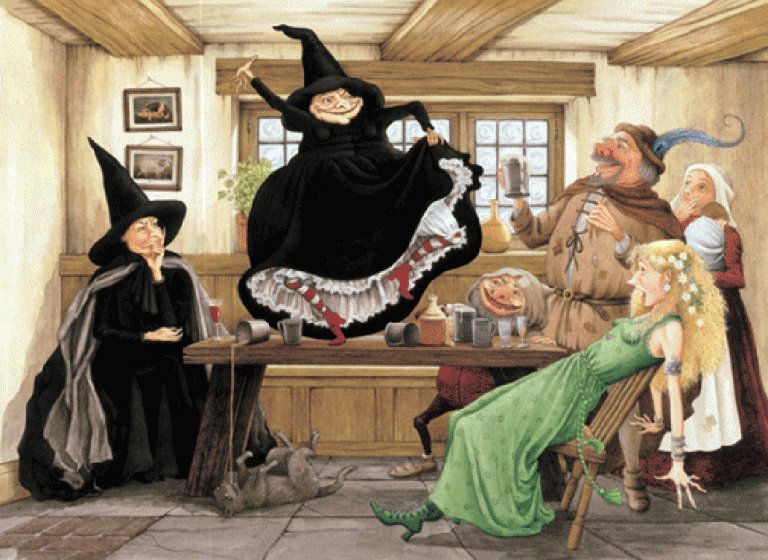

# Просто сказка: Орлея

 

Тем, кто в путешествиях отдаёт должное кулинарии, стоит посетить Орлею — город 
поваров и карнавалов. Как известно, изысканная кулинария процветает там, где 
не хватает обычных, простых продуктов, — а в Орлее, находящейся на побережье 
Болотного Моря в дельте реки Вьё, где большая часть земли занята тропическими 
болотами, не так-то много картошки или пшеницы. Поэтому орлейский повар, как 
говорят, способен приготовить незабываемый гастрономический шедевр даже из 
грязи, сухих листьев и приправ.

На самом деле про грязь — это, конечно, неправда. Чтобы создать воистину 
запоминающееся блюдо, за которым будут приезжать снова и снова, нужно огромное 
количество ползaющих, плaвaющих и летающих ингредиентов…

Карнавалы, лучше которых на Диске просто не найти, проводятся в Орлее дважды в 
году — это Жирный Вторник и Субботняя Ночь Мёртвых. Но если вы прибыли в Орлею 
в другое время — не беда. Насладитесь её сказочной — в буквальном смысле 
слова — архитектурой: аккуратными маленькими домиками, белоснежными 
особняками, великолепным изящным дворцом. Пройдитесь по безупречно чистым 
булыжным улицам, зайдите в таверну, где можно пропустить стаканчик 
изумительного бананового дайкири…

|   |
|---|
||
|Вещие сестрички неплохо провели время в Орлее в романе «Ведьмы за границей» (рисунок Сэнди Найтингейл)|

Нет, вы не попали в сказку. К счастью. Сказка некоторое время назад 
закончилась, так что Орлея стала практически безопасным местом. Да, в болотах 
живут крокодилы, — но это, согласитесь, такие пустяки по сравнению с Доброй 
Феей! Сказочная правительница — это чудовищно… К счастью, теперь у власти дочь 
Барона Субботы, что гораздо лучше, поверьте!
