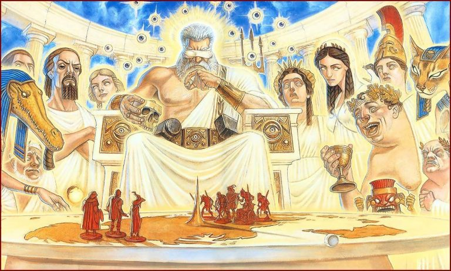

# Обитель богов: Пуп

|   |
|---|
||
|Боги Плоского мира в представлении Пола Кидби|

В Пупземелье, между горой Улсканраход (чьё название означает «Кто этот идиот, 
который не знает, что такое гора?») и Водоворотными равнинами, находится самая 
высокая часть Диска, Пуп. Её вершина — гора Кори Челести. Высота её составляет 
10 миль, а на самом её верху находится дворец Данманифестин — что в переводе с 
божественного языка значит «Достало уже проявляться». Именно там и живут 
могущественнейшие боги Диска. Как несложно догадаться, к своим почитателям они 
спускаются с большой неохотой и крайне редко.

Это и неудивительно. На Диске бог остаётся богом, лишь пока в него верит 
достаточное количество народа. Как только вера слабеет, неудачник переходит в 
разряд малых богов, вынужденных жить там, где ещё можно собрать крохи 
почитания, то есть внизу. В особо же запущенных случаях бог попросту исчезает. 
Впрочем, нередко появляются и новые боги — в мире, насыщенном магией, вера 
творит чудеса.

Из-за такой неустойчивости нельзя сказать, что на Диске боги находятся в самом 
привилегированном положении. Ибо подлинным бессмертием — независимо от того, 
верят в них или нет, — обладают не они, а Сверхъестественные создания вроде 
Смерти или Времени.
