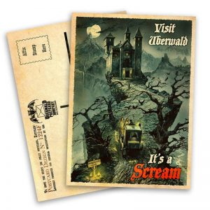
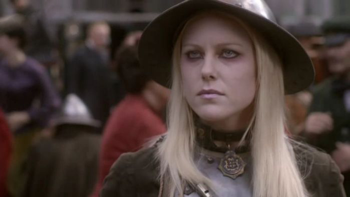
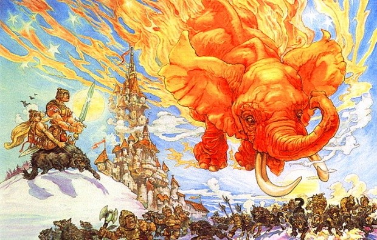

# Жирная земля: Убервальд

|   |
|---|
||
|Это, судя по всему, самая крупная страна Безымянного континента: она простирается до самого Пупового пика горы Кори Челести. Но утверждать что-либо насчёт географии Убервальда можно лишь с оговорками. И вот почему.|

Для начала, хотя Убервальд — вполне освоенная разумными жителями местность, 
точных карт её не существует. Поросший густыми вековыми лесами, иссечённый 
горными хребтами и быстрыми реками, что изобилуют водопадами, а также имеющий, 
по сути, две погодные опции — «жуткий холод» и «палящий зной», он не жалует 
заезжих картографов. Тот, кто не знает этой местности, уходит с известных троп 
на свой страх и риск — даже если им никто не заинтересуется с гастрономической 
точки зрения, блуждать в здешних чащобах можно долго. А местным жителям карты 
как-то без надобности.

К тому же Убервальд, строго говоря, не совсем страна — это множество отдельно 
стоящих городов и замков, между которыми нет границ. Кроме того, в Овцепикских 
горах живут кланы троллей, а под землёй, в своём королевстве, обитает 
множество гномов — но это всё равно не добавляет Убервальду внутреннего 
единства. А жаль, иногда это бы не помешало. Потому что в Убервальде могут 
возникнуть некоторые проблемы…

Проблема номер один — вервольфы. Хотя многие их семейства богаты и ведут свою 
родословную уже многие столетия, жить с такой особенностью, как 
оборотничество, нелегко — социальная адаптация вервольфов оставляет желать 
лучшего. Что может приобретать разные формы — от охоты на людей до убийства 
своих родственников, если они не соответствуют представлениям о правильных 
оборотнях.

|   |
|---|
||
|Дельфина Ангва фон Убервальд — стражница из анк-морпоркской полиции. Эх, если бы все оборотни были настолько цивилизованными…|

Проблема номер два — вампиры. К чести убервальдских упырей, многие из них 
«завязали» и перешли на кровь животных — хоть эта замена и похожа на замену 
виски лимонадом. Они торжественно носят чёрную ленту с надписью «Ни капли!» и 
входят в Лигу Воздержания. Но «многие» не значит «все». Кроме того, даже самый 
волевой и законопослушный вампир иногда может сорваться — хотя потом ему будет 
очень стыдно. Возможно.

Проблемой номер три могут стать гномы — но это вряд ли коснётся туристов. Вы 
же не собираетесь заниматься крупными торговыми сделками и заключать договоры 
о поставке полезных ископаемых? Хотя по их части Убервальд уникален. Железная 
руда, уголь, золото, серебро — это, конечно, важные составляющие 
благосостояния убервальдцев, но одно ископаемое не имеет аналогов не только в 
нашем мире, но и на Диске. Это жир земли.

> Разумеется, Ваймс знал эту легенду. Когда-то на панцире Великого А’Туина 
> стояли пятеро, а не четверо слонов, но один то ли оступился, то ли был 
> стряхнут в результате некоего катаклизма. Ссыпавшиеся в глубокую дыру валуны 
> похоронили слоновью тушу глубоко под землёй. Дальше потянулись тысячелетия, 
> а там, в глубине, что-то варилось и растапливалось. Такова история 
> происхождения жира земли.
>
> *Терри Пратчетт «Пятый элефант»*

Мощнейшие месторождения топлёного жира, белого твёрдого жира, светлого 
нутряного жира… Освещение, моющие средства и даже еда! Даже если вы 
заблудитесь в бескрайних убервальдских лесах, голодная смерть вам почти 
наверняка не грозит. Жировые источники и жировые гейзеры к вашим услугам. 
Правда, иногда попадаются ГХТ (горелые хрусткие твари) — обычно это гигантские 
доисторические животные… но, во всяком случае, они хорошо прожарены! Да и 
дрова, если их сначала обмакнуть в масляный фонтанчик, будут гореть куда 
лучше.

|   |
|---|
||
|Пятый элефант, запечатлённый Джошем Кирби за миг до столкновения|

Так что — рекомендуем. Изумительной красоты пейзажи, туристические маршруты 
разной сложности, вкуснейший горный воздух и много мрачноватой романтики. 
Незабываемый отпуск гарантирован! Определённое сходство со своей родиной (хотя 
и не всегда с современной) в Убервальде найдут румыны, венгры, австрийцы и, 
конечно же, русские. Только присмотритесь к двуглавой летучей мыши — гербу 
Убервальда, к его знаменитым деревянным куклам, что вкладываются друг в друга, 
к его экономике…
