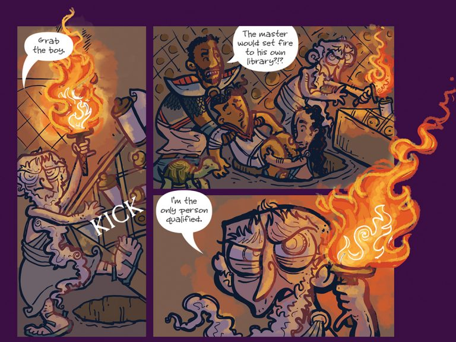

# Рай рабов и философов: Эфеб

Крулл не единственная страна на Диске, где разрешено рабство. Правда, в 
городе-государстве Эфебе ситуация совсем другая. Как ни странно, Эфеб называют 
«колыбелью демократии», и это во многом правда: уже несколько тысячелетий в 
стране держится выборная власть. Раз в пять лет там избирают тирана, который 
обязан обладать безупречной репутацией и предоставить доказательства чистоты 
помыслов и деяний (а после избрания он, как правило, оказывается маньяком и 
преступником).

У тирана в течение этих пяти лет практически неограниченная власть… но 
кое-чего сделать он всё же не может. Например, отменить рабство — против этого 
слишком много протестов. Со стороны рабов.

Дело в том, что, согласно эфебским законам, хозяин должен кормить своих рабов 
три раза в день (причём один раз — качественным мясом), заботиться об их 
жильё, предоставлять им раз в неделю выходной, а раз в год — оплачиваемый 
двухнедельный побег… О том, чтобы бить раба или плохо с ним обращаться, и речи 
нет — это серьёзное преступление. Раб — это, знаете ли, собственность, а 
уважение к собственности — одна из основ государства. И хотя рабы имеют право 
освободиться после двадцати лет рабства, желающих воспользоваться этим не 
наблюдается.

|   |
|---|
||
|Когда-то в Эфебе была великая Библиотека, но потом её сожлги, чтобы не досталась завоевателям|

Поездку в Эфеб, в отличие от Крулла, наше турбюро рекомендует. Вы сможете 
полюбоваться на чудесные пейзажи Клатчианского побережья Круглого моря, 
живописные развалины и беломраморные дворцы, познакомиться с философами, 
живущими в бочках с саунами (не пугайтесь мокрых голых стариков, бегущих по 
улице с криком «Эврика!», — они обычно безобидны)…

Желающие могут пощекотать себе нервы, попытавшись пройти по Лабиринту (не 
советуем делать это без проводников! И помните: каждый проводник знает лишь 
свою часть Лабиринта). А для любителей литературы напоминаем: именно в Эфебе 
находится самая большая немагическая библиотека на Диске!
