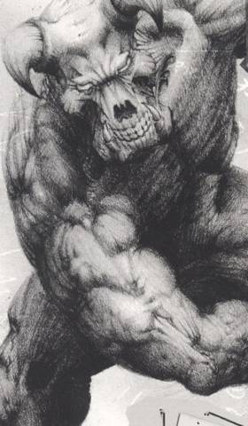

# Добро пожаловать в ад - вселенная DOOM

> Ад — это место, где дурно пахнет, и никто никого не любит.
>
> *Мать Тереза* 

Фобос, ближайший спутник Марса. Вы стоите в ангаре научно-исследовательской
базы. За окном в тумане тянется гористый пейзаж, рядом — бочка с какой-то
зеленой дрянью, рука крепко сжимает пистолет. Впереди — зомби, импы, заветная
дверь с красной надписью “Выход”, демоны, бессонные ночи, чит-коды, пятнадцать
миллионов игроков в бесплатную shareware-версию... Чуть позже “Doom” получит
звание “Игра года-1994”, ее главный программист Джон Кармак купит несколько
спортивных “Феррари” и начнет строить настоящий космический корабль, а
индустрия компьютерных игр за несколько лет изменится настолько, что сейчас,
оглядываясь назад, невольно думаешь: неужели мы в это играли?

Doom. Слово с множеством, мягко говоря, невеселых значений: рок, судьба, фатум,
гибель, кончина, смертный приговор. Джон Кармак говорил, что, придумывая
название игре, вдохновился репликой Тома Круза в фильме “Цвет денег” — когда
тому задали вопрос, что он держит в кейсе (там был бильярдный кий), Круз
нахально ответил: “Doom”.

## Бессмертная классика

Игра “Doom” была выложена на ftp-сервер университета Висконсина 10 декабря 1993
года техасской компанией “id Software”, основанной двумя годами раньше. Самый
первый “Doom”, сочетавший передовую до того времени трехмерную графику и
невиданную жестокость, был бесплатным и состоял только из одного эпизода.
Распространение его коммерческой версии с тремя эпизодами происходило по почте,
а не в магазинных сетях, что было очень неудобно, поэтому многие играли или в
урезанную, или в нелегально скопированную полную версию.

В первый же год “Doom” разошелся пятнадцатью миллионами копий по всему миру,
заложил каноны “стрелялок от первого лица”, вдохновил пользователей на создание
огромного числа модификаций (от нового оружия до игровых карт), вызвал
настоящий шквал игр-“клонов” и, без всяких преувеличений, сформировал новую
субкультуру многопользовательских игр по сети. 

На “движке” классического “Doom” были сделаны игры “Heretic” (1994), “HeXen”
(1995), “Strife” (1996), “Chex Quest” (1996). Недавно компания “Fantasy Flight
Games” выпустила настольный “Doom”: все, как положено — карты, фишки,
пластмассовые демоны.

Игроку доставалась роль безымянного космического пехотинца — члена элитного
подразделения “самых крутых, закаленных в боях и тренированных для настоящего
дела бойцов на Земле”.

|   |
|---|
||
|Необычная вещь: виниловая пластинка с саундтреком “Doom 3”!|

Ваш пехотинец был сослан на Марс за неповиновение приказу открыть огонь по
мирным гражданам. Парня заставили работать на UAC (“Union Aerospace
Corporation” — “Объединенную аэрокосмическую корпорацию”) — могущественный
военный синдикат, проводивший на Марсе секретные, опасные и незаконные
эксперименты. В частности — испытание телепортатора между спутниками планеты:
Фобосом (греческое “страх”) и Деймосом (“ужас”).

Секретные эксперименты в фантастике ни к чему хорошему не приводят. У
телепортатора обнаружился один очень неприятный побочный эффект: при первом же
запуске он открыл проход в иное измерение, проще говоря — в ад, откуда полезли
полчища изнывающих от безделья демонов.

В нашем мире им очень понравилось: часть персонала исследовательской базы на
Фобосе они перебили, часть — превратили в зомби. Что произошло на Деймосе,
осталось тайной, потому что после включения телепортатора он попросту... исчез.

Увидев это безобразие, UAC послала с Марса на Фобос группу спецназа, в которую
и вошел наш герой. Решение, было, мягко говоря, неразумным: радиоконтакт с
солдатами очень быстро прервался, а изо всей делегации выжил один человек. То
есть вы.

Подробно описывать дальнейшее не имеет смысла. В полной версии “Doom” игроку
предстоит пройти три больших эпизода игры. Первый — “По колено в мертвецах”
(дизайном занимался лично Джон Ромеро) — ставит перед нами задачу уничтожить
всех монстров на базе Фобоса. Финальных “боссов” двое — розовые демоны по
кличке Бароны ада, охраняющие телепортатор на Деймос. После того, как игрок
воспользуется им, он попадает в абсолютную темноту с целой кучей монстров
вокруг и якобы умирает.

Первым “боссом” в истории компьютерных игр был Золотой дракон, созданный в 1974
году Гари Визенхантом и Реем Вудом для игры по системе “Dungeons & Dragons”. До
того времени все игры основывались на однообразных повторяющихся действиях —
например, игра в пинг-понг или “Астероиды”. “Боссы” были призваны внести
зачатки сюжета — финальную цель и кульминацию игрового процесса.

Во втором эпизоде, “Берега ада”, игрок прорубает себе путь по базе на Деймосе,
в индустриальной архитектуре которой теперь присутствуют мрачные демонические
мотивы. Оказывается, Деймос телепортировался прямиком в ад и теперь висит над
его поверхностью. В конце эпизода нас ждет, пожалуй, самый сильный “босс” в
игре — рогатый Кибердемон.

|   |
|---|
| |
|Spider Mastermind в игре и в модели.|

Кибердемон - крупный рогатый скот, против которого очень пригодится BFG 9000.

|   |
|---|
||
|"Doom 2" - официальная обложка диска.|

Убив его и спустившись на поверхность ада, мы проходим третий эпизод —
“Инферно”, вышибаем всем демонам мозги и расправляемся с самым главным
негодяем — Паучьим лидером (Spider Mastermind). Доказав, что он слишком крут
для ада, наш герой телепортируется на Землю. Стоит отметить, что в
дополнительном расширении игры “Ultimate Doom” добавлен четвертый эпизод, “Твоя
плоть истощена”, где игроку на пути домой придется опять повоевать с демонами.

Через год после выхода первой части появился “Doom 2” с дополнительным
названием “Ад на Земле”. Графика не изменилась — добавились лишь текстуры,
новая музыка, монстры, оружие, инвентарь, а также абсолютно новые уровни и
сюжет. Все тот же безымянный пехотинец (в книгах по мотивам игры его назвали
Флинн Таггарт) возвращается на Землю и обнаруживает, что та подверглась
вторжению его старых друзей — демонов. Игроку предстояло пройти один большой
эпизод в 30 миссий и спасти остатки человечества, находящиеся в космическом
порту.

Вторая часть была так же популярна, как и первая — официально продано около
двух миллионов экземпляров (c учетом прибылей от лицензий и других сторонних
доходов “Doom 2” принес создателям примерно 100 миллионов долларов), а
количество пиратских копий вообще не поддавалось подсчету.

Последняя каноническая версия серии появилась в июне 1996 года под общим
наименованием “Final Doom”. Она состояла из двух самостоятельных частей —
“The Plutonia Experiment” и “TNT: Evolution”. Отличительной особенностью игры
“Doom” были редакторы уровней, позволявшие фанатам вносить изменения в игру и
даже создавать совершенно новые продукты. Хотя “The Plutonia Experiment” был
сделан энтузиастами (братья Мило и Дарио Касали), компания “id Software”
оценила его по достоинству и включила в состав “Final Doom”.

Ошеломляющий успех двух первых частей “Doom” привел к появлению версий для
других операционных систем и игровых консолей. Например, был разработан “Doom”
для Windows, Linux, Apple Macintosh, Super NES, Sega 32X, Sony PlayStation,
Game Boy Advance, Atari Jaguar, Nintendo 64, 3DO, Dreamcast и даже Symbian
(операционная система мобильных телефонов).

> ## Это интересно
>
> * Названия уровней эпизода “Твоя плоть истощена” (Thy Flesh Consumed) взяты
>   из Библии. В пятой главе Книги Притч читаем: “И будешь стонать после, когда
>   плоть твоя и тело твое будут истощены”. 
> * “Сфера души” изначально задумывалась как артефакт, дающий одну
>   дополнительную жизнь, однако потом разработчики решили дать персонажу всего
>   одну жизнь, ограниченную единицами здоровья. 
> * Двустволка при выстреле в упор наносит врагу урон, превышающий повреждения
>   от ракетомета. 
> * Знаменитая бензопила имеет очень интересную историю. Оказывается, дизайнер
>   Том Холл взял у подруги настоящую бензопилу “Усердный бобер” и сделал в
>   игре ее точную копию. 
> * Непонятный магический речитатив, произносимый “Иконой греха” в конце “Doom
>   2”, на самом деле представляет собой промотанную задом наперед запись
>   голоса Джона Ромеро, произносящего: “Чтобы пройти эту игру, ты должен убить
>   меня, Джона Ромеро”. 
> * Знаменитые думовские чит-коды были добавлены в игру дизайнером Дэйвом Д.
>   Тейлором. Один из них (раскрытие карты) повторял его инициалы — IDDT.

|   |
|---|
| |
|Бихолдер и Астральный храбрец - два монстра из "Dungeons & Dragons", ставшие прототипами какодемонов.|

## Разработка

Создание “Doom” началось в 1992 году, когда у Джона Кармака появилось немного
свободного времени и он решил сделать новый игровой движок. Под конец года за
проект взялись дизайнеры. В основу игры положили стилистическое подражание
фильмам “Чужой” и “Зловещие мертвецы 2”.

Разработчик Том Холл написал большой документ, названный им “Библия “Doom”.
Согласно ему, игра должна была иметь сложный сюжет, несколько действующих
персонажей и большое количество интерактивных вставок. Кармаку это не
понравилось — он потребовал значительно упростить концепцию. Из-за возникших
противоречий Холл в конечном итоге уволился.

На освободившееся место пришли два талантливых дизайнера — Джон Ромеро и Сэнди
Петерсен. Первый в особых представлениях не нуждается — эксцентричный
скандалист, испортивший свою профессиональную репутацию участием в нескольких
провальных проектах.

Второй — добродушный толстяк, мормон и поклонник Г. Ф. Лавкрафта. Одно время
Петерсен увлекался “Dungeons & Dragons”, что привело его в компанию “Chaosium”,
где он стал одним из главных авторов ролевого “Зова Ктулху”.

Среди других знаменитых разработчиков “Doom” можно назвать человека со странным
именем Американ МакГи. Помимо работы на “id Software”, он создал
мрачно-сюрреалистичную игру “American McGee’s Alice” по мотивам “Алисы в стране
Чудес” Льюиса Кэррола.

|                                   |                                   |
|-----------------------------------|-----------------------------------|
|      |        |
|Барон ада. Скетч Эдриана Кармака.  |Кибердемон. Скетч Эдриана Кармака. |

Основную графику для “Doom” делали три человека: Эдриан Кармак (однофамилец, а
не родственник Джона Кармака), Кевин Клауд и Грегор Панчац. Последний был
скульптором, работавшим ранее над фильмами “Кошмар на улице Вязов 2” и “Робокоп
1—2”. Облик многих монстров создавался сперва в моделях — ребята делали их из
глины или латекса. Некоторые виды оружия, встречающиеся в игре, были
перерисованы с детских игрушек. Мощный саундтрек написал “металлист” Бобби
Принц (он же работал над “Дюком Нюкемом 2”).

## Doom 3

14 июля 2004 года был выпущен “Doom 3” (российский релиз от компании “1С” — в
свободной продаже). Сюжетно он повторял первый “Doom”, однако по
технологической части стал целым набором продвинутых графических решений.

Главным “козырем” третьей части стала неповторимая игра света и тени, хотя, с
другой стороны, это вызвало у пользователей множество претензий по поводу
излишней затемненности помещений (ярко освещенных участков было действительно
мало). Так или иначе, “Doom 3” принес около 20 миллионов долларов чистого
дохода (по данным компании “Activision”).

Мощная графика, анимационные вставки, новое супероружие, новые демоны,
эффективные приемы запугивания игрока, высокие, но вполне реалистичные
требования, а также неповторимая атмосфера обреченности внесли “Doom 3” в
список лучших экшен-игр в истории. 25 октября 2004 года вышло расширение “Doom
3: Resurrection of Evil”. На движке “Doom 3” сейчас разрабатываются такие игры,
как “Quake 4”, “Return to Castle Wolfenstein 2”, “Enemy Territory: Quake Wars”
и “Prey”.

При подведении фантастических итогов 2004 года в “Мире фантастики” третья часть
“Doom” победила в номинациях “Лучшее продолжение компьютерной игры” и “Самый
страшный проект”, а главный научный специалист марсианской базы Малькольм
Бетругер был удостоен звания “Злодей года”.

## Что наша жизнь?

Главная заслуга классической серии “Doom” состоит в том, что она создала каноны
жанра “стрелялок от первого лица” на многие годы вперед. Игрок смотрит на
окружающий мир глазами своего персонажа. Внизу по центру в поле зрения
находятся кисти рук и оружие. Цель игрока на каждом уровне — найти характерную
дверь, увитую трубками (в стиле “Чужого”) и помеченную красной табличкой
“Выход”.

В этом ему будут мешать разнообразные монстры (которые случайно могут задеть
друг друга и начать драться между собой), бассейны с зеленой радиоактивной
слизью или раскаленной лавой, взрывоопасные бочки, опускающиеся потолки-прессы
и запертые цветные двери, для которых нужен соответствующий ключ-карта.

Зачастую уровни представляют собой лабиринт, по которому очень сложно
передвигаться без частых обращений к автоматической карте (динамичная и простая
карта уровня — замечательная находка “id Software”, которая до сих пор
используется во многих играх такого жанра). Классическим также стало наличие
“секретных комнат”, где лежат особо полезные предметы.

|   |
|---|
||
|В "Doom 3" наконец-то объяснили, откуда на Марсе бензопила - ящик этих орудий прислали сюда по ошибке вместо отбойных молотков.|

По всем уровням разбросаны патроны, ракеты, заряды для плазменного оружия,
синие бутылочки, восстанавливающие здоровье, большие и маленькие аптечки,
“Сфера души” (самая “целебная” находка), несколько видов брони, “Мегасфера”
(дает максимум брони и здоровья), антирадиационные костюмы, “Берсерк” (делает
пехотинца в 10 раз сильнее), усилитель зрения, а также бонусы, открывающие на
вашей карте неисследованные территории, дающие частичную невидимость и даже
полную неуязвимость.

В конце каждого уровня подсчитывается процентная статистика от общего числа
убитых монстров, найденных предметов и потайных комнат. Также учитывается
время, за которое вы прошли данный уровень.

Классические серии “Doom” также создали образец вооружения героя, которому
следуют по сей день. В арсенал вошли: кулак, бензопила, пистолет, помповое
ружье, двустволка, шестиствольный пулемет, ракетомет, плазменное ружье и
знаменитая BFG 9000.

BFG 9000 — здоровенная плазменная установка, выстреливавшая с небольшой
задержкой (6/7 секунды после нажатия клавиши “огонь”) сгустком зеленого света.
С помощью BFG 9000 можно с одного раза отправить на тот свет практически
любого врага. Особую пикантность оружию придает расшифровка — “big freaking
gun” (“здоровенная обалденная пушка”); есть и нецензурный вариант.

Все это богатство можно применить на монстрах двадцати видов. Самым слабым был
зомбированный солдат с винтовкой, затем шел зомбированный сержант с помповым
ружьем, ящероподобный имп, кидающийся огненными шарами, розовый демон, чем-то
смахивающий на свинью, призрак (тот же самый демон, только почти невидимый).

|                                               |
|-----------------------------------------------|
|                       |
|Зомби - слабейшие противники в игре.           |
|                       |
|Паукообразные демоны обычно атакуют толпами.   |

Более опасные твари — Барон ада, напоминающий демона в его классическом
представлении и швыряющийся зеленой плазмой; “Потерянная душа” — летающий
огненный череп; Какодемон — летающая красная сфера с глазами, зубами и рогами,
изрыгающая огненные шары; зомбированный коммандос с шестиствольным пулеметом;
Рыцарь ада; Арахнотрон — биомеханический паук с плазменным пулеметом;
Элементаль Боли (похож на Какодемона, изрыгает “Потерянные души”);
“Вернувшийся”; Манкубус — жирная туша с плазменными пушками в обеих руках, и
Архвайл — демон, способный насылать на вас огонь и оживлять других монстров.

|                                                                   |
|-------------------------------------------------------------------|
|                                        |
|Летающие черепа перемещаются с невероятной скоростью.              |
|                                       |
|Рыцарь ада. Квинтэссенция зла.                                     |
|                                         |
|Манкубус. В замкнутом пространстве с таким лучше не встречаться.   |

“Боссы” упоминались выше — это шикарный Кибердемон и Паучий лидер. Первый —
огромный биомеханический демон с ракетницей-протезом на руке, самый сильный и
живучий монстр в игре. Его следовало выманивать на открытые пространства (чтобы
взрывы от его ракет не задели вас) и убивать — долго, старательно. Второй —
многократно увеличенная копия Арахнотрона, по сути — мозги с глазами и ртом,
стоящие на механических ногах и вооруженные шестиствольным пулеметом.

И, наконец, самый странный монстр, если его можно считать таковым — “Икона
греха” (иногда его называют “Бафомет”) — большое настенное изображение головы
демона, уменьшенные копии которого — типичный элемент оформления игр серии.
Лобная часть черепа трепанирована, наружу проглядывает что-то
неприятно-красное.

Интеллект монстров в классических играх “Doom” примитивен по сегодняшним
меркам, но не для того времени. Монстров можно было заставить драться друг с
другом (еще одно ноу-хау “id Software”) — для этого можно было, к примеру,
встать так, чтобы один из них находился на линии огня между вами и другим
монстром.

## Мнение: Поэзия обреченности

Николай Пегасов, главный редактор “Мира фантастики” :

“Doom” часто воспринимают как прародителя “тупых шутеров”, то есть игр, в
которых не нужно думать: достаточно уничтожить меткой стрельбой все живое.
Казалось бы, “Doom” лишен красоты, обаяния и прочих эстетических категорий.

Однако даже первая игра цикла обладала необычной, запоминающейся атмосферой.
Плагиаторы и последователи скопировали игровой процесс, сложность лабиринтов и
качество графики — но не дух игры. Удивительно, но “Doom”, не имевший
практически никакого сюжета, затягивал игрока, заставлял поверить в реальность
нарисованного пикселями Марса и — главное — пугал не монстрами, но тенями и
неосвещенными углами.

На тех же дизайнерских решениях строился успех прошлогоднего “Doom 3”. Третья
часть сериала дала ясно понять, чем марсианская сага отличается от любого
другого, проходного компьютерного “шутера”.

Главный персонаж современной игры — герой без страха и упрека, спаситель
галактики и отдельно взятой принцессы. Герой руководствуется Мотивом:
освободить человечество от гнета, остановить опасный научный эксперимент, на
худой конец — отомстить за преступление. Его действия рискованны, благородны и
не требуют моральных терзаний. Ему готовы прийти на помощь команда
единомышленников или — чаще — двадцатилетняя блондинка с обтекаемыми формами.

На фоне подобных опусов “Doom 3” выглядит произведением из иной реальности.
Ты — обычный человек, которому не повезло с работодателем и местом проживания.
У тебя нет иной цели, кроме как остаться в живых. Ты один не только на
подземной базе — на целой планете. Если забиться в угол и ждать, когда Ад
отступит, неминуемо придет смерть. Шанс на спасение единственный, и этот
шанс — ты сам. Борьбой с одиночеством, страхом и безнадежностью пропитана
уникальная атмосфера игры, в которой стена за спиной становится верным другом,
а малейший шорох приводит в ужас.

В пустых, разрушенных залах ты жаждешь встретить хоть одного выжившего, и
встречаешь — людей, которых сломала судьба, не готовых бороться. Клаустрофобия
выгоняет тебя на долгожданную поверхность — но Марс вселяет ужас безлюдными
просторами, где жизнь без кислородного баллона длится секунды. И ты спешишь
вернуться в проклятые коридоры...

В финале герою не вручат медали, не провозгласят Спасителем, не предложат
полцарства. Перепуганные десантники подымут с пола тело единственного
уцелевшего и поспешат покинуть мертвую планету. Он победил Обреченность и
выжил. В этом — великий человеческий подвиг героя вселенной “Doom”.

----

Вряд ли можно вспомнить более успешную и в то же время противоречивую игру, чем
“Doom”. Ее создателей часто обвиняли в пропаганде сатанизма, хотя вся эта
зверская мешанина из черных свечей, пентаграмм и людей, нанизанных на колья,
была сделана, как говорится, “от балды” — исключительно в художественных целях.

“Doom” стал первой популярной игрой, которая позволила людям от души вышибать
друг другу виртуальные мозги в локальных сетях или по модему (именно тогда и
зародился известный термин “deathmatch” — смертельный поединок). Правозащитные
общества и некоторые политики называли “Doom” не иначе как “симулятором
массового убийства”. Особенно громко эти высказывания стали звучать после волны
“школьной стрельбы”, прокатившейся по США в конце девяностых.

В наше время никого нельзя удивить компьютерным насилием — в играх вы можете
убить человека молотком, облить бензином и сжечь. К счастью, для большинства
нормальных людей “Doom” запомнился не как сатанинская забава или наглядное
пособие для юных Потрошителей, а как революционная игра, преобразившая
индустрию развлечений и заложившая основы того, во что мы с вами играем
сегодня.
