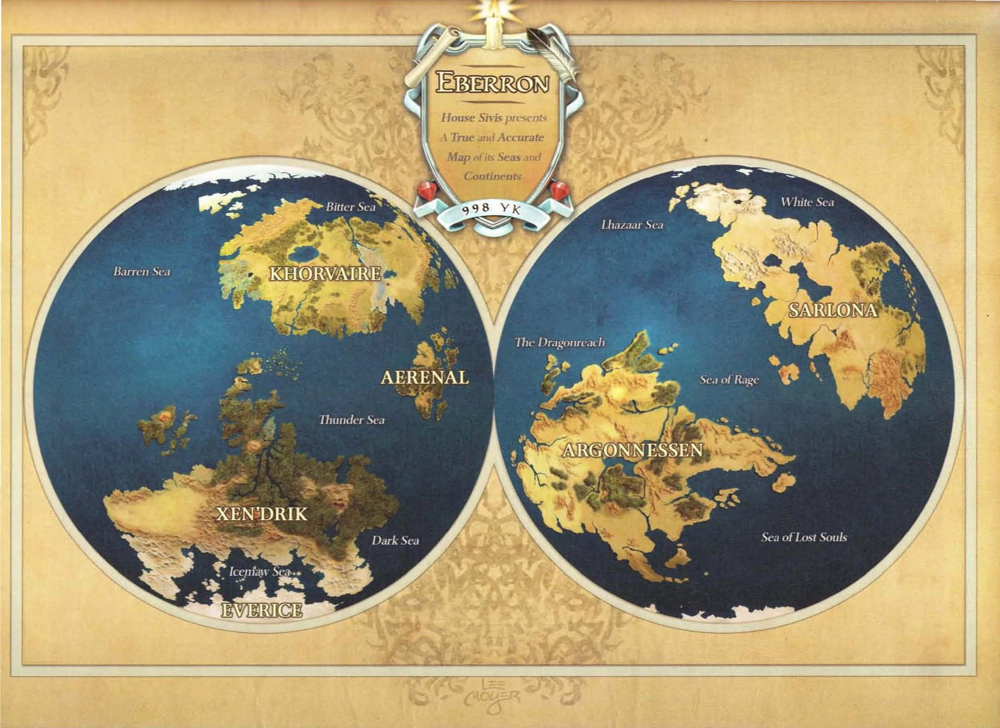

# Эберрон

Эберрон — сеттинг, созданный библиотекарем Кейтом Бейкером для игры Dungeons & Dragons. Эберрон Бейкера выиграл на проводимом Wizards of the Coast конкурсе Fantasy Setting Search (Поиск фэнтезийного сеттинга), проводившемся в 2002 с целью найти новый сеттинг для D&D. Эберрон и еще 2 сеттинга были выбраны из более 11.000 конкурсных работ.

Эберрон совмещает в себе фэнтези с элементами нуарного детектива, а также приключенческой и научной фантастики: поездами, псионикой, воздушными кораблями и механическими разумными созданиями.

Книга «Eberron Campaign Setting» (первое дополнение, описывающее мир Эберрона), написанная Кейтом Бейкером, Биллом Славичеком и Джеймсом Виаттом, была опубликована в июне 2004 года. В июне 2005 она победила на конкурсе Origins Award в номинации «Лучшее дополнение 2004 года».

## Заслуживающие внимания отличия от стандартного сеттинга D&D

Для начала, Эберрон — это не мир магического псевдосредневековья с благородными рыцарями и могущественными волшебниками. Он частично похож на Новое Время, частично на Европу времен королевы Виктории, с поправкой на то, что технологическое развитие на Эберроне заменено на магию.

При этом высокоразвитая магия, такая как воскрешение мёртвых, является редкой, как и высокоуровневые персонажи вообще. Но низкоуровневая встречается повсеместно и доступна широким слоям населения. Улицы многих городов освещаются волшебными вечно горящими фонарями, а поездку в город на поезде по молниевой дороге может позволить себе даже не слишком богатый крестьянин.

В отличие от стандартного сеттинга D&D, мир Эберрона не делится на «чёрное» и «белое», а окрашен в оттенки серого. Часть злых рас (таких, например, как медузы или хобгоблины) в Эберроне представляются в другом свете, а добрые организации и сообщества могут быть отнюдь не абсолютным прибежищем добродетели.

Основное действие в мире Эберрона разворачивается после разрушительной войны на континенте Хорвайр. Последствия войны сказались практически на каждом жителе континента, и в настоящий момент уровень доверия населения государственным структурам и старым традициям небывало низок, что накладывает отпечаток на общий настрой сеттинга.

|   |
|---|
||
|Новый кованый выходит из кузни творения.|

В Эберроне впервые появилось несколько новых игровых рас. Кованые — созданные магией живые конструкты, которые повсеместно использовались во время недавно завершившейся мировой войны. Подменцы — потомки допельгангеров, которые могут свободно менять свою внешность и как правило живут, маскируясь под представителей других рас. Зверолюди — гуманоиды, обладающие некоторыми звериными чертами и способные обращаться к своему звериному началу в бою. Калаштары — результат слияния людей и пришельцев из плана снов, которые получают за счет этого преимущества в освоении псионических героических классов.
Стандартные расы фэнтези на Эберроне могут проявлять Метки Дракона, магические отметины, открывающие в носителе сверхъестественные способности. В мире существуют так называемые Дома, Отмеченные Драконом — торгово-промышленные династии, контролирующие значительную долю мировой экономики. Большинство членов этих домов либо являются носителями Меток, либо имеют таковых среди предков и могут передать эту черту своим потомкам.

Сеттинг добавляет новый базовый героический класс — изобретатель (англ. Artificer). Изобретатели — заклинатели, фокусирующие магию в предметах. Также они более искусны в создании разнообразных предметов. Вместо заклинаний они используют инфузии — способности временно наполнять предметы необычными силами и эффектами.

Эберрон также добавляет новый неигровой класс мага-техника, тайного заклинателя со специализацией на низкоуровневых заклинаниях и ремеслах. Именно распространенностью представителей этого класса объясняется большое количество доступной в мире низкоуровневой магии. Чтобы разграничить обычных людей и героев, в сеттинге Эберрона появились очки действий. Их можно тратить, чтобы совершать героические, кажущиеся сверхъестественными поступки. Персонажи обновляют запас очков действий с каждым новым уровнем.

В книге Eberron Campaign Setting и других материалах описываются и новые черты, расширяющие области применения очков действий: например, позволяющие персонажу ещё раз использовать классовые умения, число применений которых в день ограничено, или автоматически стабилизировать состояние персонажа при смерти.

## Космология

### Происхождение мира
Название сеттинга позаимствовано от одного из трех Драконов-Прародителей, мифических существ божественной силы, которым приписывают создание всего мира. Согласно легенде, Сиберис, Эберрон и Хайбер обнаружили в первозданном хаосе либо сами составили Драконье Пророчество, универсальный закон, определяющий существование творения. С его помощью брат и две сестры совместно создали тринадцать внешних планов существования.

Однако сразу за последним актом творения, созданием Первичного Материального Плана, застарелые противоречия между Сиберисом и Хайбер вылились в открытый конфликт. Они вступили в схватку за Пророчество и контроль над судьбой мира. Хайбер удалось убить брата, однако Эберрон смогла улучить момент и пленить злокозненную сестру.

Три дракона стали частями нового мира. Чешуя Сибериса образовала небесное Кольцо Сибериса, опоясывающее мир. Эберрон слилась с поверхностью планеты, превратившись в её почву и залечив раны мира. Хайбер осталась в глубинах, что привело к появлению одноименного подземного мира, аналогичного Андердарку из Forgotten Realms.

Также три дракона породили все формы жизни в сеттинге. Из волшебной эссенции Сибериса появились драконы, ангелы и коатли. Эберрон создала гуманоидов «низших рас» и всю остальную жизнь на поверхности планеты. Хайбер породила всевозможных монстров.

### Планы

|   |
|---|
||
|Космология Эберрона в варианте правил третьей редакции.|

Как и многие другие сеттинги D&D, Эберрон имеет ряд планов существования. Однако космология мира заметно изменилась при переходе от третьей редакции правил к четвёртой. Ниже изложен первоначальный вариант.

Кроме Первичного Материального Плана, Эфирного Плана, Плана Тени и Астрального Плана, в Эберроне существует и 13 уникальных планов. Планы вращаются вокруг Эберрона, подобно спутникам вокруг планет. В зависимости от дистанции между внешним планом и Эберроном различается три варианта того, как план может влиять на материальный мир.

* План удаляется или приближается и не оказывает никакого влияния на Эберрон.
* План прикасается к Эберрону и усиливает родственные ему эффекты в материальном мире. Это касается как заклинаний, так и природных эффектов.
* План удален от Эберрона, и родственные ему эффекты ослабляются в материальном мире.

Также существуют так называемые зоны проявления планов — места, имеющие постоянную связь с одним из внешних планов. Самая известная такая зона находится в мегаполисе Шарне, Городе Башен. Шарн — зона проявления плана воздуха Сирании, благодаря чему в городе крайне легко творить заклинания, связанные с полетом и можно строить здания невероятной высоты.

Путешествие на внешние планы в Эберроне относительно затруднено, поскольку порталы и высокоуровневые заклинания в мире очень редки. Однако путешествие можно через зоны проявления планов в то время, когда соответствующий план прикасается к Эберрону. Например, когда Рисия, План Льда прикасается к Эберрону, то попасть туда можно без всякой магии, попав в сильную метель.

С внешними планами связаны два крупных катаклизма, постигшие Эберрон. Первым было вторжение куори из плана снов, Дал Куора, и их разрушительная война с великанами на Ксен’Дрике. Магам великанов удалось сделать так, что теперь план снов никогда не прикасается к Эберрону. Однако использованные ими ритуалы включали в себя массовые жертвоприношения и нанесли серьезный вред миру. Драконы, которые обучили великанов магии, сочли подобное использование их дара недопустимым. Когда великаны решили таким же образом подавить восстание их рабов-эльфов, драконы вмешались и разрушили то, что еще оставалось от цивилизации великанов.

|   |
|---|
||
|Вторжение из Плана Безумия привело к гибели империю гоблиноидов.|

Вторым конфликтом с обитателями внешних планов было вторжение даэлькиров из Ксориата, плана безумия. Объектом их нападения была империя гоблиноидов Дхаакани. Орки-друиды из секты Хранителей Врат нашли способ ускорить движение Ксориата и разорвать его контакт с Эберроном, однако война истощила империю и привела к её закату. Когда план безумия снова прикоснется к Эберрону точно неизвестно, но считается, что сохранившиеся с тех времен магические печати оттягивают этот момент.
В рамках более поздней космогонии Эберрона  все планы, за исключением Ксориата, являются частью Сибериса, Эберрон и Хайбера, а список планов пополнился Баатором и Бездной.

Вокруг Эберрона вращаются 12 лун, хотя есть мнение, что существует и 13-ая невидимая луна. Каждой из них соответствует один из внешних планов. В рамках первоначальной космогонии луны являлись этими планами. В более поздней версии луны стали порталами, ведущими на соответствующие планы, и «невидимая» луна была уничтожена великанами во время войны с куори.

В четвертой редакции правил космология стала выглядеть следующим образом:

|   |
|---|
||
|Космология Эберрона четвертая редакция|

Сиберис (или Астральное море;Море Сибериса) поделено на царства, подобно миру под ним, и захватывающие дух города в них населены прекрасными, нестареющими существами. 

* Даанви (Daanvi) — план Совершенного Порядка
* Ириан (Irian) —  Вечный День
* Сирания (Syrania) — Лазурное Небо
* Ламанния (Lamannia) — Сумеречный Лес
* Мабар (Mabar) — Бесконечная Ночь
* Баатор (Baator)  — Девять кругов Ада
* Шаварат (Shavarath) — Поля Битвы

Эберрон (основной Физический мир) состоит из:

* Доларх (Dolurrh) — Царство Теней
* Селанис (Thelanis) — Страна Фей
* Дал Куор (Dal Quor) — таинственный План Грёз. В данный момент сильно отдален от Эберрона магией Великанов.

Хайбер (Элементальный Хаос в Эберроне также представлен огромными подземельями, который простираются под континентами и океанами) родина демонов, дьяволов и ещё более худших существ. Они изо всех сил стремятся вырваться из Хайбера в Кольцо Эберрон, чтобы охотиться на уязвимые тела и разумы смертных. Состоит из:

* Ферния (Fernia) — Океан Пламени
* Рисия (Risia) — План Льда
* Кутри (Kythri) — Стихийный Хаос
* Бездна (The Abyss) — об этом плане практически ничего неизвестно в Эберроне

Некоторые верят, что существует четвертый слой вселенной, или, возможно, слой за её пределами. Учёные называют этот план «Ксориат, Мир Безумия». Даже храбрые вздрагивают при упоминании существ, живущих там. Хоть большая часть того, что известно о Ксориате, недостоверна, но само существование Мира Безумия и его воздействие на Эберрон не вызывает сомнений.

* Ксориат (Xoriat) — план безумия. 

## География

|   |
|---|
||
|Современная карта Эберрона|

"Осью мира" в Эберроне выступает континент Хорвайр (по очертаниям частично напоминающий Россию). Именно на этом континенте в свое время располагалась империя гоблиноидов, погибшая в войне с обитателями плана безумия. Сейчас самой многочисленной нацией Хорвайра являются люди, потомки колонистов с континента Сарлона.

До недавних пор большая часть земель Хорвайра была объединена в королевство Галифара. Однако чуть более ста лет тому назад между детьми короля произошел спор о порядке наследования. Последовавшая за ним кровопролитная Последняя Война унесла огромное количество жизней и привела к распаду королевства. Конец ей положило приписание Тронхольдского мирного договора два года назад.

Великие государства людей когда-то были единым целым, затем пятью, а теперь четырьмя королевствами: учёный Аундаир, милитаристский Каррнат, теократический Трейн и космополитичная Бреландия. Эти четыре королевства вместе с погибшим государством, некогда известным как Сайр, находятся в центральном Кхорвайре. Разрушенный Сайр теперь зовётся Землями Скорби, это опустошённое призрачное царство, где серый туман высасывает жизнь из путников. Мало кому удаётся здесь выжить, но сокровища погибшего государства искушают некоторых испытать свою удачу. Единственные живые существа здесь — охотники за сокровищами, путешественники, а также те, кто не обладает жизненной силой, которую крадёт эта земля: кованые, нежить и другие, ещё более необычные существа.

Аундаир, Бреландия, Каррнат, Сайр и Трейн в далёком прошлом именовались Пятью Народами, и, несмотря на то, что одного из них больше нет, это название всё ещё используется. Когда-то эти государства были основой великого королевства Галифар. За пределами Пяти Народов земель людей немного — это Лазаарские княжества на северо-западе, тропическая Ку’барра на юго-востоке и дикие земли Элдиинских Пределов на западе.

Кхорвайр — это родина и других рас. Дом дварфов — Чертоги Мрора, что находятся на северо-востоке, близь Каррната. Полурослики-кочевники путешествуют по Талентским равнинам, на востоке. Эльфы с острова Аеренал поселились в землях, известных как Валенар, на юго-востоке. Селения орков и полуорков сосредоточены в болотистом Сумрачном Пограничье, на западе. Гномы зовут своим домом южный Зиларго; в давние времена, когда рухнуло древнее королевство тифлингов Ор Калуун, тифлинги нашли себе пристанище в западном Кхорвайре.

По диким лесам континента странствуют шифтеры. Анклавы драконорождённых на востоке возрождают великую империю своего древнего прошлого. Эладрины долгое время проводили в Кхорвайре, покидая свои дома в Стране Фей, но сейчас многие феи застряли в этом мире. Один из их городов разделил судьбу Земель Скорби. Даже расы чудовищ — минотавры, медузы, огры, и прочие — считают Дроаам своим собственным государством в Кхорвайре, хотя другие страны на материке отказываются признавать их суверенитет.

Южнее Кхорвайра находится небольшой остров-континент Аэренал, населённый эльфами. Их предки когда-то были рабами у великанов Ксен’Дрика, но сумели бежать через море во время войны великанов с куори, обитателями плана снов. Аэренал подвергается периодическим нападениям драконов с Аргонессена, хотя причины этих регулярных рейдов остаются загадкой для большинства обитетелей мира. Ведомые своими прародителями-нежитью, аерени сохраняют свои традиции неизменными уже многие тысячелетия. Постороннему взгляду эльфы этого древнего королевства напоминают некромантов или смертепоклонников, но почтение к мёртвым не делает их злыми. Однако кроме богатых возможностей в этих землях полно и опасностей.

Ксен’Дрик, древняя родина цивилизации великанов, находится южнее Хорвейра. Те из великанов, что пережили войну с Дал Куором и последующее истребление со стороны драконов, выродились и впали в дикость. Второй многочисленной расой Ксен’Дрика являются Дроу, дикие родственники аэренальских эльфов. Континент представляет большой интерес для исследователей и авантюристов, поскольку в многочисленных руинах, оставшихся от цивилизации великанов, скрываются огромные сокровища.

|   |
|---|
||
|Куори правят империей Рьедра, используя Вдохновленных в качестве материальной оболочки.|

Сарлона, — это сосед Кхорвайра сразу и с востока, и с запада, историческая родина людей. В настоящий момент большую часть её территории занимает империя Рьедра, автократическое государство, управляемое так называемыми Вдохновленными. Посредников и дипломатов Вдохновленных можно встретить в любом крупном поселении Кхорвайра. Другие области Сарлоны — Адар, Сиркарн и Ташана Тундра — характеризуются через их отношение к Риедре и находятся в её тени. Время от времени адарианские путешественники посещают Кхорвайр. Вдохновленные — это результат вселения куори в тела смертных. Тайная цель империи заключается в том, чтобы найти способ соприкоснуть Дал Куор с Эберроном и начать второе полноценное вторжение из плана снов.

Главными противниками вдохновленных выступают калаштары горного королевства Адар. Калаштары — также результат слияния куори и смертных, однако породила их группа беглецов диссидентов из Дал Куора, которая не хотела мириться с царящими там жестокими порядками. Древние жители Адара добровольно приютили этих куори, став их смертными носителями, а не марионетками, как это происходит в случае вдохновленных. Рьедра значительно превосходит Адар по ресурсам, но покорить его не может благодаря его стратегическому местоположению и защите магической природы.

Арогонессен находится южнее Сарлоны и является родиной драконов. Большинство обитателей мира мало что знают о делах этих существ. Известно, что они большое значение придают поиску фрагментов Драконьего Пророчества, которое они видят в движении лун и звезд, знаках, начертанных на земле, и странных узорах. Эти узоры — драконьи метки, и многие ученые видят в них символ силы и судьбы. После неудачного опыта с великанами драконы долгое время практически не контактировали с малыми расами. Однако их интерес разгорелся вновь после появления в мире Меток Дракона, которые, вероятно, являются частью Пророчества.

На далеком севере находится неизведанный континент Фростфелл — К северу от Кхорвайра лежат ледяные пустоши Фростфелла, это место зарождения свирепых зимних бурь и родина внушающих ужас чудовищ льда и разрушения. Лишь две экспедиции из Кхорвайра смогли выдержать безжалостный холод Фростфелла, но ни одна из них не сообщила об этих бесплодных землях ничего хорошего.

## Последняя война

Последняя война — событие, оказавшее огромное влияние на мир Эберрона. В качестве её прототипов выступают с одной стороны Столетняя война между Англией и Францией, с другой стороны — Первая Мировая.

Причиной войны послужил спор о том, кто из детей короля Джейрода ир’Винарна должен унаследовать его трон. Традиция требовала возведения на престол принцессы Мишанн, наместницы Сайра. Однако принц Талин, наместник Трейна, оспорил это право. Наместники Каррната и Бреланда поддержали его претензии, в то время как наместник Аундаира, верный данному отцу слову, выступил на стороне Мишанн.

Кровопролитный конфликт между некогда едиными Пятью Нациями продолжался больше века. Воюющие стороны заключали и разрывали альянсы друг с другом и со сторонними силами, захватывали и теряли территории, создавали новые виды оружия, но никто из них не смог получить решающего преимущества и возродить королевство Галифара.

Решающий перелом в военных действиях обескровленных противников возник в результате магической катастрофы, стёршей с лица земли Сайр. Это событие, получившее название День Скорби, превратило некогда наиболее промышленно развитую часть королевства в выжженную магией пустыню, населенную лишь конструктами и смертельно опасными живыми заклинаниями. Сейчас эта территория называется Землями Скорби, а бывшие подданные Сайра поголовно стали беженцами.

Что вызвало День Скорби достоверно неизвестно, но ударила эта катастрофа и по остальным четырем великим нациям. Как раз в тот момент на территории Сайра находились значительные силы его противников, осуществлявших скоординированное вторжение, и эти армии также погибли в тот день. Воспользовавшись передышкой в войне, король Каррната Кай III по дипломатическим каналам договорился о проведении переговоров в древней столице Галифара, Тронхольде. Два года спустя был подписан Тронхольдский мирный договор.

По итогам войны все первоначальные участники конфликта потеряли значительные территории. Мирный договор признал за ними суверенитет, хотя независимыми де факто они стали задолго до этого. В итоге на Хорвайре появилось 12 равноправных стран. Единственными территориями континента, не имеющими своей государственности, остались Демонические Пустоши, которые и так никогда не были частью королевства Галифара, раздробленные и слишком удаленные от центра цивилизации Теневые Топи, не менее раздробленное «королевство монстров» Дроаам и не приспособленные для жизни Земли Скорби.

|   |
|---|
||
|После окончания Последней Войны освобожденным кованным пришлось искать место в мирной жизни.|

Вторым значительным итогом переговоров стало признание кованных в качестве полноценной расы, обладающей свободой воли. Кованные были созданы во время войны Домом Каннит в качестве неутомимых солдат. Сформированные из них подразделения сражались на стороне всех, кто мог себе позволить их купить. Тронхольдский Договор сделал незаконным право собственности на всех кованных, хотя то, насколько свободными они стали в реальности сильно зависит от страны пребывания.

С другой стороны, договор запретил производить новых кованных и принудил Дом Каннит разрушить все имеющиеся у него Кузни Творения — сложные магические устройства, в которых кованные и создавались. Ходят слухи, что какие-то из Кузен были тайно сохранены, но подтверждений этому пока не существует.

Наступивший два года назад мир остается хрупким. Среди правящих кругов великих наций сильны реваншистские настроения. Беженцы Сайра пока что нашли приют на территории других стран, но многие из них хотели бы иметь землю по праву сильного, а не из милости. Часть новых стран вроде эльфийского Валенара или гоблиноидского Даргууна не очень-то признают Тронхольдский договор и продолжают время от времени нападать на соседей. А в Землях Скорби обосновалась секта кованных-радикалов, лидер которых, Лорд Лезвий, объявил свою расу высшей и вынашивает планы истребления всех, кто состоит из плоти и крови.

## Великие Дома

Великие Дома или Дома, Отмеченные Драконом — 13 фамильных родов, которые контролируют большую часть экономики и промышленности Хорвайра. В настоящий момент по степени влияния они сопоставимы с традиционной земельной аристократией, но так было не всегда.

Во времена Империи Галифара Дома сдерживалось всевозможными ограничениями и занимали подчиненное положение. Только хаос Последней Войны позволил им подняться до нынешнего уровня.

### Метки Дракона

|   |
|---|
||
|Метка Поиска в четырех вариантах силы и размера.|

Первоначальной основой процветания Великих Домов являются Метки Дракона. Это передающиеся по наследству отметины, напоминающие татуировки, которые наделяют носителя сверхъестественными способностями. Внутри Домов лишь малая часть проявляет силу метки, но из-за родственных связей, которые связывают большинство членов Дома, у каждого есть шанс, что метка проявится у кого-то из потомков.

Всего меток 12 (не считая потерянной Метки Смерти). Каждая метка привязана к одной из базовых рас сеттинга и не может проявляться у других рас. При этом Великих Домов — 13 (не считая истребленного Дома Вол). Дом Фиерлан и Дом Туранни, проявляют одну и ту же Метку Тени и конкурируют между собой.

Метки Дракона делятся на три формы:

* Искажённая
* Обычная
* Сибериса

Обычные метки в свою очередь бывают трех степеней силы:

* Меньшая
* Средняя
* Великая

По мере развития персонажа более слабая метка может переходить в более сильную, давая доступ к более мощным сверхъестественным способностям и визуально увеличиваясь в размере.

В отличие от них Метка Сибериса, сила которой превосходит даже силу обычной Великой Метки, проявляется внезапно и сразу. Членами великих домов могут быть носители обеих этих разновидностей меток.

### Искажённые метки

|   |
|---|
||
|Искаженные метки заметно отличаются от нормальных.|

Искажённые Метки Дракона отличаются от обычных формой и цветом, а также набором способностей, которые они открывают. Известно, что дети от смешанных браков носителей обычных меток имеют высокий шанс родится с Искажённой Меткой. Считается, что такие метки оставляет Хайбер, Дракон Глубин, и что носители таких меток всегда преданы злу.

Это мнение частично правдиво. Силы, которые дают Искаженные Метки, часто имеют деструктивную направленность и склонны проявляться спонтанно. В результате этого человек, у которого проявилась Искаженная Метка, имеет много шансов стать причиной несчастного случая, вероятно, даже со смертельным исходом.

Порядка 25 веков назад число и сила Искаженных Меток начали резко возрастать, спровоцировав вспышку подозрительности и гонений на носителей таких меток. Великие Дома принимали участие в этих гонениях, желая доказать принципиальное отличие Истинных Меток от Искажённых.

Те носители Искаженных Меток, кто не был убит линчевателями или казнен властями, объединились вокруг генерала Халаса Тарканана. Он был талантливым офицером и носителем особо мощной Метки. Благодаря его руководству и наличию некоторого числа других носителей сильных Меток, изгоям удавалось достаточно долго противостоять превосходящим силам Домов и их союзников.

Однако разница в ресурсах в итоге взяла свое. Тарканан и его люди, захватившие город, расположенный на территории современного Шарн были полностью уничтожены, хоть и высокой ценой. Эти события, которые получили название Войны Метки, цеметировали Дома, превратив их из просто торгово-промышленных союзов в сплоченные организации, объединенные общей идеалогией.

В настоящий момент существует преступная организация, объединяющая носителей Искажённых Меток. Они называют себя Домом Тарканан в честь легендарного генерала.

### Метка Смерти

Потерянная тринадцатая Метка Дракона проявлялась в могущественной эльфийской династии Вол. Этот род являлся центром политической силы на Аундаире, конкурирующим с Двором Неумирающих. Обе стороны нашли способ достижения бессмертия, но если Двор для поддержания существования после физической смерти использовал позитивную энергию, то Вол применяли негативную.

Конкуренция переросла в полноценную гражданскую войну, причиной которой послужила Эрандис д’Вол, полудракон-полуэльф. Ее рождение явилось результатом долгих экспериментов Вол и их союзников -драконов. Сила Метки Смерти, проявившейся у Эрандис, на голову превосходила все, что появлялось в мире до этого. Прочие эльфы и драконы восприняли девушку как угрозу и объявили Вол войну на уничтожение. В результате весь род был уничтожен, а Метка Смерти была утрачена.

В настоящее время единственный представитель рода Вол — та самая Эрандис, которая обрела бессмертие, став личом. Однако превращение в нежить лишило её силы Метки, и теперь она пытается найти способ восстановить её. Помимо этого она хочет отомстить за уничтожение её рода как эльфам, так и драконам.

Инструментами для леди Вол служат церковь Крови Вол и Орден Изумрудного Когтя.

### Жизнь Великих Домов

Свою огромную власть Дома, Отмеченные Драконом, обрели за долгие века коммерческой деятельности. Задолго до объединения Хорвайра в Империю Галифара они способствовали развитию международной торговли. В настоящее время Дома выполняют роль международных регуляторов, регулируя цены на товары и услуги и следя за соблюдением качества на всех аффилированных с ними предприятиях.

Магические исследования Домов привели к появлению множества удивительных изобретений, включая молниевые дороги, воздушные корабли или магическое почтовое сообщение. Великий Дом Каннит нашел способ создать целую новую расу — кованных.

До Последней Войны деятельность Домов была сильно ограничена Кортскими Эдиктами. Им было запрещено владеть землей, за исключением той, что находится под их анклавами. Член Дома, вступивший в брак с представителем семейной аристократии, обязан был отказаться от своих былых привилегий. Также им было запрещено служить в национальных армиях. Лишь одному из Великих Домов — Дому Денейт — дозволялось собирать сколь-нибудь многочисленные войска. Ослабление государственной власти за век бесконечных сражений привело к тому, что многие влиятельные люди в Великих Домах подумывают о том, чтобы сбросить былые запреты.

Не все носители Меток Дракона работают на соответствующие Дома. Есть те, кто отказался от всяких связей с Домом по тем или иным причинам либо временно ведет самостоятельный образ жизни, но планирует вернуться в лоно Дома позже.

Наконец, есть те, от кого отказался сам Дом в порядке наказания. Это называется эксориация, или усекновение. Подвергшегося ей члена Дома лишают всех привилегий, включая право добавлять название Дома к своему имени. Прочим членам дома не позволяется под страхом наказания иметь контакт с подвергшимся эксориации. Осуждаться может даже предоставление услуг Дома теми гильдиями, которым Дом покровительствует.

В былые времена при эксориации действительно физически срезали участок кожи, на котором проявилась Метка. Эта болезненная процедура не лишает носителя силы Метки, поскольку со временем она проявляется на новом месте. Но в некоторых случаях, особенно когда наказанию подвергались носители Великой Метки или Метки Сибериса, эксориация была намеренно смертельна.

## Религиозные системы

В Эберроне существует несколько религиозных течений разного происхождения и степени организованности. Классических фентезийных богов, активно вмешивающихся в дела смертных, в сеттинге не существует.

### Владычествующий сонм
Самая распространенная религия на Хорвайре — поклонение Владычествующему Сонму — пантеону из девяти благоволящих смертным божеств. Они покровительствуют различным областям цивилизации, от земледелия и охоты до торговли и законов. Считается, что люди, занимающиеся соответствующими профессиями, самим фактом своего труда поклоняются соответствующим богам.

К этому же культу относится поклонение Шестерым Тёмным. Это шесть божеств разных вариантов злой и хаотичной приверженности, которые откололись или были изгнаны из Владычествующего Сонма за разные проступки. В отличие от божеств Владычествующего Сонма, они не имеют своих имен, только прозвища. Шестеро находят своих поклонников среди преступников и людей, приверженных злу по идеологическим соображениям.

Все эти 15 божеств имеют общую историю и сложную систему взаимоотношений. Например, Ауреон — супруг Болдреи и брат Онатара. Аравай — сестра Балинора и Пожирателя. Ярость — дочь Аравай от Пожирателя, который изнасиловал собственную сестру. Тень — это ожившая тень Ауреона. И так далее.

### Серебряное пламя

|   |
|---|
||
|Колонна серебряного пламени в центре главного собора Флеймкипа.|

Вторая по значимости религия на Хорвайре — церковь Серебряного Пламени. Это законопослушно-добрая религия, постулирующая необходимость активного сопротивления злу в мире, особенно сверхъестественному, чем она напоминает зороастризм. Церковь является государственной религией в Трейне.

Главным объектом поклонения является столп пламени волшебной природы, находящийся в городе Флеймкип на территории Трейна. Пламя появилось порядка семисот лет назад в результате битвы между вырвавшемся из заточения могущественным демоном и его прислужниками с одной стороны и силами смертных под предводительством паладина по имени Тира Мирон с другой. Мирон и примкнувший к ней древний пернатый змей коатль пожертвовали собой, чтобы остановить демона, и их души превратились в Серебряное Пламя.

Пламя обладает собственным разумом и само выбирает себе старшего прислужника, являющегося формальным главой церкви. В настоящий момент таковым является Джаэла Даран, одиннадцатилетняя девочка.

Церковь сыграла ключевую роль в борьбе с эпидемией ликантропии, охватившей западную часть континента, особенно Аундарил и Трейн, два века назад. Благодаря самоотверженности тамплиеров Серебряного Пламени распространение болезни удалось остановить, а большую часть ликантропов на континенте истребить.

Однако борьба с эпидемией оставила тяжёлое наследство. Церковь не стеснялась в методах и не сильно усердствовала, устанавливая вину тех, в ком подозревала оборотней. В итоге помимо представлявших реальную опасность злых ликантропов было истреблено много невиновных — добрых ликантропов, шифтеров и просто попавших под подозрение. Из-за этого церковь получила частично незаслуженное клеймо фанатиков.

### Двор Неумирающих

|   |
|---|
||
|Неумирающие — особая форма нежити, основанная на энергии Ириана, Плана Вечного Дня.|

Эльфы Аэренала умеют создавать особую форму нежити, неумирающих. В отличие от традиционной нежити вроде вампиров и личей, неумирающие черпают силу в позитивной энергии и склонны к добру. В Аэренале церемонию превращения в неумирающих проходят наиболее выдающиеся эльфы. Обретя бессмертие, они служат своим потомкам в качестве мудрых советников, а те в ответ поклоняются им.

### Кровь Вол
Адепты Крови Вол ищут божественность внутри себя и считают кровь источником жизни — буквально и метафорически. Во время Последней Войны церковь смогла завоевать большое влияние в Каррнате, с которым поделилась известными ей секретами создания нежити.

Однако около десяти лет назад король Кай III значительно ограничил влияние церкви. Он объявил вне закона орден Изумрудного Когтя, который фактически являлся военным крылом церкви Крови Вол, а саму религию лишил большинства былых привилегий.

Тайной причиной этого падения является то, что церковь на самом деле была создана в качестве инструмента влияния личом по имени Эрандис Вол. Когда-то леди Вол была полу-драконом полу-эльфом, носителем драконьей метки Смерти. Родители надеялись, что рождение девочки позволит примирить эльфов Аундарила и драконов Аргоннессена.

Однако и те, и другие посчитали такое существо чудовищем. Дом Вол был истреблен, и только сама Эрандис выжила, став личом, но утратив силу метки. В течение тысячелетия Вол вынашивала планы мести эльфам и драконам. Церковь Крови Вол — одно из последних воплощений её планов.

Кай III — на деле является Каем I, вампиром, обращённым в нежить леди Вол, но восставшим против её власти и сумевшим заменить своего внука на престоле Каррната. Борьба с влиянием лича на его страну стала одной из главных задач короля.

### Друидические культы
Поклонение природе друидического толка распространено в менее обжитых регионах Хорвайра. Главным прибежищем друидов Эберрона являются Эльдинские Дали, огромный лес на западе континента. Друиды не имеют единой церкви и делятся на множество культов, отличающихся по влиянию, численности и идеологии.

### Культы Дракона Снизу
Под этим названием объединяются разрозненные секты безумцев, ищущих могущества в поклонении различным воплощениям злых сил, в частности, легендарному дракону Хайбер.

### Путь Света
Калаштары Адара имеют свою законопослушно-нейтральную религию, направленную на поклонение божественному великому свету, иль-Янна. Религиозные практики направлены на совершенствование духа и тела путем медитаций, постов и физических упражнений. Происхождение религии можно проследить до Таратаи, первой из беглых куори, появление которых привело к появлению калаштаров как самостоятельной расы.

### Путь Вдохновления
В империи Рьедра государственной религией является Путь Вдохновения, культ поклонения куори. Для жителей империи куори являются добрыми покровителями, защищающими их от зла и мудро управляющими государством. Вдохновленные — это смертные носители куори, которые занимают руководящие должности в Рьедре.

### Другие религии
Существуют и другие верования, которые не так подробно описаны в исходных материалах по сеттингу. Например, дикари Аргоннессена поклоняются драконам, а доктрину превосходства кованных над прочими расами, которую проповедует Лорд Лезвий, можно считать религиозной.

## Элементальные транспортные средства
На Эберроне есть транспортные средства, использующих силу пленённых элементалей. Два из них являются примечательными элементами сеттинга. Это молниевые экипажи и воздушные корабли. Также существуют галеоны Дома Лирандар, водные суда, приводимые в движение водными элементалями, но они не так хорошо известны.

Лучшими специалистами по связыванию элементалей являются гномы Зиларго. Без их участия в разработке появление элементальных транспортных средств было невозможным.

### Молниевые дороги

Молниевые экипажи — аналог железнодорожных поездов в мире Эберрона. Они могут перемещаться только по специально проложенным молниевым дорогам. Такая дорога представляет собой цепочку магических камней-проводников, которые взаимодействуют с аналогичными камнями на днище проходящего экипажа и таким образом поддерживают его в воздухе. При этом между парами камней проходят электрические разряды, от которых и произошло название экипажей и дорог.

Сам экипаж приводится в движение силой заключённого в нем элементаля воздуха. Магические «вожжи», с помощью которых можно контролировать элементаля, может использовать только носитель Метки Прохода, поэтому эксклюзивным оператором молниевых дорог является Дом Ориен, объединяющий носителей этой метки.

Строительство сети молниевых дорог, связывающей все крупные города Пяти Наций, началось почти за 50 лет до начала Последней Войны. В настоящий момент из-за гибели Сайра в День Скорби и разрушения моста, некогда связывавшего Аундаир и Каррнат сообщения между западной и восточной частью сети нарушено.

### Воздушные корабли

|   |
|---|
||
|Воздушный корабль с характерным огненным кольцом|

Воздушные корабли — это аналог дирижаблей в мире Эберрона. Такой корабль удерживается в воздухе и приводится в движение огненным элементалем, который опоясывает судно в виде кольца пламени. Встать за штурвал воздушного корабля может только носитель Метки Шторма, а появились они менее десяти лет назад, так что большая часть таких кораблей до сих пор остается во владении Дома Лирандар, объединяющего носителей этой метки.

Стоит отметить, что в среднем воздушные корабли уступают молниевым экипажам в скорости. Однако существуют разные модели кораблей, а некоторые вообще строились по индивидуальному проекту. Поэтому некоторые воздушные корабли могут превосходить по скорости и молниевые экипажи, и элементальные галеоны.

## Осколки Драконов

|   |
|---|
||
|Три разновидности Осколков Драконов.|

Осколки Драконов — тяжёлые полупрозрачные кристаллы с пульсирующими внутри подвижными цветными прожилками. Форма этих прожилок напоминает Метки Дракона, хотя не было такого случая, чтобы рисунок в осколке полностью совпал с какой-либо меткой.

Согласно мифологии Эберрона, осколки являются фрагментами тел трех легендарных драконов, которые создали мир. Существует три разновидности осколков, которые ассоциируются с Сиберисом, Эберрон и Хайбер. Они различаются внешне и по областям применения.

Осколки Драконов являются одним из самых ценных ресурсов сеттинга. Они могут усиливать сверхъестественные способности Меток, а также используются при создании различных магических предметов. Осколки размером поменьше вставляют в кольца, ожерелья и другие магические ювелирные предметы. Более крупные используются в жезлах и посохах, магических доспехах, конструктах и транспортных средствах.

### Осколки Сибериса
Осколки Сибериса, также известные как «солнечные камни» и «звездные пылинки» падают с Кольца Сибериса в небесах Эберрона. Они чаще всего обнаруживаются в экваториальных регионах, таких как Ксен’Дрик и Аргонессен. Прожилки внутри этих кристаллов золотистые, а сами они жёлто-янтарного цвета.

Осколки Сибериса имеют самую тесную связь с Метками и усиливают их способности в том или ином аспекте. Как правило осколок настраивается на конкретную Метку Драконов, прежде чем его можно будет использовать. Многие услуги Великих Домов, включая магический телеграф Дома Сивис или магическая охрана частных домов Дома Кундарак сильно зависят от использования предметов, созданных из Осколков Сибериса

Также Осколки Сибериса позволяют владельцу-псионику лучше фокусировать свою псионическую силу, что определяет их ценность для псионов-калаштаров и вдохновленных правителей Рьедры. Это требует довольно болезненной операции, в ходе которой осколок вживляется в тело пользователя.

### Осколки Эберрон
Осколки Эберрон находят в толще земли, но никогда в скальных породах. Как правило они встречаются в виде кластера, заключенного внутри жеоды. Такие осколки попадаются на Хорвайре и Аэренале и только там. Предполагается, что они могут быть связаны с появлением Меток Дракона у младших рас Эберрона. Сами кристаллы — розовые, а прожилки внутри имеют насыщенный темно-красный цвет, из-за чего такие осколки получили название «кровавые камни».

Сфера применения Осколков Эберрон шире, чем у двух других разновидностей осколков. Заклинатель может настроить Осколок Эберрон на определенное заклинание, после чего это заклинание будет усилено, если его использовать на осколок. Именно так создаются «вечные фонари». Также заклинатели могут использовать Осколки Эберрона вместо книги заклинаний.

Осколки Эберрон способны накапливать пси-энергию и служат псионическим эквивалентом магических свитков.

### Осколки Хайбер
Осколки Хайбер находят в глубоких подземельях, особенно рядом с озерами магмы и внутри геотермальных источников. Особенно часто они встречаются там, где водится много демонов или элементалей, например в Демонических Пустошах. Выглядят они как дымчатые кристаллы с прожилками тёмно-синего до иссиня черного цвета. Их иногда называют"осколками ночи" и «демоническими камнями».

Магические свойства Осколков Хайбер связаны с заклинаниями связывания. Поэтому они необходимы в производстве небесных кораблей, молниевых поездов и других устройств, использующих силу связанных элементалей.

## Число 13

Число 13, а точнее — «13-1», играет особенную роль в Эберроне. Во многих областях Эберрона изначально существовало 13 понятий, но одно из них было утеряно/уничтожено, и поэтому их осталось на данный момент лишь 12.

* Существует 13 планов, но только 12 могут приближаться/удаляться, план Ксориат же постоянно отдален от Эберрона.
* Существует 13 Меток Драконов, но одна из них, (Метка Смерти), была уничтожена. В Эберроне также 13 Домов, но у двух из них — общая метка.
* Существует 13 различных рас, но не все из них «официально зарегистрированы».
* Древние календари Галифара насчитывали 13 месяцев, а современные календари Эберрона насчитывают лишь 12.
* Во времена Эры Великанов легенды рассказывали о 13 лунах, но сейчас их 12.
* В Твердынях Мрор было 13 Кланов Гномов, но один был уничтожен, поэтому сейчас их 12.

----

* [City of Towers](http://cityoftowers.ru/) — сайт российской группы, занимающейся организацией кабинетных игр по Эберрону.
* [The Grand History of Eberron](http://www.scribd.com/doc/7469132/The-Grand-History-of-Eberron) — неофициальное дополнение, представляющее собой компиляцию истории Эберрона из различных источников.

----

Eberron is a campaign setting for the Dungeons & Dragons (D&D) role-playing
game, set in a period after a vast destructive war on the continent of
Khorvaire. Eberron is designed to accommodate traditional D&D elements and
races within a differently toned setting; Eberron combines a fantasy tone with
pulp and dark adventure elements, and some non-traditional fantasy
technologies such as trains, skyships, and mechanical beings which are all
powered by magic.

Eberron was created by author and game designer Keith Baker as the winning
entry for Wizards of the Coast's Fantasy Setting Search, a competition run in
2002 to establish a new setting for the D&D game. Eberron was chosen from more
than 11,000 entries, and was officially released with the publication of the
Eberron Campaign Setting hardback book in June 2004. The campaign setting book
was written by Baker, Bill Slavicsek, and James Wyatt.

In June 2005, the Eberron Campaign Setting book won the Origins Award for Best
Roleplaying Game Supplement of 2004.

A new version of the Campaign Setting was released in June and July 2009 to
bring the setting to the new 4th edition of D&D. Released were a Player's
Guide, a Campaign Guide, and an Adventure. In February 2015, an update for the
5th edition was released.

## Hardbacks

* 86400 Campaign Setting
* 86420 Sharn: City of Towers
* 17868 Five Nations
* 17869 Explorer's Handbook
* 882917200 Magic of Eberron
* 953687200 Player's Guide to Eberron

## Accessories

* 95005 Deluxe Eberron Character Sheets
* 95006 Deluxe Dungeon Master's Screen

## Adventures

* 86410 Shadows of the Last War
* 86430 Whispers of the Vampire's Blade
* 17730 Grasp of the Emerald Claw
* 95363 Voyage of the Golden Dragon

## The Forgotten Forge

* EMH1 Reflections of the Multiverse
* EMH2 Pirate's Bounty and the Isle of Fire
* EMH4 Finding the Way
* XMH1 Death in Darguun
