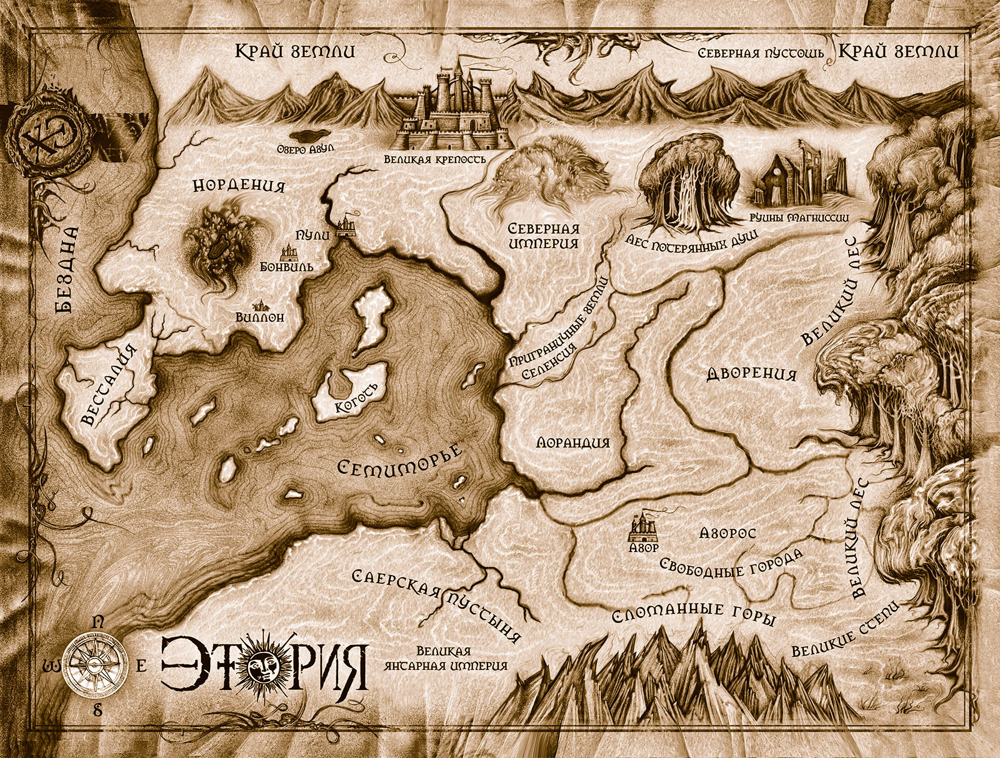

# Этория. 

Цикл произведений российского писателя-фантаста Михаила Костина, лауреата премии «Серебряная стрела», написанный в жанре фэнтези. В цикл входят романы «Тени прошлого» (2007), «Ложные истины» (2008) и «Время умирать» (2015). В планах автора написать еще минимум два тома основного повествования и один, действие в котором происходит спустя некоторое время.

