# Однажды в Калифорнии
## Вселенная Fallout

>   Война... Война никогда не меняется.

|               |                                       |
|---------------|---------------------------------------|
|Название:      |Fallout                                |
|Возникновение: |1997 год новой эры нашего мира         |
|Создатели:     |игровая компания Black Isle Studios    |
|Происхождение: |компьютерные игры                      |
|Воплощения:    |настольная ролевая игра                |

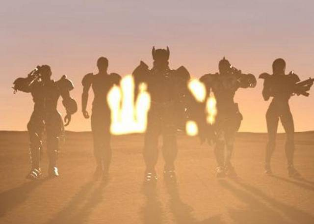

Восход Fallout был подобен яркой вспышке, за которой последовало долгое
затмение. Игра уводила игроков от поднадоевших фэнтезийных вселенных и
приглашала в совершенно иной мир. Мрачная и жестокая картина выжженной
безжалостным солнцем пустоши, где немногочисленные очаги человечества борются
за свое существование и страшная судьба людей, в мановение ока обрушивших на
Землю ярость ядерного хаоса — таким мы увидели мир Fallout.

Антиутопия — жанр, не обделенный вниманием ни в литературе, ни в кино. Но среди
компьютерных игр его практически единственный яркий представитель — серия
Fallout. Самый знаменитый проект Black Isle Studios, ролевого подразделения
корпорации Interplay, внесший очень многое в эволюцию жанра CRPG. Но не только
удачная ролевая система и “взрослый” сюжет обеспечили ей культовый статус.
Пугающий, но такой правдоподобный вариант будущего и оригинальный мир — вот о
чем мы поговорим в нашей статье.

## Назад в будущее

|   |
|---|
|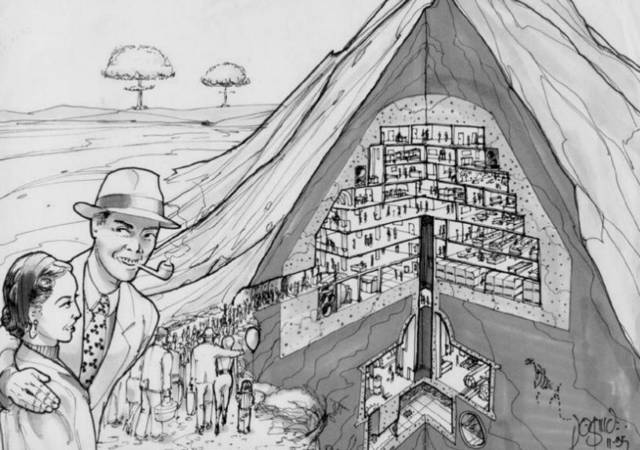    |
|Агитационный плакат программы “Защищенный Дом”. Намеренная стилизация под пропаганду 50-х годов прошлого века. |

Пятидесятые годы 21 века отметились чередой крупномасштабных кризисов по всему
миру. Экономические ресурсы многих стран истощились, и Европа, зависимая от
поставок нефти с Ближнего Востока, ответила на повышение цен на черное золото
военными действиями. Разгорелась давно назревающая война между Европейским
Содружеством и Ближним Востоком. В свете этого конфликта и вновь начавшейся
гонки вооружений Соединенные Штаты запустили в действие проект “Защищенный
Дом”, направленный на создание подземных убежищ — Бункеров (Vaults), для защиты
населения в случае ядерной войны.

В 2060 году Евро-Ближневосточный конфликт изжил сам себя, когда закончилась вся
нефть в скважинах Ближнего Востока. Китай, находящийся на грани экономического
обвала, вел себя крайне агрессивно в торговых сделках с США, а в 2066 вторгся
на Аляску. Пропустив американские войска через свою территорию, Канада тем
самым создала почву для своего присоединения к Штатам в 2076.

|   |
|---|
|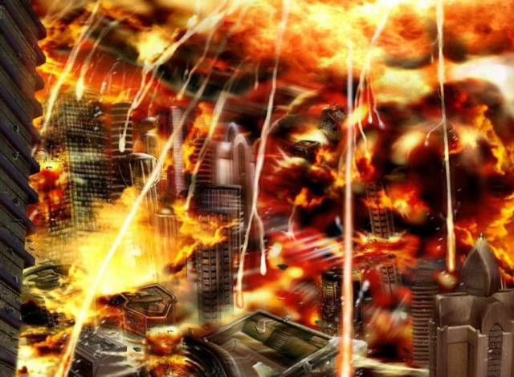  |
|Великая Война.         |

В ходе противостояния использовалось и биологическое оружие, что привело США к
разработке Вируса Принудительной Эволюции (FEV), вызывавшего физические
мутации. Продовольственные и энергетические ресурсы противоборствующих сторон
стремительно таяли. Повсеместно в городах вспыхивали массовые бунты, обычно
заканчивавшиеся многочисленными жертвами среди мирного населения. Участились
случаи дезертирства из армии. Поэтому на территории США было введено сначала
чрезвычайное, а затем и военное положение.

23 октября 2077 года. Эта дата навсегда врезалась в историю как начало
кратчайшей Мировой Войны, когда пошло в ход столь долго сдерживаемое ядерное
оружие. Часть населения США укрылась в Бункерах, остальные же, пережившие
гибельную бомбежку, подверглись действию немыслимых доз радиации, а FEV
оказался выпущен в атмосферу. Под воздействием радиации вирус начал мутировать
и заражать уцелевших людей и животных на бескрайних просторах бесплодных
пустошей. Ядерная зима укутала планету...

## Истерзанный мир

Действие саги Fallout разворачивается преимущественно на территории современной
Калифорнии, затрагивая также Неваду и Орегон. Конечно, Великая Война стерла все
границы и ныне мир состоит из городов-государств, связанных между собой
торговыми отношениями.

Некоторые из них можно и сейчас отыскать на карте Америки, например, Кламат,
Модок или Реддинг. Здесь разместились потомки выживших в ядерной войне, и их
уровень развития крайне невысок. Там, где нет собственного производства,
приходится довольствоваться продуктами давно ушедшей эпохи. Как следствие —
анархия, дефицит воды, жизнь ради выживания, огромное количество наркоманов, а
за власть борются бандитские группировки. А по пустыне кочуют одичавшие
племена, вообще вернувшиеся к первобытному строю.

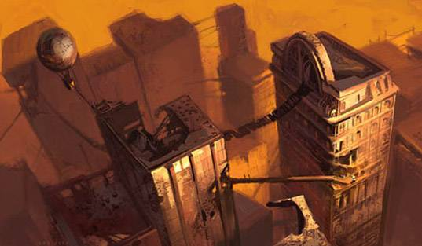

Рено, один из крупнейших городов Калифорнии, также пережил конфликт. Ныне он
именуется Нью-Рено и является центром игорного бизнеса, проституции и
наркоторговли. Эдакое гнездо порока, яркий локальный мегаполис, управляемый
четырьмя семейными кланами криминальных авторитетов.

Иные поселения основаны людьми — потомками укрывшихся в Бункерах. Яркий
пример — Город-Бункер (Vault City). Техническое оснащение здесь вполне на
уровне, институты власти работают, как часы, даря порядок и процветание
гражданам. Правда, простых жителей пустошей они за людей не считают и
используют как рабов. Но жизнь в пустыне настолько тяжела, что многие
предпочитают ей даже такое существование и специально приходят в город.

Однако идея вновь сплотить разрозненные поселения в единое государство не
оставила умы людей. Так на месте неприметной деревушки Тенистые Пески (Shady
Sands) выросла столица стремительно расширяющейся Новой Калифорнийской
Республики, символа единения народов пустошей под централизованной властью.

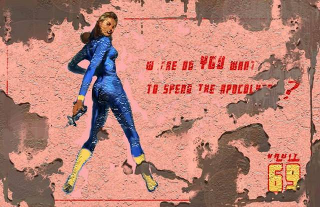

Сан-Франциско ныне заполонен китайцами. Последние “случайно” оказались
во время Великой Войны на подлодке близ берегов Северной Америки, заняли
разрушенный город и перестроили его на свой лад.

Там и сям по пустоши рассыпаны Бункеры: иные — давно заброшены, иные — вполне
обитаемы. О, как ошибались те, кто полагал, что проект “Защищенный Дом” был
запущен в силу присущего членам правительства США альтруизма! На самом деле,
каждый из 122 созданных Бункеров — своего рода эксперимент по изучению реакции
определенных слоев населения на экстремальные условия.

К примеру, Бункер 12 вообще не должен был закрываться, Бункер 8 был
запрограммирован на открытие спустя 10 лет после Великой Войны, Бункер 15 —
спустя 50, а Бункер 13 — через два столетия, ибо целью создания его стояло
изучение сообщества после длительной изоляции от окружающего мира. Но небольшая
случайность — поломка водного чипа — вынудила одного из жителей Бункера 13
выйти в мир гораздо раньше, в 2161 году. Это повлекло за собою цепь
судьбоносных событий, нашедших отражение в оригинальном Fallout.

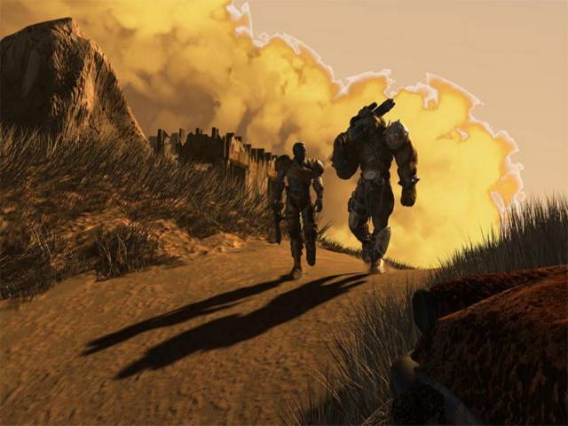
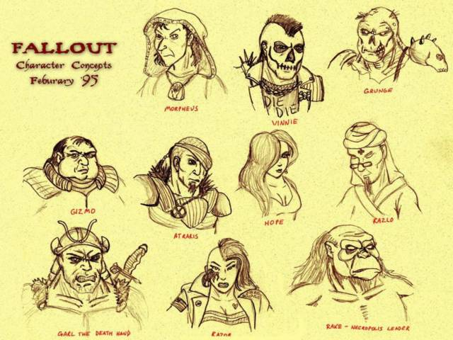
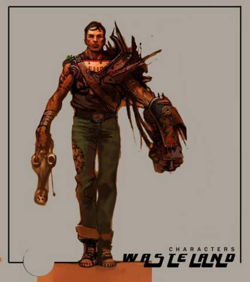
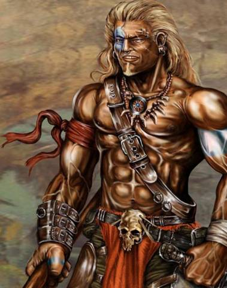
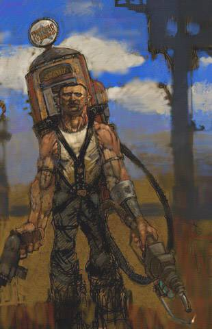

> ### О названии
>
> 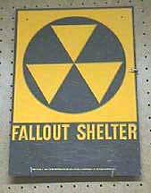
>
> Само слово Fallout, ставшее уже нарицательным для обозначения постъядерных
> миров в фантастике, является военным термином и означает “выпадение
> радиоактивных осадков”. Подобное название хорошо отражает атмосферу всей
> игры, выдержанную в стиле агитационных плакатов начала Холодной Войны, когда
> по обе стороны океана всерьез верили в неизбежность конфликта.

## Фауна пустошей

Чудовищные дозы радиации и FEV нанесли огромный урон окружающей среде и
породили множество удивительных существ; некоторые из них стали визитной
карточкой этой вселенной. Среди банальных гигантских насекомых и крыс
попадаются действительно колоритные виды.

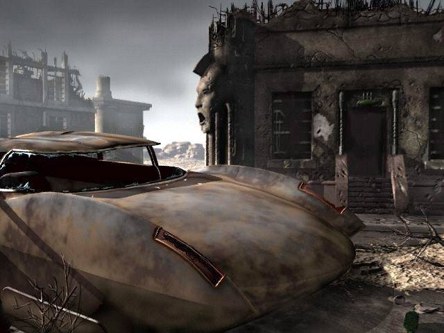
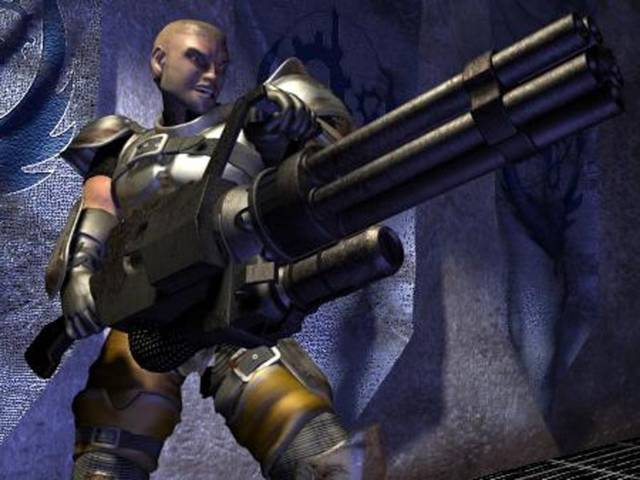

**Брамины** — двухголовые коровы, основа экономики Пустошей. Их разводят на
мясо, на них пашут, длинные караваны из повозок с запряженными в них браминами
являются единственным средством связи и торговли между городами. Прозвище —
отсылка к индийскому почитанию коровы как священного животного.

|   |
|---|
|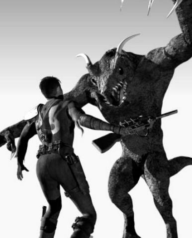    |
|Коготь Смерти атакует. У путника нет никаких шансов.   |

**Когти Смерти** — выведенные военными в качестве идеальных солдат, вырвались
на свободу и распространились по всей Калифорнии. Сильные, ловкие, чрезвычайно
живучие, и к тому же с неплохим интеллектом, они представляют серьезную угрозу
даже хорошо вооруженному отряду.

**Гекко** — огромные прямоходящие ящерицы, чьи шкурки весьма ценятся и
привлекают охотников. Однако самые опасные из них могут и поджарить
неосторожного траппера.

**Собаки** — наверно, единственное уцелевшее довоенное животное. Давно уже не
друзья человека, одичавшие звери огромными стаями рыщут по пустыне в поисках
добычи.

**Кентавры** — гротескные существа с двумя головами, используемые
супермутантами как ручные зверушки. Их укус фатален для жертвы.

## Герои постхолокоста

|   |
|---|
|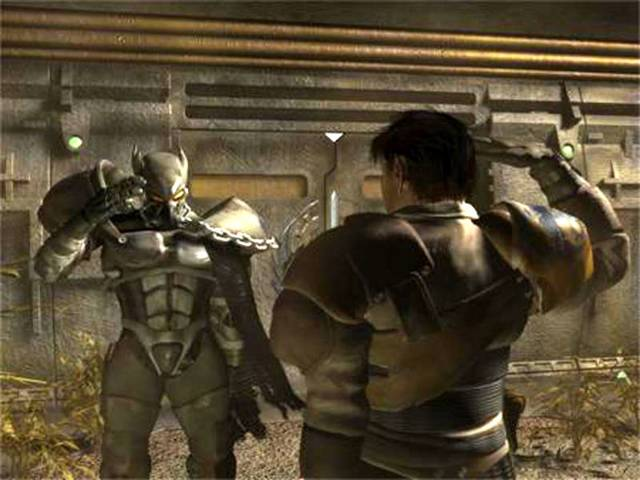  |
|Паладины Братства Стали. Любят делать грязную работу чужими руками.    |

В мире, где интернет остался в далеком прошлом, распространение информации
осуществляется крайне медленно. Тем не менее, некоторые персонажи и группировки
известны каждому обитателю пустошей, ибо именно они оказали огромное влияние на
судьбу региона в целом.

**Братство Стали.** Организация паладинов, поборников мира и справедливости.
Убежденные милитаристы, они истово противостоят любым угрозам, будь то
мародерствующие рейдеры, супермутанты или довоенные роботы, движимые враждебным
искусственным интеллектом. Ныне оплоты Братства Стали можно найти практически в
любом крупном поселении пустошей.

**Мастер.** Выходец из Города-Бункера, он подвергся воздействию FEV, в
результате которого страшно мутировал. Исповедуя идею владычества новой,
превалирующей расы, он создает армию супермутантов: запредельно сильных, но
довольно недалеких созданий. Перебравшись в Лос-Анджелес, Мастер подводит под
свои действия новую религию Объединения и с помощью верных последователей —
культистов судного дня — начинает обращать поставляемый ими человеческий
материал в могучих монстров.

|   |
|---|
|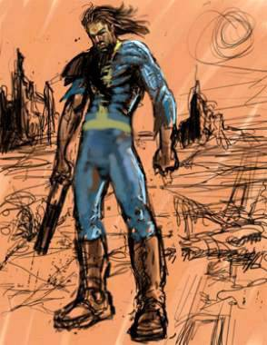                  |
|Житель Бункера в представлении фанатов.    |

**Рэйдеры.** Человечество в основном вернулось к натуральному хозяйству, но не
всем по нраву день и ночь горбатиться с мотыгой и пасти браминов. Эти отщепенцы
сбиваются в безжалостные банды, и при помощи довоенных запасов оружия
терроризируют города и поселки.

**Гильдия работорговцев.** Отбрасывание цивилизации на несколько веков назад
возродило и это отвратительное занятие. Дикие племена охотников,
неплатежеспособные должники и просто неудачливые путники очень легко становятся
жертвами рейдов.

**Житель Бункера.** Тот самый легендарный герой из Бункера 13, кто с небольшой
группой последователей уничтожил базу, где создавались супермутанты, а также
покончил с самим Мастером. Остатки могучей армии, собираемой последним, бежали
на восток и в течение последующих десятилетий методично истреблялись паладинами
Братства Стали.

|   |
|---|
|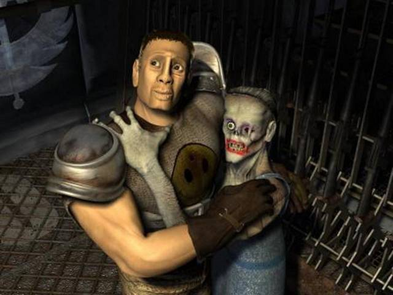        |
|Любовь зла — полюбишь и упыря. |

**Упыри.** Обитатели Бункера 12, простоявшего открытым на протяжении всей
Великой Войны, подверглись чудовищному облучению, и выжившие практически
утратили человеческий облик. Отвергнутые людьми, они влачат жалкое
существование в немногочисленных общинах. Во время своей экспансии супермутанты
установили контроль над Некрополисом, городом упырей, но вскоре оказались
выбиты оттуда Жителем Бункера.

**Анклав.** Незадолго до Великой Войны президент Соединенных Штатов, элита
американского общества и воинских сил, вместе с новейшими образцами технологий
и вооружения бежали на нефтяную платформу “Посейдон” у западного побережья, где
и пережили кризис. В последующие десятилетия эта группировка тайно вела
наблюдения за восстановлением цивилизации на континенте и ходом выполнения
проекта “Защищенный Дом”. Наткнувшись на руины военной базы, взорванной Жителем
Бункера, Анклав получает во владение образец FEV и намеревается с его помощью
расчистить пустоши от любой оппозиции.

|   |
|---|
|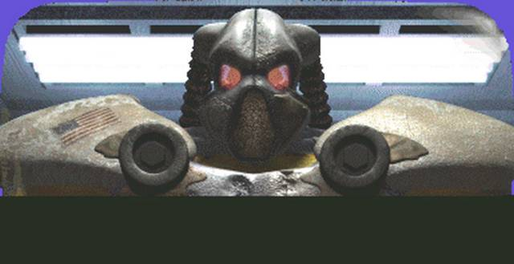                        |
|Фрэнк Хорриган — главный злодей Fallout. 2.    |

**Фрэнк Хорриган.** Анклавовец, участвовавший в раскопках военной базы и
подвергнувшийся воздействию Вируса Принудительной Эволюции. Обладающий огромной
силой и практически полным отсутствием интеллекта, Хорриган становится полевым
оперативником в действиях, направленных против коренного населения пустоши.

**Избранный.** Потомок Жителя Бункера, покинул родную деревеньку Арройо в
поисках GECK (Garden of Eden Creation Kit) — набора инструментов,
предназначенных для восстановления локальной экосистемы, пострадавшей во время
Великой Войны. В долгих странствиях по пустошам он сошелся с воителями Братства
Стали, от которых узнал о новой угрозе — Анклаве. Проникнув на старом нефтяном
танкере на платформу “Посейдон”, Избранный взорвал ее, нарушив тем самым мечты
Анклава о мировом господстве. Да, история любит повторяться.

> ### Fallout pnp
>
> 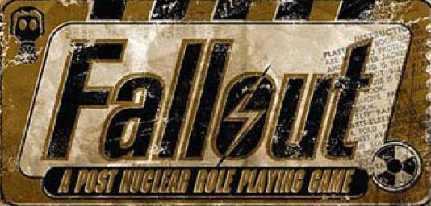
>
> Популярность игры была столь велика, а мир — настолько оригинален и необычен,
> что силами энтузиастов была создана настольная версия ролевой системы
> SPECIAL, которая получила название Fallout Pen and Paper. Хотя она является
> некоммерческой и распространяется бесплатно (а может, именно поэтому), игра
> нашла своих поклонников, в том числе, и в нашей стране.
>
> Переведенные на русский язык правила ищите на сайте
> www.postnuclear.rpgclub.ru.

## Возвращаясь в настоящее

Оригинальный Fallout, выпущенный корпорацией Interplay в 1997 году, стал
предметом поклонения весьма небольшой части играющих масс, которые увидели за
необычным антуражем глубокую и продуманную концепцию.

|   |
|---|
|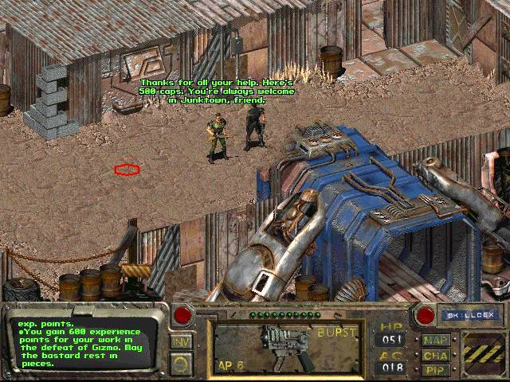  |
|Fallout. Из руин старой цивилизации растут новые города.   |

Изначально игра должна была базироваться на GURPS — системе правил популярной
настольной ролевой игры. Однако владельцу системы не понравилось количество
насилия в игре, и на место GURPS пришла удобная и интересная система SPECIAL,
сотворенная самими разработчиками и ставшая с тех пор визитной карточной
Fallout.

Сюжетная линия игры закручивалась вокруг Жителя Бункера, его странствий по
обезображенному Войной миру и противостоянии зловещему Мастеру, решившему с
помощью супермутантов смести остатки человечества с лица планеты. Необычайно
стильная и затягивающая, игра заняла свое законное место в золотом фонде жанра.

Выпущенный год спустя Fallout 2 оказался крайне спорным проектом. С одной
стороны, игровой мир значительно вырос, баланс ролевой системы улучшился... Но
на смену мрачной серьезности оригинала пришел совершенно не вписывающийся в
антураж стеб над известными фильмами, играми и личностями. Игра явилась в
буквальном смысле “копилкой приколов”, заставив истинных фанатов от отчаяния
схватиться за головы (а кого-то — изрядно повеселив).

|   |
|---|
|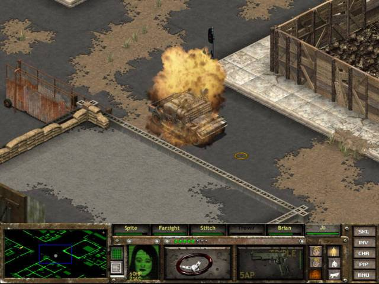  |
|Fallout Tactics — в игре появилась разнообразная техника, а в противовес — минные поля.    |

Конечно, можно было попросту не обращать на шуточки никакого внимания и вновь
погрузиться в атмосферу постъядерного мира, и спасти его от Анклава,
организации, назвавшей себя единственной законной властью в пустошах.

Следующим проектом Interplay в рамках вселенной стал Fallout Tactics:
Brotherhood of Steel. Ролевый элемент упростился, его заменил тактический,
заключающийся в управлении группой бойцов Братства Стали. Игра представляла
собой последовательный набор миссий. Бравые герои, преследуя остатки некогда
могучего воинства супермутантов, забирались в окрестности Чикаго, где
обнаруживали легендарный Бункер 0, управляемый равнодушным нечеловеческим
разумом...

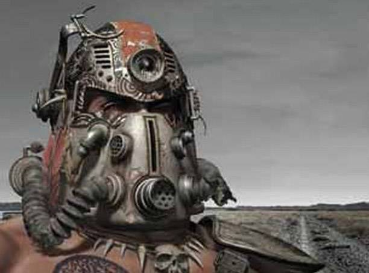

Дальнейшая судьба серии трагична. Ориентация Interplay на приставочные игры
побудила переживающую финансовый кризис компанию бросить ресурсы на создание
стрелялки Fallout: Brotherhood of Steel, а на полноценном ролевом сиквеле
Fallout 3, разрабатываемом в то же время, поставить жирный крест. Ухищрения
рекламщиков вроде девиза “It’s better than sex!” и наличия светящихся
(наверняка радиоактивных!) презервативов в коробке с игрой не смогло спасти
откровенно халтурную поделку. Как следствие — игра с треском провалилась. А
вскоре в небытие канула и сама именитая корпорация.

Ныне лицензия на вселенную Fallout находится у Bethesda Softworks, создателя
знаменитой серии The Elder Scrolls, и работы над полноценным продолжением
начались. Факт этот фанаты восприняли крайне настороженно, ибо неизменные
атрибуты вселенной — пошаговые сражения, система SPECIAL, стилизация под 50-е
годы ушедшего века — теперь стоят под большим вопросом. А без них — будет ли
это Fallout, который мы знаем и любим? Или же нас ждет нечто кардинально новое,
что, кстати, совершенно не означает — худшее? Будем ждать. Верить. И надеяться.

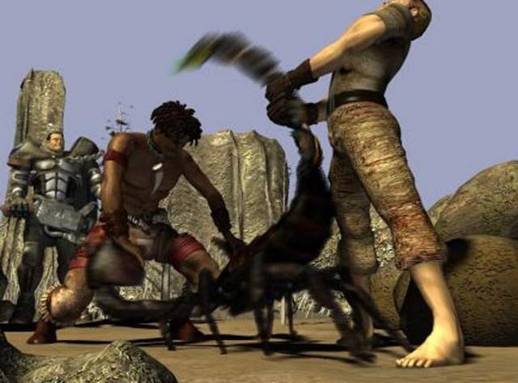
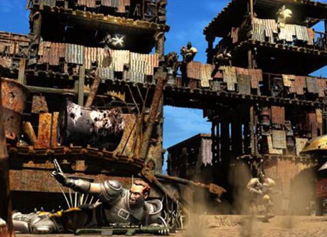
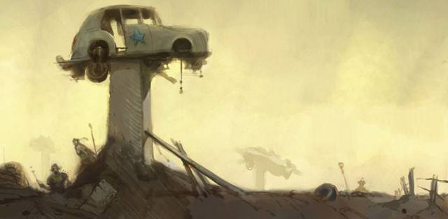
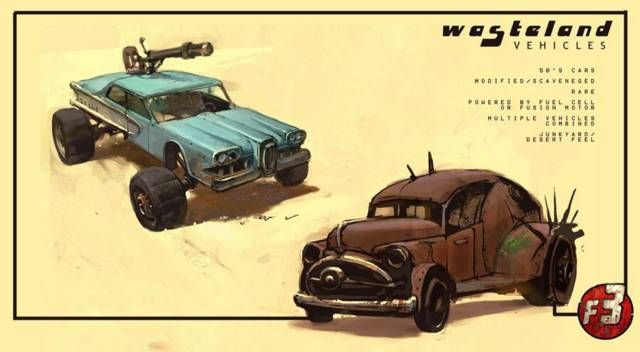

> ### Последователи
>
> 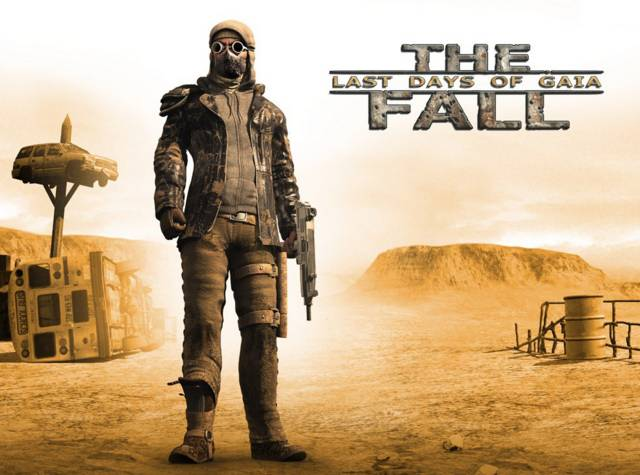
>
> Несмотря на то, что серия “широко известна в узких кругах” и не принесла
> Interplay значительных прибылей, игра является эталоном постапокалиптической
> вселенной. Любые новые постъядерные миры, созданные писателями или
> дизайнерами игр, всегда будут сравниваться с культовым, атмосферным миром
> Fallout.
>
> По всему свету разработчики игр носятся с идеей создания собственного
> Fallout. Число анонсированных проектов близко к 20, и большая часть из них
> создается в Польше и — сюрприз — в России. Однако что-то похожее на результат
> могут предложить пока только немцы из Silver Style Entertainment. Их детище, 
> ролевая игра The Fall: Last Days of Gaia, должна выйти уже в октябре этого
> года.

----

Любую игру нужно рассматривать в целом — оригинальные мир и ролевая система
внесли свою лепту в известность серии. Но все же главное — это сюжет. За
кажущейся стандартной канвой про “злого властелина” и спасение мира скрываются
множество линий, без четкого разделения на “плохих” и “хороших”. Все оттенки
серого — люди по мере сил стараются выжить на исковерканной планете, и при этом
неизбежно кто-то страдает. И никакие войны не в состоянии изменить природу
человека, только мы сами.
