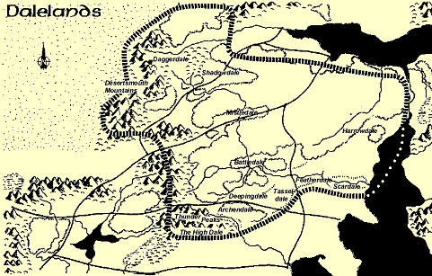
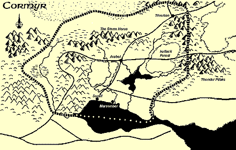
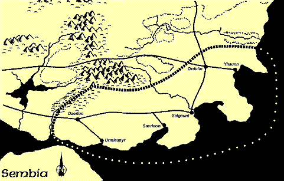
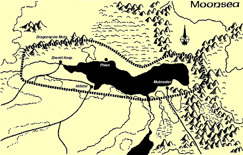
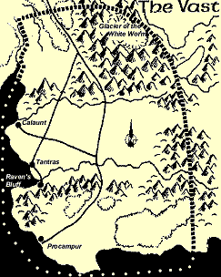
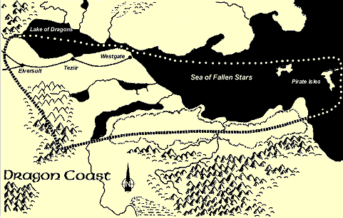
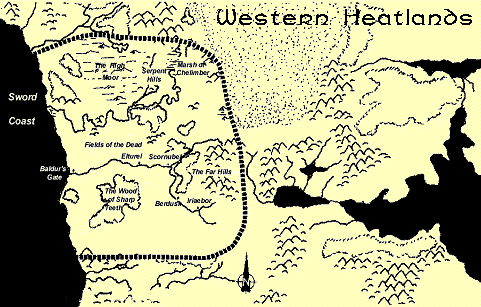
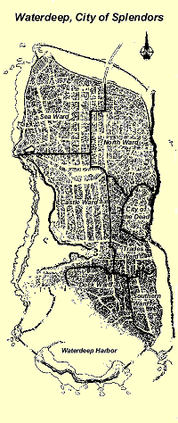

# Regions of the Realms

This page provides basic campaign information about various regions of the Forgotten Realms setting and the people who live there. For those interested in more details on a particular region I have included links to other sources of information..

If you run a website with information about a particular region then email me at sunsetvale@yahoo.co.uk and I'll include it in my list of links.

## The Dalelands

 

Other sources of information about the Dalelands

* [FR Index- The Dalelands](http://www.crosswinds.net/~prespos/FRS1.htm)
* [The Daggerdale Project](http://www.mapmaker.freeservers.com/)
* [The Scardale Project](http://scardale.freeservers.com/main.html)
* [Cyclopedia of Battledale](http://hometown.aol.com/noctifer/private/DND/CampInfo/cyclo-battle.html)
* [A Sneak Peak at Scardale](http://www.wizards.com/dnd/article.asp?x=fr/fx20010112c)
* [Semberholme](http://www.semberholme.com/)
* [Myth Drannor](http://mythdrannor.webhostuk.com/)

### The Dalelands

The Dalelands, also called the Dales by the people who live there is a beautiful and pastoral region. They are are surrounded by the old elven forest, Cormanthor and are home to a tough, independent race of people, many powerful individuals and predatory beasts and dark secrets.

### The Dalelands Mindset: 

The people of the Dales live in communities that are on the frontiers of civilization. The Dales are not nation-states, the largest centres of population rate as towns at best, nor are the Dales a united nation like Cormyr or Sembia. This means they are often targets for marauding bands of goblinoids, flights of dragons and attacks by larger, more powerful realms and city-states. 

The Dalesmen admire heroism, self-reliance, and have a strong, almost clannish sense of community. The Dalemen feel that looking after their own people and protecting their homes is the most important thing in the world. Many folk in the Dales lack surnames.

To an outsider, the Dalesmen seem close-mouthed, suspicious, and reserved. Indeed, until a newcomer is identified as friend or foe, most Dalesman keep their responses to the civil minimum. The Dalemen have had many problems with shapechangers, lycanthropes and Zhentish spies and have found a little caution can save many lives.

Once they feel a person can be trusted, the Dalesmen are by and large open and giving, and expect the same from their guests. Once a person is accepted as a part of the community, he or she is expected to aid its defense. This particularly applies to adventurers who suddenly find themselves elevated to the position of the local lord.
 	
## Cormyr

 

Other sources of information about Cormyr 

* [FR Index - Cormyr Page](http://www.crosswinds.net/~prespos/FRS2.htm)
* [Suzail of the Forgotten Realms](http://members.home.net/suzail/city/suzail1a.html) 
* [The Cormyr Website](http://home.swipnet.se/~w-21845/Cormyr.htm)
* [Encylopedia of the Realms](http://silverlion.virtualave.net/fre/index.html)
* [Haunted Halls of Eveningstar](http://members.tripod.com/sir_talion/)
* [Lord Rojan's Suzail (ALFA)](http://home.columbus.rr.com/suzail/)
* [Cormyr Update](http://home.hawaii.rr.com/tobym/places/cormyr.htm)

### Cormyr

A rising nation ruled by King Azoun IV, Cormyr is a land with established laws and powerful armies. The ever-watchful war wizards keep the realm and the throne secure.

### The Cormyrean Mindset:

Cormyr is a civilized and responsible nation. It's people have a strong loyalty to their government and king and tend to be law-abiding and peaceable. For its part, the government of Cormyr seems almost enlightened in dealing with its people. There is a strong noble class, a vibrant freeman or commoner class, and a rich merchant class. Quality of life has improved within the past generation for most Cormyreans and most are content with their lot.

The average Cormyrean is honest, self confident and loyal to his or her nation. They see themselves as cultured and peaceful. They only fight when they have to and try to protect the rights of others. 

Often Cormyreans see the rest of the world as a dangerous and evil place, needing the strong hand of a good king to control it. The Dalesmen are suspicious people, good at heart, but too disorganized to make a credible stand against the evil of the Moonsea region. Waterdeep and Sembia seem to spend too much time counting coin to fight evil. The independent states of the Vast, the Western Heartlands, and the Dragon Coast are sprawling and disorganized. Someone has to bring peace to Faerûn, it might as well be the followers of the Purple Dragon!

Cormyreans are often perceived as being elitist and isolated from the troubles of the rest of Faerûn. The Cormyreans believe that other people should follow their example if they want to improve their lot. The lands beyond Cormyr need wise kings, sensible laws and a strong military force before they can become truly civilized.

Adventurers in Cormyr are viewed as a curiosity, often causing more problems than they solve. Adventurers native to Cormyr are an eccentrics or youngsters following a passing fancy. The idea that people would risk their lives for gold or glory strikes many natives as odd. In days gone by that sort of thing was necessary, but those days are gone. However, many in Cormyr are not fully aware of the dangers that lie just beyond the borders of their peaceful forest kingdom.
 	
## Sembia

 

Other sources of information about Sembia

* [FR Index - Sembia](http://www.crosswinds.net/~prespos/FRS5.htm)

### Sembia

A kingdom of allied merchant cities on the coast of the Inner Sea and east of Cormyr. Sembia is a land of good farms, busy ports, skilled textile makers and prosperity. The silver coins on the flag of Sembia represent the nation's trading wealth.

### The Sembian Mindset:

There is a famous saying in the Realms, "When you look into a Sembian's eyes, you can see coins being counted in his mind." The people of Sembia have a reputation for being materialistic, even greedy and avaricious.

Of all the western Inner Sea lands, Sembia is greatest in financial wealth, it's national heroes are merchant-leaders, not noble warriors or knowlegeable wizards. In Sembia, a person's success is measured by their value in gold pieces. Titles and accomplishments, which carry great weight in Cormyr and the Dales matter little to Sembians.

Sembians see themselves as being cautious when matters are unknown, yet bold and decisive when an opportunity presents itself. They are in command of their own destiny, and when they face setbacks and disappointments, they strive to learn from their mistakes and work hard to regain that which they have lost and a bit more for interest.

Sembians are industrious and hard-working, toiling away at tasks long after any other people would stop for the evening. The Sembians believe themselves superior to their neighbors because they work harder and never give up.

The Sembians are cool to their neighbours, keeping them at arm's length. The Cormyreans are viewed as having too much noble blood poisoning their system, this explains why they spend so much time fighting evil, instead of striving for economic improvement. The Dalesmen are primitive country bumpkins, surviving only by dint of powerful allies such as Elminister and the Harpers. The Moonsea cities are enemies best destroyed economically not by force of arms. The same may be said for the Dragon Coast, which is a hotbed of secret societies and thieves' guilds. The Vast and the Western Heartlands are emerging markets with access to important natural resources, and care must be taken not to turn them into economic rivals.

Industrious, proud, diligent, cosmopolitan, and canny -these are the phrases the Sembian merchant would use to describe herself or himself, although his or her non-Sembian neighbours would doubtless disagree.

## The Moonsea

Other sources of information about the Moonsea

* [FR Index - The Moonsea](http://www.crosswinds.net/~prespos/FRS3.htm)
* [FR Index - Zhentil Keep](http://www.crosswinds.net/~prespos/zhentilkeep.htm)

### The Moonsea 

A small, deep lake, connected to the Dragon Reach and the Inner Sea by the river Lis. The Moonsea is bordered with independent city-states and their vassals. Some of the present day cities of the Moonsea, like Mulmaster and Zhentil Keep are built upon the ruins of fallen civilisations.

### The Moonsea mindset: 

The people of the Moonsea cities are by nature plotters, informers, and spies. They are adept at keeping secrets and finding out the secrets of others. In most Moonsea cities, the walls not only have ears but also tongues ready to speak out against anyone who might pose a threat to the status-quo. In the cities of the Moonsea those of a trusting nature often die young.

The people of Zhentil Keep, Mulmaster, Melvaunt, and Hillsfar are used to cruel lords, for theirs is a cruel land. If their cities were meant to have just, kind-hearted rulers, they would have them already, and the wreckage of ruined cities would not lie all around. 

The people of the Moonsea cities view most of the rest of Faerûn, even those from other Moonsea cities, with suspicion and distrust. The Dalesmen are fools, why else would they rely on the Harpers and other powerful adventurers to protect them? The Cormyreans and Sembians are empire builders, one using military might, the other economic power. To the north are the Cold Lands, home of the very evil that has plagued the coast. Likewise, the Vast promises to be nothing but trouble, the home of more meddlesome adventurers! As for people from the other Moonsea cities, they are obviously spies, for what other reason would one leave his or her home?

To the outside world, the people of the Moonsea are viewed as unfriendly, sullen, dispirited, crafty, and most of all, dangerous. Although not all of them are evil, when travelling the Moonsea lands, a wise person presumes they all are.
 	
## The Vast

Other sources of information about the Vast

* [FR Index - The Vast](http://www.crosswinds.net/~prespos/thevast.htm)
* [The Living City](http://www.wizards.com/rpga/lc/)
* [Primer on Vastian Geography](http://www.wizards.com/rpga/lc/vast/welcome.asp)
* [Procampur - Jewel of the Vast](http://www.concentric.net/~Jlorien/procampur/)
* [The Fellowship of the Grand Tankard](http://members.tripod.com/taleoftheseven/)

### The Vast

Situated on the eastern side of the Dragon Reach, the Vast is the gateway to the east. The region is centered the independent city-states of Raven's Bluff, Tantras, Procampur and Calaunt. The Vast is both a friend and a challenge to heroes from throughout the Realms.

### The Vast Mindset: 

The people of the Vast are diverse, ranging from the old established families of Procampur to the powerful adventurers of Ravens Bluff. They all share a spirit of adventure and daring that is unseen anywhere else in the Realms, even in the wild lands of the Western Heartlands and the Savage North. Although fell enemies are as common here as in the Moonsea, in the Vast the powers of evil are confronted and more often than not defeated by the forces of good.

Their past successes and their love of independence as lead to an optimism and an openness among the people of the Vast. Adventurers are welcome because they fight to keep down evil and tyranny and bring new gold into the local economy. There is a spirit of opportunity, advancement, and growth in the Vast. A common caravan guard can become a famous hero and in time even a popular leader in the Vast.

The people of the Vast see themselves as sharing much in common with the Cormyreans and Dalesmen, and view both areas as allies and good trading partners. Azoun of Cormyr is respected for his actions during the Tuigan invasion. Procampur defeated Sembia decisively in recent history. 

The Moonsea lands are watched vigilantly. The people of the Vast regard Mulmaster much the way that Shadowdale's natives view Zhentil Keep. The Moonsea is the home of cheats, spies and the power hungry. The cities of the Dragon Coast are too lawless, for many of the pirates that raid the coastline of the Vast and disrupt trade come from there.

Tantras is dominated by religion, Calaunt by thieves, Ravens Bluff by religion and thieves, and Procampur by ancient status.

## The Dragon Coast

 
 	
### The Dragon Coast

A wild region of pirates, rogues, and traders. The Dragon Coast includes the Pirate Isles of the Inner Sea and Westgate, an important city which links trade between the Inner Sea to the east and the Sword Coast to the west.

### The Dragon Coast Mindset: 

The typical native of the Dragon Coast does not think of himself or herself as belonging to a nation or even their home city or local community. He, she or it sees themself as alone and seeks to protect him-, her-, or itself from the perils of the outside world. As a result, most of the natives of the Dragon Coast are thought of as selfish at best, and rapacious and greedy in their worst moments.

The natives, of course, consider themselves to be merely sensible and reasonable doing what they have to do in order to survive. Their lands see a vast amount of trade, including wondrous items from far-off lands. Why should they allow all these riches to pass them by? Waterdeep and Thay have riches aplenty already, the people of these lands are already rich, they don't these things as much as they do.

Regarding the Dragon Coast as a gathering place of thieves and vultures is slightly off the mark. To think of the natives of the region as intermediaries and facilitators, people who make things happen, is much more accurate. After all, everyone has a price, the price is just more reasonable in the Dragon Coast.

The natives of this land see the Cormyreans and Sembians as bullies. They are too weak to stand alone, so they gang together and saddle their people with foolish rules and regulations. At any moment these nations could strike the Dragon Coast and tell them how to live their lives! The Western Heartlands are a land of opportunity, and many a native has caught that caravan west to settle in Berdusk or Soubar, leaving behind those who truly like it here.

Not all natives of the Dragon Coast are grasping, greedy manipulators and shady middlemen. The ruler of Elversult has struggled to make a city worthy of the respect of its citizens, and fair merchants and honourable mercenary companies are encouraged to stay here. They are just extremely outnumbered by the rest of the cynical society of the Dragon Coast.

## The Western Heartlands

 

Other sources of information about the Western Heatlands

* [FR Index - The Sword Coast](http://www.crosswinds.net/~prespos/FRS4.htm)
* [FR Index- Darkhold](http://www.crosswinds.net/~prespos/zhentilkeep.htm#DARKHOLD)
* [Malcom's PBeM Realms Site](http://www.ozemail.com.au/~mrconnor/)
* [The Daggerford Campaign](http://www.daggerford.com/index.shtml)
* [King's Tears](http://members.tripod.com/KingsTears/)
* [The Scribes of the Sword Coast](http://www.swordcoast.co.uk/)
* [Da Man's Western Heartlands](http://www.dndgaming.com/dm/fr/ref/westheart/index.html)

### The Western Heartlands

These lands begin south of Waterdeep and down to the northern borders of Amn and reach west from the Sword Coast as far as the edge of Anauroch and the Tunland in the east. Also called the Empty Lands, they are a vast expanse of endless plains, haunted moors, and monster-infested hills. Many folk have dreamed of founding a kingdom in this untamed frontier, but only ruins remain of their attempts. The Western Heartlands are home to some important independent cities: Baldur's Gate, Berdusk, Elturel, Hill's Edge, Iriaebor, and Scornubel.

### The Western Heartlands Mindset: 

The mindset of the Western Heartlands is a varied as its people. In Berdusk there is a thriving community of sculptors, artists and musicians, whilst Soubar is home to brigands, evil mages, doppelgangers and mercenaries. This is a land of contrast, where good and evil co-exist in an uneasy peace. 

The people of the Western Heartlands are independent. They have little need or love of government, kings, and nations beyond the local level. An established patrol in the area is one thing, but taxes, inspections and prying government officials are quite another.

The "Westies" are generally friendly and open, at least initially. Such a wide variety of people dwell here of different attitudes and alignments that strangers are tolerated. Open conflicts whether for monarch, god, or alignment are discouraged. These lands have seen more than enough war already.

The inhabitants of the Western Heartlands are stubborn. Warnings, arguments, and cold hard facts in no way stop them once their minds have been made up. Given the fact that they live in such a dangerous land, their obstinate natures can be seen as a virtue.

The Westies see themselves as the last independent people, not counting the poor sods fighting barbarians in the Savage Frontier. The Waterdhavians, the Cormyreans, the Sembians and the southerners are all soft, even when ganged up in huge armies for protection. The Dalesmen have promise, but are probably going to be sucked up by the more powerful groups in the Eastern Heartlands. No, the Western Heartlands are the true heart of the Realms.
 	
## Waterdeep

Other sources of information about Waterdeep 

* [FR Index - Waterdeep](http://www.crosswinds.net/~prespos/FR1.htm)
* [YaFR Waterdeep Page](http://www.geocities.com/TimesSquare/Castle/2566/waterdeep.htm)
* [The Waterdeep Herald](http://www.geocities.com/TimesSquare/Castle/2566/waterdeep-herald.htm)
* [Volo's Rumors of Waterdeep](http://crpp0001.uqtr.uquebec.ca/www_wanderer/Guides/Waterdeep.html)
* [Realms by Night!](http://www.wizards.com/ForgottenRealms/FR_Features.asp)
* [An Unofficial Waterdeep Website](http://www.raflar.com/waterdeep/index.html)
* [Spells of Waterdeep](http://www.geocities.com/TimesSquare/Dungeon/8779/Waterdeepspells.html)
* [A Brief History of Waterdeep](http://silverlion.virtualave.net/fre/fr1-0013.html)

### Waterdeep

Waterdeep... the crossroads of the world, City of Splendors, the greatest city in the North. Waterdeep lies on the western coast of Faerûn, the region known as the Sword Coast. Waterdeep is a merchant's paradise, a wizard's marvel, and potentially an adventurer's worst nightmare. The city is built upon a many-leveled dwarven city and mine known as the Undermountain.

### The Waterdeep Mindset: 

Waterdeep is a varied and cosmopolitan city, open to the many different nationalities and races in the Realms. It's citizens bring to the city their different viewpoints, deities, and attitudes. No other city in Faerûn is as tolerant as Waterdeep, particularly when it comes to religion.

Waterdhavians can show the bluff honesty of a Dalesman, the calculating planning of a Sembian, the honor of a Cormyrean, the independence of a Westie and the sly cunning of a native of the Moonsea. These behaviors can all be exhibited in the same individual, and the art of choosing the right frame of mind for a certain instance is inherent to the city's character.

Waterdhavians attempt to be understanding and open-minded, but the trend is not pursued to a fanatic level That nobles, merchants, adventurers, traders, and immigrants all have their own place in society is accepted, but that does not mean they necessarily want to associate with each other. Waterdeep at its best is never a society of equals. However, this level of toleration means that it is hard to surprise a Waterdhavian, whether with invading gods or walking statues or flying carpets. They have seen it all before.
 	
## Beyond the Heartlands

### The Island Kingdoms

Diverse and mysterious, the kingdoms of the Trackless Sea include the Moonshaes, elven Evermeet, magical Nimbral, and wondrous Lantan.

Other sources of information about the Island Kingdoms

* [FR Index - The Moonshaes](http://www.crosswinds.net/~prespos/FR2.htm)
* [Lantan, the Island-Nation](http://www.geocities.com/TimesSquare/Castle/2566/lantan0.htm)

### The North

The North is defined as the region north of the River Delimbiyr, excluding Waterdeep and reaching to the Spine of the World (the mountains also known as the Wall). 

It is a rugged heavily wooded wilderness. What little civilisation can be found hugs the coastal regions and a few inland valleys. The rest is the domain of orcs, trolls, the Uthgardt barbarian tribes and countless other monstrous denizens who regularly hurl themselves in fury at the walls and pallisades of the towns and villages in the wilderness.

It is a land of riches. Mineral wealth unequalled elsewhere in the known realms is found here, along with seemingly endless stands of timber. Here too is the wealth of history, the plunder of lost civilisations and vanished Realms.

Other sources of information about the North

* [FR Index - The North](http://www.crosswinds.net/~prespos/FR5.htm)
* [The Northern Journey](http://www.steigerwaldedv.via.t-online.de/nj/njstart.htm)
* [Project Silverymoon](http://www.mageweb.com/silverymoon/index.html)
* [Fallow's Cross Adventures](http://www.mardona.com/fx/)
* [The High Frontier](http://forgottenrealms.20m.com/fr/ref/HiFrontier/index.html)
* [Mistmoor](http://www.mistmoor.com/)
* [Volo's Rumours of the North](http://crpp0001.uqtr.uquebec.ca/www_wanderer/Guides/Volo_North.html)
* Llorkh
    * [1](http://home.hawaii.rr.com/tobym/places/llorkh.htm)
    * [2](http://home.hawaii.rr.com/tobym/places/llorkh2.htm)
    * [3](http://home.hawaii.rr.com/tobym/places/llorkh3.htm)
* [The Arch Glade of Mielikki](http://members.tripod.com/~trauma2/mielikki.html)

### Anauroch

Anauroch. The Great Sand Sea. The Great Desert. Grave of The Lost Princes. Not a place many sane folk in the Realms would want to visit. But there are plenty of the other sort, who come here to find wonders both beautiful and dangerous.

The deadly, shifting sands of Anauroch hide - and occasionally, tantalizingly reveal - the riches and strange treasures of The Lost Kingdoms, swallowed long ago. The legendary wealth of The Cities of Gold lies somewhere in it's sandy depths.

So, too, do worse things: fell monsters, famous in adventurer's tales (and listener's nightmares) across the Realms. Death slumbers lightly in the Anauroch, ever-ready to awaken and strike down the unwary intruder.

### The Cold Lands

Crouched in the shadow of the Great Glacier, these areas include Thar, Vaasa, Damara, and Sossal. They are under the continual threat of monstrous incursions.

### The Unapproachable East

A land of magic and treachery, the Unapproachable East lies hard on the borders of the barbarian Hordelands to their east. The land is dominated by Thay, with its fell Red Wizards, and the various nations that oppose it.

Other sources of information about the Unapproachale East

* [Red Wizards](http://www.redwizards.com/)

### The Old Empires

The eldest living cities and organized nations of the Realms, the Old Empires claim to be the birthplace of the modern world, where mankind first achieved greatness in the Realms. The remnants of this greatness are the three kingdoms of Mulhorand, Unther, and Chesenta, kingdoms of mystery and ancient empires.

The ancient south can be termed "a slumbering giant". It is an extremely powerful land that wishes to be left alone to engage in it's own self-indulgent, decadent pursuits, not caring what goes on beyond it's borders. 

The Old Empires are considered to be a place of twisted power. They have strange gods. They wield weird and powerful magics. And there is the hint of the weirdest magic of all - technology, a word which causes hardened sages to shudder. There are strange monsters and strange men, great treasures and unknown delights, and life-ending perils. In short, nearly anything that an adventurer could want.

Other sources of information about the Old Empires

* [Cimbar, City of Beauty](http://www.geocities.com/TimesSquare/Castle/2566/cimbar.html)

### The Vilhon Reach

The southern coast of the Sea of Fallen Stars is a land of fallen nations, opulent cities, and ancient woods. It is a land of mercenary companies and petty kingdoms in endless minor wars.

Other sources of information about the Vilhon Reach

* [FR Index - The Vilhon Reach](http://www.crosswinds.net/~prespos/FRS6.htm)
* [Chondath, an Overview](http://www.geocities.com/TimesSquare/Castle/2566/chondath-main.htm)

### The Empires of the Sands

The southern countries of Amn, Tethyr, and Calimshan are a mixture of the established realms and the wonders of the South, influenced by both cultures and different from either.

Other sources of information about the Empires

* [FR Index -Empires of the Sands](http://www.crosswinds.net/~prespos/FR3.htm)
* [Calimport, City of Decadence](http://sefton.tradepage.co.za/Realms/Lands/Calimport/calimpor.htm)
* [Empires of the Sands](http://www.swordcoast.co.uk/swordcoast/empiresindex.htm)

### The Shining South

The strange and magical lands of the far South are little more than legends to the natives of the Dales and Waterdeep, but they are legends of power and glory. From the jungles of Chult, to mage-dominated Halruaa, to Luiren, land of the halflings, the South is a diverse and deadly land.
