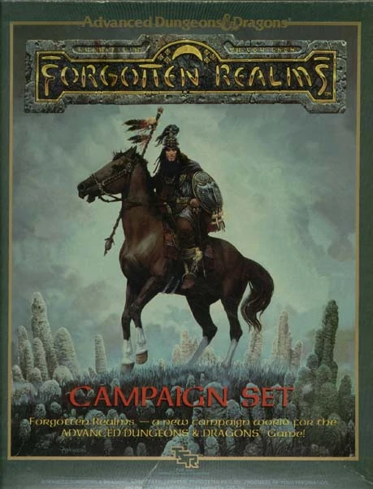
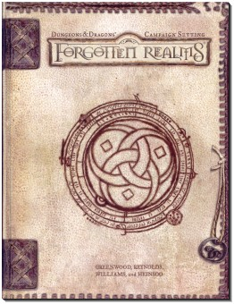
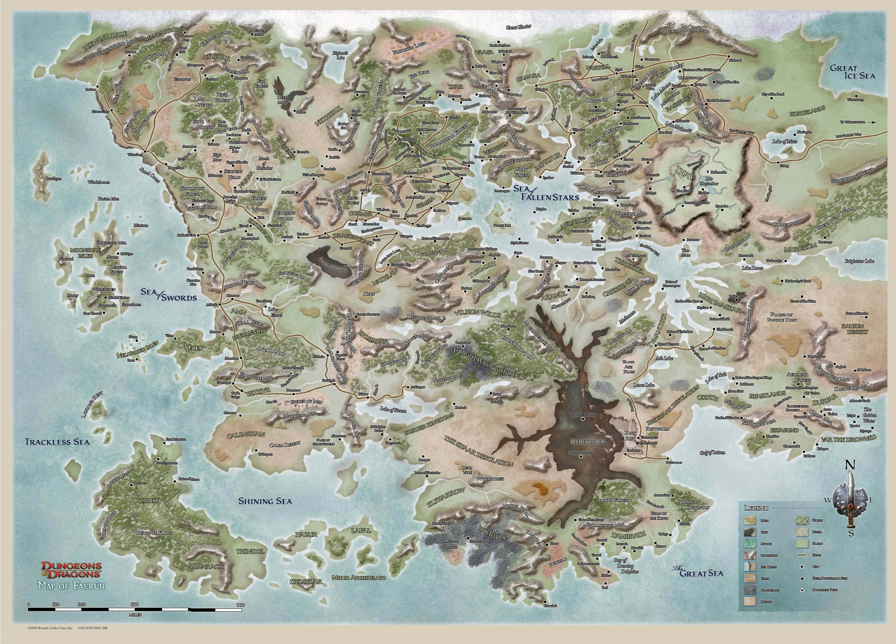

# Forgotten Realms

|                                           |
|-------------------------------------------|
|     |
|Логотип Forgotten Realms (третья редакция) |
|     |
|Логотип Forgotten Realms (вторая редакция) |

Forgotten Realms (Забытые Королевства) — сеттинг для ролевой игры Dungeons & Dragons (D&D), созданный канадским писателем и разработчиком игр Эдом Гринвудом. Королевства стали самым популярным из миров D&D в 1990-е благодаря серии романов Роберта Сальваторе, а также компьютерным играм Pool of Radiance и Baldur's Gate. Наибольшее внимание в сеттинге уделяется огромному континенту под названием Фэйрун, части планеты Абер-Торил.

Это хорошо проработанный обширный фантастический мир, в котором много персонажей, мест и событий, описанных в длинном списке игровых продуктов, романов и приложений, издаваемых с конца 1980-х. Во времена третьей и трёхсполовинной редакций FR был одним из сеттингов для D&D, которые официально издавались и развивались Wizards of the Coast (вторым был Эберрон). Сейчас, помимо FR, издают в том или ином виде Eberron, Dark Sun и Gamma World.

## История сеттинга

### [Первое издание](https://rpg.fandom.com/ru/wiki/Forgotten_Realms_Campaign_Set)
|   |
|---|
||
|Первое издание FRCS 1987 года|

Изначально Гринвуд создал Forgotten Realms для проведения собственных приключенческих кампаний, после чего он стал печатать небольшие статьи, описывающие этот мир в журнале «Dragon». Хотя Королевства ещё не были полностью официальным игровым миром, первое приключение по нему, H1 «Bloodstone Pass» (Проход Кровавого Камня), было выпущено в 1985 г. компанией TSR. Первый полностью официальный «Набор Кампании Забытых Королевств» был выпущен несколько позже, в 1987 в виде коробочного набора из двух книг и четырёх больших карт, разработанных Эдом Гринвудом совместно с Джеффом Граббом.

### Конец 80-х— середина 90-х
После успеха Набора Кампании Забытых Королевств в мае 1987 г. был опубликован первый роман по этому миру, «Тёмные силы над Муншаез» (первый в «Трилогии Муншаез») Дугласа Найлза. В следующем году увидел свет первый роман о приключениях очень популярного персонажа, Дриззта До’Урдена, который затем появился еще в семнадцати романах, многие из которых входили в список бестселлеров New York Times. В 1988 г. вышла в свет первая компьютерная ролевая игра по миру Забытых Королевств, Pool of Radiance, выпущенная компанией SSI. Игра была довольно популярна и получила несколько продолжений.

Сеттинг был переработан в 1993 г., чтобы соответствовать новой второй редакции системы правил Advanced Dungeons & Dragons (AD&D), тогда был выпущен Сеттинг Кампании Забытых Королевств (Forgotten Realms Campaign Setting), включавший три книги и карточки с дополнительными монстрами. Дополнительные игровые материалы для сеттинга, а также множество романов разных авторов, постоянно выпускались на протяжении 1990-х.

### Конец 90-х— наши дни
|   |
|---|
||
|Forgotten Realms Campaign Setting третьей редакции|

В 1998 году вышла игра Baldur's Gate, первая в линейке популярных компьютерных ролевых игр, выпущенных компанией Bioware для персонального компьютера. У игры было несколько продолжений, наиболее известные из которых Baldur's Gate II: Shadows of Amn (2000) и Icewind Dale, отдельная игра, но выпущенная на том же движке. Некоторые популярные персонажи Забытых Королевств, такие как Дриззт До’Урден и Эльминстер, эпизодически появлялись в этих играх.

После выхода пересмотренной третьей редакции правил Dungeons & Dragons, выпущенной в 2000 году компанией Wizards of the Coast, набор кампании Забытых Королевств тоже был пересмотрен в 2001 году. Вскоре вышла компьютерная игра Neverwinter Nights, действие которой также происходило в мире Forgotten Realms, а ролевая система была основана на правилах D&D 3-ей редакции. Игра получила большую известность, к ней вышло несколько официальных дополнений и огромное количество неофициальных. Последней известной игрой по миру является Neverwinter Nights 2, по убеждениям некоторых превзошедшая свою предшественницу. Система в ней была основана уже на версии правил 3.5 редакции Dungeons & Dragons.

## Сведения о мире

### География
На планете Торил или Абейр-Торил есть несколько частей света: Фэйрун, на котором фокусируется сеттинг, Кара-Тур (мир средневекового Востока), Закхара (мир арабских сказок), Мацтика (мир доколумбовой Америки) и ещё не открытые и не описанные континенты.

Фэйрун находится в северо-западной части основного материка Торила. К востоку от него простираются бескрайние степи Земли Орды, по которым кочуют многочисленные племена варваров-кочевников. Эти земли зовутся так же Бесконечной Пустошью. Живущие там кочевники называют свою землю Таан. На юге, по берегу Великого Моря лежит Земля Судьбы, Закхара. На северо-западе лежит Север. Этот негостеприимный регион простирается от побережья Моря Плавающих Льдов до песков Анорача, от Хребта Мира до Глубоководья, а под поверхностью на многие мили вглубь земли тянутся бесконечные пещеры Андердарка.

### Религия
Религия играет важную роль в мире Забытых Королевств. Существует несколько расовых и географических пантеонов, каждый из которых насчитывает большое количество богов разной степени силы. В целом они напоминают греческий пантеон, лишь с тем отличием, что между богами нет родственной связи. Боги влияют на все аспекты жизни обитателей мира; фактически мир ЗК— это арена их борьбы за последователей, а как следствие за могущество. Их вмешательство в дела смертных не ограничивается лишь божественными силами, но и прямым вмешательством через свои церкви, а также аватаров (смертных воплощений богов). В результате заговора нескольких тёмных богов в мире ЗК произошли события, известные как Смутное время или Кризис аватаров, во время которых боги были свергнуты в облике смертных аватаров на земли Фэйруна. Это время длилось не больше года, но обернулось страшными катастрофами для некоторых земель, а также гибелью нескольких богов и обожествлением нескольких смертных.

## Литература и компьютерные игры

По Забытым Королевствам было выпущено очень много художественной литературы, но самыми известными являются книги трилогии Роберта Сальваторе «Тёмный эльф» (The Dark Elf Trilogy): «Отступник» (Homeland, 1990), «Изгнанник» (Exile, 1990) и «Воин» (Sojourn, 1991), которые вышли на русском в 2006 году в издательском центре «Максима».

Из компьютерных игр достойны упоминания такие серии, как Baldur's Gate, Eye of the Beholder, Icewind Dale, Neverwinter Nights и Gold Box.

----

* На английском
    * [Официальный сайт](http://www.wizards.com/dnd/ForgottenRealms.aspx)
    * [Forgotten Realms Wikia](https://forgottenrealms.fandom.com/wiki/Main_Page)
    * [Кэндлкип](http://www.candlekeep.com/) — англоязычный фанатский сайт
    * https://www.realmshelps.net/index.shtml
* На русском
    * [Wiki Aerie](http://wiki.aerie.ru/) — русский вики-сайт по миру Забытых Королевств
    * [Забытые Королевства](http://fr.dungeons.ru/) — информация и переводы
    * [Forgotten Lands](http://oranj.3dn.ru/) — информация по Забытым Королевствам

----

Created by author and game designer Ed Greenwood as his personal campaign and
detailed in a long series of articles in Dragon Magazine, Forgotten Realms
became the most popular D&D setting from the late 1980s onwards and has been
well received by both gamers and reviewers - Sean Patrick Fannon, author of
The Fantasy Roleplaying Gamer's Bible, has praised the setting's scope and
ambition and considered that it "may be the most widely played-in game setting
in RPG history."

The Forgotten Realms is a high fantasy world - magic is powerful, legendary
monsters are commonplace, and gods often intervene directly in mortal affairs.
Players can indulge in several types of fantasy adventures - from
straightforward hack-and-slash treasure hunting in dungeons to epic campaigns
involving regional wars, cataclysms and direct contact with gods and
extra-dimensional beings.

The lands of the Forgotten Realms are not all ruled by the human race: the
setting's planet, Abeir-Toril, is shared by humans, dwarves, elves, goblins,
orcs, Dragons and other peoples and creatures. Technologically, the world
resembles pre-industrial Earth of the 13th or 14th century. However, the
strong presence of magic provides an additional element of power to the
societies.

The main focus of the campaign is the region of Faerûn, the western part of a
continent that was roughly modeled after the Eurasian continent on Earth.
Faerûn was first detailed in the original Forgotten Realms Campaign Set,
published in 1987 by TSR and contains rough analogues of mythical versions of
European, African and Middle Eastern cultures, as well as regions dominated by
non-human races. Other areas include the Underdark (an underground realm
dominated by evil elves), Maztica (inspired by Pre-Columbian Meso-America) and
Kara-Tur (based on the mythical Far East).

For D&D's 4th edition, the setting was reworked: the timeline advanced into
the future where a major cataclysm caused by a conflict amongst gods caused
the previously divided worlds Abeir and Toril to collide with several
geographical areas changing place. In 2014, with the launch of the 5th
edition, the world of Forgotten Realms was again returned to its previous, 3rd
edition geography.

This campaign is currently officially supported by Wizards of the Coast and
over the years has expanded into a variety of other media, including
literature, comics and video games. The highly successful Baldur's Gate,
Icewind Dale, and Neverwinter Nights series of computer games are based on the
Forgotten Realms, which is also the setting of a large number of novels,
featuring, among others, the popular characters Drizzt Do'Urden, Artemis
Entreri, and Elminster.

The Forgotten Realms are the default setting for the modules for 5th Edition
of Dungeons & Dragons, although the D&D Multiverse (including Greyhawk,
Eberron, Dragonlance, Mystara, and Planescape) is the default setting for the
5th Edition core books.

Forgotten Realms (Забытые Королевства) — сеттинг для ролевой игры Dungeons &
Dragons (D&D), созданный канадским писателем и разработчиком игр Эдом
Гринвудом. Королевства стали самым популярным из миров D&D в 1990-е благодаря
серии романов Роберта Сальваторе, а также компьютерным играм Pool of Radiance
и Baldur's Gate. Наибольшее внимание в сеттинге уделяется огромному континенту
под названием Фэйрун, части планеты Абер-Торил.

Это хорошо проработанный обширный фантастический мир, в котором много
персонажей, мест и событий, описанных в длинном списке игровых продуктов,
романов и приложений, издаваемых с конца 1980-х. Во времена третьей и
трёхсполовинной редакций FR был одним из сеттингов для D&D, которые официально
издавались и развивались Wizards of the Coast (вторым был Эберрон). Сейчас,
помимо FR, издают в том или ином виде Eberron, Dark Sun и Gamma World.

## 3e

### Hardbacks

* 11836	Forgotten Realms Campaign Setting
* 17665 Unapproachable East
* 17738 Lost Empires of Faerûn
* 17872 Champions of Ruin
* 17929 Shining South
* 88162 City of Splendors: Waterdeep
* 88578	Races of Faerûn
* 88581 Underdark
* 88643	Faiths and Pantheons
* 88647 Player's Guide to Faerûn
* 953667200 Power of Faerûn
* 96566 Serpent Kingdoms
* 882927200 Champions of Valor
* 9537172 Mysteries of the Moonsea

### Boxed Sets

* 88433	City of the Spider Queen Miniatures

### Accessories

* 11832	Monster Compendium: Monsters of Faerûn
* 11964	Magic of Faerûn
* 11989	Lords of Darkness
* 88567	Silver Marches

* 88686	Dungeon Master's Screen

# Adventures

* 11634	Into the Dragon's Lair
* 11710	Pool of Radiance: Attack on Myth Drannor
* 88574	City of the Spider Queen
* 884467400 Sons of Gruumsh

* LGR1 Extermination
* LGR2 Gray Hunt
* LGR3 Key to Phantoms' Cloister
* LGR4 Secret of Phantoms' Cloister
* LGR5 Dark Exodus
* LGR6 Epidemic
* LGR7 Nurture and Nature
* LGR8 Rat's Bastard
* LGR9 Denial of Resource
* LGR11 Humility
* LGR12 Tyranny
* LGR13 Book Knowledge
* LGR16 In Cold Blood
* LGR18 Feast on the Moon
* LGR19 Difference of Option
* LGR20 The Howling of a Mighty Storm
* XGR1 Under High Lord's Hall
* XGR2 Dungeon of the Hark
* XGR3 Undermountain
* XGR4 Ruins of Karse
