**Кратко о статье:** Самый детализированный мир фэнтези Вам доводилось слышать о темных эльфах? Тогда имя Дриззта Ду Ардена вам должно быть знакомо! А если компьютерные ролевые игры для вас — не пустой звук, то наверняка вы слышали название Neverwinter Nights. Столь же знамениты и другие РПГ — Baldur’s Gate, Icewind Dale, а ветераны помнят такие названия, как Curse of Azure Bounds и, конечно, Eye of the Beholder. В фэнтези-литературе имена Аэрелин Мунблейд и Эльминстра уже давно стали нарицательными, как и сериал Роберта Сальваторе о Темном эльфе. Фанаты ролевой системы Dungeons & Dragons знакомы не понаслышке с городскими проблемами Вотердипа и политическими сложностями Кормира. Все эти знаковые места, персонажи и события объединены одним названием — Фэйрун (Faerun)...

## Самый детализированный мир фэнтези

# Книги о Забытых Королевствах

Если вы ищете приключений в этой стране, то помните — не все является тем, чем кажется на первый взгляд. Полагайтесь на свою сообразительность, оружие и здравый смысл. И вы выживете в Забытых Королевствах.

Записано Лхео со слов Эльминстера из Долины Теней

|   |
|---|
||
|Современный логотип Забытых Королевств.|

Вам доводилось слышать о темных эльфах? Тогда имя Дриззта Ду Ардена вам должно быть знакомо! А если компьютерные ролевые игры для вас — не пустой звук, то наверняка вы слышали название Neverwinter Nights. Столь же знамениты и другие РПГ — Baldur’s Gate, Icewind Dale, а ветераны помнят такие названия, как Curse of Azure Bounds и, конечно, Eye of the Beholder. В фэнтези-литературе имена Аэрелин Мунблейд и Эльминстра уже давно стали нарицательными, как и сериал Роберта Сальваторе о Темном эльфе. Фанаты ролевой системы Dungeons & Dragons знакомы не понаслышке с городскими проблемами Вотердипа и политическими сложностями Кормира.

Все эти знаковые места, персонажи и события объединены одним названием — Фэйрун (Faerun). Именно так называется основной континент мира Забытых Королевств (Forgotten Realms), самого детализированного в истории фэнтези-мира. Откуда же взялось такое чудо, что живет и развивается на протяжении десятков лет?

|   |
|---|
|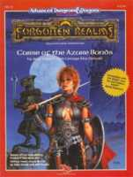| 
|Знакомьтесь — Элия из “Путеводного камня”!|

## Феномен мироустроения

|   |
|---|
|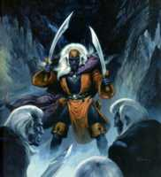| 
|Вжик, вжик, вжик! Кто на новенького?|

Десятки фантастических миров появились на свет только для того, чтобы послужить фоном одной-единственной книге или сериалу. Если произведение удается, то появляются последователи и развивают тему. Классическим примером подобного развития можно считать сагу о Конане-Варваре. Если последователей не наблюдается, то мир будет костенеть в рамках того единственного произведения, чье действие разворачивается на его просторах. Хорошо, если автор — гений, а книга — шедевр. Тогда это прозябание хотя бы не станет забвением!

|   |
|---|
|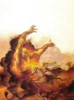|
|Страна Закхара, родина шейхов, повелевающих джиннами.|

Совсем иначе дело обстоит с Забытыми Королевствами. Эта вселенная изначально не была предназначена для какого-то одного автора или литературного произведения. Основная цель его создания — поддержка ролевой системы AD&D 2nd Edition компании TSR, ныне почившей в бозе. На материале Королевств десятками писались приключения-модули для любителей настольных РПГ. Этот мир не был первым творением компании, не стал он и последним. Но в многолетнем беге с литературными и ролевыми препятствиями именно Королевства показали себя наиболее живучими и интересными как для игроков, так и для авторов.

Но основной феномен мира даже не в его живучести, а в целях, личностях авторов, его строивших, и их количестве. Основным миростроителем можно считать Эда Гринвуда, бывшего школьного учителя, а ныне — известного писателя и мастера. Мастер, или Dungeon Master — это такой специальный человек из мира настольных ролевых игр, который воссоздает для своих товарищей-игроков окружающих их мир и реакции мира на действия персонажей.

|   |
|---|
|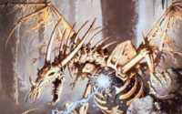|
|Страшнее драколича существ не бывает!|

Верными соратниками Гринвуда были такие мэтры, как Дуглас Найлз и Джеф Грабб. А еще — десятки других, менее известных авторов. Мир создавался в первую очередь для Мастеров и игроков — как база для РПГ- творчества. И создавался такими же любителями, как и те, кто будет в этот мир играть. Практически никто из команды Гринвуда не получил специального литературного образования и вряд ли планировал становиться писателем. Кто-то, как Грабб или Сальваторе, вышел из вуза инженером, а другие и вовсе ограничились колледжем. Отсутствие нужных знаний восполнялось энтузиазмом и азартом. Да и где было взять опыта, если они стали одними из первых создателей игрового мира, который должен был не только пережить рамки книги, фильма или единственной игры, но вместить в себя десятки других таких же книг, фильмов и игр. И при этом нужно было не противоречить своим предшественникам и не ограничивать возможности последователей.

В дальнейшем карьеры многих авторов, для которых Забытые Королевства стали первой ступенью, успешно развивались в других направлениях. Кто-то ушел в разработчики компьютерных и настольных игр, кто-то продолжил свою литературную деятельность, а кому-то организационные и редакторские задачи оказались куда ближе. И почти все эти люди, спустя год или десять лет, так или иначе, возвращались к своему первому детищу.

#### Фэйрун на мониторе

Для начала просто небольшой список того, что нынче можно считать раритетами компьютерных игр: Pool of Radiance, Curse of the Azure Bonds, Secret of the Silver Blades, Pools of Darkness, Gateway to the Savage Frontier, Treasures of the Savage Frontier, Eye of the Beholder, Eye of the Beholder II, Eye of the Beholder III, Dungeon Hack, Menzoberranzan, Hillsfar и Blood & Magic. Все они, ясное дело, имеют своим местом действия Забытые Королевства.

Игры первой части списка, вплоть до Treasures of the Savage Frontier, представляют собой классические CRPG, с видом а-ля Neverwinter Nights. Правда, графика слегка похуже — на дворе был конец восьмидесятых! Набираете партию из четырех-шести персонажей и вперед, к планке экспириенса! Все игры были сделаны еще под AD&D 1st edition, а их появлением мы обязаны славной компании SSI.

Вторая часть списка — уже более современные CRPG, с видом от первого лица. Серия Eye of the Beholder в свое время била все рекорды по популярности. Да и сейчас, вспоминая о ее прохождении, начинаешь задумываться об утерянном геймплее и прочей ностальгической фигне. Эх, как же мы с Черным посохом тогда зажгли! Menzoberranzan, с другой стороны, был не столь хорош, зато про войну. Правда, не про Дриззта нашего Ду Ардена, но о местах его былой славы. Да и сам легендарный драу в игре все же засветился. Эти шедевры также достались нам от SSI.

|   |
|---|
|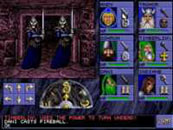 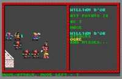| 
|Вот так это выглядело раньше...|

Особняком стоят Hillsfar и Blood & Magic. Первая не входила ни в одну из серий и была игрой переходного периода, от AD&D 1st edition к AD&D 2nd edition. Вторая принадлежала к классу стратегий в реальном времени, что всегда выглядело дико в рамках любой ролевой системы.

|   |
|---|
|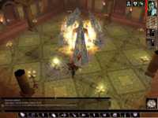 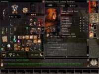| 
|... а так это смотрится теперь!|

После благополучной кончины SSI за дело принялись такие монстры, как Atari, Black Isle Studio и даже Interplay. Их детища — Baldur’s Gate I и II, Icewind Dale I и II, Neverwinter Nights со всеми его расширениями и дополнениями. Кстати, онлайновая игра под названием Neverwinter Nights выходила давно, и новая РПГ стала своеобразным “римейком”. Тем более что первая игра по правилам D&D 3rd edition. Правда, и эти правила уже устарели! Так что будем ждать новых пополнений коллекции игр, посвященных Фэйруну и его обитателям.

На диске вы можете ознакомиться с более детальным обзором серий Baldur’s Gate и Icewind Dale.

## Забытые Королевства в историях

В 1987 году появилась первая книжка по объединенному миру — Forgotten Realms Campaign Set. Ее авторами были Джеф Грабб и Эд Гринвуд. До того выходили разрозненные модули и художественные произведения, действие которых потом было “вписано” в рамки Королевств. В двух 96-страничных буклетах и прилагающихся картах заключалось описание целого мира. Но если вы не фанат AD&D, то лишь весьма малая часть этого описания была бы вам интересна и понятна. Компьютерные игры, выходившие примерно тогда же — Curse of Azure Bounds и Treasures of the Savage Frontier, —не слишком дополняли мир, используя наработки “настольщиков”. Совсем другое дело — литературные серии, взявшие свой старт в те годы.

|   |
|---|
|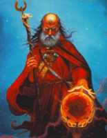| 
|Жизненный график тайских магов не располагает к самой жизни.|

### Первый этап

|   |
|---|
|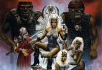| 
|Жрицы богини Ллотх на подиуме.|

Самым плодовитым автором был Дуглас Найлз. Его первая серия — The Moonshae Trilogy (“Муншайская Трилогия”) — посвящена героической борьбе коалиции Друидов со всякими нехорошими тварями во главе с самим Баалом — одним из злобных богов. Место действия этой борьбы — задворки континента, не шибко развитое островное государство на западе, южнее Вотердипа (название этого города на русский часто переводят как “Глубоководье”). Ее даже перевели и издали на русском языке. Ужасающий дизайн этого издания (издательство “Мир и семья”, 1993 год) отпугнул многих фэнов, хотя перевод был не столь уж плох, если сравнивать с его с теми, что последовали далее.

Следующая трилогия Найлза, Druidhome Trilogy, была посвящена все той же Муншаи. После Баала за страну принялся Талос, которого недвусмысленно прозвали “Разрушителем” — бог бурь и прочих революций... Его наследники, тоже боги, по-прежнему придерживались дарвинистской теории развития: выживает сильнейший, зубастейший и когтейший.

|   |
|---|
|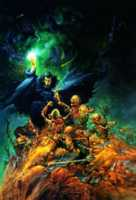|
|Вставай, проклятьем заклейменный! Да-да, и ты тоже!|

Примечательность этих двух трилогий — в месте действия. Хотя весь мир открыт для авторского произвола, автор выбрал максимально удаленную от основных событий провинцию и возился с ней целых шесть томов. Хотя любому мало-мальски знакомому с геополитической картиной Фэйруна человеку понятно, что даже если б эту Муншае напрочь смыло, в остальном мире никто бы этого не заметил. Такова специфика Забытых Королевств — все катаклизмы и войны преимущественно локальны.

|   |
|---|
|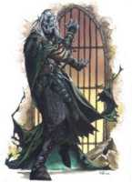| 
|Это не темный эльф, это баэлнорн — добрый лич эльфийского происхождения. Подобные “мертвые” эльфы встречаются только в Королевствах.|

Вторым за перо взялся Джеф Грабб, совместно со своей супругой Кейт Новак. Их Finder’s Stone Trilogy (“Трилогия о Камне Файндера”, в русском переводе — “Путеводный камень”) повествует о приключениях женщины-воина Элии и ее друзей в борьбе со злобным богом Моандером (божеством увядания и разложения). Надо отметить, что активное участие божеств в людских делах — обычное дело в Королевствах. Да и не удивительно, учитывая количество этих божеств — только ныне действующих порядка сотни, а ушедших на покой и вовсе никто не считал. В этой трилогии события происходят уже в более обжитых местах: Westgate, Shadowdale, Myth Drannor и Suzail — это уже центр мира. Появляются знаковые персонажи и группы — Эльминстер, Night Mask, Рыцари Миф Драннора, Арфисты и Зентаримы. При этом большинство из них исполняют роль статистов. Сразу видно, что автор не понаслышке знаком с миром и его работа с самим Гринвудом не была пустой тратой времени.

Эта трилогия была переведена и издана у нас еще в 1997 году издательством “Золотой век”. Оформление вполне достойно тех времен, а перевод хоть и имел массу недочетов, но все же был сносным. И уж конечно, своей мировой популярностью трилогия не в последнюю очередь обязана компьютерной игре Curse of Azure Bounds, имевшей хождение в массах. Приключение, написанное по мотивам книги Джефом Граббом и Джорджем МакДональдом для AD&D, имело значительно меньший успех, но тоже легло в общую копилку популярности.

|   |
|---|
|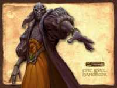| 
|Мэншун, глава Зентарима и один из основных злодеев мира.|

Следующей серией стали Harpers, то есть “Арфисты”. На этот раз не трилогия, а целая эпопея. Арфисты — это тайная организация, борющаяся со всякой несправедливостью по всему миру. Эдакие пионеры Забытых Королевств, причиняющие добро и справедливость. С их помощью Силы Света регулярно одерживают победу над Силами Разума. Последние обычно представлены Зентаримами, верхом практичности и сдержанности. Косность и самоуверенность Арфистов стала прямо-таки притчей во языцех чуть ли не с самых первых книг.

|   |
|---|
|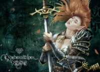| 
|Эльфийка Арибет из Neverwinter Nights — самой современной компьютерной игры о Забытых Королевствах.|

В цикле “Королевств” поучаствовали такие могучие авторы, как Трой Деннинг, Джеймс Лаудер и Дэвид “Зеб” Кук. Но особо хочется отметить Элейн Канингем с ее сериалом в сериале. Книги Канингем выгодно отличаются от своих предшественников, в первую очередь, замечательным языком и понятным даже далекому от ролевых игр человеку юмором. Достойный сюжет и хорошо прорисованные персонажи удерживают внимание читателя. За кадром не слышно “грохота игральных костей” при описании боевых сцен. А ведь первые книги можно было читать прямо с ролевыми руководствамив руках, настолько была заметна механика AD&D!

Elfshadow (“Эльфийская тень”) — второй том Арфистов, повествующий о приключениях наемницы-полуэльфийки Аэрелин Мунблейд. Сама главная героиня не входит в ряды Арфистов, но регулярно выполняет для них поручения. Все начинается с того, что агенты, с ней пересекавшиеся, гибнут один за другим. Суровые, но справедливые Арфисты начинают расследование, в результате которого вскрывается коварный замысел. По ходу дела героиня немного узнает и о прошлом своих родителей. В следующих четырех томах дела Аэрелин и ее друзей стремительно идут в гору, а противники становятся все круче и круче. Весь континент обходится вдоль и поперек за время повествования. Ну, а уж исторических личностей на просторах книги — хоть отбавляй.

К сожалению, ни до сериала Канингем, ни до других Арфистов еще не дошли руки наших издателей. Но, учитывая, что московская “Максима” наконец-то поставила издание романов о Забытых Королевствах на поток, есть вероятность, что скоро нас порадуют русским переводом.

|   |
|---|
|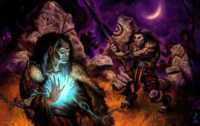 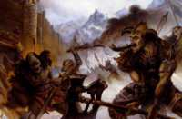| 
|Орки Фэйруна мало отличаются от классических орков фэнтези.|

### Сквозь редакции

|   |
|---|
|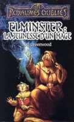| 
|Многострадальные Забытые Королевства, кроме нашествия кочевников, битвы богов и падения нескольких империй, пережили аж три редакции правил классической ролевой системы D&D. Сейчас мир пребывает в лапах D&D 3.5 edition, сделанной на базе D20 system. А начиналось все еще с AD&D 1st edition!|

Сами изменения правил не сильно влияют на историческую и геополитическую картину мира. Ну правда, чего тут сложного, если подходить к делу разумно? Вот есть тот же Эльминстер, самый могучий и мудрый маг Королевств. Значит, неважно, каким уровнем и характеристиками он обладает, главное — чтобы был круче всех, а остальное — лирика.

С выходом каждой новой редакции накапливалось много материала, требующего дополнительной систематизации и привязки к миру — книги, модули, дополнения и расширения. Ведь авторы писали, что и как им вздумается, не особо заботясь о таких тонкостях, как целостность мира и “историческая” достоверность. Таким образом, с каждым новым набором правил история мира двигалась лет на пять-десять вперед. Так что последние 17 лет Забытые Королевства жили в режиме реального времени. Почти как параллельный мир!

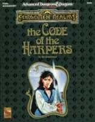 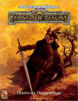 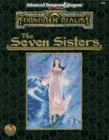
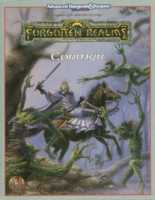 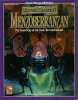  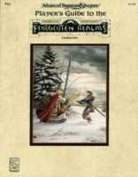 

### Непреходящая слава

|   |
|---|
|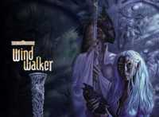|
|Иллюстрация к роману Windwalker (“Носимый ветром”), одной из книг цикла “Дочь драу”.|

Роберт Сальваторе — автор, прославивший Забытые Королевства в веках. Процентов семьдесят, а то и больше, популярности этого мира — всецело его заслуга. Его и придуманного им персонажа — темного эльфа Дриззта Ду Ардена (Drizzt Do’Urden). Кстати, подобное прочтение его имени не является ошибкой — Сальваторе строит свое повествование и все иерархию темных эльфов, во многом опираясь на произведения Александра Дюма, и французские корни здесь очевидны. Правда, в русском переводе его ради благозвучности переименовали в Дзирта. Дриззт появился впервые в Icewind Dale Trilogy (“Трилогия Долины Ледяного Ветра”), где с группой боевых товарищей в лице гнома Брюнора “Боевого топора”, хоббита Региса, варвара Вульфгара и его подружки Кэтти-бри наводят порядок в вышеозначенной Долине.

|   |
|---|
|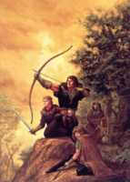| 
|Иллюстрация к роману “Долина теней” (художник Джефф Изли).|

Темные эльфы вообще народ особый, а уж этот их представитель — и вовсе выдающийся. Мало того, что живет на поверхности, а не в Подземье, так еще и природу любит, и людей десятками не режет, как завещают традиции великих предков. Отступник, одним словом. Но в первой трилогии об отступничестве и его корнях Сальваторе особо не распространялся — и так у героя дел много. То дракона в капусту порубить, то гоблинов на путь истинный наставить, а то и приблудившемуся демону указать кратчайший путь домой. Здесь же появляется первый антагонист — Артемис Энтрери, персонаж мною лично обожаемый. Он почти так же хорош, как и Джарлаксел, “главный злодей” третьей трилогии. Вообще, в книгах Сальваторе как-то особо удаются симпатичные негодяи. Но не все — надо же кого-то и убивать, в конце концов!

Сама Долина Ледяного Ветра и Мифрильный Холл, который отбивает у дракона вся честная компания, — безусловно, исторические места, расположенные на северо-западе мира, северней Вотердипа. То есть опять на задворках ойкумены. Но вот во второй трилогии, повествующей уже о молодости главного героя, Сальваторе создает целый новый мир, при этом не выходя за рамки Забытых Королевств.

|   |
|---|
|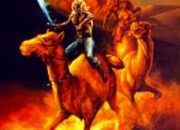| 
|Иллюстрация к роману “Проклятие рубина” (художник Джефф Изли).|

Подземье — это пространство, скрывающееся под ногами обывателей. Пещеры и переходы пронизывают весь континент на глубине десятков миль от поверхности. Можно войти в тоннель в районе Серебряных Пустошей, а выйти — в степях Мулгоранда, ни разу за время пути не показавшись на свет. А можно и не выйти вовсе. Ведь там, под поверхностью, обитают не только десятки злобных и уникальных магических тварей, но и целые расы, ушедшие из подлунного мира. А доброе, незлобивое существо, с мечтой о личном огороде на старости лет, навряд ли поменяет свой сколь угодно плохой быт на поверхности на добровольное заточение в сырых и темных катакомбах. Целые города драу (темных эльфов), дуэргаров (темных гномов), иллитидов (про этих лучше вообще не знать; но если любопытно — это человекоподобные моллюски с псионическими свойствами, питающиеся мозгом разумных существ) и прочих, не менее обаятельных тварей, расположены здесь.

|   |
|---|
|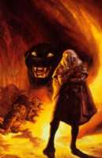| 
|Иллюстрация к роману “Изгнанник” трилогии “Темный эльф” (художник Джефф Изли).|

Подземье — родина Дриззта Ду Ардена, Мензоберранзан — его дом. И дом сотен других драу и более чем пятидесяти кланов, ведущих непрерывную кулуарную битву за место под солнцем. Законы у этого мира — суровей не придумаешь. Загляделся — нож в спине, и хорошо, если один. Клан против клана, брат против брата, женщины против мужчин, и каждый — сам за себя. Вот где провел свое детство наш герой. Так что нечего удивляться десяткам трупов, что устилают его жизненный путь. Dark Elf Trilogy (“Трилогия Темного эльфа”) повествует о нелегком пути Дриззта к своему настоящему дому, о поисках ответов на волновавшие его вопросы бытия. Он — типичный “лишний человек”, хоть и драу, герой своего времени — бездомный изгой и ангел возмездия в одном лице. В общем, достойный персонаж.

После второй трилогии старые герои вновь ожили на страницах продолжений. Вся компания Мифрильного Холла схлестнется сначала с назойливыми родственниками Ду Ардена, а затем и со всеми остальными жителями Мензоберанзана. Злодеев хватит на много томов. А если вдруг они закончатся — то можно воскресить старых. Надо отметить, что, как и Глену Куку в его “Черной Гвардии”, Сальваторе очень тяжело уничтожить кого-нибудь из любимых героев окончательно. Так что вас ожидает масса приятных сюрпризов на протяжении этого почти бесконечного сериала.

Язык автора в оригинальных произведениях выгодно отличается от наших переводов. Особенно — от самого первого, вышедшего в издательстве “Золотой век”. Полные пафоса и лирики вступительные монологи героя в Dark Elf Trilogy превратились в борьбу косноязычного поэта с трудами Гегеля. Характерные, говорящие за себя имена и названия, довольно пристойно звучащие в оригинале, стали наглядным примером к статье Анджея Сапковского “Нет золота в серых горах”. Авторский стиль изуродован до неузнаваемости. К сожалению, издательство “Максима”, взявшееся за переработку старых и перевод новых книг, не до конца исправило ошибки своих предшественников. Но их издание можно читать без содрогания, да и в руки брать не страшно. На текущий момент последней изданной книгой серии является “Хребет мира”, двенадцатая по счету!

За Сальваторе о Подземье стали писать и многие другие авторы, но особо стоит выделить творение уже знакомой вам Элейн Канингем: Daughter of the Drow (“Дочь драу”). Оно посвящено еще одной представительнице темных эльфов, решившей избрать свой путь. Дочь Верховного Мага Мензоберранзана, обладающая уникальными магическими способностями, — сама по себе довольно интересный персонаж. А уж разнообразные сюжетные повороты и замечательный язык только добавляют занимательности повествованию.

### Демиург за работой

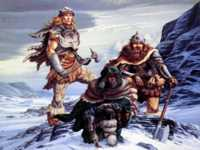 

Писатель Эд Гринвуд, по праву считающийся главным создателем и укротителем Забытых Королевств, не бросил свой мир и спустя 17 лет после выхода первой официальной книги. Кроме пособий для игроков AD&D 2nd edition, а ныне — D&D 3rd edition, он успевал выпускать и литературные произведения. Первой ласточкой стал Spellfire (“Заклинательный огонь”) — книжка про бедную девочку, поражающую разрушительной мощью современного крейсера, если ее хорошенько напугать. Дальше последовали продолжения — Crown of Fire и Hand of Fire. Несколько рассказов в различных сборниках лишь разогрели аппетит и окончательно наставили Эда на путь истинный. Дело в том, что во всех ранних произведениях автор пытался живописать быт произвольных персонажей, но с кого бы он ни начинал — с безвестной девочки или знаменитого лорда Мэншуна, — заканчивал он все равно тем, что персонаж становился архимагом всех времен и народов, клоном Гэндальфа, любимцем Мистры и вообще — примечательным человеком. Потому Гринвуд принялся за сагу об Эльминстере. Этот знаменитый чародей свершил много добрых (и не очень) поступков, победил кучу злодеев и по сей день стоит на страже мирового равновесия. Клоном Гэндальфа я его назвал не случайно — та же трубка, посох и шляпа. Те же бесконечно добрые глаза, готовые в любой момент выбрать точку удара для огненного шара. Да и сам автор не скрывает этого сходства.

Первый том, Elminster: The Making of a Mage (“Эльминстер: Рождение мага”), повествует о бурной молодости ныне весьма почтенного старца. Кем он только не был: и воином, и вором, и священником, и даже — женщиной! И все это в борьбе за сгинувшее ныне царство. В продолжениях его противники все ближе подбираются к современным Королевствам. Сейчас уже вышел пятый том саги — Elminster’s Daughter (“Дочь Эльминстера”).

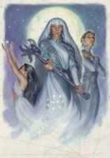 

Кроме того, Гринвуд создал еще одну сагу, посвященную будням центрального королевства Кормир — Cormyr Sage (“Кормирский мудрец”). В нее входят Cormyr, Beyond the High Road и Death of the Dragon. Его же перу принадлежат два произведения о Семи Сестрах — феминизированном обществе чародеек-профессионалок, стоящих на страже магии и доброты: Stormlight и Silverfall: Story the of Seven Sisters.

> ### Забытые Королевства в России
>
> В настоящее время книги цикла Forgotten Realms по-русски выпускает московский Издательский Центр “Максима”. За последний год “Максима” успела переиздать первую трилогию о Темном эльфе, а также напечатала несколько ее продолжений и стартовала новые серии в рамках мира Забытых Королевств. Вот как выглядит полный список книг, выпущенных “Максимой” по состоянию на лето 2004 года:
>
> Книги Роберта Сальваторе:
>
> * “Темный эльф” (вся Dark Elf Trilogy в одном томе)
> * “Трилогия Долины Ледяного Ветра”: “Магический кристалл”, “Проклятье рубина”, “Серебряные стрелы”
> * “Наследие драу”: “Беззвездная ночь”, “Темное наследие”, “Нашествие тьмы”, “Путь к рассвету”
> * “Пути тьмы”: “Незримый клинок”, “Хребет мира”
>
> Книги других авторов:
>
> * Скотт Чинчин. “Долина Теней” (первая книга трилогии “Аватары”)
> * Эд Гринвуд. “Эльминстер: Рождение мага”
> 
> 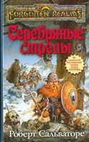 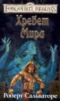  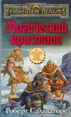 
> 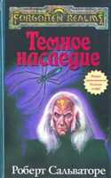 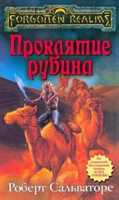 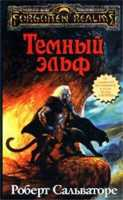 
> 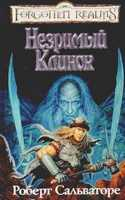 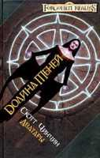 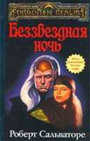
> 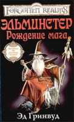 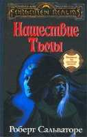 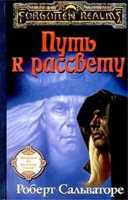 

## Современная история: заключение

Все течет, все изменяется. Вот уже и Роберт Сальваторе написал шестнадцатый том приключений Дриззта Ду Ардена и его друзей. Недалек тот день, когда к нам в руки попадет пятый том приключений Данилы Тана и Аэрелин Мунблейд. Хотя теперь Элейн Канингем больше уделяет времени своей новой любимице — Лиреаль Бенре, третий том ее приключений может не стать последним. Последователи Сальваторе с радостью схватились за тему “Богиня Ллотх против всего мира” и клепают уже пятый том War of the Spider Queen (“Война Паучьей королевы”). Эд Гринвуд утомился писать про бессмертного Эльминстера и взялся за его детей. Первой, как вы уже знаете, была дочь. Прочие авторы исследуют другие, не менее интересные темы. Трой Деннинг, Дэвид Кук и Джеймс Лаудер — самые известные и достойные прочтения представители.

Но и на этом история не заканчивается. Учитывая, что Забытые Королевства вовсе не забыты ни издателями, ни читателями, думаю, что в ближайшие годы поток литературного и игрового творчества об этом мире не иссякнет. Так что ждите новых поступлений и готовьтесь к закупке переводов. До встречи на просторах Фэйруна!

> #### Фэйрун в деталях
>
> На территории Забытых Королевств проживают десятки миллионов людей, эльфов, гномов, хоббитов и представителей других рас. В том числе и таких, чья численность составляет всего несколько десятков особей. Люди превосходят все остальные расы по численности. Однако из этого вовсе не следует, что они представляют собой самую грозную силу. Скажем, одинокий и слегка озлобленный дракон способен сравнять с землей пару крупных городов. И очень хорошо, что это не мир Krynn (известный нам по саге Dragonlance), где драконы имеют тенденцию сбиваться в стаи!
>
> |   |
>|---|
|
> 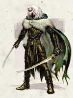 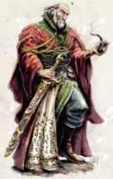 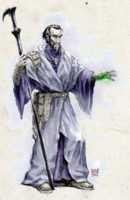 
> Самые известные “добрые” персонажи Королевств: следопыт Дриззт Ду Арден и архимаги Эльминстер из Долины Теней и Черный Посох из Вотердипа. Такими их увидел Тодд Локвуд, нынешний шеф-дизайнер D&D.

### Государства

Страны Фэйруна не похожи друг на друга. Есть такие, чье население исчисляется миллионами, а пространства — необъятны. И в то же время у такой страны может быть сосед, занимающий жалкий клочок земли размером с сотую часть своего большого брата и населяемый всего несколькими тысячами жителей. Пройдемся по наиболее известным местам.

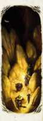 
Подземье тянется на сотни миль под землями Королевств.

**Кормир**: население 1,4 миллиона жителей (85% — люди), монархия. Эта страна прекрасно подходит в качестве места действия рыцарского романа. Социальный и политический статус напоминает средневековые европейские государства. Только тысячелетний опыт борьбы за существование помог пережить королевству недавнее нашествие варваров-степняков Туйганской Орды, вторжение полчищ орков и гоблинов, мор, атаку огромного красного дракона и смерть короля. Теперь страна стоит на перепутье, и только гильдия Боевых Магов Кормира в союзе с элитной королевской гвардией Пурпурных Драконов удерживает ее от гражданской войны.

**Долины**: население 600 тысяч (80% — люди), правительство выборное. Конгломерат из одиннадцати долин был некогда образован как пограничная зона между могучим эльфийским государством Кормантор и человеческими странами. Каждая долина управляется своим Правителем, которого избирают жители. Взаимная поддержка людей и эльфов помогала выживать Кормантору и Долинам на протяжении сотен лет. Но недавняя массовая эльфийская эмиграция и вторжение драу в Кормантор положили конец и без того не слишком спокойной жизни. Наиболее известные места — Долина Теней, нынешняя резиденция Эльминстера, а также Миф Драннор — разрушенный город, полный злобных демонов, место действия игры Pool of Radiance.

**Тай**: население 5 миллионов (60% — люди), “магократия” (во главе правительства — могущественные маги). Суровая империя, построенная на работорговле, магической мощи правителей, и армии нежити и гоблиноидов (орки, гоблины, гноллы и прочие). Одиннадцать провинций управляются восьмью зулькирами (главы магических школ) и их ближайшими помощниками. И без того представляющий огромную опасность для своих соседей, Тай бы уже давно объявил войну всему миру, если бы не внутренние дрязги. Только железная воля лича (то есть ходячего мертвеца) Шаз Тама, зулькира Некромантии, удерживает прочих магов от междоусобной войны.

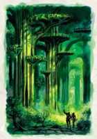 
Кормантор, древний эльфийский лес в центре Фэйруна.

**Сембия**: население 4,5 миллиона (96% -- люди), купеческая республика. Страна торговцев. Они продадут вам все, что вы сможете у них купить. Совет торговцев выбирает правителя страны. В отличие от прочих государств, здесь чтят контракт или слово, а также букву закона. Основным оппонентом Сембии является Тай: с ним республика бьется за рынок сбыта магических предметов. Главной проблемой страны становятся экономические разногласия между торговыми кланами: в своем стремлении обойти конкурента здесь не гнушаются любыми средствами.

### Магия

Волшебством заведуют две богини: Мистра и Шар. Первая отвечает за магию обычную, которой пронизано все пространство мира. Так называемая “пряжа”, источник заклинаний, представляет собой магические каналы, которые невидимы обычным зрением. Из них черпается энергия для любого магического действия. Все нити “пряжи” Мистра держит в своих руках, и в случае, если полоумный маг начнет творить непотребства вроде изменения природы мира, она с легкостью лишит его всех сил, невзирая на титулы и регалии.

В то же время Шар управляет “теневой пряжей”. Это такие же каналы магической силы, имеющие “темную” природу. Тот, кто посвятит свою жизнь этой стороне магии, рано или поздно сходит с ума. Такова природа “тени”.

Занявшись магической практикой в одном из двух вариантов “пряжи”, маг никогда не сможет сменить свою специализацию на другой ее тип. Ибо одна магия не может ни питаться от источников другой, ни управлять воздействиями своей второй половины. Грубо говоря, устранить обычному магу заклинание “тени” будет столь же сложно, как и простому крестьянину.

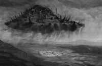  
Летающий город шейдов. Один из таких городов падает на землю в продолжении компьютерной игры Neverwinter Nights: Shadows of Undrentide.

### Далекие берега

Забытые Королевства — это не только Фэйрун. За его пределами расположены другие, не менее интересные, земли.

**Мазтика**: местная Америка времен ее открытия Колумбом. Континент покрыт непроходимыми тропическими лесами, которые полны странных созданий. Десятки различных народов, враждебно настроенных друг к другу, живут на этих землях. Сейчас крупные торговые корпорации Фэйруна начали борьбу (преимущественно друг с другом) за освоение этих территорий.

**Кара-Тур**: эта страна известна также, как Рокуган (мир коллекционной карточной игры Legend of the Five Rings). Некогда созданный самим Гари Гигаксом (человек, придумавший D&D), фэнтезийный Восток всегда рад удивить своих исследователей. Воюющие самурайские кланы, тайные шпионы-ниндзя, мудрые и смертельно опасные в бою монахи, и разнообразные диковинные магические создания — вот кто обитает в этом полушарии планеты.

**Закхара**: а вот и Ближний Восток. Страна выжженных солнцем пустынь, редких оазисов и всемогущих джиннов. Именно на могущество последних опираются местные правители. В Фэйруне нет правителя настолько глупого, чтобы бросить вызов закхарским шейхам. Не слишком активная торговля объясняется бесчинствующими пиратами и не больно теплым приемом, который оказывается “северным варварам” в Закхаре.
