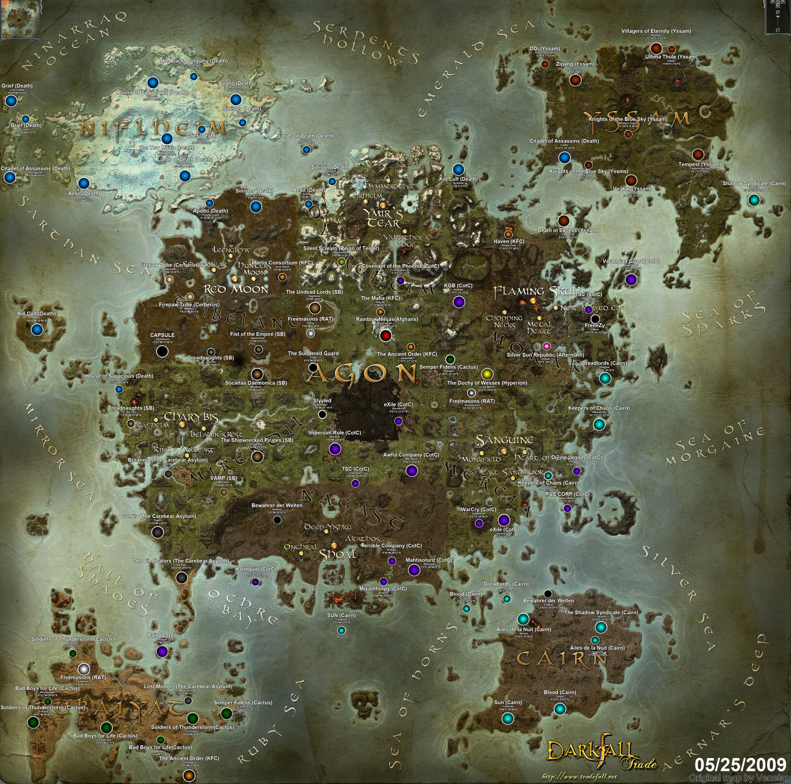

# Вселенная Гипериона.

Вымышленная вселенная будущего, в которой происходят события, описанные Дэном Симмонсом в тетралогии «Песни Гипериона», состоящей из четырёх романов и одного рассказа-спин-оффа «Сироты спирали». Первой книгой тетралогии является роман «Гиперион», с которого и пошло название всей тетралогии и вымышленной вселенной.

