# Мир, поный чудес
## Вселенная Marvel

> Только герой обретает мужество следовать своей судьбе.
>
> Герман Гессе

|               |                               |
|---------------|-------------------------------|
|Название мира: |Marvel Universe                |
|Возникновение: |1961 год новой эры нашего мира |
|Создатель:     |Стэн Ли                        |
|Происхождение: |Комиксы                        |
|Воплощения:    |Фильмы, мультсериалы, настольные и компьютерные игры   |

Человек-паук. Люди Икс. Халк. Сорвиголова. Фантастическая четверка. Блэйд.
Сотни других супергероев. Удивительно, но бесконечные истории об их
приключениях выпускает одна компания — Marvel Comics. Невероятно, но все эти
популярнейшие персонажи «живут» в одной и той же вселенной. И уж совсем
невозможным кажется то, что всех этих героев придумал, по сути, один человек.

Человека, который создал необъятную вселенную Marvel, зовут Стэн Ли. Впервые
это имя прозвучало в комикс-индустрии в 1941 году, когда вышли первые комиксы
по сценарию 19-летнего парня из Нью-Йорка. Тогда же талантливый юноша стал
главным редактором Marvel Comics и оставался на этом посту до 1972 года, с
трехлетним перерывом на службу в армии. А в начале шестидесятых Стэн вместе с
художниками издательства совершил революцию в супергероическом комиксе.

|   |
|---|
| 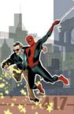 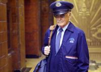 | 
|Стэн Ли. Любит попадать на обложки собственных комиксов и сниматься в их экранизациях. |

Флагманом рисованных историй тогда была компания DC Comics, которой
принадлежали права на Бэтмена и Супермена. Их похождения пользуются
популярностью и сейчас — но многие ли смогут, не задумываясь, назвать других
персонажей этого издательства? А имена супергероев Marvel на слуху у всех, да и
в Голливуде они пользуются большим спросом. Секрет успеха Стэна Ли — в том,
что, отбросив в сторону олимпийский девиз «Быстрее! Выше! Сильнее!», он подарил
американскому читателю героев качественно нового поколения. На свет появилась
вселенная, где уживаются фантастика и фэнтези, инопланетяне и гости из
будущего, боги и мутанты, магия и наука.

## Суперобыватели

|   |
|---|
|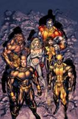              |
|Люди Икс: тяжело быть в меньшинстве.   |

Первым творением Ли стала «Фантастическая четверка», дебютировавшая в 1961
году. Конечно, в значительной степени Мистер Фантастика, Нечто, Фантастическая
женщина и Человек-факел оставались героями своего времени: чрезмерно крутыми,
предпочитающими цветные обтягивающие трико и слишком уж озабоченными спасением
мира. В то же время, речь в комиксах шла о семье, пусть и героической, но не
избавленной от проблем, знакомых каждому читателю. Супергерои впервые шагнули в
сторону простого человека, что сделало их более живыми и интересными, чем все
персонажи, существовавшие до появления «Фантастической четверки». Так был
заложен фундамент того, что впоследствии станет фирменным стилем Marvel:
сосредоточенность на внутреннем мире и характерах персонажей, которые, несмотря
на сверхспособности, оставались подвержены тем же страстям, порокам ислабостям,
что и их поклонники.

|   |
|---|
|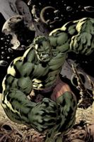              |
|Мистер Хайд не мог и мечтать о подвигах своего идеологического наследника — Халка. |

Публика ждала именно таких героев, пусть обладающих невероятными силами, но
способных на человеческие чувства и эмоции, сталкивающихся не только с
суперзлодеями, но и с жизненными неурядицами. Человек-паук в свободное от
борьбы со злодеями время с переменным успехом пытается устроить личную жизнь и
заработать на хлеб насущный. В комиксах о Людях Икс нашла отражение борьба
меньшинств за свои права. А Сорвиголова или Железный человек — по сути дела
калеки, их борьба с внутренними демонами не менее интересна, чем противостояние
с преступниками.

Нащупав верный курс и ухватив удачу за хвост, Стэн Ли не собирался
останавливаться. Всего за несколько лет появились на свет почти все те герои и
команды, которые сейчас хорошо известны любому поклоннику фантастики, хотя бы
по фильмам или компьютерным играм. Наиболее успешным изо всех героев Ли стал,
без сомнения, Человек-паук — а ведь поначалу в его успех не верил никто, кроме
создателя! Паук пробил дорогу к сердцу любителя комиксов именно тем, что до
Стэна Ли считалось недопустимым для супергероя: он не был безупречен и вполне
мог попасть впросак по совершенно банальным причинам, таким как проблемы с
девушкой или с учебой.

«Собирать» отдельных героев в одну супервселенную начали уже в шестидесятые.
Супергерои то и дело становились «приглашенными звездами» в комиксах,
посвященных другим персонажам. Одной из первых ласточек стала серия «Мстители»
об одноименной команде супергероев, пережившей множество перерождений. В состав
Мстителей в разные времена входили Человек-паук, бог Тор, Капитан Америка,
Железный человек — герои, прославившиеся в персональных сериях. Никаких особых
сложностей в том, чтобы свести под обложкой одного выпуска сразу нескольких
героев, не возникало: действие всех историй Стэна Ли сотоварищи разворачивалось
в мире, очень похожем на реальную Америку, только с некоторыми фантастическими
допущениями. На мелкие несостыковки до поры до времени попросту закрывали
глаза.

|   |
|---|
|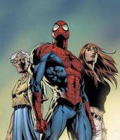              |
|Человек-паук, символ новой эпохи супергероев.  |

Постепенно кроссоверы (так любители комиксов называют подобные
взаимопроникновения серий) стали набирать все большую популярность — как у
сценаристов, так и у читателей. Первым масштабным кроссовером Marvel стала
вышедшая в 1984 году серия из двенадцати выпусков Secret Wars. В ней Странник,
персонаж, обладающей божественным могуществом, собрал на отдаленной планете
всех известных героев и злодеев Земли и заставил их сражаться не на жизнь, а на
смерть. Любопытно, что некоторые события Secret Wars не раз аукнулись в
последующие годы, например, именно здесь появился черный костюм-симбионт
Человека-паука, впоследствие давший рождение легендарному Веному.

|   |
|---|
|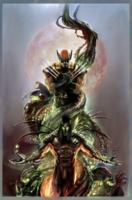              |
|Порой кроссоверы объединяют конкурентов: Росомаха принадлежит компании Marvel, а Тьма — Top Cow Productions.   |

> ### Гражданская война и ее итоги
>
> 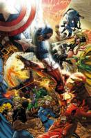
>
> Продолжая издавать комиксы, посвященные отдельным героям, Marvel регулярно
> выпускает мини-серии кроссоверов, описывающих те или иные важные для всей
> вселенной события. В 2006 году вышла линейка кроссоверов под общим названием
> «Гражданская война», повествующая о противостоянии не на жизнь, а на смерть
> между бывшими друзьями и соратниками.
>
> Весь мир оказался взбудоражен кровавым исходом одного из показушных подвигов
> молодой поросли американских героев. Правительством США, с которым тесно
> сотрудничал Железный человек Тони Старк, было в срочном порядке принято
> решение об обязательной регистрации сверхлюдей с целью контроля над их
> действиями. Далеко не все из спасателей мира в трико обрадовались
> необходимости раскрыть тайну своих личностей, и стоило у недовольных появится
> лидеру — им стал Капитан Америка, — как противостояние между двумя лагерями
> супергероев стало неизбежным.
>
> Война на информационном фронте (частью пиар-кампании сторонников регистрации
> стало раскрытие своей личности Человеком-пауком) скоро доходит до открытой
> схватки между супергероями, в которой гибнет Голиаф, после чего раскол в
> стане американских сверхлюдей достигает критической точки. Человек-паук
> переходит на сторону сепаратистов, и тем при поддержке атлантов почти удается
> одержать победу над Железным человеком и его сторонниками. В последний момент
> Капитан Америка решает, что был не прав, и сдается властям — а вскоре гибнет
> от руки неизвестного убийцы. Впрочем, Кэпу умирать не впервой: на его счету
> уже с десяток смертей, и каждый раз авторы воскрешали его при первой
> необходимости.

## Супервселенная

Эклектика, безудержное смешение жанров и стилей — главная черта вселенной
Marvel. Здесь сплавляются черты фэнтези и научной фантастики, бок о бок
существуют волшебство и высокие технологии, герои путешествуют во времени, в
космосе и по параллельным мирам, а существа с разнообразными сверхспособностями
встречаются чаще, чем Микки-Маус в Диснейленде. При этом действие
разворачивается на нашей старушке Земле: те же страны, где живет огромное
количество самых обыкновенных людей, те же исторические события, от Второй
мировой до терактов 11 сентября. Интересная деталь: в пику бэтменовскому
Готэм-сити и суперменовскому Метрополису главным городом для героев Marvel стал
Нью-Йорк, и редакторы издательства пристально следят за тем, чтобы его
комиксовый образ соответствовал реальному.

|   |
|---|
|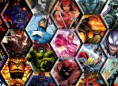  |	
|Кто же будет героем дня на этот раз? Богатый выбор...  |

Впрочем, люди со сверхспособностями — не единственное отличие вселенной Marvel
от нашей планеты. Авторы комиксов позволили себе несколько подкорректировать
географическую карту: так появилась вотчина Доктора Дума, государство Латверия.
Гениальные ученые подняли науку и технологию на невиданный уровень:
роботехника, генетические эксперименты и космические исследования шагнули во
вселенной Marvel куда дальше, чем в нашем мире. Однако большинство подобных
достижений идут на развитие арсенала супергероев и суперзлодеев (или делают их
таковыми), а вот обыватели в массе своей живут почти так же, как мы с вами.

|   |
|---|
|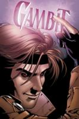 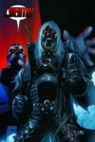|	
|Гамбит: вчера — один из Людей Икс, завтра — Всадник Апокалипсиса по имени Смерть.  |

Прибавьте к этому могущественных пришельцев из космоса и других измерений,
древние земные расы вроде атлантов, разнообразные силовые поля, обеспечивающие
существование псионики и магии, демонов, вампиров и даже настоящих богов — и
получится совершенно безумный коктейль из жанров и стилей. Но именно он
обеспечивает этому миру оригинальность и неповторимость.

|   |
|---|
|  |	
|Даже простой человек может стать супергероем. Доказано Карателем.  |

Чтобы логически объяснить все возникшие за первые годы существования вселенной
противоречия, авторы Marvel воспользовались идеей параллельных миров. «Базовым»
местом действия комиксов стала Земля под номером 616, а все сюжеты, не
вписывающиеся в генеральную хронологию, были «прописаны» на планетах с другим
номером. Благодаря такому ходу создатели серий получили невиданную прежде
свободу: характеры любимых героев можно изменить до неузнаваемости, заставить
их приключаться в самых невероятных декорациях и даже совершать непоправимые
поступки — а потом объявить все это «альтернативкой». В большинстве случаев
подобные «побочные» комиксы не оказывают никакого влияния на хронологию
основной вселенной, хотя порой отдельные персонажи из параллельных миров и
появляются на Земле-616. О том же, как любят писатели и читатели такие
эксперименты, говорит уже тот факт, что за все время существования
мультивселенной было задействовано под сотню альтернативных вариантов планеты
Земля.

|   |
|---|
|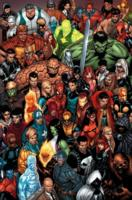  |	
|Не толпитесь, внимания читателей хватит на всех.   |

|   |
|---|
|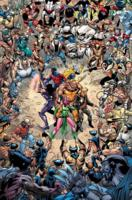  |	
|Любой мир слишком окажется тесен для такого количества Росомах.    |

К концу прошлого века стало очевидно, что интерес молодых поклонников комиксов
к супергероям, существующим уже десятки лет, снижается. Кардинально «обновить»
тех же Человека-паука или Капитана Америку, не нарушая внутренней логики
вселенной, оказалось невозможно. Так на свет появилась Земля-1610 и серии с
подзаголовком Ultimate. Герои остались прежними, но их судьбы, внешность, да и
вообще весь мир авторы создали с чистого листа. Концепция осталась почти
неизменной: все та же современная Америка, свободу и демократию в которой
защищают не ФБР и ЦРУ, а супергерои. Только во вселенной Ultimate возраст почти
всех основных персонажей колебался в районе двадцати, а то и меньше лет — чтобы
читателям было проще ассоциировать себя с героями. Кроме того, мир Marvel
Ultimate оказался более простым и логичным — за счет уменьшения числа героев и
отсутствия божественных сущностей, путешествий на другие планеты и магии.
Учитывая, что продажи всех основных серий данной линейки (Ultimate Spider-Man,
Ultimate X-Men, Ultimate Fantastic Four и The Ultimates 2) держатся на высоком
уровне уже более пяти лет, остается признать, что обновленный и осовремененный
вариант вселенной Marvel оказался не хуже предшественника.

|   |
|---|
|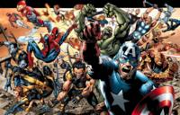  |	
|На лицо похожие, иные по сути герои вселенной Ultimate.    |

|   |
|---|
|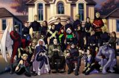  |	
|Действие мультсериала X-Men: Evolution разворачивается в одной из множества параллельных реальностей.  |

> ### Удивительные путешествия во времени
>
> Каждый автор, допускающий в своей вселенной возможность путешествий во
> времени, так или иначе сталкивается со знаменитым «эффектом бабочки». Во
> вселенной Marvel любые изменения в прошлом, произведенные путешественником во
> времени — случайно ли, намеренно ли, — порождают новую параллельную
> реальность, в которой все последующие события могут кардинальным образом
> отличаться от «оригинала». Тем не менее, виновник оказии, вернувшись в свое
> время, обнаружит, что ход истории в его родной реальности совершенно не
> изменился.

## Суперсборные

За почти полстолетия, на протяжении которых компания Marvel остается лидером в
индустрии комиксов, ее стараниями на свет появились сотни персонажей.
Некоторые, например, Росомаха или Халк, стали настоящими легендами. Другие — и
таких, конечно, больше — знакомы лишь узкому кругу поклонников. Впрочем,
подробно рассказать даже о самых популярных супергероях в рамках одной статьи
не получится. Поэтому ограничимся кратким обзором главных команд и организаций
вселенной Marvel.

|   |
|---|
|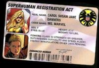                 |
|Даже у героя в маске должен быть паспорт.  |

### З.А.Щ.И.Т.А.

Секретная организация, созданная после окончания Второй мировой полковником
Ником Фьюри при поддержке ООН для противодействия терроризму и особо опасным
преступникам. Шпионская сеть З.А.Щ.И.Т.А. (S.H.I.E.L.D.) раскинулась по всей
планете. Конек ее агентов — тайные операции, подспорьем в выполнении которых
служат самые передовые технологии. Впрочем, поскольку основную массу
сотрудников З.А.Щ.И.Т.Ы. составляют пусть и отлично подготовленные, но все-таки
обычные люди, ее эффективность зачастую оставляет желать лучшего.

|   |
|---|
|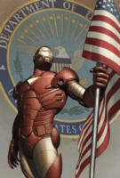  |
|Новый глава З.А.Щ.И.Т.Ы. внимательно относится к своему имиджу.    |

### Иллюминати

Тайная группа из шести наиболее могущественных созданий Земли: Профессор Икс,
Доктор Стрэндж, Мистер Фантастика, Железный человек, Намор и Черный Гром. В
этом не то тайном мировом правительстве, не то последнем мощном оплоте добра на
Земле представлены самые разные герои: полностью зависящий от своего костюма
Железный человек соседствует с волшебником, а мутант — с повелителем Атлантиды.
Впрочем, сообща эти герои действуют нечасто, и едва ли не единственный
достойный упоминания их поступок — изгнание с Земли совершенно съехавшего с
катушек Халка. Тот, впрочем, отсутствовал недолго и, вернувшись на родную
планету, горит желанием оторвать зарвавшимся Иллюминати головы. Этому и
посвящен очередной глобальный кроссовер World War Hulk, стартовавший летом 2007
года.

|   |
|---|
|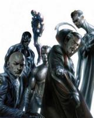  |
|Всесильные вершители судеб.    |

### Мстители

Команда с самой значительной текучкой кадров — по сути дела, даже не столько
команда, сколько легендарное название, которое носили многие группы героев. В
числе Мстителей успели перебывать почти все известнейшие персонажи вселенной
Marvel. Первым составом Мстители боролись на стороне бога Тора с покровителем
обмана Локи — и в дальнейшем героям, вставшим под знамена легендарной команды,
приходилось меряться силами исключительно с самыми могущественными злодеями.
Мстители — своего рода последний довод королей, которым создатели вселенной
Marvel отвечают на многочисленные угрозы миру.

Впрочем, и сами Мстители порой представляют для окружающих не меньшую
опасность, чем те, с кем призваны бороться. Именно раскол в их рядах привел к
Гражданской войне. В итоге образовалось сразу несколько групп, именующих себя
Мстителями. Одну из них, «официальную», возглавил Железный человек. В ряды
Тайных Мстителей, возглавляемых Люком Кейджем, вошли Человек-паук, Росомаха,
Доктор Стрэндж и еще несколько героев, не согласных с законом о регистрации
супергероев. В то же время правительством США запущена программа, которая
должна подготовить по команде героев для каждого штата — об этом рассказывает
новая серия комиксов Avengers: The Initiative.

|   |
|---|
|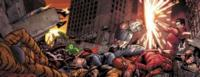    |
|В Гражданской войне Мстители оказались по разные стороны баррикад. |

### Фантастическая четверка

Зримое воплощение идеи о том, что спасение мира вполне может быть семейным
делом. Неудавшийся эксперимент превратил четверку друзей в сверхлюдей, которые,
в отличие от большинства коллег по цеху, и не думали скрываться под броскими
масками. Наоборот, вся четверка пользуется немалой известностью среди простых
людей — благодаря как своим подвигам, так и научным открытиям. Популяризация
научно-технического прогресса стала одной из главных тем комиксов о
Фантастической четверке. Недаром именно здесь впервые появились многие
«космические» персонажи вселенной Marvel, вроде Серебряного Серфера или
Галактуса. Другой особенностью команды стала необычайная стабильность: за
долгие годы существования лишь несколько раз кто-то из героев ненадолго покидал
четверку. Последняя ротация в составе произошла совсем недавно: после окончания
Гражданской войны рассорившиеся супруги Мистер Фантастика и Фантастическая
женщина ушли из группы, а их место заняли Черная Пантера и Буря.

|   |
|---|
|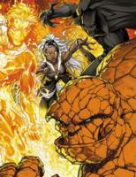   |
|Не удивляйтесь новым лицам: Рид и Сью временно покинули «Фантастическую четверку». |

### Люди Икс

Другое дело — знаменитая сборная хороших мутантов: тут что ни серия, так
абсолютно новый состав героев. В мутантах — людях с необычным кодом ДНК,
дарующим им особые способности, — на Земле-616 недостатка не наблюдается. Люди
Икс — лишь одно, самое известное объединение существ, которых многие считают
новым шагом в эволюции человека. Профессор Ксавьер создал школу для обучения и
поддержки мутантов, которых зачастую отвергает нетерпимое к любым отклонениям
человеческое общество. Основатель Людей Икс стремится научить своих подопечных
жить в гармонии с окружающим миром, но далеко не все мутанты разделяют его
взгляды. Нередко мутантам приходится вступать в сражения со своими собратьями,
также объединенными в команды.

|   |
|---|
|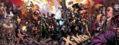  |
|Междусобойчик мутантов.    |

### Громовержцы

Самая молодая и необычная команда, набранная из бывших преступников. Изначально
была организована Бароном Земо с целью объединить силы и способности нескольких
злодеев, которые вскоре волей случая оказались в шкуре защитников добра и
справедливости. В итоге Громовержцы вынуждены постоянно идти по тончайшему
лезвию между добром и злом, что делает их одной из интереснейших и наиболее
неординарных команд во всей вселенной. Мало кто из Громовержцев полностью
отказался от старых привычек: многие из них с радостью приняли участие в охоте
на супергероев, отказавшихся пройти регистрацию в самом начале Гражданской
войны.

|   |
|---|
| |
|Повелевая ветрами.             |

### Суперзлодеи

Впрочем, грызня супергероев между собой — скорее исключение, чем правило.
Львиную долю своего времени защитники человечества уделяют прямым
обязанностям — борются с суперзлодеями. На рядовых преступников, пожалуй, не
разменивается никто, кроме Карателя. Почти у каждого героя или команды есть
свой набор антагонистов: Фантастическая четверка уже десятки лет противостоит
Доктору Думу, Железный человек борется с Мандарином, а тех, кто мечтает о
смерти Человека-паука, устанешь перечислять. И все-таки есть один преступник,
выделяющийся на общем фоне.

Как ни странно, Амбал не наделен какими-либо сверхчеловеческими способностями,
кроме разве что невероятной полноты. Да, он силен физически, но до того же
Халка ему далеко. Толстяк в белом костюме стал олицетворением организованной
преступности во вселенной Marvel, собирательным образом мафиози, который
благодаря уму и хитрости ставит себе на службу даже самых могущественных
суперзлодеев. Именно поэтому даже из тюрьмы, близкое знакомство с которой
Амбалу не раз обеспечивали супергерои, тот преспокойно держал руку на пульсе
преступной деятельности всего земного шара.

|   |
|---|
|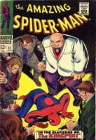                 |
|По иронии судьбы самый удачливый преступник Земли не обладает никакими суперсилами.    |

----

Вселенная Marvel давным-давно шагнула за пределы нашей планеты. По сравнению со
столкновениями сил галактического масштаба деяния Фантастической четверки или
Людей Икс выглядят беспомощным барахтаньем на маленьком комочке грязи, а
космические супергерои настолько же могущественнее земных, насколько те
превосходят обычных людей. И все-таки приключения Человека-паука, Росомахи,
Железного человека, Карателя приковывают внимание комиксов уже не один десяток
лет. И все потому, что они раз навсегда доказали: даже лопающийся от
сверхспособностей супергерой глубоко в душе остается простым человеком. А это
значит, что возможно и обратное: каждый из нас хотя бы раз в жизни способен
совершить поступок, достойный любого супергероя.
