## От рассвета до заката
# Эволюция вселенной Might & Magic

**Традиционно сложилось, что патриархами жанра компьютерных ролевых игр
считаются три сериала, появившиеся на сцене еще в восьмидесятые и с переменным
успехом дожившие до наших дней. Речь идет, конечно, о "Might&Magic", "Ultima"
и "Wizardry". Каждый из этих трех знаменитейших циклов, безусловно, оригинален
и самобытен, однако их объединяет одна общая черта: логичность и глубокая
проработка игровых миров.**

**Сегодняшний рассказ посвящен первой, великой и неповторимой вселенной "Меча и
Магии", эпический размах сюжета и идейная ненавязчивость которой навеки
закрепили ее в золотом фонде жанра.**

## Сначала было слово...

|   |
|---|
|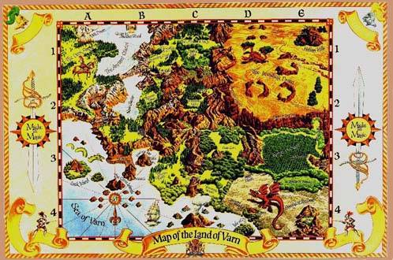                         |
|Варн. Мир, представленный в "Might & Magic I". |

В далеком 1987 малоизвестная компания New World Computing (NWC) представила
миру то, что впоследствии эволюционировало в один из наиболее удачных проектов
индустрии компьютерных игр, а именно первый том сериала "Might & Magic (M&M)",
названный "Secret of the Inner Sanctum". При разработке своего детища Джон Ван
Канегем, президент NWC, явно брал за основу систему "Advanced
Dungeons&Dragons", однако порядком видоизменил ее под компьютерную реализацию.

Сюжет игры совершенно не напрягал и не ограничивал игроков жесткими рамками. В
самом начале истории перед ними была поставлена цель: отыскать неизвестно где
сокрытое и овеянное легендами Святилище (Inner Sanctum), а там — будь что
будет... После чего команду героев выпускали на свободу, которой до самого
финала никто и ничто не угрожало. И топтали они ногами пыльные тропинки своего
родного мира — Варна, помогая нуждающимся да истребляя особо ретивые образцы
местной фауны. Так, всеми правдами и неправдами, персонажи добирались до
Святилища, где находили человека, сидящего за компьютером, который отправлял
зашедшую на огонек группу в новый мир.

Человек именовался Кроном и представлялся игрокам во втором томе серии "Gates
to Another World", вышедшем в свет в 1989 г. Технически игра смотрелась
несколько лучше предшественницы, блистая новомодной по тем временам
16-тицветной EGA графикой и слегка переработанным интерфейсом. Что же до
сюжетной линии...

Оказавшись в незнакомом мире, группа выходцев с Варна немедля решает
исследовать его вдоль и поперек. Что ж, в этом благом начинании им никто не
препятствует, вот только опасности, подстерегающие путников за крепкими стенами
немногочисленных городов, поистине неисчислимы.

|   |
|---|
|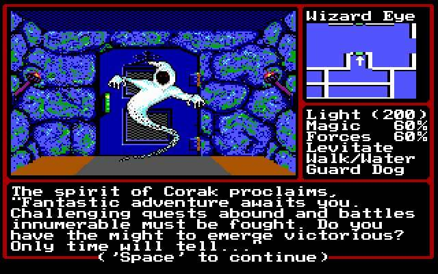                        |
|"Might & Magic II". Первая встреча с Кораком.  |

Сюжет несколько невнятно раскрывает личину главного злодея — некоего Шелтема,
его не менее таинственного противника — Корака, и кратко останавливается на их
извечном противостоянии. Во имя лишь одному ему ведомых причин Шелтем решает
покончить с Кроном как таковым. Для выполнения этой цели он пробирается в центр
управления этим планетоидом (!) и, поколдовав немного с центральным
компьютером, устанавливает конечную точку траектории полета — прямиком в
плазменное нутро ближайшей звезды. После чего спокойно ретируется через
звездные врата в пределы следующего мира — Терры, где, как несложно догадаться,
будут разворачиваться перипетии "Might & Magic III". К счастью, для
многострадальных жителей обреченного Крона все заканчивается благополучно:
вовремя подоспевшие герои аннулируют проложенный Шелтемом курс, в итоге чего
очередной мир спасен, добро торжествует, а персонажи проходят сквозь врата и
отправляются по следам злодея.

Следует отметить, что по окончании игры вопросов возникало куда больше, чем
было получено ответов в процессе. И в самом деле: ну кто такие эти Шелтем с
Кораком, что они умудрились не поделить и отчего столь истово ненавидят друг
друга? Что это за мир, имеющий рубку управления и летящий куда-то среди звезд?
Кто этот компьютерщик, охраняющий звездные врата? И, наконец, главный аспект,
применимый ко всей серии M&M в целом: почему игры, начинающиеся со стандартной
фэнтезийной фабулы, под конец переходят в жесткое sci-fi?.. Чувствовалось, что
открыты лишь мельчайшие частицы глобального замысла, что самое интересное еще
впереди...

Разработчики из NWC не обманули надежды: изданная в 1991 году третья часть
феноменальной серии — "Isles of Terra" — представляла, наконец, подоплеку
грандиозной Вселенной.

> ### "Меч и Магия" в романах
>
> Как и большинство вселенных, выросших из компьютерных игр, "Might & Magic"
> обзавелась собственным литературным фондом. Это, во-первых, дилогия Джерри
> Гравела (Geary Gravel) — "The Dreamwright" (1995) и "The Shadowsmith" (1996),
> во-вторых — книжица "The Sea of Mist" (2001) от Мел Одом. На русском языке
> эти опусы не издавались и, надо сказать, особой ценности для жанра не несут и
> близко. Так, стандартная героика, непонятно каким боком приставленная к
> "Might & Magic" за исключением брэнда на обложке...
>
> 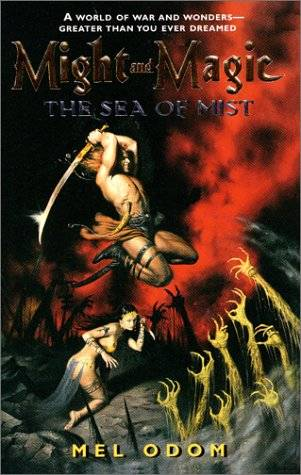

## Давным-давно в далекой галактике...

То была эпоха мира и процветания в Галактике — эпоха Древних. Старейшая
цивилизация многое перенесла на пути своего становления и развития, сумела
выжить и распространиться по многочисленным звездным системам известной
вселенной.

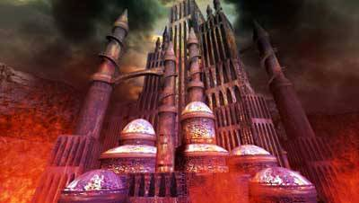

Порой для достижения отдаленных планет, пригодных для колонизации, добираться
приходилось не одно столетие, и на кораблях, посылаемых туда из Центра,
успевало смениться несколько поколений колонистов, прежде чем вожделенная цель
достигалась. Но что значит пара-тройка веков для Древних, возраст культуры
которых исчисляется тысячелетиями? И цивилизация Древних росла и ширилась,
вливая в себя все новые и новые миры, и струящиеся века отражали лишь
неизменность бытия.

Так продолжалось до тех пор, пока в одной из обширных туманностей Древние не
столкнулись с иным социумом, возраст которого не уступал их собственному, —
социумом Породителей. В своей основе цели соприкоснувшихся культур,
заключавшиеся в колонизации мириадов известных планет, совпадали, но вот
способы их реализации различались в корне. Если Древние никогда не ущемляли
интересы рас, желавших влиться в их ряды, то Породители жестоко и агрессивно
искореняли всех, посмевших встать у них на пути.

Так началась Великая Стихийная Война, когда армады ужасных, невероятных
существ, сотворенных Породителями при помощи Технологии Стихийной Манипуляции,
вторглись в пределы планетарных колоний Древних. В итоге Древним все же
удалось оттеснить противника за пределы своих владений, но практически все
планеты, лежавшие в зоне конфликта, оказались непригодны для дальнейшей
колонизации.

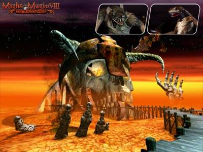

Стремясь как можно скорее восстановить равновесие сил, Древние запустили
проект, известный как Великий Эксперимент, идея которого заключалась в создании
искусственных экосистем на планетах, пострадавших во время Войны. Первичным
местом проведения его была избрана третья планета системы Миноса — Терра.
Столкновение цивилизаций полностью уничтожило коренную жизнь этого мира,
оставив после себя лишь небольшой вулканический остров посреди необъятного
океана, заполоненный выжившими демоническими отродьями Породителей.

Замысел Древних состоял в отправке на планету терраформных платформ, призванных
заново создать разрушенную экосистему, а уж после того, как эта часть
Эксперимента окажется завершенной, вновь колонизировать ее. В теории проект
выглядел вполне осуществляемым, но как было знать, чем все обернется на самом
деле?

Древними был создан Шелтем, киборг, Страж Терры, в обязанности коего входило
предотвращение всех нежелательных аномалий, могущих возникнуть в процессе
восстановления планеты. На стартовавшем из Центра гигантском космическом
корабле "Шикбат Зера", несущем на борту модули платформ, Шелтем отправился во
вверенный ему мир.

Текло время. Адаптация и развитие биосред, доставленных Шелтемом на Терру, шли
полным ходом. Казалось, Великий Эксперимент обречен на успех...

Толику хаоса в царствие порядка внесла ошибка, допущенная роботехниками при
разработке Стража. Искренне считая себя единственным и полноправным властелином
Терры, Шелтем пытался обойти встроенную директиву, предписывавшую ему слепо
следовать всем поступающим извне приказам Древних. И здесь — вопреки всему — он
добился успеха.

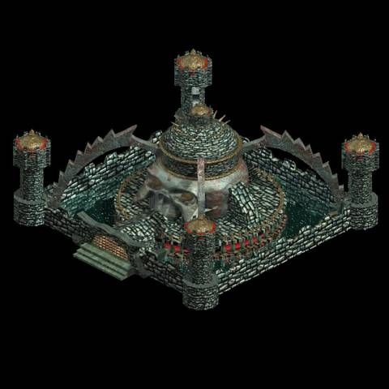

В Центре срочно создали нового киборга — Корака, первоочередной функцией
которого стало обезвреживание мятежной модели. Кроме того, подошло время
второго этапа Великого Эксперимента — попытки колонизации планет с
искусственной экосистемой. Для этого Древними в глубины космоса был запущен
Крон — огромный планетоид, на орбите которого находились Варны, небольшие
многофункциональные транспортники, населенные колонистами. Варны, как и сам
Крон, обладали собственными биосредами, искусственными солнцами — источниками
тепла и света. Назначение Крона состояло в посещении определенных звездных
систем, в каждой из которых он должен был оставить определенное количество
Варнов, впоследствии приземлявшихся на заданных планетах. Конечной точкой вояжа
планетоида значилась Терра, а на борту его находился Корак, который должен был
сместить мятежного Стража планеты.

Шелтема, естественно, такое развитие событий не устраивало, и вместо того,
чтобы дожидаться, когда делегация поселенцев Древних во главе с Кораком
нагрянет к нему в гости, он посредством звездных врат перенесся на один из
Варнов Крона, а оттуда — на сам планетоид, где и изменил курс оного, направив в
недра звезды...

Такова прелюдия к самому известному сериалу компьютерных RPG, сотворенная
гением Джона Ван Канегема. Как видите, завязка очень даже интригующая. Во что
же она вылилась в дальнейшем?

## Продолжение банкета

|   |
|---|
|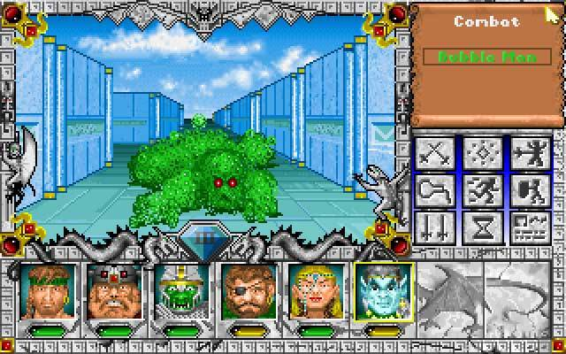    |
|"Might & Magic III". Порой на островах Терры встречается и такая экзотика. |

"Might & Magic III: Isles of Terra" стала первым томом "Трилогии Древних",
откровением, которого ожидали столь долго. Причинами тому явились и история
игровой вселенной, изложенная выше, и дальнейшее продвижение сюжетной линии,
уже куда более понятной игрокам.

"Трилогия", в которую вошли также четвертый и пятый тома цикла, "Clouds of
Xeen" и "The Darkside of Xeen", вышедшие в 1992 и 1993 годах соответственно,
повествовала о дальнейшем противостоянии Шелтема и Корака, завершившимся в
итоге их взаимоуничтожением. Многие и сейчас считают эти игры лучшими
компьютерными RPG, выходившими когда-либо под маркой M&M. Ибо здесь проявилось
все то, что принесло сериалу огромную популярность и народную любовь:
миловидная графика, динамичный игровой процесс, а также модифицированная
ролевая система. Сюжет двух последних частей "Трилогии" вращался вокруг Ксина —
искусственно созданного плоского мира, который по замыслу Древних должен был в
итоге обратиться в сфероид, что знаменовало бы окончание важного этапа в
Великом Эксперименте.

Первый виток развития вселенной подошел к логическому завершению. Да и год на
дворе стоял 1993 — время ухода с передовых позиций блиставшего некогда жанра
компьютерных ролевых игр ввиду перенасыщения рынка откровенно второсортными
поделками в этом ключе. Следующий продукт с гордым лейблом M&M появится еще ох
как нескоро...

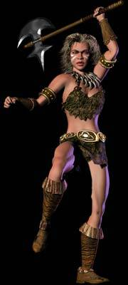

## Героический крах

Многое произошло в последующие годы. Следуя рыночным тенденциям, многие
небольшие компании-разработчики укрылись под широкими и надежными крыльями
монстров-издателей. Не обошла участь сия и NWC: в 1995 фирма становится
дочерним подразделением корпорации 3DO, навсегда расставшись с собственной
независимостью.

На рынке в то время бытовало засилье стратегических игр, и, следуя веяниям
моды, альянс 3DO/NWC внес свою посильную лепту в эту тенденцию.

Без преувеличения можно сказать, что знаменитый стратегический хит "Heroes of
Might & Magic (HoMM)", вышедший в 1995 и сразу же воссиявший в ореоле
заслуженной славы, явился, тем не менее, величайшим бедствием для Вселенной
"Меча и Магии". Решив вытащить на поверхность всех персонажей из ранних игр
серии M&M и ввергнуть их в единую баталию, разработчики тем самым откровенно
испортили всю стройную сюжетную линию. Конечно, явись игра своеобразным
ответвлением от серии, нареканий бы не возникло. Но нет же: за первыми
"Героями" следуют вторые ("Heroes of Might & Magic II"), продолжающие и
развивающие незнамо откуда вырезанный сюжетный огрызок. А чтобы окончательно
добить фанов Вселенной, за ним следует аддон ("Heroes of Might & Magic II: The
Price of Loyalty"), содержащий четыре небольших кампании, совершенно ничем не
связанных и даже не имевших собственного места в истории, начатой во второй
части.

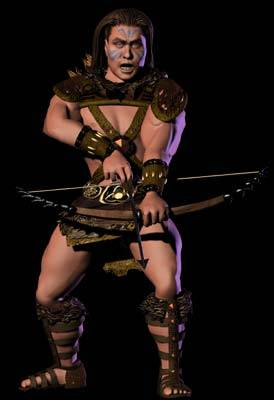 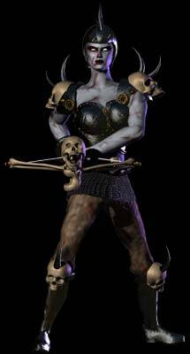

## Второе пришествие

|   |
|---|
|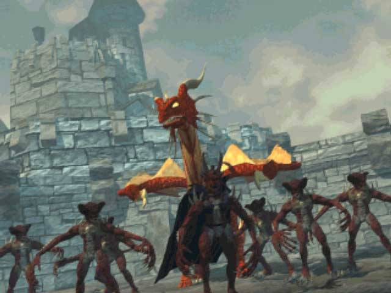                    |
|"Might & Magic VI". Вот они — кригане!..   |

Нанеся такой жесточайший удар по собственному детищу, разработчики
смилостивились и в следующем проекте — ролевке "Might & Magic VI: The Mandate
of Heaven" (1998) — сделали довольно-таки успешную попытку все расставить на
свои места.

С момента завершения перипетий M&M5 прошло более тысячелетия, и мир,
долгожданный мир снизошел на истерзанные давнишней Стихийной Войной планеты.
Колонии Древних, постоянно поддерживающие связь с Центром, процветали. Но
давние враги не забыли о своем поражении, имевшем место в давно минувшую эпоху.

|   |
|---|
|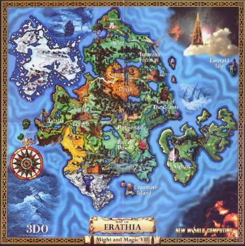                                                   |
|Антагарич, место действия наибольшего количества игр цикла "Might & Magic".    |

"Они пришли из Пустоты — древние враги древних людей". Такими словами
начиналась легенда, открывавшая новый виток развития Вселенной "Меча и Магии".
Они — демоны-кригане — атаковали отдаленные колонии Древних, неся с собою
гибель всему живому, ибо в этом состояла их суть. Были ли они тварями
Породителей или представителями совершенно иной цивилизации? Кто знает...
Вспыхнувший конфликт опустошил многие планеты, а кригане неистово поглощали все
доступные природные ресурсы, оставляя после себя лишь выжженные пустоши.
Узловые космические станции, обеспечивавшие связь колоний с Центром, оказались
уничтожены, что знаменовало наступление новой эры — Безмолвия...

Действие большинства последующих игр цикла разворачивается на планете Энрот,
также подвергшейся атаке криган. Данное "остепенение" послужило причиной
гораздо более детальной проработки персонажей и истории одного отдельно
взятого мира. Герои стали куда более яркими, события — досконально
прописанными, и в итоге притухший было интерес к серии вновь воспарил до небес.

Оно и не мудрено: M&M6 представляла игрокам все ту же потрясающую играбельность
старых томов серии, облаченную в сверкающую новизной оболочку. Красочный
движок, потрясающие саундтреки, детективный сюжет, закрученный вокруг
расследования деятельности таинственного жреческого культа Баа и в итоге
выводящий на первые признаки присутствия криган на планете.

|   |
|---|
|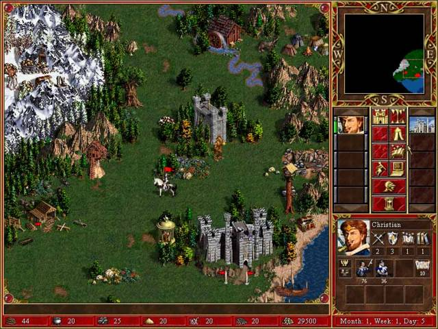                           |
|"Heroes of Might & Magic III". Волшебная Эратия... |

Интригующая история продолжилась в "Heroes of Might & Magic III: The
Restoration of Erathia" (1999). Действие перенеслось на иной континент Энрота —
Антагарич, на большей части которого вольготно раскинулось людское
королевство — Эратия. Окопавшиеся здесь кригане при поддержке местных сил тьмы
и прочих криминальных структур взялись за дело всерьез, организовав
широкомасштабную атаку на Эратию и прилежащие к ней вотчины эльфов и гномов.

Вообще HM&M3, благодаря отлично сбалансированному стратегическому элементу, по
праву считается лучшей из "героической" серии и одной из интереснейших игр всех
времен. Серия вновь вскарабкалась на пик популярности, и 3DO, почувствовав это,
принялась "ковать железо, пока горячо".

Так, в следующем году свет увидела седьмая часть хроники — "Might & Magic VII:
For Blood & Honor", эксплуатировавшая движок от "Небесного Мандата" и
повествовавшая о деяниях, имевших место в Эратии сразу после окончания недавних
баталий. На сцену вновь выводились наши герои, вынесшие все испытания на
Варне/Кроне/Терре и успешно затерявшиеся после этого... Точнее, нет:
помотавшись по космосу в поисках Древних и так оных не обнаружив, бравая
команда примчалась на Энрот, проведав, что где-то здесь находятся сокрытые
звездные врата, через которые можно попасть в Центр сгинувшей цивилизации.

Вот оно то, чего так долго жаждали истинные фанаты серии — крепкой привязки к
начальным томам цикла. Доказательства, что они не забыты, и все окажется
гораздо глубже и увлекательнее. И они это получили!

## Больше... больше... больше!!!

Почувствовав небывалый прилив энергии и денег, альянс 3DO/NWC с плодовитостью
аргентинских кроликов начал творить... Хотя нет, скорее — штамповать. В скором
времени свет увидел первый аддон к HoMM3 — "Armaggeddon’s Blade" (1999),
заключавший в себе, тем не менее, интереснейшие кампании, сводившие в итоге на
"нет" популяцию криган на Энроте.

Второй аддон — "The Shadow of Death" (2000) — повествовал о хитроумной интриге,
приведшей в свое время к Войнам Восстановления Эратии, отразившихся в
оригинальных третьих "Героях".

> Над оформлением коробок шестой, седьмой и восьмой частей "Might & Magic"
> потрудился сам Ларри Элмор.
>
> 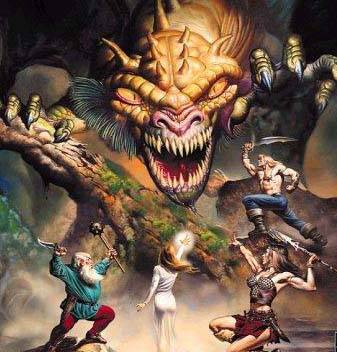 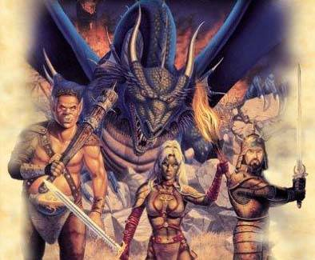 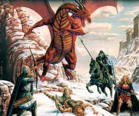

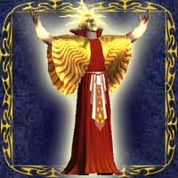

Решив, что и этого мало, на изрядно устаревшем к тому времени движке компания
выпустила "Might & Magic VIII: Day of the Destroyer". Тут стали проявляться
пугающие тенденции: в кои-то веки игроки увидели совершенно несбалансированную
игру, чего за NWC раньше не водилось. Действие развивалось на третьем
континенте Энрота — Жадаме, куда залетел кибернетический посланец Древних, он
же Разрушитель, всерьез вознамерившийся уничтожить мир ввиду отслеженного здесь
присутствия криган. Последних, правда, давно уж повывели в ходе победоносных
кампаний "Клинка Армагеддона", чего наш киборг, естественно, не знал...
Достаточно простенький сюжетец, смесь идей, понадерганных из предыдущих игр
серии да совершеннейший дисбаланс отпугнули от игры слишком многих. Фанаты,
конечно, предложенное, скрипя зубами, прожевали, но от добавки решительно
отказались.

Но зарвавшихся 3DO/NWC было уже не остановить. В кратчайшие сроки из-под их
пера выходит аж восемь частей цикла "Heroes Chronicles" (шес ть — коммерческих,
две — свободно скачиваемых из интернета). Каждая из этих поделок (или —
подделок?) — коротенькая игрушка на движке HoMM3, затыкающая пробелы в истории
Энрота. Довольно увлекательно, конечно, но откровеннейшая халтура в плане
реализации.

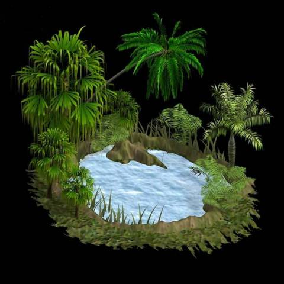

Дальше — больше. Следуя популярному и поныне лозунгу "привлечения поклонников
иных жанров в рамки раскрученной вселенной", на свет появляется нечто под
названием "Crusaders of Might & Magic" с жанровой принадлежностью Action/RPG. В
итоге видны лишь базовые элементы и того, и другого. Откровенно слабая игра,
эксплуатирующая новый мир — Ардон, никаким боком ко Вселенной M&M не
привязанный. Сиквел "Warriors of Might & Magic", изданный лишь на консолях
(PS2, PSX, Gameboy), и того "краше": элементы ролеплея деградировали до
недосягаемого прежде уровня, а вся суть игры сводилась к путешествиям по
длинным прямым подземным коридорам, забиванию подручными средствами всякой
нечисти да собиранию больших красивых алмазов в духе аркад восьмидесятых.

Третий "хит" той же оперы — "Legends of Might & Magic" — помянем лишь для
полноты картины: бездарный deathmatch с брэндом "Might & Magic" вряд ли был
способен растопить ожесточившиеся после подобного издевательства сердца
фанатов. В довершение ко всему, разбушевавшаяся 3DO анонсировала было "Dragon
Wars of Might & Magic", где игроку предлагалось отыгрывать роль дракона,
порабощенного орками (!), но вовремя одумалась. Проект был переименован в
"Dragon Rage" и не имел никакого отношения к и так уже трещащей по всем швам
Вселенной.

## Последний вздох

|   |
|---|
|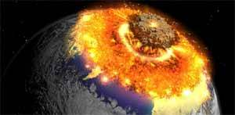                            |
|Разрушая, созидаем: гибель многострадального Энрота.   |

Осознав наконец, что в погоне за долларом они сами себя загнали в угол,
разработчики, недолго думая, порешили свести всю галактику "Меча и Магии" в
первичную материальную точку и начать все вновь, с чистого листа.

Так миру является "Heroes of Might & Magic IV", в заставочном ролике которого
Энрот, регулярно спасаемый нами на протяжении семи лет, взрывается ко всем
чертям, и действие последующих игр цикла переносится в новый мир — Аксеот.
Можно с уверенностью сказать, что кампании HM&M4 являются наиболее
проработанными и захватывающими во всей "героической" серии. Несмотря на явные
огрехи в геймплее, игра получилась если не хитом, то вполне себе на уровне.

|   |
|---|
|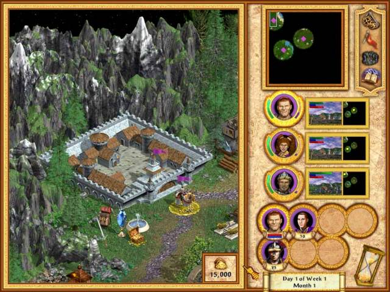                                               |
|"Heroes of Might & Magic VI". Аксеот. Новый мир со старыми героями.    |

Параллельно с оной выходит "Might & Magic IX: Writ of Fate", выполненная в
антураже скандинавских мифов и переносящая игрока на иной континент Аксеота.
Спорный проект: страшненькая графика, уклон в сторону 3D-Action, явное
заимствование многих сюжетных моментов из предыдущего, восьмого тома. Но
откровенным просчетом явилось введение целого пантеона пронордических богов.
Где в высокотехнологической Вселенной M&M может приткнуться хоть одно, даже
самое завалящее божество? В девятой части появилась целая ватага богов, и ни
единого упоминания о Древних, чего не было ни в одной из прежних ролевок под
брэндом "Might & Magic". Добро пожаловать в новую Вселенную, господа!..

Дальше — хуже (хотя хуже уже некуда). Тяжелейший финансовый кризис, в котором
оказывается 3DO, заставляет ее выпустить две слабые низкобюджетные игры —
аддоны к HoMM4 "The Gathering Storm" и "Winds of War". Примитивные сюжетные
линии обоих не пересекаются ни между собой, ни с двумя предыдущими поделками,
представляющими мир Аксеота. Продюсеры серии пообещали, правда, в дальнейшем
связать воедино все нити истории, но шанса исполнить сие им так и не
представилось.

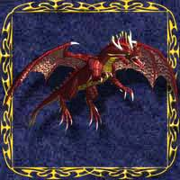 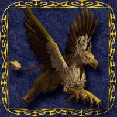

## Пока живет надежда...

Весной 2003 корпорация 3DO приказала долго жить, а все издаваемые ею брэнды
пошли с молотка. Вселенная M&M досталась французскому издателю Ubi Soft, на
ниве ролевых игр отметившемуся разве что провальным "Pool of Radiance: Ruins of
Myth Drannor", а стратегических — вполне достойной серией "Warlords".

Что же ожидает великую некогда вселенную, так деградировавшую в результате
бездарной маркетинговой политики 3DO? Кто знает... Известно лишь, что в недрах
Ubi Soft уже начата и идет полным ходом разработка "Heroes of Might & Magic V".
Кроме того, продюсер проекта — Фабрис Камбунэ — с уверенностью заявил и о
продолжении ролевой линейки серии. Есть от чего проникнуться надеждой и с
нетерпением ждать официальных пресс-релизов.

> Разработчики собираются сделать "Heroes of Might & Magic V" в полном 3D.
> Учитывая, что игра находится на самой ранней части разработки, гадать, как
> она будет выглядеть, можно лишь по первым и весьма немногочисленным
> наброскам.
>
> 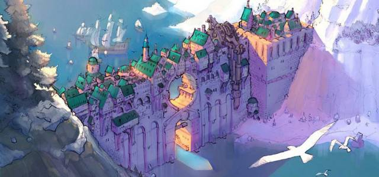 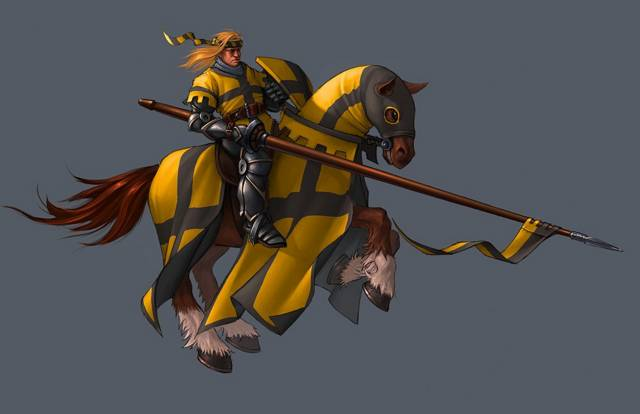 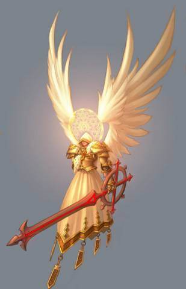

----

Конечно, пока мы не узрим воочию готовый продукт, сомнения будут продолжать
терзать наши несчастные души. Удастся ли Ubi Soft выдержать неповторимую
атмосферу вселенной "Меча и Магии"? А сохранить ее сюжетную канву? Окажутся ли
привлеченными к разработке бывшие сотрудники NWC, в том числе и сам Джон Ван
Канегем? Время все расставит на свои места, а пока нам остается лишь мечтать,
вспоминая славные деньки, проведенные на Энроте, Терре и Ксине, — и надеяться!
