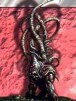

## Король сверхественого ужаса
# Г. Ф. Лавкрафт и его вселенная

|               |                                                               |
|---------------|---------------------------------------------------------------|
|Возникновение: |1920-е годы новой эры нашего мира                              |
|Создатели:     |Говард Филлипс Лавкрафт и последователи                        |
|Происхождение: |художественная литература                                      |
|Воплощения:    |графика, кино, ролевые, карточные и компьютерные игры, музыка  |

Если вдуматься, у Говарда Филлипса Лавкрафта была банальная для одаренных людей
судьба. Неизвестность и бедность при жизни, ранняя — не сказать
“безвременная” — кончина, и сверхъестественная популярность уже после смерти и
вплоть до наших дней. В этом мне видится вполне закономерная гримаса судьбы:
король сверхъестественного ужаса не мог прожить благополучную долгую жизнь
обывателя, раздавая автографы направо и налево и еженедельно выступая по радио.

|   |
|---|
|     |
|Г. Ф. Л. собственной персоною. |

На непродолжительную жизнь Лавкрафта (1890-1937) пришлось одно из самых
страшных потрясений Нового времени — Первая мировая война. Эта бойня не могла
не отразиться на творчестве Лавкрафта, осмыслившем закат рода человеческого
через призму сверхъестественного ужаса. Да и всей культуре был нанесен огромной
силы удар: еще за пару лет до начала самой кровавой из войн никто и представить
не мог, что подобное возможно. Теперь ужас стал реальностью — и потребовал
художественного осмысления.

Впрочем, неправильно было бы связывать феномен Лавкрафта исключительно с первой
мировой. Болезненное детство, замкнутость, огромная дедовская библиотека,
феноменальная память, увлечение наукой, сумасшествие родителей, потеря немногих
близких — все это постепенно сделало из “юноши бледного” короля
сверхъестественного ужаса. Он вырос на “Тысяче и одной ночи”, рассказах Эдгара
По и романах Герберта Уэллса — характерные для этих книг мотивы можно без труда
найти в его рассказах. Безусловный патриот Новой Англии, он располагал действие
своих сюжетов в знакомых с детства декорациях. Ксенофобия, нормальная для того
времени, претворилась у Лавкрафта в размышления о деградации человека и
человечества, в образы угрожающих людской цивилизации звездных пришельцев...
Впрочем, рассуждать о личности Лавкрафта, его творческом пути и значении его
наследия для мировой литературы можно бесконечно долго — и лучше оставить это
занятие ученым критикам. А мы зададимся скромной целью посмотреть, что же
такого сделал Говард Филлипс для фантастических миров и развития готического
жанра.

|   |
|---|
|    |
|В Провиденсе Лавкрафт родился и провел почти всю свою жизнь.   |

## ЗАРОЖДЕНИЕ ВСЕЛЕННОЙ

На ранних рассказах Лавкрафта лежит заметная печать подражания — Эдгару По,
Герберту Уэллсу, Конану Дойлю, “Тысяче и одной ночи”; уже в зрелом возрасте
писатель работал под ощутимым влиянием лорда Дансени. Как бы то ни было, именно
тогда начинается мир Лавкрафта. Первые упоминания о “Некрономиконе”, зачатки
мифологии, проработка стиля и “декораций” — не говоря уже о развитии общих для
писателя тем. Впрочем, некоторые ранние рассказы несколько выбиваются из общего
ряда произведений, что говорит о творческих исканиях писателя. Наиболее
характерный пример — почти научно-фантастический “Лабиринт Эрикса”, действие
которого происходит на Венере.

Строго говоря, вселенная Лавкрафта — понятие весьма относительное. Сам демиург,
несомненно, представлял общую картину описываемого им мира, однако в каждом
рассказе или повести раскрывал ее только с одной стороны. Поэтому исследователи
воздерживаются от строгой классификации лавкрафтовского творчества на отдельные
миры или циклы. Вместе с тем, во многих произведениях присутствуют сквозные
образы и иногда персонажи, не говоря уже о тематической общности. Все это
позволило ученикам писателя выделить вселенную Лавкрафта — она получила
название Мифос (Mythos). Благодаря стараниям тех же учеников Мифос стал
межавторским; также к нему относят произведения, написанные Лавкрафтом в
соавторстве.

|   |
|---|
|    |
|Действие многих рассказов Г. Ф. Л. разворачивается в забытых подземельях.  |

|   |
|---|
|    |
|Найдите в этом идиллическом пейзаже три лишних детали. |

## КОСМОЛОГИЯ

|   |
|---|
|  |
|Сумасшествие — самая гуманная расплата за знание.  |

Отличие Мифоса от большей части долавкрафтовской готики — в фундаментальной
концепции мира. Рассказы Лавкрафта представляют собой сверхъестественное
сплетение хоррора и фантастики, вызывающее в памяти не “Дракулу” с
“Франкенштейном”, а скорее “Войну миров” Уэллса. Человечество не одиноко во
Вселенной; более того, даже на нашей маленькой планете оно стало доминирующим
видом по чистой случайности, и его благополучие находится под постоянной
угрозой. У Лавкрафта, пожалуй, впервые возникает ужас космический,
перед которым бессильны земная наука и религия. А попытки человека познать
истинную природу мира или даже противодействовать зловещим силам, скрывающимся
за кулисами, в большинстве своем заканчиваются трагически. Даже если он и
сохранит земную жизнь и неомраченный разум, этот мир уже никогда не будет для
него относительно безопасным, привычным и познаваемым.

|   |
|---|
|   |
|Однажды Ктулху чуть не вырвался из своего заключения.      |

Итак, какова же эта жестокая правда, которую мы узнаем из рассказов Лавкрафт
ценой нескольких десятков убитых, пропавших без вести или сошедших с ума
главных героев? Во вселенной есть существа, способные перемещаться в
космическом пространстве и колонизировать различные планеты. В разные периоды
своей истории Земля была пристанищем нескольких видов таких существ: в
человеческую эпоху одни уже вымерли, другие выжидают своего часа, третьи
продолжают скрываться в труднодоступных уголках мира.

|   |
|---|
|    |
|Крылатые ми-го похищают людей и заключают их мозг в специальные сосуды.    |

Из межзвездных путешественников наиболее известна, пожалуй, раса Ктулху,
прилетевшая на Землю сотни миллионов лет тому назад. Эти существа вечны, но их
жизненный цикл сильно зависит от положения звезд: в определенные периоды
(которые могут длиться тысячелетиями) они впадают в состояние “не-жизни”. Это и
случилось на Земле: закрывшись в своем городе Р’лайх, раса Ктулху “заснула”,
продолжая при этом телепатически общаться с людьми. Древние люди считали Ктулху
божеством, и по Земле расплодились мистические культы, целью которых было
подготовить планету к возвращению Ктулху, “когда звезды займут верное
положение”. Р’лайх погрузился в океан, и телепатическая связь прервалась, но
зловещие культы сохранились. И, хотя однажды — по чистой случайности — угрозу
Ктулху удалось на время отвести, его преданные культисты встанут на пути
любого, кто захочет познать истину.

Другая раса, представляющая непосредственную угрозу для человечества, —
крылатые ми-го. На Земле имеется несколько колоний этих созданий, занимающихся
по большей части горной добычей. О существовании ми-го знают немногие, и
большинство из них — союзники и агенты пришельцев. Ми-го стоят на высокой
ступени технического развития. Они создали специальные устройства, позволяющие
отделить человеческий мозг от тела и отправить его в космическое путешествие:
подобной перспективой они прельщают пытливые умы, слишком много узнавшие об их
присутствии.

|   |
|---|
|    |
|Никто не знает, как пошла бы земная история, доживи старцы до наших дней.  |

В далекой-далекой древности на землю прилетели так называемые старцы. Они
воздвигли громадные города, воевали с расой Ктулху и ми-го, а также создали в
качестве слуг шогготов, представлявших собой бесформенные сгустки биомассы. От
шогготов впоследствии произошли все высшие формы земной жизни, в том числе и
человек (теперь понятно, какое место отведено в Мифосе нам с вами). К счастью
или к сожалению, старцы не дожили до наших дней: первым ударом стало восстание
шогготов, последним — очередное оледенение.

Довольно интересна Великая раса, у которой нет постоянного физического
воплощения. Ее представители способны перемещать свой разум не только в
пространстве, но и во времени. Поэтому они вечно странствуют по галактике,
вселяясь в тела разумных и не очень существ. Одержимость Великой расы — знания,
которые они собирают, временно засылая своих разведчиков во все миры и времена,
в том числе и на сегодняшнюю Землю.

|   |
|---|
|   |
|Тела этих конусообразных существ на долгое время стали вместилищем разума Великой расы.    |

Фактически в каждом третьем рассказе зрелого Лавкрафта описывается та или иная
нечеловеческая раса. Глубоководные, оборотни, зомби — кто-то из них может
показаться знакомым, но в рамках космического ужаса эти существа приобретают
совершенно иную, по-новому зловещую окраску.

## География

В качестве “человеческой” базы для своих рассказов Лавкрафт часто использовал
выдуманный им самим уголок штата Массачусетс, получивший название “страны
Лавкрафта” (Lovecraft country). Страна Лавкрафта расположена в Новой Англии —
на родине писателя, в самом “историческом” районе Северной Америки. Именно сюда
приплывали первые голландские и британские поселенцы, именно здесь зародились
США. И здесь, среди неоготических церквей и домов в колониальном стиле,
наиболее древних американских родов и деградировавших обитателей глубинки,
древних индейских мифов и воспоминаний о ведьмовских процессах, разворачиваются
жуткие события.

|   |
|---|
|                  |
|Бессмертные обитатели океанских глубин.    |

Центр страны Лавкрафта — городок Аркхем, расположенный на берегах реки
Мискатоник. Он известен своим университетом, где хранится значительное
количество оккультной литературы, в том числе копия знаменитого
“Некрономикона”. Кроме того, в период охоты на ведьм Аркхем стал прибежищем
нескольких преследуемых, бежавших из соседнего Салема. Недалеко расположен
Кингспорт, появляющийся в нескольких рассказах. На океанском побережье стоит
зловещий Иннсмут, жители которого в прошлом столетии заключили сделку с расой
глубоководных, и теперь в большинстве своем — уродливые полукровки. К западу от
Аркхема расположено окруженное мистическими монолитами селение Данвич, некогда
ставшее жертвой выращенного местным культистом чудовища. А дальше в горах
находится одна из колоний ми-го.

Гораздо реже Лавкрафт помещает действие своих рассказов в другие места земного
шара, иногда объясняя их экспедициями Мискатоникского университета. Герои
писателя попадают в Антарктиду, Австралию, Париж, Великобританию, на Аравийский
полуостров. Особняком стоит так называемая страна снов (Dreamlands),
напоминающая мистические фантазии лорда Дансени. Здесь нет ничего земного —
разве что отдельные персонажи. Наиболее частый гость страны снов — американец
Рэндольф Картер, центральная фигура нескольких произведений Лавкрафта (что само
по себе — большая редкость). Страна снов — красивый, таинственный и вместе с
тем чужой и опасный мир, заслуживающий отдельного обзора. Впрочем, не думаю,
что описать его у кого-нибудь получится лучше, чем сделал это сам Лавкрафт.

|   |
|---|
|    |
|Добро пожаловать в Аркхем. |

## БИБЛИОТЕКА

Пусть ценой тысяч рассудков, смертей и прозрений, но люди постепенно узнают
правду о Мифосе. Это знание, искаженное, иносказательное и вместе с тем
содержащее зерно истины, накапливается в оккультных книгах — некоторые из них
действительно существуют в нашем мире, другие придуманы самим Лавкрафтом и
соратниками. Наиболее известен “Аль-Азиф”, в греческом переводе “Некрономикон”,
написанный безумным арабом Абдуллой Аль-Хазредом. Оригинал и греческий перевод
считаются утерянными; от латинской версии, почти полностью уничтоженной
христианской церковью, сохранилось несколько экземпляров. “Некрономикон”,
содержащий основные знания о Мифосе, появляется в целом ряде произведений
Лавкрафта и стал своеобразной визитной карточкой писателя. Среди других
вымышленных книг стоит назвать Пнакотикские рукописи, возможно, нечеловеческого
происхождения, и “Безымянные культы” Вильгельма фон Юнцта. Вообще же оккультная
библиотека Мифоса начитывает десятки томов — от продающихся в любом книжном
магазине “Ключиков Соломона” до разваливающихся манускриптов. И каждый из них,
попав в руки одержимого культиста, может стать еще одним источником опасности в
и так неспокойном Мифосе.

|   |
|---|
|    |	
|Dark Young, демоническое порождение неземной магии и человеческого безумия.    |

|   |   |
|---|---|
|29 Kb	27 Kb
Зловещие культы веками ожидают правильного положения звезд.

> ## До Лавкрафта
>
> |   |
> |---|
> |5 Kb
> Хорас Уолпол
>
> Лавкрафт, будучи всесторонне связанным с литературой человеком, облегчил
> работу своих будущих исследователей, пытающихся выделить истоки его
> творчества. В 1927 году он написал эссе “Сверхъестественный ужас в
> литературе”, в котором проследил развитие жанра до первой четверти XX века и
> выделил наиболее значимых, на свой взгляд, писателей-предшественников.
> Несмотря на то, что текст местами довольно субъективен, он остается одной из
> лучших подобных работ.
>
> Древний мир, Средневековье, Возрождение не могут похвастаться полноценной
> литературой ужасов, однако именно тогда формируются основные образы и сюжеты,
> нашедшие отражение в последующие века. Отдельные фрагменты дошедших до нас
> книг говорят, что уже тогда страх занимал значительное место в человеческой
> культуре. Точнее говоря, он никуда не исчезал — с первобытных времен.
>
> Готический роман, появившийся в середине XVIII века, стал культурной реакцией
> на Просвещение — низвергнувшее Бога и направившее Европу по “столбовой дороге
> научно-технического прогресса”. Основателем жанра считается англичанин Хорас
> Уолпол, большой любитель мистики и средневековья. Его “Замок Отранто” не
> отличался занимательностью сюжета или блестящим стилем, однако стал
> бестселлером — настолько истосковалась публика по ужасам. Настоящим взлетом
> готического романа стало творчество Анны Радклифф. Она вносила в готический
> антураж ощущение сверхъестественного, рисовала великолепные картины природы,
> внушала читателю настоящий ужас — и, по мнению Лавркафта, портила в конце все
> впечатление, объясняя “сверхъестественное” вполне материальными причинами.
> Две другие вершины готического романа — Мэтью Льюис (“Монах”) и Чарлз
> Метьюрин (“Мельмот-скиталец”). Помимо обязательных для жанра подземелий, тайн
> и Инквизиции, в них присутствуют вполне сверхъестественные козни Дьявола.
> Впрочем, все эти сюжеты остаются в рамках христианской традиции. А вот Мэри
> Шелли в своем “Франкенштейне” делает настоящий прорыв, сплавляя воедино
> древний ужас и современную науку.
>
> |   |
> |---|
> |11 Kb	12 Kb	21 Kb|
> Анна Радклифф
>
> Мэри Шелли
>
> Эдгар Аллан По
>
> Основоположником современной литературы ужасов стал Эдгар Аллан По, которого
> Лавкрафт считал одним из своих учителей. Главную заслугу По Лавкрафт видел в
> отказе от литературных стереотипов — счастливого конца, победы добра,
> морализаторства. По описывает сверхъестественное беспристрастно, так, как
> если бы это было реальностью, предоставляя читателю самому делать выводы. У
> По мы впервые встречаем многие темы и приемы, впоследствии усвоенные и
> развитые Лавкрафтом, а также другими американскими писателями XIX-XX вв.
>
> Что же касается Великобритании, то Лавкрафт признает популярность Брэма
> Стокера с его “Дракулой”, однако отказывает ему в стилистическом мастерстве.
> Гораздо более литературны “Странная история доктора Джекилла и мистера Хайда”
> Р. Л. Стивенсона и “Потрет Дориана Грея” Оскара Уайльда. Из современных ему
> авторов Лавкрафт особо выделяет малоизвестного сейчас Артура Мэйчена и,
> разумеется, лорда Дансени.

----

Говард Филлипс Лавкрафт поднял литературу сверхъестественного ужаса на новую
ступень. Он показал, что развитие науки и технический прогресс не только не
делают человечество защищеннее, но приближают его к гибели от непознаваемого.
Творчество Лавкрафта, пусть и не признанное при жизни писателя, дало рождение
космическому ужасу, последующими воплощениями которого стали “Чужой” и
“Секретные материалы”, не говоря уже о многочисленных литературных подражаниях,
экранизациях и играх “по мотивам”. Возможно, когда-нибудь мы перерастем
космический ужас, как переросли готический роман. Но тогда — звезды снова
займут правильное положение, и из океанских глубин поднимется неземной Р’лайх,
и появится новый Лавкрафт, и страх будет вечным.
