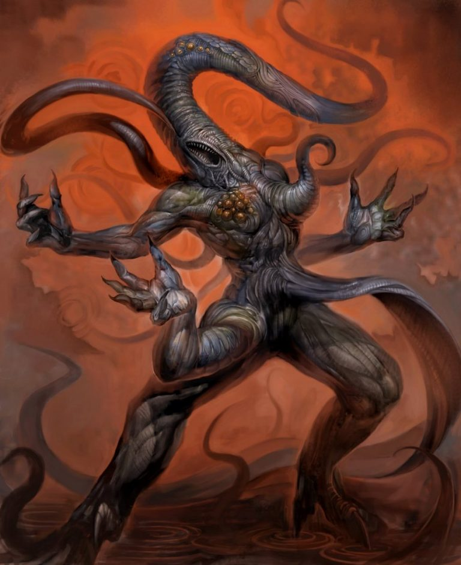
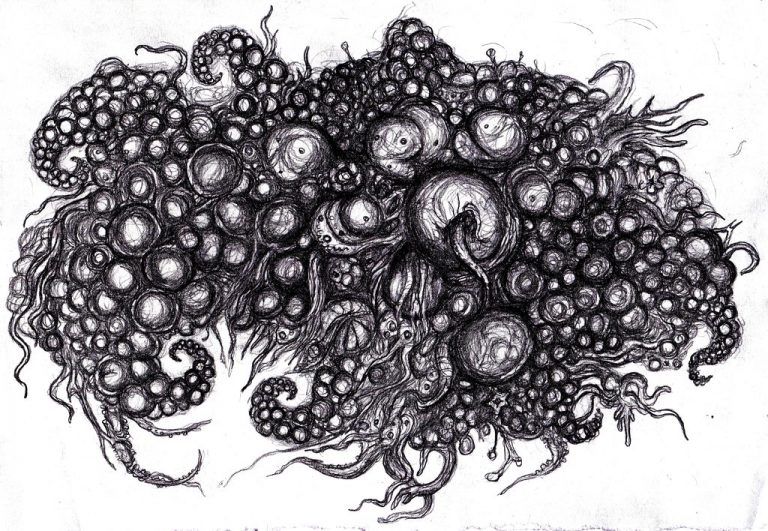

# Внешние боги

Не будем подробно останавливаться на существах, называемых в мифах Great Ones
(Великие). Они живут в особом мире — Dreamlands, и гораздо более слабы (в
магическом плане), нежели Древние или Старшие боги. Их интеллектуальные
способности также оставляют желать лучшего.

Гораздо более интересны **Внешние боги** (Outer Gods). В отличие от других, они
представляют из себя не конкретных существ, а, скорее, всеобщие принципы бытия.
Именно поэтому их сила не имеет физических границ.

**Абхот** (Abhoth) — Источник нечистоты. Живет в подземном царстве Н’Кай
(N’kai) и предстает перед людьми, как отвратительная серая масса живой плоти.
Из нее рождаются различные чудовища, но Абхот выпускает щупальца, хватает своих
детей и пожирает их. Этот бог циничен, зол и безумен. Он обладает сильными
телепатическими способностями, позволяющими ему общаться с окружающими.

> Демон Jubilex из ролевой игры “Dungeons and Dragons”, вероятнее всего, был
> списан с ктхулхианского бога Абхота.

**Азатот** (Azathoth) — Султан демонов, Кипящий ядерный хаос. Этот бог стоит во
главе пантеона мифов Ктулху. Лавкрафт подробно описывает его в романе
«Сомнамбулический поиск неведомого Кадата», повестях «Сны в ведьмином доме» и
«Шепчущий в ночи». Если верить автору, Азатот — слепой бог-идиот, не имеющий
конкретной физической формы (хотя он может воплощаться в существо Xada-Ngla).

|                                               |                                           |
|-----------------------------------------------|-------------------------------------------|
|  |                 |
|Азатот, художник Мика Стоун                    |Азатот глазами художника Анджела Ортеги.   |

Термин «ядерный» применялся Лавкрафтом для обозначения центральной роли Азатота
в нашем мироздании, а не ради намека на его радиоактивность. Этому богу может
поклоняться только сумасшедший — фактически так оно и есть, ведь немногие
смельчаки, отважившиеся избрать его своим покровителем, расплачивались за это
разумом, телом и душой.

**Ньярлатхотеп** (Nyarlathotep) — Ползучий хаос, Посланец Азатота, Черный
человек. Это божество очень сильно отличается от своих собратьев. В отличие от
Хастура, живущего на звездах, или Ктулху, спящего в морской глубине,
Ньярлатхотеп полон жизни и активно вмешивается в судьбу мироздания. Его
излюбленная внешность — высокий человек с темными волосами и хорошим чувством
юмора. Он говорит на обычном человеческом языке, не имеет своего культа и
служит посланником Азатота, реализуя его волю на Земле.

Ньярлатхотепа часто ассоциируют с древнеегипетским богом Сетом, а также
ацтекскими божествами: Тецкатлипокой («дымящееся зеркало») и Ксайп Тотеком
(«человеком без кожи»).

|                                                   |                                               |
|---------------------------------------------------|-----------------------------------------------|
|   |                     |
|Ньярлатхотеп, художник Douzen                      |Нъярлатотеп глазами художника Анджела Ортеги.  |

**Шаб-Ниггурат** (Shub-Niggurath) — Черный козел из лесов с тысячью молодых.
Как таковое, это чудовище в романах Лавкрафта не встречалось, однако его имя
можно было встретить в нескольких заклинаниях (Ia! Shub-Niggurath) — см.
«Шепоты во мраке», «Сны в ведьмином доме», «Кошмар в музее». Внешне это
существо выглядит как огромная бесформенная масса, усеянная щупальцами,
слюнявыми ртами — и все это передвигается на кривых козлиных ногах.

|                                                               |                                                                                           |                                                                                           |
|---------------------------------------------------------------|-------------------------------------------------------------------------------------------|-------------------------------------------------------------------------------------------|
|  |                                                           |                     | 
|Шуб-Ниггурат, рис. Khannea Suntzu                              |Классический Шаб- Ниггурат совсем не похож на того спрута, которого мы видели в «Quake I». |Шаб-Ниггурат глазами художника Анджела Ортеги. |

**Йог-Сотот** (Yog-Sothoth) — Все в одном; Тот, кто извне; Тот, кто откроет
Путь. Лучше всего об этом божестве сказал сам Лавкрафт:

> Безграничное Бытие воплощало Все-в-одном и Одно-во-всем, о котором ему
> поведали волны. Оно заключало в себе не только время и пространство, но и
> весь универсум с его безмерным размахом, не знающим пределов, и превосходящим
> любые фантазии и расчеты математиков и астрономов. Возможно, в древности
> жрецы тайных культов называли его Йог-Сототом и шепотом передавали из уст в
> уста это имя, а похожим на раков инопланетянам с Юггота он был известен как
> Находящийся-за-краем. Его летучих вестников со спиралевидными мозгами
> узнавали по непереводимому знаку, но Картер понимал, сколь относительны и
> неточны все эти определения.
>
> **Г. Ф. Лавкрафт, «Врата серебряного ключа»**

|                                                                                                   |                                               |
|---------------------------------------------------------------------------------------------------|-----------------------------------------------|
|  |                     | 
|Йог-Сотот                                                                                          |Йог-Сотот глазами художника Анджела Ортеги.    |

Кроме уже перечисленных, мифы Ктулху изредка упоминают и других Внешних богов:
Даолот (Daoloth), Грот (Groth), Гидра (Hydra), Мландот (Mlandoth), Тулзуча
(Tulzuscha), Уббо-Сатхла (Ubo-Sathla), Вордавосс (Vordavoss) и Ксиурн (Xiurhn).
