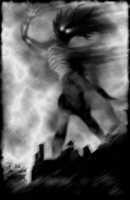

# Древние

**Древние** (Great Old Ones) — невероятно могущественные существа,
предположительно — ровесники Вселенной. Члены мистических сект и культов
почитают их как богов. Древние обитают в других звездных системах либо вообще
за пределами нашего измерения. Очень вероятно, что многие из них бестелесны,
вернее говоря — состоят не из материи.

Их могущество основано на неизвестных человечеству силах, которые традиционно
считаются магическими. Оно не безгранично и имеет свои пределы, зачастую
распространяющиеся на всю планету. Древние могут влиять на земные дела лишь при
определенных астрономических условиях (особое расположение звезд на небе) и
лишь тогда, когда им помогают их последователи — культисты.

|   |
|---|
|  |
|Древние и внешние боги в шуточном вебкомиксе The Unspeakable Vault (Of Doom)   |

**Апхум-Зхах** (Aphoom-Zhah) — он же «Холодное пламя» — божество, придуманное
другом Лавкрафта — Кларком Эштоном Смитом (1893-1961). Этот монстр — потомок
Ктхугхи (Cthugha). Подобно другому чудовищу — Итхаква (Ithhaqua), — он спит
подо льдом Арктики, ожидая своего «звездного часа». Во времена ледникового
периода Аптум-Зхах частенько наведывался в Гиперборею (Лавкрафт считал таковую
аналогом Атлантиды). Для людей он выглядит как огромный, холодный столб серого
огня.

**Чхаугнар Фаугн** (Chaugnar Faugn) — «Бог слонов», «Ужас с холмов» — творение
Фрэнка Белнапа Лонга (1903-1994).

> Другие (чудовища — прим. МФ) вели свое происхождение из куда более темных и
> загадочных, передаваемых лишь из уст в уста, тайных легенд древности — таковы
> были, например, черный, бесформенный Тсатхоггуа, обладающий множеством
> щупалец Ктулху, снабженный ужасным хоботом Чхаугнар Фаугн и прочие чудовищные
> создания, знакомые избранным людям по запретным книгам наподобие
> «Некрономикона», «Книги Эйбона» или труда фон Юнцта «Сокровенные культы».
>
> **Говард Лавкрафт, «Ужас в музее»**

**Ктхугха** (Cthugha) — создан Августом Дерлетом и впервые появляется в
рассказе «Дом на кривой улице» (1962). Это существо выглядит как огромный шар
огня. Его слуги — раса огненных вампиров. В рассказе Дерлета «Обитающий во
тьме» главный герой пытается призвать Ктхугху, чтобы тот изгнал воплощение
Нъярлатотепа (Nyarlathotep) из леса в Канаде.

**Ктулху** (Cthulhu) — самый известный из монстров Лавкрафта, созданный самим
автором. Насчет произношения его имени (вообще, про названия существ у
Лавкрафта можно с полным правом сказать «язык сломаешь») существуют разные
мнения. Сам писатель говорил, что имя этого божества уходит корнями в некий
древний язык, совершенно чуждый для людей. Наиболее близким вариантом
произношения, согласно Лавкрафту, является: «Кхлул’Хлуу».

Как уже было сказано выше, Ктулху — злой бог, который покоится в затонувшем
городе Р’Льех и ждет своего часа, когда звезды примут нужное положение и он
вернется к жизни, чтобы сеять хаос и разрушения.

|   |
|---|
|  |
|Ктулху глазами разных художников.  |

|   |
|---|
|   |
|Знаменитый портрет Ктулху работы Реймонда Бэйлесса |

Внешность Ктулху известна всем поклонникам творчества Лавкрафта — это гигант
(он смог преследовать корабль в Атлантическом океане, стоя в воде)
человекоподобной формы со скользкой чешуйчатой зеленой кожей и когтями на руках
(предположительно — и ногах). Его голова напоминает осьминога — череп лишен
волос, а вокруг рта растут многочисленные щупальца. В довершение этой милой
картины, на спине у Ктулху имеются два крыла, как у летучей мыши.

> И эскимосские колдуны, и болотные жрецы из Луизианы пели, обращаясь к внешне
> сходным идолам, следующее: «Пх’нглуи мглв’нафх Ктулху Р’льех вгах’нагл
> фхтагн» («В своем доме в Р’льехе мертвый Ктулху спит, ожидая своего часа»).
>
> **Говард Лавкрафт, «Зов Ктулху»**

Август Дерлет в своих рассказах слегка изменил роль Ктулху, сделав его далеко
не самой главной фигурой в пантеоне запредельных существ. Первенство в
иерархии Древних принадлежит Йог-Сототу (Yog-Sothoth) и Азатоту (Azathoth),
однако культ Ктулху, тем не менее, является самым распространенным (и самым
влиятельным) на Земле.

Главный противник Ктулху, согласно Дерлету, — его единоутробный брат Хастур
(Hastur), живущий в звездном скоплении Гиады (Hyades) созвездия Тельца.
Интересно, что рассказ «Возвращение Хастура» (1939) описывает физический,
реальный контакт этих двух божеств.

**Ктхулла** (Cthulla) — Тайная дочь Ктулху. Как ясно из ее второго имени, эта
юная (по космическим меркам) дама — родная дочь самого знаменитого монстра из
книг Лавкрафта. Будучи полной копией своего папочки, она прячется в некоем
потайном месте под названием Ютх (Yth). Ее предназначение — возродить Ктулху в
том случае, если он погибнет. В связи с этим она представляет большую ценность
для отца — Ктхуллу тщательно охраняют его слуги (в том числе и Глубоководные, о
которых будет сказано ниже).

**Дагон** (Dagon) — еще одна «суперзвезда» мифов Ктулху. В реальности Дагон был
божеством зерна и земледелия (dagan, иуд. — зерно), почитаемым северо-западными
семитскими племенами. Упоминания о нем встречаются даже в Библии — например, в
пятой главе первой книги Царств.

Некоторые исследователи также считают, что Дагон был покровителем рыболовов и
поэтому изображался как бородатый мужчина с рыбьим хвостом вместо ног.
Последнее, видимо, и вдохновило Лавкрафта на создание пугающего образа
подводного божества, впервые появившегося в романе «Тень над Иннсмутом» (1936).

|   |
|---|
||
|Некоторые считают, что Дагон должен быть похож на Глубоководных и выглядеть примерно так.  |

|   |
|---|
| |
|Дагон в представлении Джеффа Риммера   |

Внешность Дагона никому не известна, равно как и неизвестны подробности его
существования. Мы знаем лишь то, что его при всем желании нельзя назвать добрым
и человеколюбивым. Да, он действительно может покровительствовать рыбакам, но
плата за удачный лов рыбы будет, мягко говоря, чрезмерной.

“Мир фантастики” настоятельно рекомендует вам посмотреть фильм “Дагон” (2001),
снятый режиссером Стюартом Гордоном (последний уже имел опыт в экранизации
Лавкрафта: картина “Реаниматор” в 1985 году и “Извне” в 1986 году).

**Гхатанотоа** (Ghatanothoa) — Узурпатор, Бог вулканов и первый сын Ктулху.
Предположительно, он погребен под горой Воормитхадрет (Voormithadreth) на Мю
(мифический континент, затонувший в Тихом океане). Гхатанотоа почитался
обитателями Мю за свою способность превращать людей в живые статуи.

|   |
|---|
|    |	
|Гхатанотоа глазами художника Анджела Ортеги.   |

**Глааки** (Glaaki) — Обитатель озера, Властитель мертвых снов. Живет в долине
реки Северн неподалеку от Бричестера в Англии. Впервые появился в рассказе
Рамси Кэмбелла «Обитатели озера». Глааки выглядит как огромный слизняк, сплошь
покрытый металлическими шипами. Последние являются не просто стильным
аксессуаром — они живые и растут из тела, подобно волосам. Глааки может
выпускать из себя щупальца с глазами на концах, чтобы выглядывать из воды.

Культ Глааки достаточно силен — в основном за счет магических знаний, которыми
это божество снабжает своих последователей. Последние, если верить авторам
мифов Ктулху, систематизированы и записаны в 12 томов книги «Откровения
Глааки».

Люди приходят в этот культ ради вечной жизни, которую сулит им Глааки. Божество
всегда сдерживает это обещание — оно втыкает в очередного новичка свой стальной
шип, наполняет его тело ядом и превращает человека в особую разновидность
зомби — «слуг Глааки» (еще одно малоизвестное существо из мифов Ктулху).

**Хастур** (Hastur) — Непроизносимый; Тот, кого нельзя называть. Лавкрафт
позаимствовал его у Амброза Бирса (рассказ «Пастух Гаита»), где Хастур был
покровителем пастухов — сугубо доброй сущностью, в отличие от той злобной
твари, которая появилась на страницах рассказа Лавкрафта «Шепоты во мраке».

|   |
|---|
|   |
|Хастур, рис. художника Nuberoja    |

Согласно мифам Ктулху, любой желающий мог вызвать Хастура, произнеся его имя
три раза (отсюда и все вышеуказанные прозвища). Внешность этого божества
аморфна, но перед людьми он предстает в стандартном «ктулхианском» виде —
нечто, напоминающее гигантского осьминога.

В книге “Добрые знамения” (Н. Гейман, Т. Пратчетт) Хастур упоминается как демон
в звании Герцога Ада.

Повторение слов «Хастур, Хастур, Хастур» — всего лишь развлечение и не способно
причинить вам вред. Впрочем, редакция «Мира фантастики» не несет
ответственности за возможные последствия.

**Хциоулквоигмнзхах** (Hzioulquoigmnzhah) — божество, придуманное Кларком
Эштоном Смитом, за одно имя которого автору следует поставить памятник. Ничем
особенным это существо не отличается. По некоторым смутным упоминаниям в мифах
Ктулху, оно — дальний родственник Ктулху и Хастура. Не имеет постоянного места
обитания. Его можно встретить в мире Ксот (Xoth), на Якше (Yaksh, он же планета
Нептун), и на Цикраноше (Cykranosh — Сатурн).

**Итхаква** (Ithaqua) — Бегущий ветер, Бог холодной белой тишины, он же Виндиго
(в сказаниях североамериканских индейцев — грозный дух-людоед). Коренные жители
северных областей планеты (Сибирь, Аляска) поклоняются этому страшному
божеству, задабривая его человеческими жертвами. Считается, что Ихтаква
нападает на людей в снежном буране. Позже их находят мертвыми и лежащими в
таких позах, будто они упали с большой высоты. Черты лица искажены дикой
гримасой агонии, некоторые части тела отсутствуют.

|   |   |
|---|---|
|    | |
|Лавкравтовский Итхаква         |индейский Виндиго          |

**Ниогхта** (Nyoghta) — Вещь, которой не должно быть, Обитатель Красной бездны.
Описывается в книге Генри Каттлера «Салемский ужас» (1937). Живет в пустотах
глубоко под землей, изредка появляется на плато Ленг (на диалекте китайской
провинции Фуджиан — «холод») — вымышленном месте в Средней Азии. Загнать его
назад под землю можно лишь с помощью заклинания «Ваш-Вирай» и эликсира Тиккун.

**Уиг** (Yig) — Отец змей. Божество само по себе не злобное, но довольно
раздражительное. Наказывает своих обидчиков, посылая к ним змей. Интересно, что
в начале 1990-х этот персонаж (вернее, его имя) стал предметом реального
культа. В Коннектикуте (США) подростки взяли в моду пугать прохожих, выскакивая
на них с воплем «Уиг!», причем кричать следовало так громко, насколько это
возможно. Впрочем, подобная забава быстро перестала быть модной. Сейчас
насчитывается всего 2-5 случаев «уиггинга» в год.

Это — лишь краткий перечень Древних, о которых говорится в мифах Ктулху. При
желании, вы можете найти информацию и о других их «коллегах» (для удобства
назовем лишь оригинальные имена):

> Atlach-Nacha, Baoht Z’ugga-Mogg, Bokrug, Bugg-Sash, Byatis, C’thalpa,
> Cynothoglys, Dweller of the Gulf, Eihort, Gloon, Gol-Gorgoth, Hydra, Idh-Yaa,
> Iod, Juk-Shabb, Lloigor, L’rog’g, M’Naglah, Mnomquah, Mordiggian, Nag and
> Yeb, Oorn, Othuum, Othuyeg, Rhan-Tegoth, Saa’itii, Sfatclip, Shathak,
> Shudde’Mell, Tsathoggua, Vulthoom, Y’Golonac, Yhondeh, Ythgotha, Zhar,
> Zoth-Ommog, Zushakon, Zvilpoggua, Zustulzhemgni.

