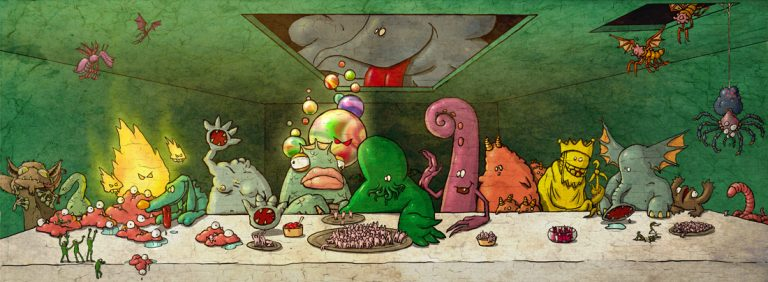
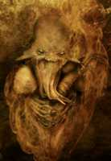
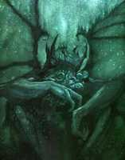
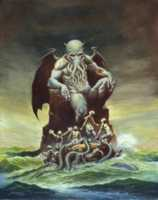
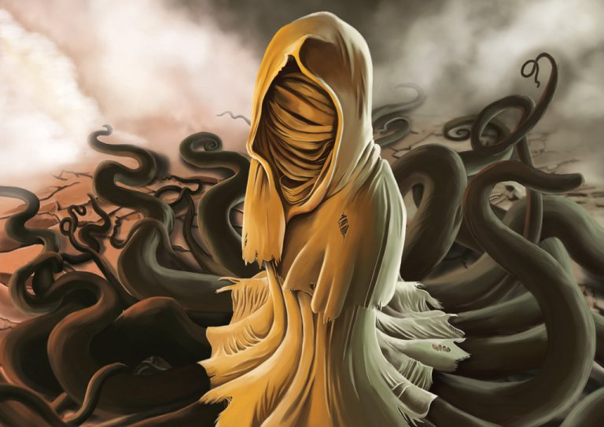
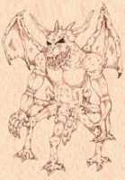
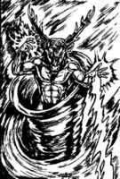

## Мифы Ктулху. Монстры Лавкрафта
# Самый страшный ужас

> Страх убивает разум. Страх — это малая смерть, несущая забвение. Я смотрю в
> лицо моему страху, я дам ему овладеть мною и пройти сквозь меня, я обернусь и
> посмотрю на тропу страха. Там, где прошел страх, не останется ничего. Там,
> где прошел страх, останусь только я.
>
> **Фрэнк Герберт, “Дюна”**

> Не секрет, что любые, даже самые страшные монстры, противостоящие героям
> фантастики, выполняют прозаичные функции: внезапно выскочить из темноты,
> укусить за самое чувствительное место и скрыться в никуда. Под этот шаблон
> подпадают вампиры, оборотни, призраки и зомби. Эти твари родились из мифов и
> легенд, суеверий и предрассудков, словом, человечество придумало их, чтобы
> обосновать свой естественный страх перед всем неожиданным и непонятным.
>
> Но есть и другие легенды. Мифы о невероятных монстрах, гораздо более
> страшных, чем кучка оживших мертвецов, и гораздо более загадочных, чем
> полупрозрачные существа, гуляющие по коридорам старинных замков. В отличие от
> европейских легенд, эти истории не могут похвастать древностью. Их придумал
> один-единственный человек — нищий американец, страдавший от ночных кошмаров.
> Но современная фантастика (а в особенности — мистика и ужасы) без них
> совершенно немыслима.
>
> **Статья из МФ №20; апрель 2005**

## Отец чудовищ

Говард Филлипс Лавкрафт (20.08.1890 — 15.03.1937) по праву считается одним из
отцов жанра ужасов. Он взял многое от Эдгара По и лорда Дансени, но еще больше
было взято у него. Клайв Баркер, Стивен Кинг, Ганс Руди Гигер, Нил Гейман,
Гильермо Дель Торо, Сэм Рэйми и Алан Мур не скрывают, что черпают вдохновение в
творчестве человека, придумавшего легенду про «книгу мертвых» — «Некрономикон».

Заслуга Лавкрафта ещё и в том, что он впервые скрестил два ранее независимых
жанра — научную фантастику и ужасы. Говард создал масштабный пантеон из богов,
полубогов и чудовищ — существ потусторонних и одновременно реальных, обитающих
то ли в другом измерении, то ли на других планетах, но активно вмешивающихся в
дела людей при помощи своих сверхъестественных сил.

При этом Лавкрафт не был сумасшедшим мистиком. Он относился к монстрам из его
книг с юмором. Говард был атеистом и рассматривал свои творения исключительно
как средство заработка — кстати, очень скромного, едва позволявшего сводить
концы с концами.

> Да, я согласен, что Йог-Сотот основан на незрелой концепции, мало подходящей
> для действительно серьезной литературы.
>
> **Лавкрафт в письме Фрэнку Белнапу Лонгу. 27 февраля 1931**

|   |
|---|
|    |
|Шутливый коллаж: Лавкрафт на фоне таинственного обелиска около Хребтов безумия (Антарктида).   |

> ### Отец ужаса
>
> |   |
> |---|
> | |
>
> Говард Филлипс Лавкрафт (20.08.1890 — 15.03.1937) родился в маленьком американском городке с многозначительным
> названием Providence («провидение»). Отец — Винфред Скотт Лавкрафт — работал
> коммивояжером. Через три года после рождения сына он заболел сифилисом, сошел
> с ума и был помещен в больницу.
>
> Дедушка Випли заставлял юного Говарда читать «Сказки 1001 ночи», «Рождение
> сказки» Булфинча, «Илиаду» и «Одиссею» Гомера. Вдобавок к этому бабушка
> каждый вечер рассказывала ему готические европейские сказки (не те, которые
> мы знаем по детским книжкам, а настоящие, не адаптированные для детей — где
> сестрам Золушки, не влезающим в хрустальную туфельку, рубят пятки; а
> прекрасный принц, добравшись до спящей красавицы, перед тем, как разбудить
> ее, «снимает цветы любви»).
>
> В молодости Лавкрафт постоянно болел и почти не ходил в школу. Он так и не
> смог получить диплома о среднем образовании и поступить в университет. Его
> брак с украинской еврейкой Соней Грин длился лишь несколько лет.
>
> |   |
> |---|
> |  |
> |Набросок Ктулху рукой Лавкрафта. Ну, не умел писатель рисовать |
>
> Хотя произведения Лавкрафта печатались и неплохо раскупались, писатель был
> беден. Он вел невиданную по масштабам переписку (считается, что это — самая
> крупная авторская переписка в мире) со своими коллегами, среди которых были
> Форрест Акерман (известный в США фантаст), Роберт Говард (создатель
> Конана-Варвара) и Роберт Блох (Психо).
>
> Лавкрафт умер от рака и недоедания. Поклонники иногда оставляют на его могиле
> эпитафию (ее быстро стирают, но она появляется вновь): «Не мертво то, что в
> вечности живет. Со смертью времени и смерть умрет».

## Откуда взялись мифы

На самом деле систематизированные «мифы Лавкрафта», более известные как «мифы
Ктулху», появились уже после смерти Лавкрафта. Его близкий друг и коллега
Август Дерлет (1909-1971) взял неоконченные работы «отца ужасов»,
отредактировал их, обобщил, кое-что добавил от себя — и опубликовал в своем
собственном издательстве «Arkham House».

|   |
|---|
|                    |
|Август Дерлет, знаменитое фото на фоне комиксов    |

Единая мифологическая картина мира Лавкрафта — плод воображения его
последователей, прежде всего — Дерлета. Он разбавил «мифы Ктулху»
христианством, превратив их в описание традиционной борьбы добра со злом.
Самому Лавкрафту это было чуждо — писатель называл этику Канта шуткой и
создавал в своих книгах вселенную, полную хаоса, ночных кошмаров и мучительной
неизвестности.

> Согласно представлениям Лавкрафта о божествах в своих мифах… изначально были
> Старшие боги (Elder Gods) — добрые и мирные, жившие на звезде Бетельгейзе
> (или около нее) в созвездии Ориона. Они крайне редко вмешивались в земные
> дела — в борьбу добра со злом, которым являются Древние (Great Old Ones, или,
> иначе — Ancient Ones).
>
> **Август Дерлет, из предисловия к «Историям о мифах Ктулху»**

У самого Лавкрафта Старшие боги явным образом ни разу не упоминались (кроме,
пожалуй, очень похожего на них Ноденса, Хозяина Великой бездны из рассказа
«Загадочный дом на туманном утесе»). Не было у него и систематизированного
пантеона Древних. Да и сам термин «Древние» (Ancient Ones) используется лишь
однажды — в рассказе «Врата серебряного ключа».

Следует отметить, что монстры из мифов Ктулху не проявляют преднамеренной
враждебности к человечеству — они скорее являются той равнодушной и
безразличной силой мироздания, которую нагляднее всего можно сравнить с
человеческой ногой, случайно затаптывающей тысячи крошечных насекомых.

## Древние

**Древние** (Great Old Ones) — невероятно могущественные существа,
предположительно — ровесники Вселенной. Члены мистических сект и культов
почитают их как богов. Древние обитают в других звездных системах либо вообще
за пределами нашего измерения. Очень вероятно, что многие из них бестелесны,
вернее говоря — состоят не из материи.

Их могущество основано на неизвестных человечеству силах, которые традиционно
считаются магическими. Оно не безгранично и имеет свои пределы, зачастую
распространяющиеся на всю планету. Древние могут влиять на земные дела лишь при
определенных астрономических условиях (особое расположение звезд на небе) и
лишь тогда, когда им помогают их последователи — культисты.

|   |
|---|
|  |
|Древние и внешние боги в шуточном вебкомиксе The Unspeakable Vault (Of Doom)   |

**Апхум-Зхах** (Aphoom-Zhah) — он же «Холодное пламя» — божество, придуманное
другом Лавкрафта — Кларком Эштоном Смитом (1893-1961). Этот монстр — потомок
Ктхугхи (Cthugha). Подобно другому чудовищу — Итхаква (Ithhaqua), — он спит
подо льдом Арктики, ожидая своего «звездного часа». Во времена ледникового
периода Аптум-Зхах частенько наведывался в Гиперборею (Лавкрафт считал таковую
аналогом Атлантиды). Для людей он выглядит как огромный, холодный столб серого
огня.

**Чхаугнар Фаугн** (Chaugnar Faugn) — «Бог слонов», «Ужас с холмов» — творение
Фрэнка Белнапа Лонга (1903-1994).

> Другие (чудовища — прим. МФ) вели свое происхождение из куда более темных и
> загадочных, передаваемых лишь из уст в уста, тайных легенд древности — таковы
> были, например, черный, бесформенный Тсатхоггуа, обладающий множеством
> щупалец Ктулху, снабженный ужасным хоботом Чхаугнар Фаугн и прочие чудовищные
> создания, знакомые избранным людям по запретным книгам наподобие
> «Некрономикона», «Книги Эйбона» или труда фон Юнцта «Сокровенные культы».
>
> **Говард Лавкрафт, «Ужас в музее»**

**Ктхугха** (Cthugha) — создан Августом Дерлетом и впервые появляется в
рассказе «Дом на кривой улице» (1962). Это существо выглядит как огромный шар
огня. Его слуги — раса огненных вампиров. В рассказе Дерлета «Обитающий во
тьме» главный герой пытается призвать Ктхугху, чтобы тот изгнал воплощение
Нъярлатотепа (Nyarlathotep) из леса в Канаде.

**Ктулху** (Cthulhu) — самый известный из монстров Лавкрафта, созданный самим
автором. Насчет произношения его имени (вообще, про названия существ у
Лавкрафта можно с полным правом сказать «язык сломаешь») существуют разные
мнения. Сам писатель говорил, что имя этого божества уходит корнями в некий
древний язык, совершенно чуждый для людей. Наиболее близким вариантом
произношения, согласно Лавкрафту, является: «Кхлул’Хлуу».

Как уже было сказано выше, Ктулху — злой бог, который покоится в затонувшем
городе Р’Льех и ждет своего часа, когда звезды примут нужное положение и он
вернется к жизни, чтобы сеять хаос и разрушения.

|   |
|---|
|  |
|Ктулху глазами разных художников.  |

|   |
|---|
|   |
|Знаменитый портрет Ктулху работы Реймонда Бэйлесса |

Внешность Ктулху известна всем поклонникам творчества Лавкрафта — это гигант
(он смог преследовать корабль в Атлантическом океане, стоя в воде)
человекоподобной формы со скользкой чешуйчатой зеленой кожей и когтями на руках
(предположительно — и ногах). Его голова напоминает осьминога — череп лишен
волос, а вокруг рта растут многочисленные щупальца. В довершение этой милой
картины, на спине у Ктулху имеются два крыла, как у летучей мыши.

> И эскимосские колдуны, и болотные жрецы из Луизианы пели, обращаясь к внешне
> сходным идолам, следующее: «Пх’нглуи мглв’нафх Ктулху Р’льех вгах’нагл
> фхтагн» («В своем доме в Р’льехе мертвый Ктулху спит, ожидая своего часа»).
>
> **Говард Лавкрафт, «Зов Ктулху»**

Август Дерлет в своих рассказах слегка изменил роль Ктулху, сделав его далеко
не самой главной фигурой в пантеоне запредельных существ. Первенство в
иерархии Древних принадлежит Йог-Сототу (Yog-Sothoth) и Азатоту (Azathoth),
однако культ Ктулху, тем не менее, является самым распространенным (и самым
влиятельным) на Земле.

Главный противник Ктулху, согласно Дерлету, — его единоутробный брат Хастур
(Hastur), живущий в звездном скоплении Гиады (Hyades) созвездия Тельца.
Интересно, что рассказ «Возвращение Хастура» (1939) описывает физический,
реальный контакт этих двух божеств.

**Ктхулла** (Cthulla) — Тайная дочь Ктулху. Как ясно из ее второго имени, эта
юная (по космическим меркам) дама — родная дочь самого знаменитого монстра из
книг Лавкрафта. Будучи полной копией своего папочки, она прячется в некоем
потайном месте под названием Ютх (Yth). Ее предназначение — возродить Ктулху в
том случае, если он погибнет. В связи с этим она представляет большую ценность
для отца — Ктхуллу тщательно охраняют его слуги (в том числе и Глубоководные, о
которых будет сказано ниже).

**Дагон** (Dagon) — еще одна «суперзвезда» мифов Ктулху. В реальности Дагон был
божеством зерна и земледелия (dagan, иуд. — зерно), почитаемым северо-западными
семитскими племенами. Упоминания о нем встречаются даже в Библии — например, в
пятой главе первой книги Царств.

Некоторые исследователи также считают, что Дагон был покровителем рыболовов и
поэтому изображался как бородатый мужчина с рыбьим хвостом вместо ног.
Последнее, видимо, и вдохновило Лавкрафта на создание пугающего образа
подводного божества, впервые появившегося в романе «Тень над Иннсмутом» (1936).

|   |
|---|
||
|Некоторые считают, что Дагон должен быть похож на Глубоководных и выглядеть примерно так.  |

|   |
|---|
| |
|Дагон в представлении Джеффа Риммера   |

Внешность Дагона никому не известна, равно как и неизвестны подробности его
существования. Мы знаем лишь то, что его при всем желании нельзя назвать добрым
и человеколюбивым. Да, он действительно может покровительствовать рыбакам, но
плата за удачный лов рыбы будет, мягко говоря, чрезмерной.

“Мир фантастики” настоятельно рекомендует вам посмотреть фильм “Дагон” (2001),
снятый режиссером Стюартом Гордоном (последний уже имел опыт в экранизации
Лавкрафта: картина “Реаниматор” в 1985 году и “Извне” в 1986 году).

**Гхатанотоа** (Ghatanothoa) — Узурпатор, Бог вулканов и первый сын Ктулху.
Предположительно, он погребен под горой Воормитхадрет (Voormithadreth) на Мю
(мифический континент, затонувший в Тихом океане). Гхатанотоа почитался
обитателями Мю за свою способность превращать людей в живые статуи.

**Глааки** (Glaaki) — Обитатель озера, Властитель мертвых снов. Живет в долине
реки Северн неподалеку от Бричестера в Англии. Впервые появился в рассказе
Рамси Кэмбелла «Обитатели озера». Глааки выглядит как огромный слизняк, сплошь
покрытый металлическими шипами. Последние являются не просто стильным
аксессуаром — они живые и растут из тела, подобно волосам. Глааки может
выпускать из себя щупальца с глазами на концах, чтобы выглядывать из воды.

Культ Глааки достаточно силен — в основном за счет магических знаний, которыми
это божество снабжает своих последователей. Последние, если верить авторам
мифов Ктулху, систематизированы и записаны в 12 томов книги «Откровения
Глааки».

Люди приходят в этот культ ради вечной жизни, которую сулит им Глааки. Божество
всегда сдерживает это обещание — оно втыкает в очередного новичка свой стальной
шип, наполняет его тело ядом и превращает человека в особую разновидность
зомби — «слуг Глааки» (еще одно малоизвестное существо из мифов Ктулху).

**Хастур** (Hastur) — Непроизносимый; Тот, кого нельзя называть. Лавкрафт
позаимствовал его у Амброза Бирса (рассказ «Пастух Гаита»), где Хастур был
покровителем пастухов — сугубо доброй сущностью, в отличие от той злобной
твари, которая появилась на страницах рассказа Лавкрафта «Шепоты во мраке».

|   |
|---|
|   |
|Хастур, рис. художника Nuberoja    |

Согласно мифам Ктулху, любой желающий мог вызвать Хастура, произнеся его имя
три раза (отсюда и все вышеуказанные прозвища). Внешность этого божества
аморфна, но перед людьми он предстает в стандартном «ктулхианском» виде —
нечто, напоминающее гигантского осьминога.

Повторение слов «Хастур, Хастур, Хастур» — всего лишь развлечение и не способно
причинить вам вред. Впрочем, редакция «Мира фантастики» не несет
ответственности за возможные последствия.

**Хциоулквоигмнзхах** (Hzioulquoigmnzhah) — божество, придуманное Кларком
Эштоном Смитом, за одно имя которого автору следует поставить памятник. Ничем
особенным это существо не отличается. По некоторым смутным упоминаниям в мифах
Ктулху, оно — дальний родственник Ктулху и Хастура. Не имеет постоянного места
обитания. Его можно встретить в мире Ксот (Xoth), на Якше (Yaksh, он же планета
Нептун), и на Цикраноше (Cykranosh — Сатурн).

**Итхаква** (Ithaqua) — Бегущий ветер, Бог холодной белой тишины, он же Виндиго
(в сказаниях североамериканских индейцев — грозный дух-людоед). Коренные жители
северных областей планеты (Сибирь, Аляска) поклоняются этому страшному
божеству, задабривая его человеческими жертвами. Считается, что Ихтаква
нападает на людей в снежном буране. Позже их находят мертвыми и лежащими в
таких позах, будто они упали с большой высоты. Черты лица искажены дикой
гримасой агонии, некоторые части тела отсутствуют.

**Ниогхта** (Nyoghta) — Вещь, которой не должно быть, Обитатель Красной бездны.
Описывается в книге Генри Каттлера «Салемский ужас» (1937). Живет в пустотах
глубоко под землей, изредка появляется на плато Ленг (на диалекте китайской
провинции Фуджиан — «холод») — вымышленном месте в Средней Азии. Загнать его
назад под землю можно лишь с помощью заклинания «Ваш-Вирай» и эликсира Тиккун.

**Уиг** (Yig) — Отец змей. Божество само по себе не злобное, но довольно
раздражительное. Наказывает своих обидчиков, посылая к ним змей. Интересно, что
в начале 1990-х этот персонаж (вернее, его имя) стал предметом реального
культа. В Коннектикуте (США) подростки взяли в моду пугать прохожих, выскакивая
на них с воплем «Уиг!», причем кричать следовало так громко, насколько это
возможно. Впрочем, подобная забава быстро перестала быть модной. Сейчас
насчитывается всего 2-5 случаев «уиггинга» в год.

----

Это — лишь краткий перечень Древних, о которых говорится в мифах Ктулху. При
желании, вы можете найти информацию и о других их «коллегах» (для удобства
назовем лишь оригинальные имена):

Atlach-Nacha, Baoht Z’ugga-Mogg, Bokrug, Bugg-Sash, Byatis, C’thalpa,
Cynothoglys, Dweller of the Gulf, Eihort, Gloon, Gol-Gorgoth, Hydra, Idh-Yaa,
Iod, Juk-Shabb, Lloigor, L’rog’g, M’Naglah, Mnomquah, Mordiggian, Nag and Yeb,
Oorn, Othuum, Othuyeg, Rhan-Tegoth, Saa’itii, Sfatclip, Shathak, Shudde’Mell,
Tsathoggua, Vulthoom, Y’Golonac, Yhondeh, Ythgotha, Zhar, Zoth-Ommog, Zushakon,
Zvilpoggua, Zustulzhemgni.

## Внешние боги

Не будем подробно останавливаться на существах, называемых в мифах Great Ones
(Великие). Они живут в особом мире — Dreamlands, и гораздо более слабы (в
магическом плане), нежели Древние или Старшие боги. Их интеллектуальные
способности также оставляют желать лучшего.

Гораздо более интересны Внешние боги (Outer Gods). В отличие от других, они
представляют из себя не конкретных существ, а, скорее, всеобщие принципы бытия.
Именно поэтому их сила не имеет физических границ.

**Абхот** (Abhoth) — Источник нечистоты. Живет в подземном царстве Н’Кай
(N’kai) и предстает перед людьми, как отвратительная серая масса живой плоти.
Из нее рождаются различные чудовища, но Абхот выпускает щупальца, хватает своих
детей и пожирает их. Этот бог циничен, зол и безумен. Он обладает сильными
телепатическими способностями, позволяющими ему общаться с окружающими.

**Азатот** (Azathoth) — Султан демонов, Кипящий ядерный хаос. Этот бог стоит во
главе пантеона мифов Ктулху. Лавкрафт подробно описывает его в романе
«Сомнамбулический поиск неведомого Кадата», повестях «Сны в ведьмином доме» и
«Шепчущий в ночи». Если верить автору, Азатот — слепой бог-идиот, не имеющий
конкретной физической формы (хотя он может воплощаться в существо Xada-Ngla).

|   |
|---|
|  |
|Азатот, художник Мика Стоун    |

Термин «ядерный» применялся Лавкрафтом для обозначения центральной роли Азатота
в нашем мироздании, а не ради намека на его радиоактивность. Этому богу может
поклоняться только сумасшедший — фактически так оно и есть, ведь немногие
смельчаки, отважившиеся избрать его своим покровителем, расплачивались за это
разумом, телом и душой.

**Ньярлатхотеп** (Nyarlathotep) — Ползучий хаос, Посланец Азатота, Черный
человек. Это божество очень сильно отличается от своих собратьев. В отличие от
Хастура, живущего на звездах, или Ктулху, спящего в морской глубине,
Ньярлатхотеп полон жизни и активно вмешивается в судьбу мироздания. Его
излюбленная внешность — высокий человек с темными волосами и хорошим чувством
юмора. Он говорит на обычном человеческом языке, не имеет своего культа и
служит посланником Азатота, реализуя его волю на Земле.

Ньярлатхотепа часто ассоциируют с древнеегипетским богом Сетом, а также
ацтекскими божествами: Тецкатлипокой («дымящееся зеркало») и Ксайп Тотеком
(«человеком без кожи»).

|   |
|---|
|   |
|Ньярлатхотеп, художник Douzen  |

**Шаб-Ниггурат** (Shub-Niggurath) — Черный козел из лесов с тысячью молодых.
Как таковое, это чудовище в романах Лавкрафта не встречалось, однако его имя
можно было встретить в нескольких заклинаниях (Ia! Shub-Niggurath) — см.
«Шепоты во мраке», «Сны в ведьмином доме», «Кошмар в музее». Внешне это
существо выглядит как огромная бесформенная масса, усеянная щупальцами,
слюнявыми ртами — и все это передвигается на кривых козлиных ногах.

|   |
|---|
|  | 
|Шуб-Ниггурат, рис. Khannea Suntzu  |

**Йог-Сотот** (Yog-Sothoth) — Все в одном; Тот, кто извне; Тот, кто откроет
Путь. Лучше всего об этом божестве сказал сам Лавкрафт:

> Безграничное Бытие воплощало Все-в-одном и Одно-во-всем, о котором ему
> поведали волны. Оно заключало в себе не только время и пространство, но и
> весь универсум с его безмерным размахом, не знающим пределов, и превосходящим
> любые фантазии и расчеты математиков и астрономов. Возможно, в древности
> жрецы тайных культов называли его Йог-Сототом и шепотом передавали из уст в
> уста это имя, а похожим на раков инопланетянам с Юггота он был известен как
> Находящийся-за-краем. Его летучих вестников со спиралевидными мозгами
> узнавали по непереводимому знаку, но Картер понимал, сколь относительны и
> неточны все эти определения.
>
> **Г. Ф. Лавкрафт, «Врата серебряного ключа»**

|   |
|---|
|  | 
|Йог-Сотот  |

Кроме уже перечисленных, мифы Ктулху изредка упоминают и других Внешних богов:
Даолот (Daoloth), Грот (Groth), Гидра (Hydra), Мландот (Mlandoth), Тулзуча
(Tulzuscha), Уббо-Сатхла (Ubo-Sathla), Вордавосс (Vordavoss) и Ксиурн (Xiurhn).

## Старшие боги

**Elder Gods** — группа сверхъестественных существ, противостоящих Древним
(Great Old Ones), а также другим, менее крупным божественным «фракциям» —
Внешним богам (Outer Gods) и Великим (Great Ones).

Литературоведы не связывают Старших богов с творчеством самого Лавкрафта,
поскольку они были созданы его последователями и, по сути, являются компиляцией
из целого ряда мифов древности.

|   |
|---|
|   |
 
**Баст** (Bast), или Бастет — божество, заимствованное у египтян. Традиционно
связывается с солнцем, плодородием и благополучными родами у женщин. Баст имеет
два воплощения — женщина с кошачьей головой (добрая сущность) и львиной
(агрессивная). Считается, что, находясь во второй форме, Баст превращается в
Секхмет — львицу, которая однажды едва не уничтожила все человечество. Ее
удалось усмирить лишь с помощью хитрости — по земле было разлито пиво,
подкрашенное минеральными красителями в красный цвет. Львица приняла эту
жидкость за кровь, напилась и уснула.

**Гипнос** (Hypnos) — персонификация сна из греческой мифологии. Мать Гипноса —
Никс (Ночь), брат — Танатос (Смерть). Его чертоги находятся в пещере, куда не
проникает солнечный свет. У входа растут маки и другие сонные растения. Дети
Гипноса — так называемые Онерои: Морфеус (сновидения), Фобетор, он же Иселус
(ночные кошмары) и Фантасос (появляется во сне в виде неодушевленных объектов).

**Эндимион** — молодой пастух, влюбился в богиню луны Селену и получил от
Гипноса редкий дар — способность спать с открытыми глазами, чтобы даже во сне
он мог смотреть на свою любимую.

**Н’Тси-Каамбл** (N’tse-Kaambl) — малозначительное женское божество из разряда
Старших, введенное в мифы Ктулху писателем Гари Майерсом (повесть «Дом Червя»).
Иногда оно отождествляется с Минервой (римская богиня ремесла и мудрости).
Существуют предположения, что имя этого божества — омоним имени Нэнси Кэмбелл,
правда, личность этой дамы неизвестна ни для кого, кроме самого Майерса.

|   |
|---|
|  |
|Ноденс, художник Mark Foster   |

**Ноденс** (Nodens) — Охотник, Повелитель Великой бездны. Как уже было сказано
ранее, впервые он появился в рассказе Лавкрафта «Дом на туманном утесе».
Представляет из себя пожилого мужчину с длинной густой бородой и седыми
волосами. Ноденс путешествует по миру в колеснице, сделанной из огромной
морской ракушки. Его призвание — охота, причем в качестве жертв он чаще всего
выбирает себе существ, принадлежащих к пантеону Древних. Это вовсе не говорит о
том, что Ноденс — защитник добра. Просто злые чудовища представляют для него
наиболее сложную, а, следовательно, — привлекательную добычу.

**Ултар** (Ulthar) — некое божество, упоминаемое Лавкрафтом в романе
«Сомнамбулический поиск неведомого Кадата» и рассказе «Коты Ултара». Кроме
того, в мифах Ктулху присутствует одноименный город. Как именно он связан с
этим божеством, до сих пор неизвестно.

Некоторые авторы причисляют к пантеону Старших еще двух существ —
Ктханида(Kthanid) и Яд-Тхаддага (Yad-Thaddag). Какая-либо подробная информация
об этих созданиях в мифах отсутствует.

|   |
|---|
| |
|По «Неведомому Кадату» есть довольно любопытный комикс |

## Небожественные существа

Кроме страшных чудовищ с щупальцами и бесформенных созданий из мрачных глубин
далекого космоса, мифы Ктулху могут похвастаться неплохой коллекцией более
простых и доступных пониманию существ.

**Подземные** (Chtonians) — милые зверюшки, напоминающие крупных кальмаров и
отличающиеся от них удлиненными телами, покрытыми скользкой слизью (эта
морфологическая особенность позволяет им легко перемещаться под землей). О
Подземных известно, что они живут тысячи лет, ревностно охраняют свое потомство
от людей и издают тягучие печальные звуки, по которым легко определить их
приближение. Подробнее об этих тварях можно узнать из сборника рассказов
Брайана Ламли «Из глубины» (1974).

|   |
|---|
|   |
|Хтониец, художник Борха Пиндао |

**Глубоководные** (Deep Ones) — рыбо-лягушкоподобные существа, обитающие
глубоко в океане. Будучи амфибиями, они неплохо чувствуют себя на суше и иногда
выходят к людям. В обмен на человеческие жертвы Глубоководные могут дарить
золото, украшения и наполнять сети рыбой.

|   |
|---|
|   |
|Глубоководный. 3D-модель художника Стефано Бернарди    |

Глубоководные также могут спариваться с людьми, порождая гибридов. В молодости
такие дети выглядят совершенно обычно, однако с возрастом они постепенно
превращаются в Глубоководных. Их глаза становятся выпученными, веки
атрофируются, голова сужается, волосы выпадают, а кожа покрывается чешуей.

Глубоководные поклоняются Дагону и Ктулху. Лавкрафт подробно описал их в романе
«Тень над Иннсмутом».

|   |
|---|
|   |
|Глубоководный из фильма «Дагон», очень вольной, но неплохой экранизации «Тени над Иннсмутом»   |

**Старцы** (Elder Things) — инопланетяне, населявшие Землю до людей.
Представляли собой помесь растения и животного. Старцы строили гигантские
города на земле и под водой, воевали с богами (без особого успеха) и, вероятно,
произвели на свет тех существ, которые населяют планету и по сей день.
Цивилизация Старцев погибла в ледниковый период, их замерзший город в
Антарктиде был обнаружен лишь в 1931 году (роман Лавкрафта «Хребты безумия»).

|   |
|---|
|
Старцы, худ. Джефф Реммер

**Гули** (Ghouls) — существа, некогда бывшие людьми, но превратившиеся в
человекоподобных чудовищ, прячущихся от солнца под землю. Причиной такой
метаморфозы является людоедство. Вполне логично, что гули сохраняют свои
прежние кулинарные пристрастия и питаются человеческими трупами. Подробнее о
них можно узнать из романа «Сомнамбулический поиск неведомого Кадата».

Среди прочих, менее колоритных чудовищ мифов Ктулху можно назвать псов
Тиндалоса (нечто, напоминающее лангольеров Стивена Кинга), ми-го (ракообразные
инопланетяне, живущие на Плутоне), шогготов (существа из протоплазмы) и зугов
(маленькие эльфоподобные создания, живущие в мире Dreamlands).

## Страшно, аж жуть!

Вам были представлены далеко не все представители «зверинца» мифов Ктулху, но
этого вполне достаточно для того, чтобы сделать несколько важных выводов.
Первое, о чем вы, наверное, уже давно думаете — такое мог написать только
потомственный шизофреник. Второй вывод более серьезен — именно эти существа
стали фундаментом всего современного жанра «мистических ужасов».

|   |
|---|
|    |
|Некрономикон стал сюжетной основой всей серии «Зловещие мертвецы»  |

В наше время такие монстры могут казаться однообразными, скучными и даже
смешными, а легенды, связанные с ними — как минимум, наивными. Но не следует
забывать, что в начале 20 века такие истории читались на ура и были самыми
настоящими экшен-триллерами той эпохи. К мифам Ктулху сейчас можно относиться
по-разному, но бесспорно лишь одно: это классика, выдержавшая самое тяжелое
испытание — временем.

----

	
Гхатанотоа глазами художника Анджела Ортеги.

Гхатанотоа (Ghatanothoa) — Узурпатор, Бог вулканов и первый сын Ктулху. Предположительно, он погребен под горой Воормитхадрет (Voormithadreth) на Мю (мифический континент, затонувший в Тихом океане). Гхатанотоа почитался обитателями Мю за свою способность превращать людей в живые статуи.

Глааки (Glaaki) — Обитатель озера, Властитель мертвых снов. Живет в долине реки Северн неподалеку от Бричестера в Англии. Впервые появился в рассказе Рамси Кэмбелла “Обитатели озера”. Глааки выглядит как огромный слизняк, сплошь покрытый металлическими шипами. Последние являются не просто стильным аксессуаром — они живые и растут из тела, подобно волосам. Глааки может выпускать из себя щупальца с глазами на концах, чтобы выглядывать из воды.

Культ Глааки достаточно силен — в основном за счет магических знаний, которыми это божество снабжает своих последователей. Последние, если верить авторам мифов Ктулху, систематизированы и записаны в 12 томов книги “Откровения Глааки”.

Люди приходят в этот культ ради вечной жизни, которую сулит им Глааки. Божество всегда сдерживает это обещание — оно втыкает в очередного новичка свой стальной шип, наполняет его тело ядом и превращает человека в особую разновидность зомби — “слуг Глааки” (еще одно малоизвестное существо из мифов Ктулху).

Хастур (Hastur) — Непроизносимый; Тот, кого нельзя называть. Лавкрафт позаимствовал его у Амброза Бирса (рассказ “Пастух Гаита”), где Хастур был покровителем пастухов — сугубо доброй сущностью, в отличие от той злобной твари, которая появилась на страницах рассказа Лавкрафта “Шепоты во мраке”. Согласно мифам Ктулху, любой желающий мог вызвать Хастура, произнеся его имя три раза (отсюда и все вышеуказанные прозвища). Внешность этого божества аморфна, но перед людьми он предстает в стандартном “ктулхианском” виде — нечто, напоминающее гигантского осьминога.

В книге “Добрые знамения” (Н. Гейман, Т. Пратчетт) Хастур упоминается как демон в звании Герцога Ада.

Повторение слов “Хастур, Хастур, Хастур” является всего лишь развлечением и не способно причинить вам вред. Редакция “Мира фантастики” не несет ответственности за возможные последствия этих действий.

Хциоулквоигмнзхах (Hzioulquoigmnzhah) — божество, придуманное Кларком Эштоном Смитом, за одно имя которого автору следует поставить памятник. Ничем особенным это существо не отличается. По некоторым смутным упоминаниям в мифах Ктулху, оно — дальний родственник Ктулху и Хастура. Не имеет постоянного места обитания. Его можно встретить в мире Ксот (Xoth), на Якше (Yaksh, он же планета Нептун), и на Цикраноше (Cykranosh — Сатурн).

Лавкравтовский Итхаква (слева) и индейский Виндиго (справа).

Итхаква (Ithaqua) — Бегущий ветер, Бог холодной белой тишины, он же Виндиго (в сказаниях североамериканских индейцев — грозный дух-людоед). Коренные жители северных областей планеты (Сибирь, Аляска) поклоняются этому страшному божеству, задабривая его человеческими жертвами. Считается, что Ихтаква нападает на людей в снежном буране. Позже их находят мертвыми и лежащими в таких позах, будто они упали с большой высоты. Черты лица искажены дикой гримасой агонии, некоторые части тела отсутствуют.

Ниогхта (Nyoghta) — Вещь, которой не должно быть, Обитатель Красной бездны. Описывается в книге Генри Каттлера “Салемский ужас” (1937). Живет в пустотах глубоко под землей, изредка появляется на плато Ленг (на диалекте китайской провинции Фуджиан — “холод”) — вымышленном месте в Средней Азии. Загнать его под назад землю можно лишь с помощью заклинания “Ваш-Вирай” и эликсира Тиккун.

Уиг (Yig) — Отец змей. Божество само по себе не злобное, но довольно раздражительное. Наказывает своих обидчиков, посылая к ним змей. Интересно, что в начале 1990-х этот персонаж (вернее, его имя) стал предметом реального культа. В Коннектикуте (США) подростки взяли в моду пугать прохожих, выскакивая на них с воплем “Уиг!”, причем кричать следовало так громко, насколько это возможно. Впрочем, подобная забава быстро перестала быть модной. Сейчас насчитывается всего 2-5 случаев “уиггинга” в год.

Это — лишь краткий перечень Древних, о которых говорится в мифах Ктулху. При желании, вы можете найти информацию и о других их “коллегах” (для удобства назовем лишь оригинальные имена):

Atlach-Nacha, Baoht Z’ugga-Mogg, Bokrug, Bugg-Sash, Byatis, C’thalpa, Cynothoglys, Dweller of the Gulf, Eihort, Gloon, Gol-Gorgoth, Hydra, Idh-Yaa, Iod, Juk-Shabb, Lloigor, L’rog’g, M’Naglah, Mnomquah, Mordiggian, Nag and Yeb, Oorn, Othuum, Othuyeg, Rhan-Tegoth, Saa’itii, Sfatclip, Shathak, Shudde’Mell, Tsathoggua, Vulthoom, Y’Golonac, Yhondeh, Ythgotha, Zhar, Zoth-Ommog, Zushakon, Zvilpoggua, Zustulzhemgni.
