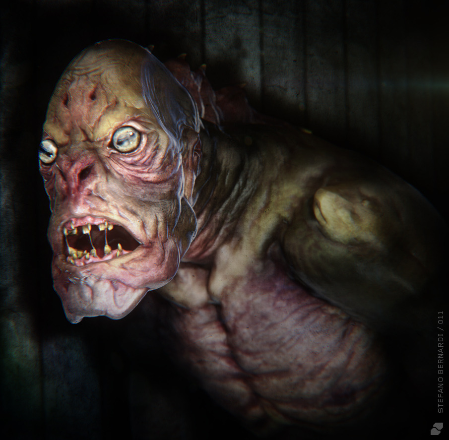
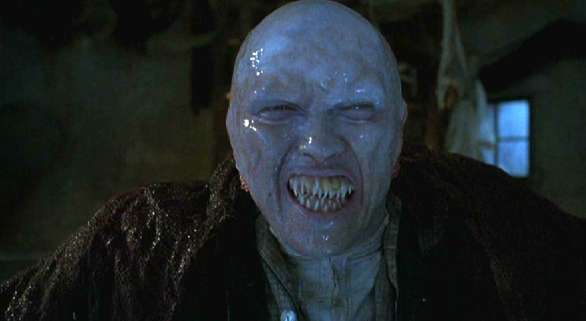
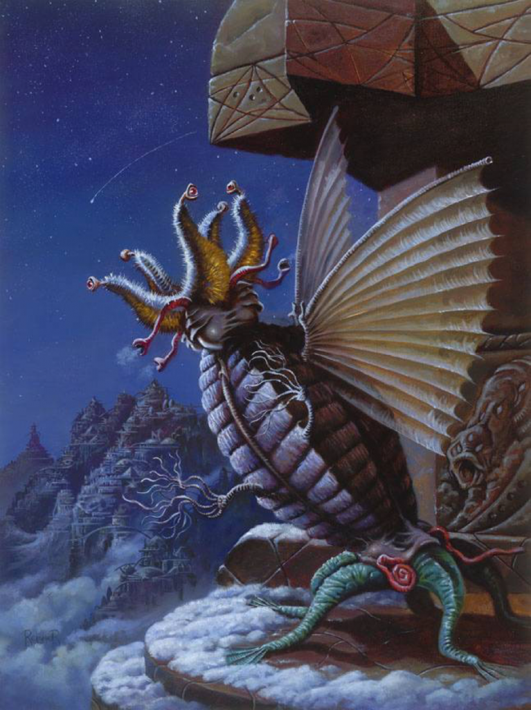

# Небожественные существа

Кроме страшных чудовищ с щупальцами и бесформенных созданий из мрачных глубин
далекого космоса, мифы Ктулху могут похвастаться неплохой коллекцией более
простых и доступных пониманию существ.

**Подземные** (Chtonians) — милые зверюшки, напоминающие крупных кальмаров и
отличающиеся от них удлиненными телами, покрытыми скользкой слизью (эта
морфологическая особенность позволяет им легко перемещаться под землей). О
Подземных известно, что они живут тысячи лет, ревностно охраняют свое потомство
от людей и издают тягучие печальные звуки, по которым легко определить их
приближение. Подробнее об этих тварях можно узнать из сборника рассказов
Брайана Ламли «Из глубины» (1974).

|                                                       |                                                                                   |
|-------------------------------------------------------|-----------------------------------------------------------------------------------|
|   |                                                        |
|Хтониец, художник Борха Пиндао                         |«Подземные», возможно, стали прообразом грабоидов из фильмов серии «Дрожь земли».  |

**Глубоководные** (Deep Ones) — рыбо-лягушкоподобные существа, обитающие
глубоко в океане. Будучи амфибиями, они неплохо чувствуют себя на суше и иногда
выходят к людям. В обмен на человеческие жертвы Глубоководные могут дарить
золото, украшения и наполнять сети рыбой.

Глубоководные также могут спариваться с людьми, порождая гибридов. В молодости
такие дети выглядят совершенно обычно, однако с возрастом они постепенно
превращаются в Глубоководных. Их глаза становятся выпученными, веки
атрофируются, голова сужается, волосы выпадают, а кожа покрывается чешуей.

Глубоководные поклоняются Дагону и Ктулху. Лавкрафт подробно описал их в романе
«Тень над Иннсмутом».

|                                                       |                                                                                               |                                                                           |
|-------------------------------------------------------|-----------------------------------------------------------------------------------------------|---------------------------------------------------------------------------|
|           |                                                                       |                                                  |
|Глубоководный. 3D-модель художника Стефано Бернарди    |Глубоководный из фильма «Дагон», очень вольной, но неплохой экранизации «Тени над Иннсмутом»   |«Глубокие» из компьютерной игры «Call of Cthulhu: Dark corners of Earth».  |

**Старцы** (Elder Things) — инопланетяне, населявшие Землю до людей.
Представляли собой помесь растения и животного. Старцы строили гигантские
города на земле и под водой, воевали с богами (без особого успеха) и, вероятно,
произвели на свет тех существ, которые населяют планету и по сей день.
Цивилизация Старцев погибла в ледниковый период, их замерзший город в
Антарктиде был обнаружен лишь в 1931 году (роман Лавкрафта «Хребты безумия»).

|   |
|---|
|    |
|Старцы, худ. Джефф Реммер                              |

**Гули** (Ghouls) — существа, некогда бывшие людьми, но превратившиеся в
человекоподобных чудовищ, прячущихся от солнца под землю. Причиной такой
метаморфозы является людоедство. Вполне логично, что гули сохраняют свои
прежние кулинарные пристрастия и питаются человеческими трупами. Подробнее о
них можно узнать из романа «Сомнамбулический поиск неведомого Кадата».

> Среди прочих, менее колоритных чудовищ мифов Ктулху можно назвать псов
> Тиндалоса (нечто, напоминающее лангольеров Стивена Кинга), ми-го
> (ракообразные инопланетяне, живущие на Плутоне), шогготов (существа из
> протоплазмы) и зугов (маленькие эльфоподобные создания, живущие в мире
> Dreamlands).
