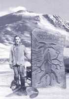
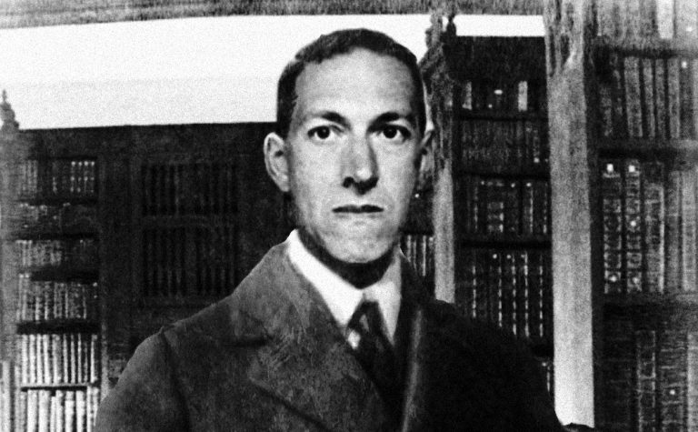
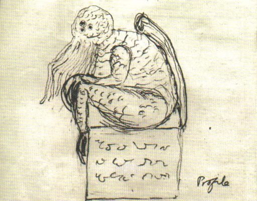

# Отец чудовищ

Говард Филлипс Лавкрафт по праву считается одним из отцов жанра ужасов. Он взял
многое от Эдгара По и лорда Дансени, но еще больше было взято у него. Клайв
Баркер, Стивен Кинг, Ганс Руди Гигер, Нил Гейман, Гильермо Дель Торо, Сэм Рэйми
и Алан Мур не скрывают, что черпают вдохновение в творчестве человека,
придумавшего легенду про «книгу мертвых» — «Некрономикон».

Заслуга Лавкрафта ещё и в том, что он впервые скрестил два ранее независимых
жанра — научную фантастику и ужасы. Говард создал масштабный пантеон из богов,
полубогов и чудовищ — существ потусторонних и одновременно реальных, обитающих
то ли в другом измерении, то ли на других планетах, но активно вмешивающихся в
дела людей при помощи своих сверхъестественных сил.

При этом Лавкрафт не был сумасшедшим мистиком. Он относился к монстрам из его
книг с юмором. Говард был атеистом и рассматривал свои творения исключительно
как средство заработка — кстати, очень скромного, едва позволявшего сводить
концы с концами.

> Да, я согласен, что Йог-Сотот основан на незрелой концепции, мало подходящей
> для действительно серьезной литературы.
>
> **Лавкрафт в письме Фрэнку Белнапу Лонгу. 27 февраля 1931**

|   |
|---|
|    |
|Шутливый коллаж: Лавкрафт на фоне таинственного обелиска около Хребтов безумия (Антарктида).   |

> ## Отец ужаса
>
> 
>
> Говард Филлипс Лавкрафт (20.08.1890 — 15.03.1937) родился в маленьком
> американском городке с многозначительным названием Providence («провидение»).
> Отец — Винфред Скотт Лавкрафт — работал коммивояжером. Через три года после
> рождения сына он заболел сифилисом, сошел с ума и был помещен в больницу.
>
> Дедушка Випли заставлял юного Говарда читать «Сказки 1001 ночи», «Рождение
> сказки» Булфинча, «Илиаду» и «Одиссею» Гомера. Вдобавок к этому бабушка
> каждый вечер рассказывала ему готические европейские сказки (не те, которые
> мы знаем по детским книжкам, а настоящие, не адаптированные для детей — где
> сестрам Золушки, не влезающим в хрустальную туфельку, рубят пятки; а
> прекрасный принц, добравшись до спящей красавицы, перед тем, как разбудить
> ее, «снимает цветы любви»).
>
> В молодости Лавкрафт постоянно болел и почти не ходил в школу. Он так и не
> смог получить диплома о среднем образовании и поступить в университет. Его
> брак с украинской еврейкой Соней Грин длился лишь несколько лет.
>
> |   |
> |---|
> |  |
> |Набросок Ктулху рукой Лавкрафта. Ну, не умел писатель рисовать |
>
> Хотя произведения Лавкрафта печатались и неплохо раскупались, писатель был
> беден. Он вел невиданную по масштабам переписку (считается, что это — самая
> крупная авторская переписка в мире) со своими коллегами, среди которых были
> Форрест Акерман (известный в США фантаст), Роберт Говард (создатель
> Конана-Варвара) и Роберт Блох (Психо).
>
> Лавкрафт умер от рака и недоедания. Поклонники иногда оставляют на его могиле
> эпитафию (ее быстро стирают, но она появляется вновь): «Не мертво то, что в
> вечности живет. Со смертью времени и смерть умрет».
