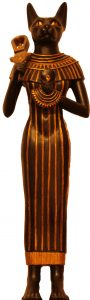
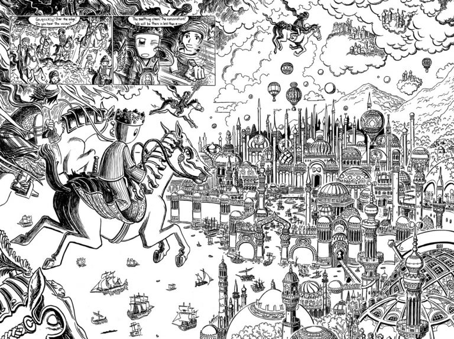

# Старшие боги

**Elder Gods** — группа сверхъестественных существ, противостоящих Древним
(Great Old Ones), а также другим, менее крупным божественным «фракциям» —
Внешним богам (Outer Gods) и Великим (Great Ones).

Литературоведы не связывают Старших богов с творчеством самого Лавкрафта,
поскольку они были созданы его последователями и, по сути, являются компиляцией
из целого ряда мифов древности.

**Баст** (Bast), или Бастет — божество, заимствованное у египтян. Традиционно
связывается с солнцем, плодородием и благополучными родами у женщин. Баст имеет
два воплощения — женщина с кошачьей головой (добрая сущность) и львиной
(агрессивная). Считается, что, находясь во второй форме, Баст превращается в
Секхмет — львицу, которая однажды едва не уничтожила все человечество. Ее
удалось усмирить лишь с помощью хитрости — по земле было разлито пиво,
подкрашенное минеральными красителями в красный цвет. Львица приняла эту
жидкость за кровь, напилась и уснула.

**Гипнос** (Hypnos) — персонификация сна из греческой мифологии. Мать Гипноса —
Никс (Ночь), брат — Танатос (Смерть). Его чертоги находятся в пещере, куда не
проникает солнечный свет. У входа растут маки и другие сонные растения. Дети
Гипноса — так называемые Онерои: Морфеус (сновидения), Фобетор, он же Иселус
(ночные кошмары) и Фантасос (появляется во сне в виде неодушевленных объектов).

> **Эндимион** — молодой пастух, влюбился в богиню луны Селену и получил от
> Гипноса редкий дар — способность спать с открытыми глазами, чтобы даже во сне
> он мог смотреть на свою любимую.

**Н’Тси-Каамбл** (N’tse-Kaambl) — малозначительное женское божество из разряда
Старших, введенное в мифы Ктулху писателем Гари Майерсом (повесть «Дом Червя»).
Иногда оно отождествляется с Минервой (римская богиня ремесла и мудрости).
Существуют предположения, что имя этого божества — омоним имени Нэнси Кэмбелл,
правда, личность этой дамы неизвестна ни для кого, кроме самого Майерса.

**Ноденс** (Nodens) — Охотник, Повелитель Великой бездны. Как уже было сказано
ранее, впервые он появился в рассказе Лавкрафта «Дом на туманном утесе».
Представляет из себя пожилого мужчину с длинной густой бородой и седыми
волосами. Ноденс путешествует по миру в колеснице, сделанной из огромной
морской ракушки. Его призвание — охота, причем в качестве жертв он чаще всего
выбирает себе существ, принадлежащих к пантеону Древних. Это вовсе не говорит о
том, что Ноденс — защитник добра. Просто злые чудовища представляют для него
наиболее сложную, а, следовательно, — привлекательную добычу.

|                                   |                                   |
|-----------------------------------|-----------------------------------|
|  |           |
|Ноденс, художник Mark Foster       |Ноденс, Повелитель Великой бездны  |

**Ултар** (Ulthar) — некое божество, упоминаемое Лавкрафтом в романе
«Сомнамбулический поиск неведомого Кадата» и рассказе «Коты Ултара». Кроме
того, в мифах Ктулху присутствует одноименный город. Как именно он связан с
этим божеством, до сих пор неизвестно.

|   |
|---|
| |
|По «Неведомому Кадату» есть довольно любопытный комикс |

Некоторые авторы причисляют к пантеону Старших еще двух существ —
**Ктханида**(Kthanid) и **Яд-Тхаддага** (Yad-Thaddag). Какая-либо подробная информация
об этих созданиях в мифах отсутствует.
