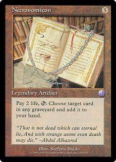
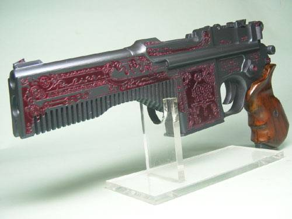
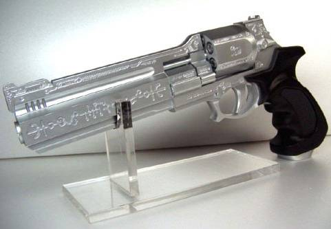

# Страшно, аж жуть!

Вам были представлены далеко не все представители «зверинца» мифов Ктулху, но
этого вполне достаточно для того, чтобы сделать несколько важных выводов.
Первое, о чем вы, наверное, уже давно думаете — такое мог написать только
потомственный шизофреник. Второй вывод более серьезен — именно эти существа
стали фундаментом всего современного жанра «мистических ужасов».

|   |
|---|
|    |
|Некрономикон стал сюжетной основой всей серии «Зловещие мертвецы»  |

|   |
|---|
| |
|Карта «Некрономикон» из коллекционной карточной игры «Magic The Gathering». |

|   |
|---|
|      |
|В Японии продается очень интересное игрушечное оружие: маузер Ктхугха (слева) и револьвер Итхаква (справа).    |

В наше время такие монстры могут казаться однообразными, скучными и даже
смешными, а легенды, связанные с ними — как минимум, наивными. Но не следует
забывать, что в начале 20 века такие истории читались на ура и были самыми
настоящими экшен-триллерами той эпохи. К мифам Ктулху сейчас можно относиться
по-разному, но бесспорно лишь одно: это классика, выдержавшая самое тяжелое
испытание — временем.
