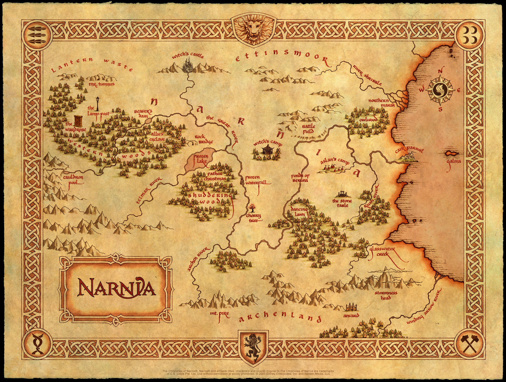

# Нарния.

Мир в стиле фэнтези, созданный англо-ирландским автором Клайвом Стейплзом Льюисом, являющийся местом действия в большинстве книг серии Хроники Нарнии, эпопеи из семи книг. Также страна в этом мире, имеющая определяющее значение в космогонии и имеющая особое сакральное значение.

