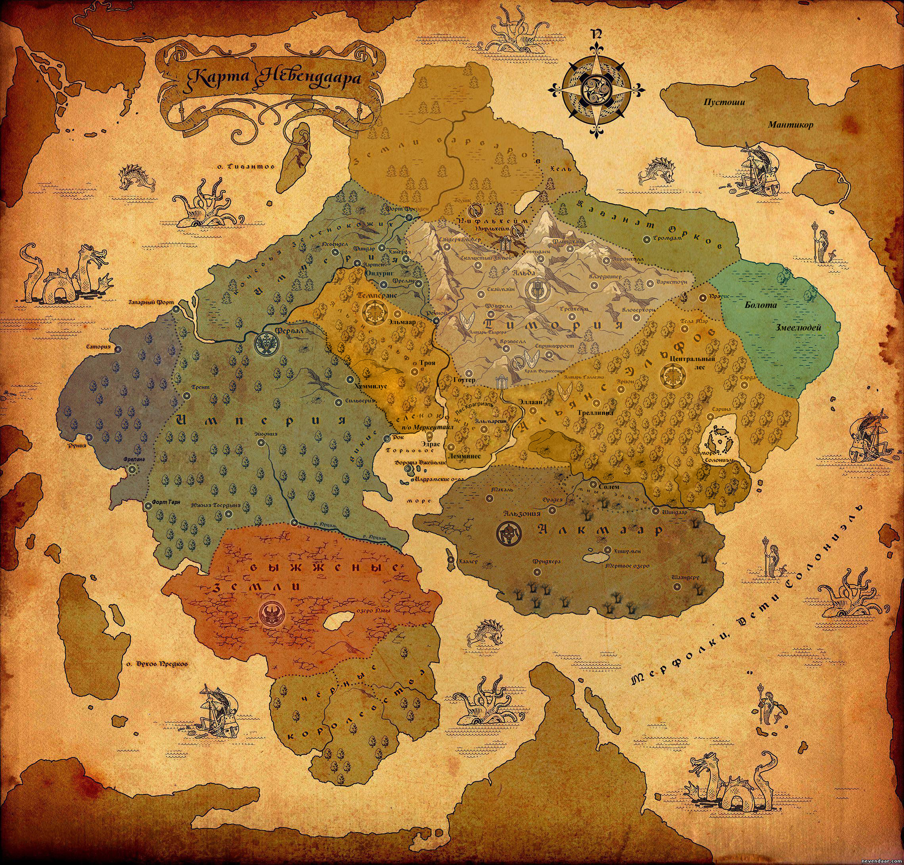

# Невендаар.

Невендаар — вымышленный мир из сеттинга Disciples. Название мира с вымышленного языка переводится как «Священные земли». Начиная со второй игры серии, государство людей, Империя, также называется Невендааром. Также существуют различные мнения о том, чем же на самом деле является Невендаар, материком или же миром? Многие фанаты верят что Невендаар материк, и причём не единственный, но тем не менее события всех игр серии Disciples происходят на Невендааре.

