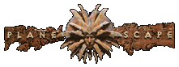
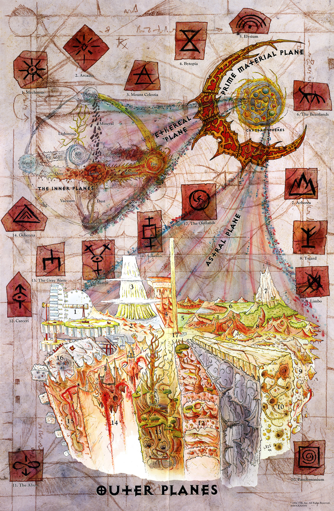

# Planescape

Planescape (рус. Планскейп или Планшафт) — сеттинг для ролевой игры Dungeons & Dragons, разработанный Дэвидом Куком. Как видно из названия, в этом сеттинге взаимодействуют и сосуществуют множество планов, составляющих особую космологию, названную Великим Колесом — подробнее об этом можно прочесть в книге Manual of the Planes, написанном Джефом Граббом. Planescape объединяет миры Dungeons and Dragons, связывая их межпространственными магическими порталами. Сеттинг представляет собой смешение атрибутов викторианской эпохи с псевдо-стимпанк антуражем. Planescape завоевал награды за свое уникальное визуальное оформление, над которым потрудились художники Тони ДиТерлицци (Tony DiTerlizzi), Роб Раппель (Robh Ruppel) и Дана Кнатсон (Dana Knutson).

## Космология

|   |
|---|
||
|Схема взаимосвязи планов сеттинга Planescape|

Стандартная космология D&D представляет собой систему взаимодействующих и взаимосвязанных между собой планов — миров, каждый из которых по-своему уникален и способен сам по себе быть отдельным сеттингом.

Все планы делятся на следующие группы:

* Внутренние Планы (представляющие собой планы природных элементов, таких как: Вода, Земля, или Огонь; а также планы положительной и отрицательной энергии).
* Эфирный План (его можно сравнить с океаном, омывающим Внутренние Планы и соединяющим их с Праймом. Хотя на самом деле — это разноцветный туман, коконом окружающий Внутренние Планы).
* Первичный Материальный План, иначе говоря — Прайм (Прайм представляет собой План, состоящий из бесчисленного множества миров. Миром считается как одна единственная планета, так и целая звездная система)
* Астральный План (соединяет Прайм и Внешние Планы. Для того чтобы попасть на Астральный План праймеру можно воспользоваться заклинанием Astral Spell).
* План Тени
* Внешние Планы (планы верований и мировоззрений. Являются домом для различных богов).

Все они связаны между собой различными сверхъестественными вратами (порталами). Вполне возможно, что портал находится за соседней дверью, войдя в которую приключенец обнаруживает себя в абсолютно новом, подчас удивительном и непостижимом месте, таящем в себе гораздо больше интересного и захватывающего, чем он мог представлять даже в самых смелых фантазиях.

Каждый из планов населён своими собственными обитателями, дружественными или враждебными. Возможно, они уже встречались приключенцу в его прошлых путешествиях. Их необычный образ мысли и чуждая простому земному человеку логика и убеждения способны стать основой многих интересных приключений. Именно о планах, путешествиях между ними, и взаимодействии с планарными жителями (сводится ли оно к обмену информацией, товарами, или ударами мечей) и повествует сеттинг Planescape.

У Planescape, как и у любого другого сеттинга, есть свои характерные особенности, то, что называется «духом сеттинга». Как пример индивидуальных особенностей, присущих разным сеттингам, можно упомянуть эпические войны и подвиги Dragonlance, готический ужас Ravenloft, мир древних империй Forgotten Realms, скрипящий на зубах песок Dark Sun.

Planescape рассказывает об убеждениях и философии, о «смысле Мультивселенной». Причём не в виде скучных, навевающих сон лекцияй старых толстых профессоров, потерявших связь с реальностью. Для планарных обитателей вопрос о смысле всего сущего — не просто вопрос, они живут день за днем в соответствии с тем, что считают на него ответом. В Planescape идеи подкрепляются действиями: взмахами мечей, вспышками магического огня — и наоборот, действия и события всегда имеют идейную подоплёку. Следует принимать это во внимание — планарные обитатели сильны, потому что материализованная философия — это не для слабаков.

Planescape — сеттинг, где абстрактное реально. Священники вымаливают заклинания не просто у богов, а у Сил, которые можно случайно повстречать на пути в мясную лавку или наведаться к ним в гости. Маги вдыхают всю вселенную магии единым вдохом, ведь они исследуют такие места, которые согласно традиционным представлениям о законах мироздания просто не могут существовать. Воины могут достичь совершенства в своих боевых навыках, потому что на планах совершенства может достичь каждый. Воры могут завладеть такими несметными сокровищами, которые даже сложно себе представить. Потому что если вообще есть в этой вселенной что-нибудь действительно ценное, то оно может быть спрятано только на планах. Планарные обитатели сильны, потому что сырьё для получения силы находится прямо перед ними — стоит только протянуть руку.

Необходимо всегда помнить о духе сеттинга, водя по нему. Планары действуют, думают, говорят иначе, чем жители Первичных материальных планов (праймеры); эти различия должны отражаться на вождении.

## Планарные приключения
Дух сеттинга придает ему уникальный характер, помогает приключениям быть более запоминающимися, но одного только духа недостаточно. Планарные приключения основываются прежде всего на мотивации персонажей, причём речь идёт как о краткосрочных целях, так и о долгосрочных. Индивидуальная мотивация персонажа должна учитываться в приключении с помощью ответа на вопрос «Чего он хочет достичь?», исходя из которого и следует строить всю кампанию.

**Слава и богатство** — наиболее банальная мотивация. Желая стать богатыми и знаменитыми, да к тому же продвинуться в уровне, партия спускается в подземелье, рубит монстров и забирает сокровища. Такой подход губит дух сеттинга Planescape, ведь зачистка планарного подземелья ничем принципиально не отличается от обычного hack&slash.

**Ощущение чуда** — планы предлагают взору персонажей столько необычных мест с ещё более необычными обитателями, что удивление не будет покидать приключенцев в течении всех их исследований и путешествий. Однако само по себе исследование и желание увидеть новые места вряд ли заставит кого-то сдвинуться с насиженного места. Если только им не овладела тяга к путешествиям, которая быстро проходит. Планы— не курорт, здесь не удастся отдохнуть, абсолютно все они смертельно опасны в большей или меньшей степени. Должен быть какой-то другой повод ступить в портал, чем просто желание посмотреть на новые миры.

**Долгосрочная цель** — задав долгосрочную цель, мы можем отправить персонажей собирать богатства и славу в неизведанные местности. Для того чтобы сделать это потребуется грамотный сюжет. Цель может быть например такая: посадить эту розу на 435-ом слое плана Бездна. Вокруг цветка уже не так сложно будет выстроить сюжет: почему именно там и зачем, как приключенцы доберутся туда, что с ними произойдет в дороге, кого они встретят и где побывают, кто встанет у них на пути? Хранитель Подземелий отвечает на все эти вопросы при создании приключения, а игроки идут к намеченной для них цели. Отвечает ли это на вопрос о мотивации? И да, и нет. Поставленная цель отвечает на вопрос что будут делать приключенцы, но не на вопрос почему и как. Почему так важно посадить розу именно в Бездне, что из этого выйдет, какое вообще приключенцам дело до всего этого? Хоть они и обретут богатство, славу и опыт в неизведанных краях, все же нужно что-то большее, чтобы придать всем этим махинациям смысл и соблюсти дух сеттинга. Для того чтобы придать смысл приключениям, им потребуется тема. Именно она сделает похождения персонажей по-настоящему запоминающимися, в результате чего игрокам не будет безразлична роль их персонажа в происходящем, они смогут рассказать не только о том, что они вообще были в том страшном, странном и опасном месте, а еще и почему и зачем, то есть укажут причину.

Темой планарного приключения должны стать философия, идеи, взгляды и убеждения, которые для планара, как уже говорилось, не пустой звук, потому что они могут действительно изменять окружающий мир.

## Философы с дубинами
Для праймера философия— это просто система взглядов на окружающий мир. Для планара философия— нечто гораздо большее, ведь философия может в буквальном смысле смещать границы планов. Так например, если в каком-то городе на одном из внешних планов большинство населения обладает мировоззрением, не совпадающим с мировоззрением всего остального плана, то город отправляется на план с более соответствующим ему мировоззрением. Таким образом, то, во что верит персонаж: добро или зло, хаос или порядок— имеет прямое влияние на Мультивселенную, и это становится причиной многих грандиозных конфликтов в ней.

Взять, например, Кровавую Войну. Это не просто война на уничтожение между существами с нижних планов— это битва за их объединение в единый нижний план с единым взглядом на смысл Мультивселенной и соответствующим ему образом действий. А раз убеждение словами не действует, остается один выход— уничтожить инакомыслящих. В результате таких рассуждений мы и имеем то, что имеем— грандиозную мясорубку, охватившую сразу несколько планов, которая продолжается больше, чем кто-либо помнит. В таком же духе обстоят взаимоотношения между фракциями: все они стараются привести Сигил к своей системе взглядов, что неминуемо приведет к его отправке на соответствующий план. Только благодаря Леди Боли этого ещё не произошло.

Персонажи также могут принимать участие в таком перекраивании Мультивселенной. Например, если они поддержат одну фракцию в борьбе с другой в каком-нибудь пограничном городке, это может привести к тому, что он отправится на другой план со всеми своими горожанами, или наоборот останется на месте. Персонажи в таких случаях могут руководствоваться как приверженностью каким-либо идеалам, так и своими интересами в расположении города в определённом месте для какой-то более крупной цели.

Так что когда один фактол вступает в дебаты с другим и приходит к выводу, что тот для него слишком опасен, в ход идут такие методы, как арест недруга, его публичное оскорбление, убийство. Также можно его подставить или нанять партию приключенцев, чтобы накопать на него компромат. И это происходит не из-за личной неприязни фактолов, а из-за силы, которую имеют идеи на планах. Это— столкновение идей на планарный манер, а фактолы— философы с дубинами.

## Тема фракций в приключениях
Итак, сеттинг Planescape посвящен конфликту идей, который может иметь вполне материальные последствия. А какое до этого дело приключенцам? Большинство игроков заметят, что их персонажи разделяют взгляды той или иной фракции. Даже если они зелёные праймеры, только что явившиеся с Первичного Материального плана, после того, как они немного разузнают о роли фракций и встретятся с несколькими рекрутерами, они могут вступить в одну из них. То, что персонаж является членом фракции, может помочь ему более эффективно и заметно продвигать идеалы добра, зла, хаоса или порядка. Принадлежность к фракции соответствующего мировоззрения дает персонажу что-то конкретное, за что ему стоит побороться.

Ещё одна замечательная особенность использования темы фракций в приключениях заключается в том, что зачастую персонаж может нанести врагу непоправимый урон вообще без кровопролития. Например, персонаж может использовать одно только своё влияние, чтобы перетащить город через границу планов из Карцери во Внешние Земли. Война убеждений никогда не кончится, да она и не должна кончаться, но она не безрезультатна. В ней заключена жизнь планара, а вряд ли кто-нибудь из них считает прожитый день абсолютно бесцельным и бесполезным.

Но не каждое приключение обязано быть связанным с борьбой идей, ведь вряд ли есть что-либо более важное в Dungeons & Dragons, чем разнообразие. Если одно небольшое приключеньице в рамках общей темы и будет посвящено исключительно шинкованию врагов и сбору сокровищ, в этом нет ничего особо плохого, главное чтобы это не становилось обычным делом.

## Структура и типы планарных приключений
Дух и тема приключения— это ещё не всё, что его составляет. Они— как чертёж постройки, на который приятно смотреть, представляя её, но который не защитит от дождя. Есть ещё и другие практические тонкости, которые делают кампанию по-настоящему захватывающей.

Всё начинается с подбора игроков и их персонажей. Не следует предоставлять возможность выбирать классы, расы, мировоззрения и фракции просто так, с потолка. Необходимо прийти к такому варианту, который устроит игроков, и создаст удачные предпосылки для построения интересного сюжета приключения. Ведь если игроки выберут, скажем, расы, которые по природе своей друг друга ненавидят, то мало чего получится из такого приключения. Это особенно касается мировоззрений и фракций.

После того, как персонажи созданы, Хранитель Подземелий должен либо провести самое первое приключение, которое создаст партию как таковую, либо просто рассказать игрокам, почему их персонажи оказались в одной партии.

На низких уровнях персонажам лучше всего оставаться в Сигиле, пока у них ещё нет опыта, мощного оружия и магии. Сигил сам по себе представляет богатую почву для приключений, со всеми его тёмными аллеями, подземельями, подковёрными интригами ит. д. У приключенцев будет возможность познакомиться с фракциями и другими влиятельными действующими лицами. Короткие приключения на Внешних планах, делающие упор на отыгрыше роли, а не на сражениях, также подойдут для низкоуровневой партии. Эти приключения должны дать партии представление о том, что её ждет в будущем, а связи, приобретённые за это время, впоследствии могут оказаться полезными или смертельно опасными.

На средних уровнях, когда персонажи уже могут начинать заниматься планарными путешествиями, идея фракций и сопутствующих убеждений выходит на передний план, привнося испытания стойкости мировоззрения членов партии. Хорошая серия приключений, ставящая перед игроками моральные дилеммы, решение которых гораздо сложнее, чем выбор из двух вариантов ответа: черного и белого, отлично подойдет для вовлечения персонажей в сюжет, который даст много завязок для будущих приключений. С ростом в уровнях, персонажи становятся все могущественнее и могущественнее, роль ХП уже не сводится к вовлечению их в приключения, у которых есть четко обозначенное начало, середина и конец. Решения, ранее принятые персонажами, сами по себе толкают их к совершению определённых действий. Игроки начинают делать приключения сами для себя, исходя из уже сформировавшейся личности персонажей, а ХП просто остается помогать им в этом, добавляя кое-где неожиданные повороты. Общение с прокси Сил может стать обычным делом ближе к высоким уровням.

На высоких уровнях персонажи уже готовы к решению глобальных задач, которые сами же себе и задали ранее. Теперь происходящее вокруг зависит больше от желаний и намерений персонажей, чем от ХП. Персонажи могут сами стать прокси, попытаться стать фактолами. Волшебники могут попытаться создать свой собственный демиплан в Эфирном Плане. Некоторые могут даже попытаться стать меньшими Силами, но каковы бы ни были их намерения, перед ними все равно лежит дальний путь, широкие возможности и много новых приключений.

## [Сигил](https://rpg.fandom.com/ru/wiki/%D0%A1%D0%B8%D0%B3%D0%B8%D0%BB)

Сигил («Город Дверей») расположен на вершине бесконечного шпиля, возвышающегося в центре Внешних Земель, на внутренней поверхности полого тора. В Сигиле нет никакого неба, есть только появляющийся из ниоткуда свет, также внезапно исчезающий— это чередование заменяет здесь смену дня и ночи. В этот город не так легко попасть, а выбраться ещё сложнее— нужно найти специальные порталы и ключи к ним. Конечно, это обстоятельство может охладить пыл потенциальному захватчику— но с другой стороны, все жители Сигила являются своего рода узниками, кроме тех, конечно, кто знает о порталах и владеет ключами к ним. Возможно, поэтому многие называют Сигил «Клеткой» (англ. The Cage). Некоторые всерьёз считают этот город центром планов (якобы это объясняется его расположением на вершине шпиля в центре Внешних Земель). Однако другие резонно возражают, что ни Сигил, ни любое другое место не может быть центром планов, ведь они настолько бесконечны и простираются во всех измерениях, что вообще не могут иметь какого-либо центра.

## Война фракций
В 1998 году TSR издала Войну фракций, приключение, эффектно завершающее историю Planescape. После этого издания поддержка сеттинга прекратилась. Фактически, Война фракций стала кульминацией всех подковёрных интриг и столкновений, перевернув с ног на голову весь Сигил.

## Обитатели
На Планах обитает множество различных существ. Всех их условно можно поделить на следующие большие группы: Праймеры (жители Первичного Материального Плана), Планары (коренные жители Планов), Прокси (приближенные к богам, их пророки), просители (души умерших), Силы (боги). Праймеры— это обычные приключенцы, осевшие на Внешних Планах. Планары, напротив, считают Внешние Планы своим домом. На праймеров они смотрят свысока, считая их провинциалами.

Боги также выбрали Внешние Планы местом своего обитания. Оттуда они руководят последователями на Прайме, существуя за счёт духовной энергии получаемой от верующих. Когда бога забывают, он умирает. Скончавшиеся смертные попадают на Внешний План бога, которому служили. Cкончавшиеся смертные принимают форму так называемых просителей. Это начисто стирает их память. Цель просителей (о которой они, возможно, даже не подозревают) слиться со своим планом. Случается такое, что бог наделяет просителя или другое существо особыми силами, возвышая его, таким образом, до уровня своего приближенного слуги— прокси.

## Изданные материалы
Сеттинг Planescape — это развитие идей, представленных в AD&D DMG (Первое издание) и оригинальном Руководстве по планам. Когда публиковалось второе издание Advanced Dungeons & Dragons, было принято решение не включать в него ангельских и демонических существ, что в значительной степени ломало космологию. Ситуацию попытались исправить сеттингом Spelljammer, и в определённой мере это удалось. Однако спрос фанатов на второе издание Руководства по Планам был достаточно высок, что оправдывало его расширение во вполне законченный сеттинг. Таким образом, в 1994 году был выпущен Planescape. Поддержка сеттинга осуществлялась рядом дополнений, детализировавших: Планы Хаоса, Планы Закона и Планы Конфликта.

Были и другие расширения и дополнения, и сеттинг обновлялся до третьего издания Руководства по Планам, издания 3.5 DMG, был выпущен Планарный справочник (Planar Handbook). В настоящее время издание материалов по сеттингу Planescape прекращено, а все вышеописанные книги продаются по букинистическим ценам.

По сеттингу было написано некоторое количество художественной литературы. Все книги были в той или иной степени неудачны и заслужили отрицательное отношение фанатов D&D литературы. Например, в романе «Воины Бездны» (Abyssal warriors) главный герой Аэрас не имеет какой-либо воинской подготовки, однако, по мере развития сюжета убивает сотни самых ужасных монстров. Все эти бесконечные стычки нужны лишь затем, чтобы хоть как-то двигать вперёд топчущийся на одном месте сюжет.

В 1995 году Planescape выиграл Origins Award в номинации «Лучшая графическая презентация для приключенческой ролевой игры или приложения за 1994 год».

### Список выпущенных по Planescape продуктов
* Planescape Campaign Setting, TSR 2600, 1994. Базовое руководство по сеттингу. Включало в себя:
    * Руководство игрока по Планам (A Player’s Guide to the Planes), 32 стр. Описание основных реалий сеттинга с позиций игрока.
    * Руководство мастера по Планам (A DM Guide to the Planes), 64 стр. Описание того же с позиций ведущего и советы по проведению игр.
    * Сигил и окрестности (Sigil and Beyond), 96 стр. Описание Сигила и Внешних Земель.
    * Приложение по монстрам (Monstrous Supplement), 32 стр.
    * Дополнительно: экран мастера и четыре постера-карты устройства Мультивселенной.
* Вечная граница (The Eternal Boundary), TSR 2601, 1994. Вводное приключение для персонажей 1-5 уровней, связанное с таинственным исчезновением и перерождением сигильских бродяг и безумцев. 32 стр.
* Приложение по монстрам (Monstrous Compendium Appendix), TSR 2602, 1994. Описание большого количества характерных для сеттинга существ. 128 стр.
* Планы Хаоса (Planes of Chaos), TSR 2603, 1994. Руководство по Планам Хаоса— Лимбо, Пандемониуму, Арборее, Бездне и Асгарду. Включало:
    * The Book of Chaos (Книга Хаоса) — руководство для мастера по условиям Планов Хаоса, их особенностям, достопримечательностям и обитателям. 128 стр.
    * The Travelogue — то же, для игроков. 48 стр.
    * Chaos Adventures (Приключения в Хаосе) — 15 коротких приключений (по 3 на каждый План— для низких, средних и высоких уровней). 32 стр.
    * Monstrous Supplement — описание 15 новых существ. 32 стр.
    * Приложение — пять постеров.
* Колодец миров (Well of Worlds), TSR 2604, 1994. — Сборник из 9 отдельных приключений (На Баатор и обратно, Лабиринты, Любовное письмо, Кровавая буря, Тяжёлые времена, Дочь Эпоны, Вербовщики, Охота и Народ под водопадом). 128 стр.
* In the Abyss (В Бездне), TSR 2605, 1994. — Приключение для героев высоких уровней, посвященное поискам Корабля Хаоса в Бездне. 32 стр.
* The Deva’s Spark (Искра дэва), TSR 2606, 1994. — Приключение для героев средних и высоких уровней, посвященное последствиям утраты небожителем своей высшей сущности и получения её демоном, к несчастью их обоих. 32 стр.
* Planes of Law (Планы Порядка), TSR 2607, 1995. — Руководство по Планам Порядка— Механусу, Семи Небесам, Баатору, Ахерону и Аркадии. Включало в себя:
    * A Player’s Guide to Law (Руководство игрока по Порядку) — описание общих закономерностей и значимых мест на этих Планах для игроков. 32 стр.
    * Ахерон— описание этого Плана для мастера, включая три приключения. 32 стр.
    * Аркадия— то же, для Аркадии. 32 стр.
    * Баатор— то же, для Баатора. 32 стр.
    * Механус— то же, для Механуса. 32 стр.
    * Небесная гора— то же, для Семи Небес. 32 стр.
    * Monstrous Supplement — описание 13 новых типов существ.
* Огни Диса (Fires of Dis), TSR 2608, 1995 — Приключение для героев средних и высоких уровней, которым предстоит вернуть украденный у паладина меч из глубин Баатора и увидеть, к каким последствиям это приведёт. 64 стр.
* В Клетке: путеводитель по Сигилу (In the Cage: A Guide to Sigil) TSR 2609, 1995 — описание города и значимых персонажей. 128 стр.
* Руководство по Внешним Землям (A Player’s Primer to Outlands) TSR 2610, 1995 — описание Внешних Земель, царств и портальных городов этого Плана. 32 стр. К книге прилагался компакт-диск с голосовым описанием многих мест во внутриигровых терминах, предназначенный для использования в играх.
* Манифест фактола (Factol’s Manifesto) TSR 2611, 1995 — руководство по фракциям. 160 стр.
* Приложение по монстрам 2 (Monstrous Compendium Appendix II), TSR 2613 [1], 1995. Описание 100 новых видов монстров. 128 стр.
* Дом предвестника (Harbinger House), TSR 2614, 1995. Приключение для героев средних уровней, связанное с обретением божественности безумцами из приюта в Сигиле. 64 стр.
* Планы конфликта (Planes of Conflict) TSR 2615, 1995. Руководство по Верхним и Нижним Планам— Элизиуму, Битопии, Звериным Землям, Серым Пустошам, Карцери и Геенне. Включало в себя:
    * Planes Divine — описание Элизиума, Битопии и Звериных Земель для мастера. 64 стр.
    * Planes Diabolic — описание Серых Пустошей, Карцери и Геенны для мастера. 64 стр.
    * A Player’s Guide to Conflict — описание их же для игроков, 32 стр.
    * Adventures in Conflict — сборник заготовок для тематических приключений на каждом из этих Планов. 32 стр.
    * Monstrous Supplement — 15 новых видов монстров.
    * Приложение— 6 постеров.
* TSR 2616 Blood Hostages, J. Robert King — первая часть трилогии (The Bloodwars Trilogy). Не является игровым руководством.
* TSR 2617 Abyssal Warriors, J. Robert King, 1996 — вторая часть.
* TSR 2618 Planar Powers, J. Robert King, 1996 — третья часть.
* Нечто дикое (Something Wild) 1996, 64 стр. Приключение для героев средних уровней. Волна насилия захлестывает Сигил, существа по всей Мультивселенной ощущают, как звериная часть их сущности подает голос всё активнее. Персонажам предстоит нейтрализовать растущее влияние бога охоты и звериной дикости.
* Руководство планоходца (Planewalker's Handbook) TSR 2620, 1996. Расширенные правила по генерации персонажа (именно тут впервые была введена возможность играть модроном или джинази), уточнённые вводные для игроков, советы для ведущего.

----

* http://planewalker.com, официальный фэн-сайт Planescape.
* http://mimir.net, прежний официальный фэн-сайт, временно заморожен
* http://planewalking.dungeons.ru/general/library/library.htm — русскоязычное описание сеттинговых книг (включая ссылки и переводы части из них)
* [Sigil Prep School](http://www.sigilprep.com/index.htm)
* [Карты Сигила](http://www.shadowland.org/Planescape/maps.html)
* [Единство Колец](http://www.wizards.com/dnd/DnD_PS_Index.asp?Page=1) Онлайновый Planescape-комикс
* [Искусство выживания в Сигиле](http://www.planescapecomic.com/), веб-комикс
* [All Things Planar](http://www.acaeum.com/ps/index.html), каталог выпущенной по сеттингу продукции

----

A setting that crosses the numerous "planes of existence", as originally
developed in the Manual of the Planes. The setting crossed Victorian era
trappings with a pseudo-steampunk design and attitude. Planescape won acclaim
on its unique visual aspects, products of artist Tony DiTerlizzi. This
campaign setting is no longer officially supported, although its city of Sigil
has appeared in the 3rd edition in the Planar Handbook and the Epic Level
Handbook, in the 4th edition in Dungeon Master's Guide 2, and in the 5th
edition Dungeon Master's Guide.

## Boxed Sets

* 2600	Planescape Campaign Setting
* 2603	Planes of Chaos
* 2607	Planes of Law
* 2615	Planes of Conflict
* 2621	Hellbound: The Blood War
* 2610	A Player’s Primer to the Outlands

## Accessories

### Planescape Conspectus

* 2609	In the Cage: A Guide to Sigil
* 2611	The Factol’s Manifesto
* 2620	The Planeswalker’s Handbook
* 2623	On Hallowed Ground
* 2624	Uncaged: Faces of Sigil
* 2625	A Guide to the Astral Plane
* 2633	A Guide to the Ethereal Plane
* 2634	The Inner Planes
* 2630	Faces of Evil: The Fiends

* 2602	Monstrous Compendium Appendix
* 2613	Monstrous Compendium Appendix II
* 2635	Monstrous Compendium Appendix III 

## The Planescape Sketchbook

### Adventures

* 2601	The Eternal Boundary
* 2604	Well of Worlds
* 2605	In the Abyss
* 2606	The Deva Spark
* 2608	Fires of Dis
* 2614	Harbinger House
* 2619	Something Wild
* 2626	Doors to the Unknown
* 2628	The Great Modron March
* 2629	Faction War
* 2631	Dead Gods
* 2632	Tales From the Infinite Staircase
