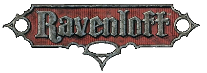
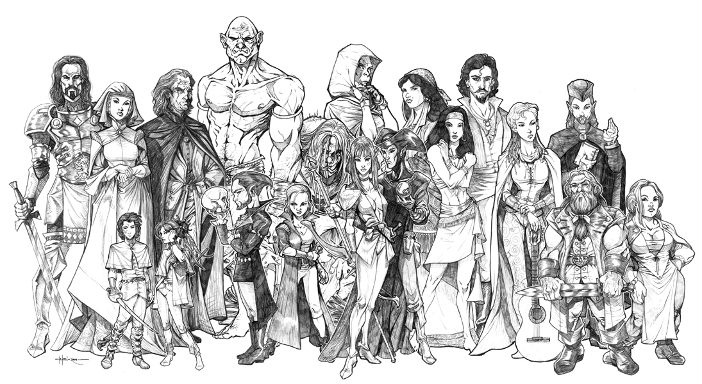

# Ravenloft

Равенлофт (англ. Ravenloft) — сеттинг Dungeons and Dragons, выполненный в готической традиции. Равенлофт описывает особое карманное измерение (демиплан), известное под именем «Демиплан ужаса». Демиплан, в свою очередь, состоит из уникальных территорий, называемых доменами. Каждым доменом управляет тиран или злодей (Тёмный Владыка, Дарклорд), заточенный в пределах собственной территории в результате некоторого ужасного поступка. Вершат судьбу демплана и его обитателей таинственные и непостижимые Темные Силы, чьи возможности на демиплане безграничны или близки к этому.

Название сеттингу дал замок Равенлофт (англ. Ravenloft), сердце первого домена Земель Туманов — Баровии. Стоит отметить, что устоявшееся в среде русскоязычных ролевиков название «Равенлофт» является неправильной транскрипцией названия замка, более точным будет прочтение «Рэйвенлофт».

## Особенности игровой механики

|   |
|---|
||
|Представители народов, населяющих Демиплан ужаса.|

Игромеханика сетинга обладает следующими особенностями:

1. Введены правила на проверку страха, ужаса и безумия (в AD&D появились три специальных 
   спасброска, тогда как в Ravenloft d20 проверка осуществляется модифицированным спасброском на волю)
2. Введены специальные правила на использование проклятий.
3. Введены проверки темных сил, совершающиеся по результатам злодеяний
4. Создана механика путешествия по снам (приложение Nightmare Lands).
5. Ravenloft D20 обладает параметром Outcast Raiting, который отражает враждебность жителей домена к персонажу

Известно, что Ravenloft D20 создавался по специальному соглашению между White Wolf и Wizards of the Coast, вследствие чего версия сеттинга под D&D 3.x не выходила под лейблом Dungeons & Dragons.

## Устройство сеттинга

### [Домены](https://rpg.fandom.com/ru/wiki/%D0%94%D0%BE%D0%BC%D0%B5%D0%BD_(%D0%A0%D0%B0%D0%B2%D0%B5%D0%BD%D0%BB%D0%BE%D1%84%D1%82))

### Туманы

Еще одним важным элементом Равенлофта являются угрюмые туманы — предвестники опасностей в старинных готических романах. Вне всякого сомнения, туманы Царств Страха живут собственной жизнью и являются носителями воли Темных Сил. В Доменах Ужаса даже самые маленькие дети слышали об островах и отдельных территориях, со всех сторон окруженных белесым саваном зла. Путешествие в подобные места грозит героям чрезвычайными опасностями, поскольку персонаж, вошедший в туманы, обычно вскоре понимает, что окончательно сбился с пути и не знает, куда идти дальше. Расстояние и направление в туманах не соответствуют физическим реалиям сеттинга. Таким образом, верного направления можно держаться только тогда, когда герой следует во мгле так называемым туманным путем. Однако, стоит отметить, что Туманные Пути частенько «сносит», в результате чего герой может выйти из белого савана очень далеко от первоначальной цели путешествия. Бывает и так, что подобный «снос» перебрасывает персонажей не только в другие земли, но и в другие времена. Гораздо более надежным туманное путешествие оказывается тогда, когда вместе с героями следуют Вистани или могущественные клирики — Анахореты Эзры.

Туманы — это вовсе не банальный флюид, заполняющий пространство между доменами. Это мрачная живая сила, которая захватывает в плен людей и нелюдей, действия которых смогли заинтересовать Темные Силы. Кроме того, туманы способны инициировать многие неестественные эффекты, невозможные в мирах, подчиняющихся законам классической физики. В Доменах Ужаса обычны легенды, повествующие о людях, блуждавших много дней по небольшой чаще, а также рассказы о темных городских улицах, которые превращались в запутанные лабиринты. Нередки истории о домах, внутренние помещения которых содержат больше комнат, чем позволяют их внешние размеры. Конечно, многие ученые пытались объяснить загадочные феномены мрачной реальности. Однако до сих пор неизвестно, искажают ли туманы чувства людей или на ходу переделывают саму ткань мироздания. Вопрос открыт, и ответов на него не получено!

В легендах обитателей Равенлофта туманную границу зовут не иначе, как Туманы Конца Мира или Туманы Смерти. Подобные эпитеты не удивительны, поскольку мгла, текущая между доменами, является домом для легионов невообразимых чудовищ.

### [Тёмные Владыки](https://rpg.fandom.com/ru/wiki/%D0%A2%D1%91%D0%BC%D0%BD%D1%8B%D0%B9_%D0%92%D0%BB%D0%B0%D0%B4%D1%8B%D0%BA%D0%B0)

### Тёмные Силы

Тёмные Силы выковали Равенлофт согласно своим мрачным вкусам, но даже самая мощная магия предсказания бессильна определить их природу. Мало кто в Равенлофте вообще осведомлен об их существовании и даже знающие оккультисты, размышляющие над их природой, частенько приходили к фантомам собственного разума. Так что же такое Тёмные Силы? Ответа на этот вопрос не может дать никто. Мы можем лишь строить догадки относительно их истинной природы. Некоторые считают, что Тёмные Силы — это пантеон мертвых богов, другие думают, что это материализованное воплощение человеческих грехов, третьи приходят к выводу, что Силами является сама земля Равенлофта. В последнее время появилось множество новых интересных гипотез. К примеру, появилась целая теория, доказывающая, что Тёмные Силы — это Великие Древние. Ещё одна гипотеза связывает Тёмные Силы с Леди Боли.

Однако, все вышеозначенные гипотезы не опираются на реальные факты и, как следствие, не могут быть доказаны. Хуже того, мы не знаем, добро или зло олицетворяют собой угрюмые властители Царств Страха. Казалось бы, Тёмные Силы навечно заперли жутких злодеев в туманных темницах мучения. Они никогда активно не склоняют смертных к злу и просто реагируют на тех, кто уже сам погряз во грехе. По этой причине их можно назвать олицетворением строгого правосудия. С другой стороны, ряд оккультистов замечает, что мучения владык доменов, насылаемые на них Тёмными Силами, доводят злодеев до агонии, погружая последних в еще больший порок. Кроме того, что можно сказать насчет невинных, которые попали в когти туманных чудовищ, или крестьян, которые становятся жертвами ужасов? Может быть, Тёмные Силы получают удовольствие, наблюдая за гибелью невинности, или специально показывают дарклордам тот путь, на который им никогда не вернуться?

## История сеттинга

Сеттинг Равенлофт начал свое существование в 1983 году, когда на свет появился модуль Трейси и Лауры Хикмен под названием «Castle Ravenloft». Успех приключения был столь велик, что уже через год, те же самые авторы выпустили прямое продолжение своего мрачного рассказа — «Ravenloft II: House Of The Gryphon Hill». Стоит отметить, что первоначальные творцы готической вселенной не задумывались о выпуске полномасштабного сеттинга, и завершили работу над миром сразу же после выхода второй серии приключений. Однако начало было положено и путь к спасительному отступлению окончательно затерялся среди угрюмых туманов Царств Страха. «Зловещим» последователям семейства Хикман не оставалось ничего иного, как двигаться по заранее проложенной дороге готического эпика.

Первый настоящий вариант сеттинга Ravenloft — так называемая «Чёрная коробка» (Black Box) — вышел из-под пера Андрии Хайдэй и Брюса Несмита в 1991 году. Книга детализировала Царства Страха до Великого потрясения и включала в себя краткие описания всех существовавших (на то время) доменов и тёмных владык. Издание было отлично оформлено и отличалось не только детальными картами Ядра, но и уникальными цветными иллюстрациями основных персонажей. Для того, чтобы закрепить серьезный успех первого издания, дизайнеры Равенлофта выпустили специальное приложение «Forbidden Lore», которое познакомило игроков с вистанской карточной тароккой, описало главные секретные общества мрачной вселенной и рассказало первые правила отыгрыша ночных кошмаров. Кроме того, творцы мира запустили серию из шести модулей, которая должна была подготовить мир к инициации Великого потрясения, а также начали писать Руководства ван Рихтена по монстрам. Каждый трактат великого ученого содержал детальную информацию по одному типу чудовищ. На протяжении шести лет свет увидели руководства по вампирам, оборотням, призракам, големам, личам, древним мертвым, вистани и ведьмам.

После того, как Великое Потрясение завершилось, авторам сеттинга пришлось выпустить вторую книгу основных правил, которая описывала состояние мира на момент завершения грандиозной катастрофы. «Ravenloft Campaign Setting» или «Красная коробка» (Red Box) включил в себя не только все изменения, происшедшие с царствами страха после знаменательной даты, но также содержал на своих страницах описания новых доменов и кластеров.

Период с 1993 по 1997 год стал Золотым веком Равенлофта. Именно в этот промежуток времени появились дополнительные кампании «Nightmare Lands», «Requiem» и огромное количество модулей, связанных с событиями, имевшими место до гибели Ил Алука. TSR, Inc., тогдашний владелец готической вселенной, не остановилась на написании одних лишь настольных приложений. Довольно скоро лейбл Ravenloft появился на художественных книгах (часть из них была переведена на русский язык в начале 90-ых) и компьютерных играх («Ravenloft:Strahd’s Possession», «Stone Prophet», «Iron And Blood»). До момента трагической гибели TSR, Равенлофт входил в число лидирующих сеттингов, завоевав огромное количество поклонников по обе стороны океана. Однако, сказка не могла продолжаться вечно. Когда в мир вышел новый набор игровых правил — «Domains of Dread» — TSR вошла в период глубокого кризиса. В 1999 году ролевой гигант рухнул, а его правопреемник Wizards of the Coast решил сконцентрироваться на сеттингах Forgotten Realms и Greyhawk. Направление сеттинга Ravenloft слишком сильно расходилось с основной линией развития системы. И тогда Равенлофт умер… умер, но не перестал существовать.

Подобно древнему мертвому, или ожившему ходячему мертвецу, Равенлофт начал новую жизнь под бдительным руководством самых упертых фанатов (часть из них ранее писала официальные книги). Собравшись под знаменами Каргатана (секретного дарконийского общества), почитатели мрачного мира стали выпускать собственные приложения и самодельные модули. Их упрямая вера в сеттинг привела к тому, что вселенной заинтересовалось свободное ролевое издательство Sword & Sorcery Studios, которое искало неординарный мир, способный принести прибыль. Именно тогда началась вторая жизнь Равенлофта.

В 2001 году, Wizard-ы продали права на вселенную Sword and Sorcery, которая совместно с фирмой White Wolf основала небольшую конторку Art House, ориентированную на работу с проектами, базирующимися на сторонних лицензиях. Новая инсталляция готической вселенной была конвертирована под правила D&D 3.0, после чего свет увидел четвёртый выпуск основных правил (он назывался «Ravenloft d20»). Поскольку сама AH модулями заниматься не собиралась, дизайнеры сеттинга запустили несколько книжных линеек, способных восполнить эту трагическую потерю. Самым знаменитым проектом Sword and Sorcery стал «Атлас Судного дня» — энциклопедический путеводитель по Ядру, который к моменту свертывания работ насчитывал 5 двухсотстраничных томов. Кроме того, новые держатели лицензии продолжили работу над Руководствами Ван Рихтена и даже создали оригинальный spin-off, под названием «Арсенал Ван Рихтена». К сожалению, дальше первого тома работы над этой серией не продвинулись. Еще одной интересной задумкой AH оказалась серия книг про темных и светлых героев. К сожалению, оригинальная идея была частично испорчена самими авторами гримуара, которые были плохо знакомы с механикой DnD и провели чрезвычайно неудачную конверсию базовых персонажей, изначально обладавших ADnDшными характеристиками.

Печально, но за два года непрерывных работ новые владельцы вселенной не сумели придумать ничего нового и толкли в ступе ту же самую воду, которую в свое время наливала TSR. Первым признаком надвигающегося кризиса стал закономерный спад продаж на книжные приложения.

Чтобы обезопасить себя от возможных финансовых потерь, Art House провела успешный трансфер Равенлофта на новые правила DnD версии 3.5. После этого, SnS решила содрать с почитателей сеттинга еще немного денег, продав им немного измененный Ravenloft D20 (v3.5) и модернизированный монстрятник. Естественно, что вышеозначенная инициатива завершилась для издателей полным провалом. Лишь самые упертые фанаты купили новые редакции старых книг, в которых содержалось не более 5 % нового материала. По всей видимости, это и стало началом конца. Выпустив пятый том Атласа, Книгу мастера и еще одно руководство Ван Рихтена (в этот раз по Теневым Феям), Art House сконцентрировался на разрушительной авантюре, получившей название «Masque of the Red Death» D20. Обновленный сеттинг, напоминавший собой Готическую землю Викторианского периода, должен был базироваться на фундаментальных правилах Равенлофта. Говоря компьютерными терминами, это была тотальная конверсия. «Маска» вышла в свет в конце 2004 года, но ее релиз инициировал ряд крупных скандалов, связанных с массовыми ошибками в тексте книги и с серьезными проблемами в игровой механике. К началу 2005 года всем стало понятно, что Art House хочет избавиться от готической «иконы», для того, чтобы бросить все свободные силы на популярные в широких народных массах Warcraft D20 и Everquest D20.

Май 2005 года, отметился последней книгой по Равенлофту третьей редакции. Ею стала холодно воспринятая фанатами «Dark Tales and Disturbing Legends», ставшая жуткой смесью готического романа и приключенческого полуфабриката. Долгожданное «Руководство Ван Рихтена По Туманам» так и не было напечатано, поскольку в августе руководство Sword and Sorcery вернуло права на Равенлофт фирме Wizards of the Coast (следует заметить, что в сентябре 2005 г. «Руководство По Туманам» было выложено на веб-сайте Sword and Sorcery для бесплатного скачивания). Все находящиеся в работе проекты были свернуты. В их число совершенно точно попала «Masque of the Jade Dragon», несколько руководств Ван Рихтена и тома «Атласа Судного дня» после пятого. К середине 2000-х гг. один из самых знаменитых и долгоиграющих сеттингов AD&D/D&D оказался в состоянии глубокой заморозки. Выживание вселенной целиком легло на плечи верных фанатов…

Однако с выходом четвёртой редакции D&D WotC вернулись к сеттингу и анонсировали на 2011 г. выход нового издания Равенлофта. В связи с изменением космологии в D&D 4, новый Равенлофт будет представлять собой закрытые фрагменты Царства теней, управляемые тёмными владыками. Таким образом, Царства ужаса новой редакции будут отдалённо напоминать второредакционные Острова ужаса, а приключения в них будут проходить в стиле «выходные в аду». Анонс Равенлофта D&D 4 вызвал весьма неоднозначную реакцию среди поклонников сеттинга. В августе 2010 года на форумах WotC последовало подтверждение, что новый Равенлофт появится в четвёртом квартале 2011 года, но уже в марте 2011 года появилась информация о том, что «Ravenloft Boxed Set» отменён (или, по другим утверждениям, отложен на время). Позже на форумах обсуждались слухи о том, что сеттинг целиком не будет переиздаваться, а его отдельные элементы и персонажи будут помещены в Царство теней.

## [История Равенлофта](https://rpg.fandom.com/ru/wiki/%D0%A0%D0%B0%D0%B2%D0%B5%D0%BD%D0%BB%D0%BE%D1%84%D1%82_(%D1%85%D1%80%D0%BE%D0%BD%D0%BE%D0%BB%D0%BE%D0%B3%D0%B8%D1%8F))

Даты важнейших событий сеттинга даются по календарю Баровии (Б. К.)

* 299 Б. К. — рождение Страда фон Заровича.
* 320 Б. К. — вторжение захватчиков-тергов в Баровию.
* 347 Б. К. — Страд фон Зарович побеждает последних тергских князей на территории Баровии и приказывает перестроить разрушенную цитадель Дурукан, переименовав её в замок Равенлофт.
* 351 Б. К. — Из-за отчаянной страсти к невесте своего брата, Страд фон Зарович заключает кровавый договор с неизвестной сущностью, превращаясь в вампира. Страд тайно убивает своего брата. Резня в замке Равенлофт, устроенная врагами Страда, в ходе которой становится ясна нечеловеческая сущность графа. Гибель Татьяны — возлюбленной Страда. Стена непроницаемого тумана окутывает Баровию, отделяя её от прочего мира и превращая в первый домен Равенлофта.
* 469—470 Б. К. — кочевое племя вистани приходит из-за стен тумана. Его глава — мадам Ева — заключает договор о взаимопомощи со Страдом.
* 475 Б. К. — появление Мартина Пеклара и формирование культа Утреннего Бога.
* 480 Б. К. — Будущий лич Азалин казнит собственного сына и получает от тёмных сил секрет бессмертия.
* 542 Б. К. — лич Азалин в ходе бегства из своих владений попадает в Баровию и поступает на службу Страду.
* 547 Б. К. — появление у южных границ Баровии домена Форлон.
* 551 Б. К. — появление домена Хар’Акир.
* 554 Б. К. — появление домена Паридон.
* 564 Б. К. — появление домена Себуя.
* 575 Б. К. — появление Арака.
* 579 Б. К. — попытка Страда и Азалина покинуть Равенлофт приводит к появлению домена Мордент.
* 579 Б. К. — Азалин покидает Страда и становится лордом Даркона.
* 581 Б. К. — появление домена Блютспур.
* 590 Б. К. — появление домена Фаразия.
* 593 Б. К. — появление домена Гундарк.
* 603 Б. К. — появление домена Индивия.
* 607 Б. К. — появление домена Сангвиния.
* 613 Б. К. — Харкон Лукас бежит из Баровии и становится лордом домена Картакасс.
* 615 Б. К. — появление домена Нидала.
* 630 Б. К. — появление Моря Печали.
* 635 Б. К. — появление доменов Сурань и Грабен.
* 671 Б. К. — родился Рудольф ван Рихтен.
* 682 Б. К. — появление домена Новая Васса.
* 683 Б. К. — появление домена Ламордия.
* 700 Б. К. — Драков нападает на Даркон. Первая война Кампании Мертвецов.

## Художественная литература и компьютерные игры

В середине 90-ых годов прошлого века, фирма Dreamforge Entertainment приобрела у TSR лицензию на создание игр, базирующихся на сеттинге Ravenloft. За три года разработчики создали две компьютерные ролевые игры «Ravenloft: Strahd’s Posession» и «Ravenloft: Stone Prophet», а также уникальный ролевой файтинг «Iron & Blood: Warriors of Ravenloft».

Компанией TSR был также выпущен бустер «Ravenloft» (август 1994 г.)[1] к коллекционной карточной игре Spellfire: Master the Magic (автор Джеймс Вард).

По сеттингу написано большое число художественных произведений. Часть из них переведена на русский.

* TSR 8056 Вампир Туманов (англ. Vampire of the Mists) (изд. сентябрь 1991 г.), автор — Кристи Голден (ISBN 1-56076-155-5)
* TSR 8057 Рыцарь Черной Розы (англ. Knight of the Black Rose) (изд. декабрь 1991 г.), автор — Джеймс Лаудер (ISBN 1-56076-156-3)
* TSR 8058 Танец мертвых (англ. Dance of the Dead) (изд. июнь 1992 г.), автор — Кристи Голден (ISBN 1-56076-352-3)
* TSR 8059 Сердце полуночи (англ. Heart of Midnight) (изд. декабрь 1992 г.), автор — Дж. Роберт Кинг (ISBN 1-56076-355-8)
* TSR 8060 Полотно тёмных душ (англ. Tapestry of Dark Souls) (изд. март 1993 г.), автор — Элейн Бергстром (ISBN 1-56076-571-2)
* TSR 8061 Карнавал страха (англ. Carnival of Fear) (изд. июль 1993 г.), автор — Дж. Роберт Кинг (ISBN 1-56076-628-X)
* TSR 8062 Я, Страд: мемуары вампира (англ. I, Strahd: The Memoirs of a Vampire) (изд. сентябрь 1993 г.), автор — П. Н. Элрод (ISBN 0-7869-0175-6)
* TSR 8063 Враг внутри (англ. The Enemy Within) (изд. февраль 1994 г.), автор — Кристи Голден (ISBN 1-56076-887-8)
* TSR 8064 Морденхейм (англ. Mordenheim) (изд. май 1994 г.), автор — Чет Вилльямсон (ISBN 1-56076-852-5)
* TSR 8065 Равенлофтские истории (англ. Tales of Ravenloft) (изд. сентябрь 1994 г.), под редакцией Брайна Томсена (ISBN 1-56076-931-9)
* TSR 8067 Башня Судьбы (англ. Tower of Doom) (изд. ноябрь 1994 г.), автор — Марк Антоний (ISBN 0-7869-0062-8)
* TSR 8069 Кровавая баронесса (англ. Baroness of Blood) (изд. март 1995 г.), автор — Элейн Бергстром (ISBN 0-7869-0146-2)
* TSR 8068 Смерть тёмного владыки (англ. Death of a Darklord) (изд. июнь 1995 г.), автор — Лорел Гамильтон (ISBN 0-7869-4122-7)
* TSR 8070 Ученик распада (англ. Scholar of Decay) (изд. декабрь 1995 г.), автор — Таня Хафф (ISBN 0-7869-0206-X)
* TSR 8071 Король мертвых (англ. King of the Dead) (изд. март 1996 г.), автор — Джин ДиВизи (ISBN 0-7869-0483-6)
* TSR 8072 В постели со злом (англ. To Sleep with Evil) (изд. сентябрь 1996 г.), автор — Андреа Кардарелла (ISBN 0-7869-0515-8)
* TSR 8073 Повелитель Некрополиса (англ. Lord of the Necropolis) (изд. ноябрь 1997 г.), автор — Джин ДиВизи (ISBN 0-7869-0660-X)
* TSR 8074 Рожденный в тени (англ. Shadowborn) (изд. март 1998 г.), авторы — Кэрри Бэбрис и Уильям Коннорс (ISBN 0-7869-0766-5)
* TSR 8075 Я, Страд: война против Азалина (англ. I, Strahd: The War Against Azalin) (изд. июнь 1998 г.) автор — П. Н. Элрод (ISBN 0-7869-0754-1)
* TSR 21333 Призрак Черной Розы (англ. Spectre of the Black Rose) (изд. март 1999 г.), авторы — Джеймс Лаудер и Вороника Уитни-Робинсон (ISBN 0-7869-1333-9)

----

* [География Ravenloft](https://rpg.fandom.com/ru/wiki/%D0%93%D0%B5%D0%BE%D0%B3%D1%80%D0%B0%D1%84%D0%B8%D1%8F_Ravenloft)
* [Список литературы по Ravenloft](https://rpg.fandom.com/ru/wiki/%D0%A1%D0%BF%D0%B8%D1%81%D0%BE%D0%BA_%D0%BB%D0%B8%D1%82%D0%B5%D1%80%D0%B0%D1%82%D1%83%D1%80%D1%8B_%D0%BF%D0%BE_Ravenloft)
* [Тайные общества Ravenloft](https://rpg.fandom.com/ru/wiki/%D0%A2%D0%B0%D0%B9%D0%BD%D1%8B%D0%B5_%D0%BE%D0%B1%D1%89%D0%B5%D1%81%D1%82%D0%B2%D0%B0_Ravenloft)
* [Хронология Ravenloft](https://rpg.fandom.com/ru/wiki/%D0%A5%D1%80%D0%BE%D0%BD%D0%BE%D0%BB%D0%BE%D0%B3%D0%B8%D1%8F_Ravenloft)
* [Языки Ravenloft](https://rpg.fandom.com/ru/wiki/%D0%AF%D0%B7%D1%8B%D0%BA%D0%B8_%D0%A0%D0%B0%D0%B2%D0%B5%D0%BD%D0%BB%D0%BE%D1%84%D1%82%D0%B0)

----

* [Серый кардинал](http://www.graycardinal.narod.ru/) — Переводы по Равенлофту. В основном по 2-ой редакции сеттинга.
* [Равенлофт D20](http://www.ravenloft.dungeons.ru/) — Переводы третьей редакции сеттинга. Ныне не обновляется.
* [Fraternity of Shadows](http://www.fraternityofshadows.com/) — Крупнейший фан-сайт посвященный Равенлофту
* [Secrets of the Kargatane](http://www.kargatane.com/) — Классический сайт Каргатана. Ныне не поддерживается создателями.
* [Midway Haven Alchemical Observatory](http://www.geocities.com/midwayhaven/) — Популярный фан-сайт, занятый производством сетевых приложений.
* [White Wolf Downloads](http://www.white-wolf.com/downloads.php?category_id=21) — Сайт третьей редакции Ravenloft-а.

----

A gothic horror setting originally created for an adventure module, Ravenloft,
then expanded into an entire series and campaign setting. After years of
production by TSR and WotC, Wizards of the Coast licensed Ravenloft to Arthaus
Games, which published its materials through White Wolf, Inc.'s Sword &
Sorcery Studios label, but rights returned to Wizards of the Coast in
early 2006. In October 2006, Wizards of the Coast released Expedition to
Castle Ravenloft, an updated version of the original module, as a hardcover.
In August 2010, Wizards of the Coast released the Castle Ravenloft board game,
and in 2011 announced the release of the Ravenloft Roleplaying Game, which was
a standalone game that can double as a 4th Edition Campaign Setting. This was
subsequently canceled.

## Hardbacks

* 2174	Domains of Dread

## Boxed Sets

* 1053	Ravenloft Realm of Terror
* 1108	Ravenloft Campaign Setting
* 1079	Forbidden Lore
* 1088	Castles Forlorn
* 1103	Masque of the Red Death and Other Tales
* 1124	The Nightmare Lands
* 1141	Bleak House
* 1146	Requiem: The Grim Harvest
* 9494	A Light In the Belfry

# Accessories

* 9331	RR1 Darklords
* 9336	RR2 Book of Crypts
* 9348	RR4 Islands of Terror

* 9345	RR3 Van Richten’s Guide to Vampires
* 9355	RR5 Van Richten’s Guide to Ghosts
* 9412	RS1 (RR6) Van Richten’s Guide to the Lich
* 9416	RR7 Van Richten’s Guide to Werebeasts
* 9417	(RR8) Van Richten’s Guide to the Created
* 9451	(RR9) Van Richten’s Guide to Ancient Dead
* 9477	(RR10) Van Richten’s Guide to Fiends
* 9496	(RR12) Van Richten’s Guide to the Vistani

* 11447	Van Richten's Monster Hunter's Compendium Volume One
* 11507	Van Richten's Monster Hunter's Compendium Volume Two
* 11613	Van Richten's Monster Hunter's Compendium Volume Three

* 9498	The Gothic Earth Gazetteer
* 9529	A Guide to Transylvania

* 9510	Forged of Darkness
* 9559	Champions of the Mists
* 11382	Carnival

* 9513	Children of the Night: Vampires
* 9555	Children of the Night: Ghosts
* 9583	Children of the Night: Werebeasts
* 11360	Children of the Night: The Created

* 2122	MC10 Monstrous Compendium
* 2139	MC15 Monstrous Compendium II: Children of the Night
* 2162	Monstrous Compendium I & II
* 2153	Monstrous Compendium III: Creatures of Darkness

* 91271	Introduction to the Land of the Mists

## Adventures

* 9298	RA1 Feast of Goblyns
* 9321	RA2 Ship of Horror
* 9338	RA3 Touch of Death

* 9413	RM1 Roots of Evil
* 9414	RM2 The Created
* 9415	RM3 Web of Illusion
* 9418	RM4 House of Strahd

* 9352	RQ1 Night of the Walking Dead
* 9364	RQ2 Thoughts of Darkness
* 9375	RQ3 From the Shadows

* 1163	The Shadow Rift
* 9419	Dark of the Moon
* 9439	Adam’s Wrath
* 9452	The Awakening
* 9456	Hour of the Knife
* 9466	Howls in the Night
* 9476	When Black Roses Bloom
* 9493	Circle of Darkness
* 9495	(RR11) Chilling Tales
* 9497	The Evil Eye
* 9499	Neither Man Nor Beast
* 9523	Death Unchained
* 9526	Death Ascendant
* 9537	The Forgotten Terror
* 9541	Servants of Darkness
* 9582	Vecna Reborn

The origins of the Ravenloft series are found in modules I6 Ravenloft and I10
Ravenloft II: The House on Gryphon Hill.

The module Ravenloft was revised for Second Edition as an RPGA exclusive.

Modules Castle Spulzeer and Die Vecna Die! both feature Ravenloft crossovers.

## 3ed

### Hardbacks

* WW15000	Ravenloft Campaign Setting
* WW15099	Ravenloft Limited Edition

* WW15002	Denizens of Darkness
* WW15004 Dungeon Master's Guide
* WW15005 Player's Handbook
* WW15006 Denizens of Dread
* WWP15007 Masque of the Red Death

### Accessories

* WW15001	Secrets of the Dread Realms
* WW15003	Champions of Darkness
* WW15010	Van Richten's Arsenal Volume I
* WW15011 Van Richten's Guide to the Walking Dead
* WW15012 Van Richten's Guide to the Shadow Fey
* WW15020	Gazetteer Volume I
* WW15021 Gazetteer Volume II
* WW15022 Gazetteer Volume III
* WW15023 Gazetteer Volume IV
* WW15024 Gazetteer Volume V
* WW15030	Heroes of Light
* WW15031 Legacy of Blood: Great Families of the Core
* WW15032 Dark Tales & Disturbing Legends
* WW15049 Tarokka Deck

## Masque of the Red Death

A spin off of Ravenloft set in a fantasy, low magic, version of 1890s Earth.
This campaign setting is no longer officially supported.
