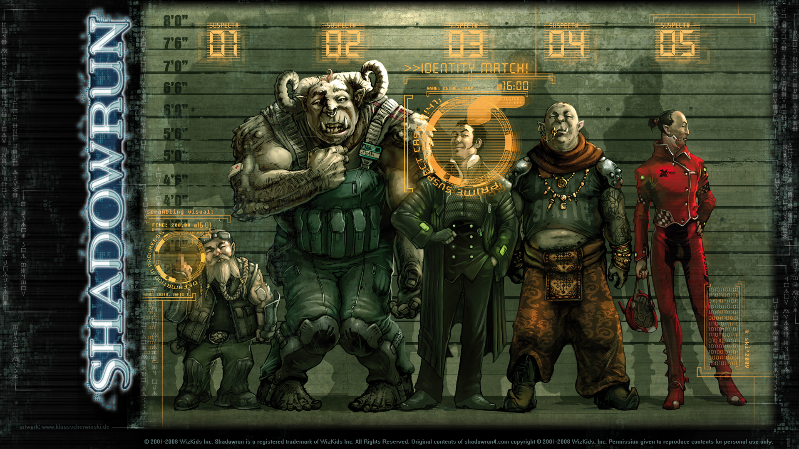

# Shadowrun

Shadowrun (Шедоуран) — настольная ролевая игра про альтернативное будущее, в котором с одной стороны жизнь людей контролируется мегакорпорациями, а с другой — в мир вернулась магия, порядочно его изменив. Для разрешения своих проблем корпорации, правительства, мафия и просто достаточно состоятельные люди нанимают особых специалистов, самые способные и удачливые из которых называются shadowrunners (англ. «бегущие по теням»). Такими шедоураннерами и являются PC, а какая перед ними стоит миссия, определяет Мастер.

Шедоуран развивался и публиковался корпорацией FASA с 1989 по 2001, после её закрытия права перешли к WizKids. На 2014 год текущая редакция — пятая (издаётся Catalyst Game Labs), вышло уже более сотни игровых дополнений, около сотни художественных книг, видеоигры и пр. Основные правила, несколько дополнений и коллекционная карточная игра получали призы Origins Awards, а четвёртая редакция взяла ещё и два приза ENnie: за лучшие правила и лучший продукт 2006.

Шедоуран — игра кросс-жанровая, объединяющая элементы киберпанка и городского фэнтези.

## Сеттинг

|   |
|---|
||
|Гном,тролль,человек,орк и эльф|

Магия вернулась в 2011 году и превратила некоторых людей в металюдей: эльфов, дварфов, орков или
троллей. Также существуют т. н. «метаварианты»: гномы, великаны, минотавры и пр. После возвращения кометы Галлея появился новый подтип: оборотни (changelings). Метачеловеком можно быть с рождения, но есть и те, кто рождаются обычными людьми и потом «гоблинизируются» (обычно в орков или троллей). Феномен получил название Необъяснимого Генетического Проявления (Unexplained Genetic Expression, UGE). Кроме того, существует вирус HMHVV (Human Meta-Human Vampiric Virus), превращающий людей в вампиров, эльфов — в баньши, дварфов — в гоблинов, и так далее. Создание персонажа заключается в том, что игрок выбирает, быть ли персонажу обычным человеком или принадлежать к одному из подтипов, а затем добавляет киберимплантанты, магические способности, умения и снаряжение. В конце приключения мастер раздаёт «карму», которая используется для улучшения атрибутов и способностей.

Главными антагонистами в мире Шедоурана в соответствии с канонами киберпанка являются мегакорпорации (сокр. «megas», «corps»). В XXI веке они настолько глобальны, что редко какой бизнес не имеет филиалов и дочерних фирм по всему миру. Они полностью правят миром, и у крупнейших корпораций больше политической, экономической и военной мощи, чем у стран. Мегакорпорации разделяются по рангам: ААА — самые весомые, затем АА и А. Большинство корпораций рангов АА и ААА не подчиняются локальным законам, отвечая за свои действия только перед Корпоративным Судом (Corporate Court), состоящим из крупнейшей десятки фирм ранга ААА, владея безраздельно землёй и даже выдавая гражданство (у многих сотрудников гражданство в таком случае может быть двойным: страны и корпорации).

Корпорации (особенно ААА) противостоят друг другу не только на деловых переговорах, но и физически: диверсиями, нелегальными операциями, переманиванием или уничтожением персонала, саботажем. Отвечать за свои действия они при этом, разумеется, не хотят, что и приводит к наниманию незаметных для системы шедоураннеров, не имеющих идентификационного номера (System Identification Number, SIN).

Десятка крупнейших мегакорпораций ранга ААА к 2070: Ares Macrotechnology (технологический конгломерат, из реальных прототипов поглотивший General Motors, НАСА, Apple), Aztechnology (товары общего потребления, химия, магия), Evo Corporation (русская корпорация, занимающаяся нанотехнологией, биотехнологией, исследованием генетики и трансгуманистическими технологиями), Horizon (средства массовой информации, недвижимость, фармакология), Mitsuhama Computer Technologies (тяжёлая промышленность, Робототехника, компьютеры), NeoNET (беспроводная Матрица), Renraku Computer Systems (японское оружие и вычислительная техника), Saeder-Krupp Heavy Industries (производство стали, машин, оружия, включает, например, BMW), Shiawase Corporation (энергетика, биотехнология, экологическая экспертиза), Wuxing Inc. (логистика и финансы).

## Хронология мира

* 1980, 8 декабря: был застрелен Джон Леннон. Каждый, рожденный в этот день, получил наследство согласно Завещанию Дункельзана после его смерти в 2057 году, так как "все в этом веке должны оплакивать потери прошлого века".
* 1984: в Японии из-за длительной внутренней борьбы за верховенство в Ямагучи-гуми был сформирован Ичива-кай, клан якудза Шестого Мира.
* 1987: родился Лиам О'Коннор, эльф-дите Спайка (условное наименование металюдей, родившихся до Пробуждения), будущий лидер эльфийского крыла ИРА, которое создаст Тир-на-нОг.
* 1990ые: Группы хакеров, стремящиеся к обнаружению дыр в безопасности, становятся более активными. Формируются также группы людей, использующих такие же технологии, как и обычные хакеры, но сплоченные политическими или социальными мотивами. В Интернете начинают распространяться вирусы.
* 1999: Верховный Суд США узаконивает возможность Корпорации Серетех содержать вооружённые силы для защиты персонала и собственности, легализируя частные армии корпораций.
* 2001: Верховный Суд США дает право Корпорации Шиавази (после чего данный прецедент используют другие межнациональные корпорации) действовать экстерриториально. 
* 2002: Разработан первый оптический чип, способный выдержать электромагнитные импульсы.
* 2003: Внезапное наводнение из Северного моря захлёстывает Германию. Множество производств попадает в зону затопления. Гамбург затоплен, некоторым ядерным станциям требуется экстренное отключение.
* 2004: Авария в Великобритании, на ядерном реакторе в графстве Кент. Возникает локальная заражённая зона. Гибнет более 6 000 человек.
* 2005: Крупное землетрясение поражает Нью-Йорк, гибнет 200 000 человек, миллиарды ущерба. Корпорации отстраивают город в обмен на некоторые уступки, которые позволяют им более эффективно управлять.
* 2005—2006: Поддерживаемая японскими корпорациями Южная Корея объявляет войну Северной. К концу года Северная Корея полностью захвачена. Окрылённая успехом Корейского конфликта, Япония объявляет себя Японской Империей.
* 2006: Успешно клонирован сумчатый волк, используя замороженные образцы, полученные из ледников.
* 2008: Метеор попадет в станцию Мир-1 (которую русские продали корпорации Харрис-3М), гибнет два члена команды. Остальные гибнут позже, когда спасательная операция проваливается.
* 2009: Инцидент «Одинокий орёл»: борцы за свободу из американских индейцев захватывают ракетную шахту на северо-западе Монтаны и угрожают запустить ракеты, если правительство США не вернёт им индейскую землю.
* 2009—2010: В ответ на инцидент «Одинокий орёл» конгресс США издаёт акт о переселении. Акт призывает к заключению всех лиц, связанных с Независимым Американским Индейским Движением. Канадский парламент издаёт Непеанский акт, легализуя лагеря для коренных американцев. В 2010-ом тысячи коренных американцев отправляются в «центры переобучения». Многие из них никогда не вернутся.
* 2010: Вирус токсичного аллергического синдрома (ВИТАС) — новая Чёрная Смерть. Мировая чума убивает 25 % населения в течение одного года.
* 2011: Начинается Пробуждение. Определение «Необъяснимая Генетическая Экспрессия» (НГЭ) входит в лексикон, начинают рождаться эльфийские и гномские дети от человеческих родителей.
* 2012: Великий дракон Дункельзан впервые появляется около озера Черри Крик в Денвере. После публикации интервью с драконом становятся известны первые факты о возрождении магии, называемом Пробуждение.
* 2012—2018: Коренные Американские Нации (NAN) используют в качестве основного оружия против американцев и канадцев магию в ходе Североамериканской Индейской Войны. Хаос достиг апогея 17 августа, когда горы Hood, Rainer, St. Helens и Adams разрушаются в магическом катаклизме. 
* 2015: Гонконская Свободная Корпоративная Зона объявляет независимость от Китая благодаря Триадам и подкупленным банкирам.
* 2015—2016: Орбита американской станции «Свобода» начинает снижаться. Ученые предсказывают, что она сгорит в атмосфере в течение двух лет. В 2016 Арес Индастрис покупает НАСА у США, стабилизирует орбиту и начинает расширять станцию.
* 2018: Денверское соглашение закрепляет права NAN в большей части Северной Америки. Обеспечение продовольствием и управление таких городов, как Сиэтл, выступающих в роли анклавов, остается за США, как и большая часть Калифорнии.
* 2019: Доктор Хосато Хикито создаёт первое поколение ASIST (технология искуственного осязания).
* 2019: Корпорация Transys объявляет о первом успешном имплантировании искуственного органа человеческому существу, виртуозному виолончелисту, потерявшему левую руку при несчастном случае с поездом.
* 2012: В ответ на джихад, объявленный распространяющимся метачеловеческим расам Иранскими Аятоллами, дракон Аден уничтожает город Тегеран.
* Мировой банк, страдающий от финансовых проблем, замещается Мировой Финансовой Службой, базирующейся в Цюрихе. Арес Индастрес раскрывает подробности о своей новой космической платформе Аполлон.
* 2021: Спонтанные НГЭ происходят по всему миру, когда взрослые и дети превращаются в новые метачеловеские расы (орков и троллей). Это явление назвают гоблинизацией.
* 2022: Куба, Ямайка, Гренада, Бермуды и Вирджинские острова создают Карибскую лигу. Австралия подписывает договор с Новой Зеландией, создавая Новозеландскую Объединённую Конфедерацию.
* 2024: Созданы первые кибертерминалы. Впервые проводятся выборы президента США по Интернету.
* 2025: UCLA создаёт первую школьную программу оккультных наук. Киборги приходят в профессиональный спорт и входят в NFL. Их команда проигрывает.
* 2026—2029: Sony Cybersystems, Fuchi Industrial и RCA-Unisys разрабатывают прототип системы кибертерминалов, позволяющих оперировать Интернетом через нервную систему.
* 2028: Большое землетрясение уничтожает Лос-Анжелес. Правительство США создаёт Echo Mirage, группу киберсолдат для удержания превосходства с помощью кибертехнологий.
* 2029: Компьютерный вирус, не имевший аналогов, поражает Интернет, вызывая хаос в контроле воздушного транспорта, коммуникациях и финансах. Это событие носит название Крах. 
* 2030: Остатки правительств Канады и США формируют Объединённое правительство Канады и США (UCAS). Конфликт между кланами мафии и якудзы в Сиэтле после убийства обоих лидеров. После множества смертей провозглашён мир.
* 2031: Echo Mirage уничтожает последние очаги вируса, породившего Крах.
* 2032: Корпоративный Совет направляет усилия мегакорпораций на создание новой системы, создаётся полностью иммерсивная система, известная как Матрица.
* Оябун, лидер якудзы в Японии, поручает корейским боссам восстановить организацию в Сиэтле.
* 2032—2033: Корпоративный Совет переносит Глобальную Финансовую систему в Цюрих-Орбитал и переименовывает центральный банк в Цюрихский-Орбитальный.
* 2033: Damien Knight совершает торги на бирже за наносекундны, получив 22 % от Арес Макротехнологи, демонстрируя преимушества Матрикса.
* 2034: Матрикс Систем, находящиеся в Бостоне, выпускают первый терминал для выхода в Матрицу для серого рынка, называемый Портал. Конфедерация Американских Штатов мирно выходит из состава UCAS. Южная Флорида присоединяется к Карибской лиге.
* 2036: Фуши Индастриал становится первой крупной корпорацией, обладаюшей кибертерминалом третьего поколения CDT-1000.
* Объединенные американо-канадские штаты издают 14-ю поправку, которая вводит Систему Идентификационного Номера (SIN), требующую регистрации от всех граждан. Любой не обладающий SIN становится гражданином с усечёнными правами. Примеру UCAS следуют почти все другие страны.
* 2037: Фуши выпускает RealSense — технологию, позволяющую трансформировать эмоцию в коммерческую симзапись. Денверский Центр Данных становится крупнейшим хранилищем данных Матрицы в мире.
* Новое оборудование, симулирующее чувства, может передавать эмоции в виде сигналов. 
* 2038: В хаосе Евро Войн мегакорпорации покупают город и землю, достаточную для создания маленькой страны — Свободного Кенигсберга.
* Восстание студентов трех берлинских университетов приводит к тому, что город фактически погружается в пучину анархии. Столичной мэрии с помощью полиции и наемников частных военных компаний с трудом удается удерживать отдельные районы центра.
* 2039: В Чарльстоне (Южная Каролина), серийный убийца пойман первым магом-детективом, изучившим привидение жертвы. Действия привидения открыли важные улики, которые привели к поимке убийцы. 
* В ночь на 7 ферваля, известной как Ночь Гнева, сотни метачеловек гибнут в ходе возгорания склада, окружённого Сиэтловской метрополисной стражей.
* В Берлине с 7 по 12 февраля идут уличные бои между Политклубом Гуманистов (фашистской организацией, борящейся против металюдей) и анархистами. После своей победы лидеры анархистов сжигают старую Ратушу и запираются на 23 дня в Шёнеберге. После этого события, вошедшего в историю как "Шенебергский совет", анархисты полностью изменяют систему управления городом. Формируется так называемое Изменчивое Государство.
* Фуши спонсирует Универсальную Матриксную Конференцию в Токио. Более 7 000 человек и метачеловек встречаются для определения деталей матричного программирования. Полученные стандарты программирования (UMS) приняты во всем мире.
* 2040: Начинается строительство Ренраку Архолоджи в Сиэтле.
* 2041: Европерелет 329 из Лондона в Атланту уничтожен над Атлантикой. Последняя передача и обнаруженный чёрный ящик свидетельствуют о нападении дракона Sirrurg, а также о том, что один героический пассажир держал тварь на расстоянии целых несколько минут с помощью магии.
* 2042: Боссы корейских якудза в Сиэтле страдают от кровавого конфликта. Большая часть корейцев убита, выжившие формируют Seolupa Ring. Великий дракон Дункельзан начинает вести передачу «Змей говорит» (Wyrm Talk). Темы варьируются от интервью знаменитостей до комментариев о культуре и обществе.
* 2044: Шотсуми Хано становится главой сиэтловских якудза. Его тактика сильной руки возрождает разногласия между якудзой и мафией. Дон Джеймс О'Мэлли возвращается с пенсии, чтобы разобраться с новой угрозой.
* 2046: Свободный штат Калифорния и Лос-Анжелес решают, что они не хотят иметь друг с другом дел. Лос-Анжелес становится свободным городом, в целом контролируемым корпорациями.
* Три мегакорпорации — Aztechnology, Shiawase и Universal Omnitech — утверждают, что они полностью расшифровали немагические сегменты человеческого/метачеловеческого генома.
* 2048: Корпоративный Совет жёстко реагирует на национализацию государством Aztlan всего зарубежного бизнеса. Операция Recipriocity, объединённая военными силами крупных корпораций, атакует войска Aztlan в Ensenada. В результате корпорации решают проблему и компенсируют свои потери.
* 2049: Ренраку показывает первого полуавтоматического робота знаний (SK) — экспертную систему с голографической составляющей.
* 2050: Седьмое поколение кибертерминалов появлется на рынке, размеры терминалов сравнимы с клавиатурой.
* 2052: 2XS, гораздо более опасный и притягательный чип, чем средний BTL, выплескивается на улицы. Чип воздействует на тело через мозг. Виртуальная биржа в Японии рушится в середине торгов.
* 2054: Группа ученых и археологов сообщает о большой находке в 130 милях от побережья Крита. Обнаружено хранилище артефактов в исторической области острова Thera, который предположительно является источником сведений об Атлантиде. Эксперты отметают предположения, что артефакты магические по природе.
* 2055: Первые зафиксированные рождения отаку (известных как «дети матрицы»), которые могут ментально входить в матрицу без устройств.
* 2056: Великий дракон Дункельзан побеждает на выборах.
* 2057: Эльф, называющий себя Леонардо, начинает серию успешных ограблений и угроз против Ренраку. Через некоторое время он заключает сделку с мегакорпорацией, обменивая свои навыки на финансы. Ренраку вырывается вперед.
* Убийство дракона Дункельзана, следующее за его инагурацией, потрясает весь мир. Его политика поддерживала баланс между корпорациями во всём мире. Надя Давиар, помошник Дункельзана, становится вице-президентом. Под её руководством меняется 14 поправка, по которой металюди могут получить карточки граждан SIN, если за них поручится гражданин-человек.
* 2058: Дон О'Мэйли застрелен перед своим домом в Сиэтле. Новость порождает войну между мафией, якудзой, триадами и Seolupa Ring.
* 2058—2059: Завещание Дункельзана сильно ударяет по Фуши. Рихард Виллерс, владелец 1/3 Фуши, создаёт корпорацию Новатех.
* 2059: Искуственный интеллект Deus захватывает контроль над офисом Ренраку Архолоджи ,закрывая доступ к раскопкам для всего мира.
* 2061: Год кометы Галлея. 50-я годовщина Пробуждения. В декабре великий дракон Ghostwalker выходит из разлома Дункельзана в Вашингтоне.
* 2062: Ghostwalker встречается с советом Денвера и получает контроль над городом. Aztkan изгнан, сектор отдан CAS, создана оборонительная Zone Defense Force.

## Система

Система Шедоурана — скилловая, а не классовая, но в корбуке в качестве примеров для игроков и мастеров перечисляются архетипы: уличные самураи, адепты, деккеры и т. п. Система загоняет игроков в рамки специализации только тем, что на развитие персонажа даётся очень мало ресурсов, но вообще на словах разрешается что угодно.

До четвёртого издания все проверки работали так: любое действие (использование умения, удар в бою и т. п.) получало число, означающее сложность его совершения. Это число увеличивалось или уменьшалось при учёте разных факторов среды, состояния персонажа, используемых инструментов и т. п. Затем игрок бросал число кубиков, равное значению умения, и число тех дайсов, на которых выпало сложность или выше, означало степень успеха. Сложности могут быть и выше шести, в таком случае выпавшие шестёрки «взрываются» (бросаются ещё раз и прибавляются к первой шестёрке). Аналогично для совсем заоблачных сложностей: например, если нужно 20, то учитываются только те дайсы, на которых три раза подряд выпадают шестёрки и не меньше двух в четвёртом броске.

В четвёртой редакции сложность зафиксировали на пяти, но ввели дополнительное условие на границу успешности (Threshold). Таким образом, для успеха нужно выкинуть 5 или 6 как минимум столько раз, какова граница. Все умения и архетипы были переделаны под новую систему, что привело к обильным дискуссиям о балансе и проблемой переноса персонажей из старых редакций под новую.

В дополнение к базовой механике, игроки используют специфические дайспулы, которые периодически возобновляются, но недостаточно часто, так что игрок должен стратегически планировать их разумное использование. Наконец, пул кармы используется для перекидывания дайсов, и восполняется очень редко (раз за сцену или реже).

* Earthdawn — игра по тому же миру, но на много тысячелетий раньше
* [Shadowrun Wikia](https://shadowrun.fandom.com/wiki/) — викия про Шедоуран на английском
* [Официальный сайт Shadowrun](http://www.shadowrun4.com/)
* [Блог со ссылками и информацией о Shadowrun](http://www.dumpshock.com/)
* https://vk.com/sr_sor — русскоязычное сообщество Вконтакте, посвящённое сеттингу, системе и переводу книг
