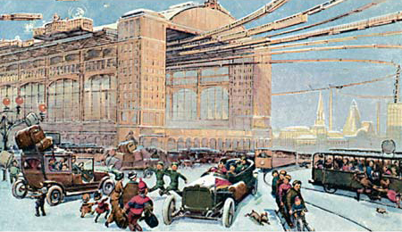
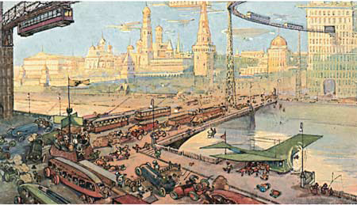
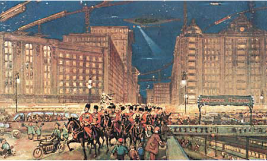
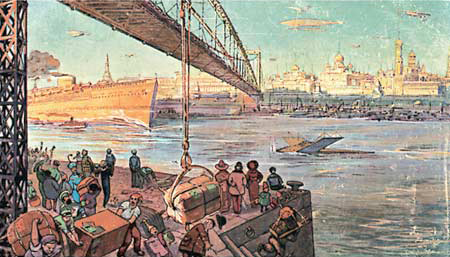
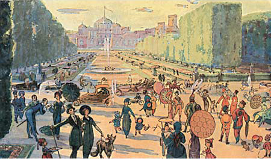
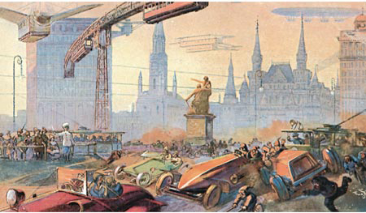
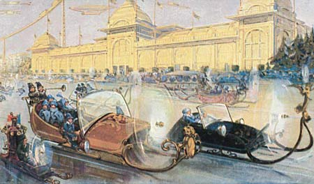
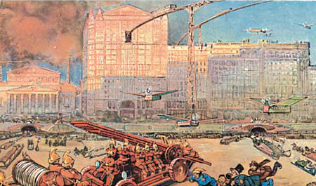

# Москва в XXIII веке

«Москва в XXIII веке» или «Москва будущего» — цикл из восьми футуристических почтовых карточек 1914 года, выполненных неизвестным художником по заказу московской кондитерской фабрики «Эйнем».

Рисунки на карточках демонстрируют то, как, по мнению автора, предстояло выглядеть Москве в XXII и XXIII столетиях: от 2114 года (карточка «Центральный вокзал») до 2259 года (карточка «Санкт-Петербургское шоссе»). На них изображены такие известные места, как Красная, Театральная, Лубянская площади, Петровский парк. Примечательно, что на одной из карточек находилось изображение Центрального вокзала Москвы, создание которого предлагалось к сооружению в начале XX века, но впоследствии потеряло свою актуальность.

На оборотной стороне карточки каждого вида находилась краткая аннотация к рисунку; на карточке № 1 — ко всей серии. Данные об авторе (либо авторах) рисунков и текста на самих карточках и в печатных источниках не сохранились.

Набор был выпущен в мирное время, за несколько месяцев до начала Первой мировой войны.

В 2010 году компания «Красный Октябрь», являющаяся правопреемником Эйнема, перевыпустила данную серию.

## Список карточек

|Рисунок																								|Подпись	|
|-------------------------------------------------------------------------------------------------------|-----------|
| Центральный вокзал			|Зима такая же, как и при нас 200 лет назад. Снег такой же белый и холодный. Центральный Вокзал Земных и Воздушных Путей Сообщения. Десятки тысяч приезжающих и уезжающих, все идет чрезвычайно быстро, планомерно и удобно. К услугам пассажиров — земля и воздух. Желающие могут двигаться с быстротою телеграмм	|
| Москворецкий мост						|Кремль так же украшает древнюю Белокаменную и с золотыми куполами представляет феерическое зрелище. Тут же у Москворецкого моста мы видим новые огромные здания торговых предприятий, трестов, обществ, синдикатов и т. д. На фоне неба стройно скользят вагоны подвесной воздушной дороги…	|
| Лубянская площадь					    |Ясный вечер. Лубянская площадь. Синеву неба чертят четкие линии светящихся аэропланов, дирижаблей и вагонов воздушной дороги. Из-под мостовой площади вылетают длинные вагоны Московского Метрополитена, о котором при нас в 1914-м году только говорили. По мосту над Метрополитеном мы видим стройный отряд доблестного русского войска, сохранившего свою форму ещё с наших времен. В синем воздухе мы замечаем товарный дирижабль Эйнем, летающий в Тулу с запасом шоколада для розничных магазинов	|
| Река Москва						|Оживленные, шумные берега большой судоходной Москвы-реки. По прозрачным глубоким волнам широкого торгового порта несутся огромные транспортные и торговые крейсеры и многоэтажные пассажирские пароходы. Весь флот мира — исключительно торговый. Военный упразднен после мирного договора в Гааге. В шумной гавани видны разнохарактерные костюмы всех народов земного шарa, ибо Москва-река сделалась мировым торговым портом	|
| Петровский парк			    	|Мы переносимся мысленно в Петровский парк. Аллеи расширены до неузнаваемости. Древний Петровский дворец реставрирован, и в нём сосредоточен Музей Петровской эпохи. Повсюду бьют, сверкая, дивные фонтаны. Лишенный микробов и пыли, совершенно чистый воздух прорезывают дирижабли и аэропланы. Толпы людей в ярких костюмах XXIII века наслаждаются дивной природою на том же месте, где, бывало, гуляли мы, пра-пра-прадеды	|
| Красная площадь			    		|Красная площадь. Шум крыльев, звон трамваев, рожки велосипедистов, сирены автомобилей, треск моторов, крики публики. Минин и Пожарский. Тени дирижаблей. В центре — полицейский с саблей. Робкие пешеходы спасаются на лобном месте. Так будет лет через 200	|
| Петербургское шоссе			    	|Красивая ясная зима 2259-го года. Уголок «старой» веселящейся Москвы, древний «Яр» по-прежнему служит местом широкого веселья москвичей, как было и при нас 300 с лишним лет тому назад. Для удобства и приятности сообщения Санкт-Петербургское шоссе целиком превращено в кристально-ледяное зеркало, по которому летят, скользя, изящные аэросани. Тут же на маленьких аэросалазках шмыгают традиционные сбитенщики и продавцы горячих аэросаек. И в XXIII веке Москва верна своим обычаям	|
| Театральная площадь	|Театральная площадь. Темп жизни усилился в сто раз. Всюду молниеносное движение колесных, крылатых, пропеллерных и прочих аппаратов. Существовавший ещё в 1846 году Торговый дом Мюр и Мерлиз в настоящее время разросся до баснословных размеров, причем главные отделы его соединены с воздушными железными дорогами. Из-под мостовой вылетают многочисленные моторы. Где-то вдали пожар. Мы видим автомобильную пожарную команду, которая через мгновение прекратит бедствие. На пожар же спешат бипланы, монопланы и множество воздушных пролёток |

## Сбывшиеся предсказания

### Архитектура

* Здание магазина «Детский мир», построенное много позднее — при СССР в 1957 году, выглядит почти так же и находится там же, где изображено на карточке 1914 года.
* Очертания Лубянской площади соответствуют современности.

### Техника

* Метро «Лубянка» на открытке расположено там же, где его построили много позднее, в 1935 году, только современная станция — закрытого типа.
* После строительства Канала имени Москвы, Волго-Балтийского водного пути, Беломорканала, Волго-Донского канала и системы гидроузлов на реке Волга, Москва стала «портом пяти морей», способным принимать суда класса «река-море» способные доходить до Черного, Средиземного, Красного, Белого, Балтийского, Баренцева и Северного морей. А на четырехпалубном круизном теплоходе проекта 302 (тип «Дмитрий Фурманов») из Москвы периодически можно совершить беспересадочное путешествие в Турцию, Финляндию, Швецию и Эстонию. По водоизмещению (почти 5200 т) этот речной гигант не сильно уступает океанскому крейсеру начала XX века (легендарный «Варяг» имел водоизмещение всего 6400 т). Следует отметить, что крупные суда в акваторию Москвы-реки все таки не попадают, а заканчивают свой путь на Химкинском водохранилище у Северного речного вокзала.
* «Воздушная дорога» на открытке — монорельс. Такая система появилась в Москве в начале XXI века, правда не подвесной схемы как на открытке, а опорной и проходит не в районе Лубянской площади, а в районе ВДНХ и Останкинского телецентра.
* Уже в 1930-х годах в Москве появилась пожарная авиация: сначала легкие самолеты, позже (с 1960-х годов) — вертолеты.

## Факты

* Подпись к карточке «Лубянская площадь» является примером неявной коммерческой рекламы фирмы-производителя, ныне называемой продакт-плейсмент: В синем воздухе мы замечаем товарный дирижабль Эйнем, летающий в Тулу с запасом шоколада для розничных магазинов.
* Современное здание ФСБ на Лубянской площади (бывшее здание страхового общества «Россия», архитектор Щусев) после нескольких реконструкций насчитывает 9 этажей; в здании, изображённом на открытке, 11 этажей.
* Изображённые на открытке «Санкт-Петербургское шоссе» аэросани опасны для пешеходов и других экипажей, поскольку их винт находится спереди (тянущий) и ничем не защищён (нет сетчатого защитного кожуха). Первые справа аэросани карточки «Санкт-Петербургское шоссе» — фирмы Роллс-Ройс.
* Мост через Москву-реку похож по конструкции на ныне существующий Крымский мост, построенный в 1936—1938 гг. — на открытке отчётливо виден центральный пролёт, подвешенный на цепях.
* В перспективе Красной площади слева от здания Исторического музея предугадано будущее здание-параллелепипед гостиницы «Интурист» (построено в 1969—1970 гг., в 2002 г. снесено).
* Насчёт здания ЦУМа (бывшего магазина «Мюр и Мерилиз»), на открытке вдвое превосходящего по высоте Большой театр, художник не угадал; здание разрослось не в высоту, а в длину, новое помещение построено в 1974 г. на месте бывших Голофтеевского и Александровского пассажей, в 2007 г. расширено почти до красной линии Кузнецкого моста.

## Источники, использованные в статье

Реклама фирмы «Эйнем»: Москва в XIX веке

### Публикации про данную серию

* «Москва XXIII века». Журнал «Техника — молодёжи», 1966
* Арсен Мелитонян, Николай Морозов. Назад в будущее // Известия : ежедневная газета. — М.: Известия, 2007. — Вып. 9 февраля.
* Айзек Бромберг. Фантазии о Москве // Очевидное и невероятное : научно-популярный журнал / ред. Панченко Г.. — Х.: НиТ, 2008. — Вып. октябрь. — № 4. — С. 22—25.

### Сопутствующие публикации

* Айзек Бромберг. Сладкий мир будущего // Очевидное и невероятное : научно-популярный журнал / ред. Панченко Г.. — Х.: НиТ, 2008. — Вып. ноябрь—декабрь. — № 5—6. — С. 29—32.
* П. Лопатин. Москва в 1945 году // Техника — молодёжи : научно-популярный журнал. — М., 1940. — Вып. июль. — № 7.
* Александр Громов. 2100 год // Очевидное и невероятное : научно-популярный журнал. — Х.: НиТ, 2008. — Вып. апрель—май. — № 1. — С. 75—79.
* «Век спустя»: Франция в 2000 году // Очевидное и невероятное : научно-популярный журнал. — Х.: НиТ, 2008. — Вып. июнь—июль. — № 2. — С. 76.
