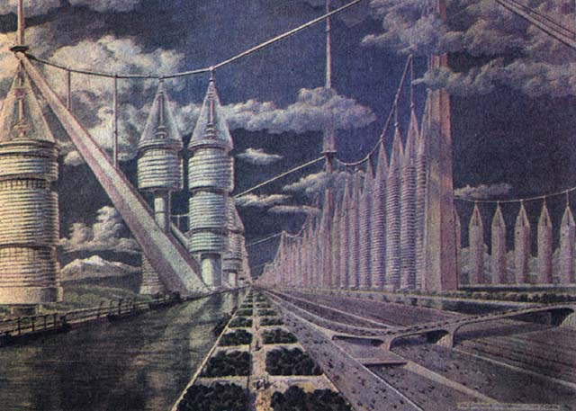
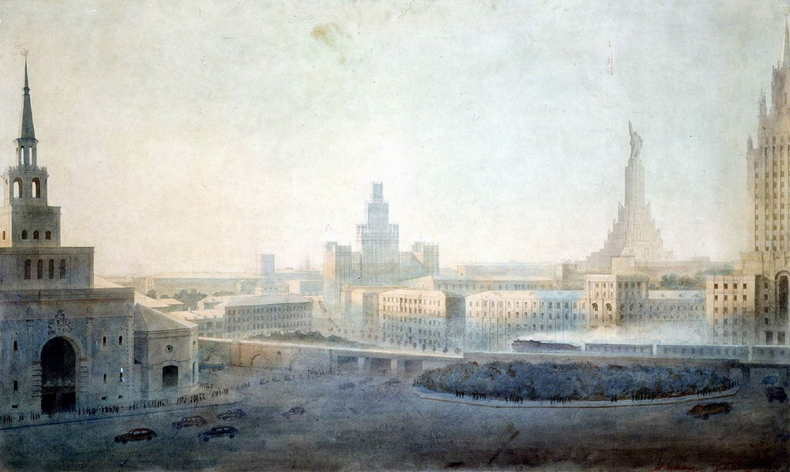
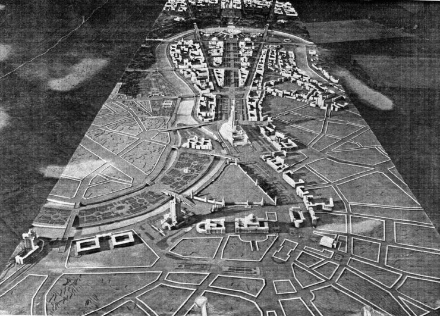
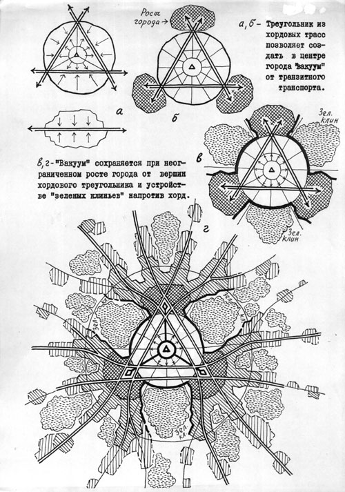
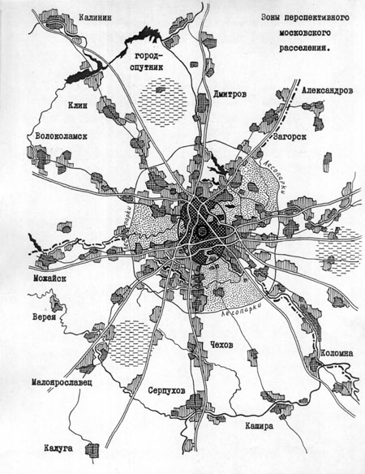
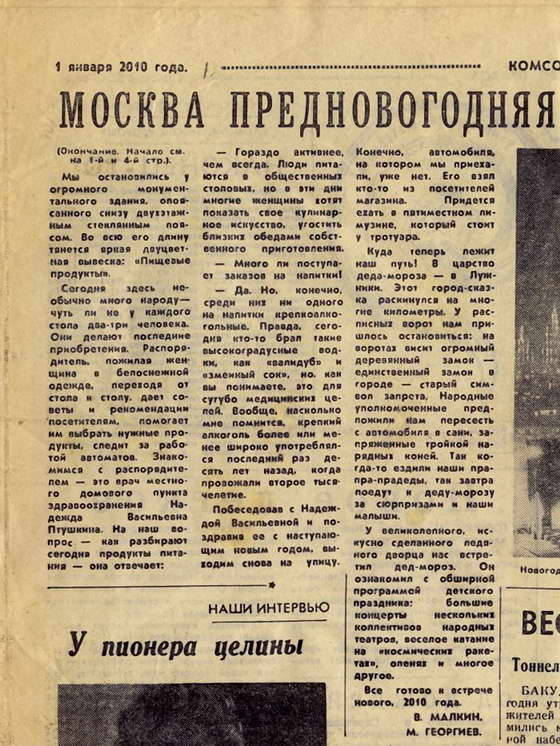
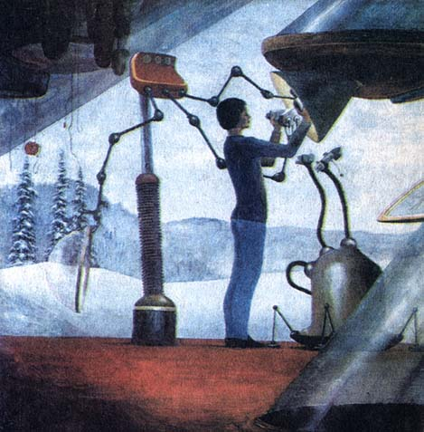
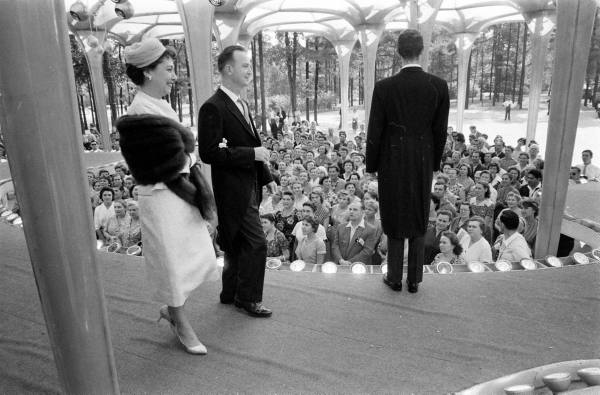

# Какой виделась Москва будущего из 1950-60-х годов

  

В начале хрущёвской оттепели будущее Москвы представлялось продолжением романтических мечтаний 1920-х: большие парки, университеты, стадионы. Но уже в 1960-е в описание города-мечты ворвался механицизм: фабрики-кухни, магазины-автоматы, бетонные дома-конструкторы. Человек там становился придатком города-механизма.

Блог Толкователя уже писал, как представляли себе будущее Москвы в 1920-30-е годы: «Почти полный снос исторического центра; проспекты шириной 120 метров; рабочие, живущие прямо в цехах; город, вытянутый в сторону Ленинграда на 120 км; город-университет в Хамовниках; аэро-экспрессы Москва – Лондон – Нью-Йорк и Москва – Сан-Франциско».

Вторая Мировая война на время прекратила мечтания урбанологов – не до жиру, восстановить бы порушенное. Но уже в середине 1950-х, в самом начале хрущёвской оттепели, вновь появляется множество фантазий на эту тему. Фонтанируют идеями все, кто только могут: студенты, учёные, рабочие в письмах в газету.

И вновь, как и в 1920-е, в футурологию возвращается романтизм: город для человека, а не человек для города.

Такой взгляд на будущее, к примеру, даётся в книге А. Логинова и П. Лопатина «Москва на стройке» (издательство «Молодая гвардия», 1955 г.), где описывается Москва 1980-х годов:

> «А на противоположном берегу реки, где лежала когда-то низина Лужников, раскинулся крупнейший стадион столицы. Прозрачный купол высится над чашей стадиона, над его трёхъярусными трибунами. Зимой, когда воет вьюга и ветер срывает с крыш колючую позёмку, на зелёном поле стадиона – футболисты в майках и трусах. Летом здесь на гладких ледяных дорожках проходят конькобежные соревнования…
> 
> Машина идёт по магистрали Юг-Север. Впереди канал, спрямляющий центральную петлю Москвы-реки. Он проложен в глубокой выемке. В обход Кремля, разгружая центр города от корабельной суеты, по каналу проходят суда.
> 
> Среди них товарный электроход какого-то нового типа. Он идет величайшей водной дорогой мира: Москва-Сталинград-Астрахань-Каспийское море – Омск – Диксон – Карское море – Маточкин Шар – Петрозаводск – Ленинград – Москва.
> 
> Таким же широким, как магистраль, мостом машина пересекает канал и все дальше устремляется по проспекту Юг-Север. Справа, в зеленых просветах между домами, видна Москва-река у её подходов к Южному порту. А впереди – Парковое кольцо. Зелёным венцом шириною добрых 60 метров и длиною 44 километра окружает оно Москву. Наша магистраль пересекает Парковое кольцо как раз на площади бывшей Серпуховской заставы.
> 
> Сплошным потоком идут машины по кольцу. Такой же поток движется с нами по магистрали. Казалось бы, неизбежна остановка, длительное, надоедливое ожидание у закрытого светофора. Но светофора нет, машины не сбавляют скорости: магистраль проходит над Парковым кольцом по высокой эстакаде, площадь лежит под нами, одетая не то в асфальтовую, не то иную разноцветную мозаику.
> 
> Снова впереди все та же прямая магистраль и эстакада над новым Бульварным кольцом.
> 
> Машина идет сейчас по центру давно застроенного Замоскворечья, но нет ощущения однообразия и узкого коридора. И не только потому, что магистраль широка. Навстречу бежит расширенный участок, где лежит сквер, зеленеющий купами деревьев, или бьет фонтан среди цветочного партера. То мелькнёт белая скульптурная группа, проплывет памятник народному герою, то, наконец, на улицу выйдет полная прохлады опушка парка.
> 
> Дома теплы и солнечны. Они сложены из плит цветного бетона. То здесь, то там поблескивают яркие орнаменты из керамики, золотистая смальта, цветной витраж. И всё это вместе с зелёными, вишнёвыми, красными листьями вьющихся растений создает выразительную, чуть подсинённую воздухом гамму красок.
> 
> Москва получила свой неповторимый цвет, не похожий ни на нежносероватые тона Ленинграда, ни на сплошь белые города юга. В столице преобладают сочные тона, они подчёркивают чёткость объемов зданий, помогают им сохранить выразительность и в прозрачном воздухе весеннего утра и в полусвете зимних сумерек…
> 
> Наша магистраль уже приближается к центру столицы, но так же стремителен бег машины.
> 
> Указатель скорости отмечает: 87 километров в час. Это обычная скорость в Москве: над магистралью то и дело мелькает предупреждающий транспарант: «Не ниже 70 км».
> 
> Магистраль не знает пересечений на одном уровне: вот только что мы миновали Добрынинскую площадь, пропустившую под собой в тоннеле густой поток Садового кольца. На менее ответственных перекрестках для пешеходов сооружены пандусы под полотном магистрали, а для машин — плавные ответвления, мягко вписанные в магистраль. Машинам, как поездам в метро, никто и ничто не мешает. Так во имя чего искусственно снижать скорость, присущую машине, и терять время?
> 
> В несколько рядов идут машины, сотни, тысячи машин. А на магистрали – тишина. Только слышно шуршание шин — словно отдалённый шум прибоя в безветренный летний день.
> 
> И это естественно. Пусть гудки машин ещё не сняты – кто знает, быть может, они понадобятся в загородных поездках где-нибудь на второстепенных просёлках, — но в Москве гудок запрещен раз и навсегда. К тому же и мотор не урчит: подобно гудку, бензиновый мотор изъят из Москвы – в столицу допущены только электродвигатели.
> 
> Так откуда же возникнуть уличному шуму, если ко всему этому резиновые прокладки полностью исключили всякое дребезжание даже многоместных автобусов?
> 
> И ещё одно характерно для магистрали – чистота. Не просто чистота, а какая-то блистающая, прозрачная чистота мостовой, тротуара, воздуха, неба.
> 
> Большие белые машины идут по магистрали, сметая пыль, всасывая её широкими раструбами в свои вместительные цистерны и поливая улицу – то голубую, то жёлтую, то синюю. И никому из москвичей не придёт на ум бросить, скажем, окурок не в урну, а на эту нарядную одежду дороги, как неудобно, бросить конфетную бумажку на полированный гранитный пол подземной станции Московского метрополитена.
> 
> Чисто не только на улицах – чисто и во дворах. Тёмные дворы-колодцы уже не существуют в Москве. Каждое здание теперь омывается светом и воздухом. Не только со стороны улицы и в глубине кварталов, но и во дворах – садовые насаждения, цветы. И даже если в доме большие магазины, требующие ежедневного подвоза продуктов, машины не разгружаются во дворе: по специальному спуску они въезжают в тоннель под домом.
> 
> И как может быть не прозрачен воздух Москвы, когда она полна зелени, когда так тщательно убирают её мостовые, когда на улицах нет выхлопных газов автомобилей и над гигантским городом не поднимается ни единого дымка в прозрачное высокое небо?..
> 
>   
> 
> Все ближе и ближе подходит машина к центру города. Уже позади Водоотводный канал, Москворецкий мост из светло-розового гранита – и перед нами знакомая панорама Кремля: красочные главы Василия Блаженного, зубчатая стена, сбегающая уступами к Москве-реке, Красная площадь.
> 
> Вырываясь из Замоскворечья, магистраль Юг-Север проходит по мостам канала и Москвы-реки: здесь, на левом берегу, пройдя считанные десятки метров, машина неожиданно ныряет под землю.
> 
> Тоннель пробит под Китай-городом, под площадями и проспектами центра: для магистрали крут подъем на Китайгородский холм, а московский центр так законченно спланирован, что не было резона прорезать сквозь него новый проспект.
> 
> Машина идёт по тоннелю, но мы не чувствуем подземелья. И не только потому, что тоннель просторен и высок, что воздух в нем безукоризненно чист, что стены его одеты гладким камнем, что он залит отраженным светом зеркальных ламп дневного света.
> 
> Немалую роль в этом играет и меняющаяся степень его освещённости.
> 
> Если там, на земле, стоят осенние сумерки, лампы тоннеля горят не в полную силу. Если же на поверхности летний солнечный день, они заливают тоннель таким же ярким светом. И вот это-то отсутствие резкой перемены силы света при входе в тоннель не только не ослабляет остроты зрения водителя машины, но почти неощутимо и для пассажиров.
> 
> Машина идёт по тоннелю, а над ним стоят площади центра.
> 
> Площадь Свердлова… Дома почти всё те же, только гостиница «Москва», обнявшая теперь целый квартал, выдвинула к площади один из своих корпусов.
> 
> Противоположная Большому театру сторона площади широко раскрыта. Ступени монументальной лестницы, поднимающейся к Китай-городу между гостиницей «Метрополь» и Музеем В. И. Ленина. На фоне кремлёвских башен на площади Свердлова вырисовывается памятник Якову Михайловичу Свердлову.
> 
> В Театральном сквере из круглого водоема с шумом летят вверх прозрачные струи фонтана. Вокруг бассейна – хоровод детских фигур из белого мрамора. Кажется, дети кружились в танце и лишь на мгновение остановились, чтобы полюбоваться фонтаном, осыпающим их радугой брызг.
> 
> Преобразилась и площадь Дзержинского. Она перепланирована, раздалась в длину и ширину, подойдя вплотную к зданию Политехнического музея. В центре площади — памятник Феликсу Эдмундовичу Дзержинскому. Окруженная новыми домами, площадь стала торжественной и строгой, напоминая площади Ленинграда.
> 
> Изменился Китай-город — наиболее тесное в старой Москве скопление домов. Теперь здесь образовались более просторные кварталы из лучших прежних домов и новых зданий центральных учреждений. И впервые за много столетий зелень нашла себе место в каменном Китай-городе…
> 
> Полтора километра тянется тоннель под московским центром и выходит на поверхность ближе к Трубной площади.
> 
>   
> 
> Здесь начинается северный отрезок магистрали. Она идёт двумя параллельными лучами. Правый луч перерезает сутолоку переулков и, наконец, достигает зеленой гущи Пушкинского (Останкинского) парка. Левый луч проходит поблизости и в конце концов вливается в то же Останкино.
> 
> Между обоими лучами – зелень. Кажется, где-то там, на севере, в районе Пушкинского парка она прорвала границу города и зелёным потоком хлынула к центру. Зелёным клином входят подмосковные леса в каменное тело города.
> 
> Снова все то же прямое и широкое полотно, снова двухэтажные пересечения с бульварными и парковыми кольцами. Снова всё тот же предупреждающий транспарант: «Не ниже 70 км». И тем не менее этот северный отрезок магистрали отличен от её южной половины.
> 
> Быть может, это потому, что на каждом из двух лучей движение одностороннее: на восточном – только на север, на западном – только на юг. Может быть, оттого, что здесь ещё больше зелени и цветов. Или потому, что на этом отрезке магистрали дома стоят ещё просторнее. А может быть, причина в том, что именно здесь, на былых пустырях, прорезанных ныне магистралью, широко и смело пробуют новую облицовку зданий, новые строительные материалы.
> 
> В частности, на границе прежней Марьиной рощи только что возведён стеклянный жилой дом. В нём все из стекла: стены, потолки, полы, оконные рамы, двери, даже плита на кухне.
> 
> Днём этот дом, собранный из стеклянных блоков, светло-синего и цвета слоновой кости, переливается на солнце, как камень-самоцвет. Ночью, когда в нём загораются огни, он похож на огромную призму, сияющую изнутри. И в то же время всё, что происходит в доме, не видно с улицы: сложенный из рифленого стекла, он так преломляет свет, что через стены ничего не разобрать, словно сквозь окно, густо подёрнутое инеем…
> 
> Перешагнув путепроводом через железную дорогу, магистраль входит в Пушкинский парк.
> 
> Здесь аллеи-просеки разрезают старый лес, связывают с небольшими лесными гостиницами и лагерями отдыха на опушках.
> 
> Пешеходные туристские тропы ведут к запрятанным в чащах лужайкам, к искусственному «хаосу скал», напоминающему Алупку в Крыму. Дорожки вьются вдоль ручьёв, шумно сбрасывающих с камней вспененную воду. Далеко вглубь парка уходят аллеи для верховой езды и прогулок на велосипедах.
> 
> Местная река, приняв в себя волжские воды из Химкинского водохранилища, породила новые лесные озера с нетронутой молодой травой по берегам, и водные праздники проходят здесь особенно непринужденно.
> 
> Гордость парка – обширный Главный ботанический сад Академии наук: вековые сосны, дубовые и березовые рощи, пруды, дендрарии, плантации, музеи, питомники. В центре сада – главная оранжерея «Хрустальный дворец». Здесь на открытом воздухе и в теплицах собраны сотни тысяч видов и разновидностей культурных и дикорастущих растений – вся флора земного шара.
> 
> Вот поднялись купы гигантских тропических деревьев – их родина за Атлантическим океаном. Распластались мхи и карликовые березы тундры. Таежные леса Сибири соседствуют с густыми зарослями бамбука и пробкового дуба, серебристые пихты Урала – с представителем древнейших эпох, огромным энцефаляртосом. Здесь же аллеи деревьев, подстриженных и расположенных в стиле старых парков, и скупая растительность саванн и пустынь. Зимой рядом с застеклёнными оранжереями тропической флоры стоят опушенные снегом бронзоствольные сосны и темно-зелёные ели. В двух шагах – пышное цветение экваториальной растительности и строгий ландшафт морозного Севера.
> 
> Еще сотня-другая метров – и на обочине магистрали тот же светящийся транспарант, что вы видели на юге, в лесах Теплого Стана, и на транспаранте то же короткое, звучное слово – «Москва».
> 
> Здесь конец многокилометровой магистрали и северная граница города».

В конце 1950-х годов группа студентов и преподавателей Московского архитектурного института (МАРХИ) начала работу над моделированием «Города будущего». Проект назвали «Новый элемент расселения» (НЭР).

  

В результате расчётов (к работе были также привлечены урбанисты, экономисты и социологи) в НЭР пришли к выводу об идеальном размере города. Его население должно быть 100 тысяч жителей, а протяжённость – всего 6 км. В таком городе можно максимум за 15 минут добраться до работы, пешком – до природы.

Нэровцы предлагали советские города-миллионники расчленять: разделять сплошную городскую застройку зелеными массивами и превращать её в систему крупных, имеющих свои центры и вполне автономных городских районов с тем самым населением 100 тысяч человек.

Именно тогда заговорили о разделении Москвы на два города – Москву-столицу и Большую Москву. Первый город должен был быть ограничен кольцевой железной дорогой, второй мог бы расти и дальше в Подмосковье.

Позднее, в конце 1960-х годах, НЭР перевели на более технологичный уровень, и в конце-концов его в 1971 году присоединили к Институту системных исследований Академии наук, возглавляемый академиком Шаталиным. Создавались модели, программы, в Институте Генплана закупили первые ЭВМ.

Тогда предлагалось разделить Москву на 8 «городов», каждый примерно по 700-800 тысяч населения. В свою очередь каждый город делился ещё на 50 микрорайонов. Но в условиях брежневского застоя эти идеи, разумеется, не нашли поддержки у правящей верхушки.

  

Советская пресса, в середине – конце 1960-х годов, описывая будущее Москвы, ещё соединяла в себе романтизм 1920-х и механицизм 1930-40-х. «Романтическая механика» выглядела так:

П.Волин, 1964 год, «1/130 завтрашней Москвы»:

> «К 1980 году жилищные условия советских людей должны измениться коренным образом. Каждая семья будет иметь отдельную квартиру. Норма жилой площади значительно возрастет. Более удобным станет расселение — комнат в квартире будет не меньше, а возможно, и больше числа членов семьи.
>
> Чтобы найти верные решения, градостроители решили провести грандиозный эксперимент: соорудить кусочек будущей Москвы. «Кусочек» в одну стотридцатую величины той новой жилой площади, которую запланировано ввести в строй в 1980 году.
> 
> В экспериментальном жилом районе намечено построить 0,5 млн. кв м жилья для 45 тысяч москвичей. Иначе говоря, более 11 кв. м на человека? Не щедровато ли?
> 
> По нынешним временам, да. Но ведь цель эксперимента — заглянуть в будущее. Значит, и условия жизни в новом районе должны быть иными, лучшими, чем теперь.
> 
> Детских садов и яслей, например, здесь будет достаточно, чтобы принять всех детей. Будут беспрерывно, круглые сутки работающие магазины-автоматы.
> 
> С новшествами в коммунально-бытовом обслуживании связана и новая планировка квартир. Будут, например, квартиры… без кухонь – в обычном смысле этого слова. Это, однако, не стеснит жильцов, не доставит им лишних хлопот. Великолепно оснащенные столовая, прачечная — общие для всех — расположатся на первом этаже. А в квартирах — самое необходимое кухонное оборудование (электроплита, небольшая мойка) отлично разместится в закрытых нишах. Или квартиры с так называемой гибкой планировкой, где нетрудно совершенно изменить расположение и размеры помещений: скажем, уменьшить кухню, расширив жилые комнаты, увеличить число спален, приблизить к ним ванные и т.п.
> 
> На строительстве экспериментального района впервые найдут массовое применение пластмассы и синтетика: теплоизоляция и звукоизоляция из легких синтетических материалов, пластмассовые наличники, плинтуса, долговечные синтетические краски, полы из линолеума на мягкой пористой основе.
> 
> С домостроительных комбинатов на строительство будут привозиться готовые, отделанные до последней мелочи ванные комнаты, кухни — со всем оборудованием. Но это еще не все. Дома, разные по архитектурному рисунку, этажности, планировке, будут монтироваться из одинаковых составных элементов. Район без единого кирпичного здания — только из сборного железобетона. Без газа — его полностью заменит электричество. Без светофоров — никаких пересечений транспортных и пешеходных потоков…»

  
(Новогодний номер «Комсомольской правды» от 1959 года – представления о Москве 2010 года)

В.Куканов, 1963 год, «Вдоль МКАДа»:

> «Пройдет еще немного времени…
> 
> Мотели появятся на «стыках» со всеми шоссе, ведущими в столицу. Здесь, видимо, возникнут автовокзалы для междугородных (а может, и международных!) автобусов. Здесь же появятся универсальные магазины — зачем ехать за покупками в центр?»

Н.Железнова, 1968 год, «Мода 2000 года»:

> «В будущем костюм останется только декором, только ярким цветовым пятном. Человек не будет страдать от капризов погоды, ему будет достаточно легкой туники и нескольких съемных украшений — для разнообразия! Яркие эластичные колготки, обувь типа высоких мягких сапожек или чулок — вот и весь нарядный туалет наших потомков.
> 
> …Рассматривая сто пятьдесят работ Наташи и Михаила, с которыми зрители сегодня познакомятся на экране, невольно вспоминаешь старинный киновариант «Аэлиты». Мысленно сравниваешь, насколько реальнее, проще, человечнее стало наше представление о жизни людей будущего мира.
> 
>  
> 
> Ну, а Слава Зайцев? Художник очень одаренный, сложный, фантазер и выдумщик (каким и должен быть художник). Что предлагает он?
> 
> Тема 2000 года настолько заинтересовала его, что в результате споров и мыслей вслух и на бумаге появилась оригинальная коллекция, в которой продуманы разные сферы жизни, труда, творчества, быта нашего потомка из третьего тысячелетия.
> 
> - Люди мечтают о космосе, о полетах, об отрыве от Земли,— говорит художник.— Я верю, что в третьем тысячелетии люди будут летать не только в самолетах или в ракетах. Но и сами — как птицы. Их предельно простые, легкие, изящные костюмы освободятся от всех лишних деталей!»

В.Сажин, Москва, 1966, «Москва 1980 года»:

> «В беседе с архитектором Жолтовским Владимир Ильич Ленин высказал мысль о том, что новые районы Москвы нужно строить на Воробьевых (ныне Ленинских) горах, то есть в сторону юго-запада. Там и местность сухая, говорил Владимир Ильич, и воздух чистый, здоровый.
> 
> А ведь и в самом деле для современного большого города проблема чистого, здорового воздуха, иначе говоря, проблема климата, очень важна. Насыщенность промышленностью, транспортом, плотная масса жилых домов — все это резко снижает потенциал здоровья городских жителей. Как же будет решаться эта сложная и животрепещущая для всех современных больших городов проблема в Москве будущего?
> 
> Город останется в существующих ныне границах, очерченных кольцевой автомобильной дорогой. Это составляет примерно 30 километров в диаметре. В этих пределах не будет построено ни одного нового промышленного предприятия. Мало того, многие мелкие заводы и фабрики будут вынесены за пределы города. Промышленность Москвы будет специализироваться в области точного машиностроения и приборостроения, радиоэлектроники, производства станков и автомобилей и в некоторых отраслях легкой и пищевой промышленности.
> 
> Население Москвы ограничится числом 6,6-6,8 миллиона жителей. При этом имеется в виду, что рост производства будет идти не за счет расширения предприятий и привлечения новых рабочих, а за счет совершенствования технологических процессов и оборудования, за счет технического прогресса. И это единственно правильный путь. Иначе Москва может принять самые уродливые формы гигантски разросшегося города, нормальную жизнь которого наладить будет просто невозможно, как невозможно это сделать, скажем, в Нью-Йорке.
> 
> С другой стороны, такое ограничение позволит наконец обеспечить всем живущим в Москве нормальные условия: 12-15 квадратных метров на человека, то есть каждый член семьи будет иметь отдельную комнату, сможет нормально отдыхать, заниматься, не мешая другим, принимать у себя друзей.
> 
> Проблема транспорта — одна из самых сложных проблем, которую предстоит решить градостроителям. Скоростное движение автомобилей (число их увеличится весьма значительно) должно быть организовано таким образом, чтобы пассажиры могли быстро добираться в нужное им место города.
> 
>   
> (Американская выставка в Москве, 1959 год – многие горожане смогли впервые убедиться, что у американцев не растут рога и они такие же люди)
> 
> Нынешние улицы уже не удовлетворяют этим требованиям, и придется, как говорят строители, пробивать новые магистрали. Значительно увеличится и сеть подземных дорог. За 30 лет линии метро выросли в десять раз и составляют сейчас 110 километров. В предстоящие годы протяженность линий метрополитена достигнет 320 километров.
> 
> Мы уж начали привыкать к тому, что сложилось как бы две Москвы: старая и новая, центр и районы новостроек. Они резко отличаются. Если в новых районах планировка просторная, оставлено много места для зелени, то в старой части города дома стоят, тесно прижавшись друг к другу, настолько тесно, что, кажется, дышать им трудно. Теперь, когда на бывших окраинах выросло много новых домов, появилась возможность приняться за коренную реконструкцию центра.
> 
> Пятнадцать архитектурных коллективов оспаривали право на получение заказа на разработку окончательного проекта реконструкции центра. В их очень непохожих предложениях содержатся интересные, прогрессивные решения, которые будут использованы в окончательном плане, но немало и спорных. Во всяком случае, пока ясно одно: многие старые здания, не представляющие исторической или культурной ценности, будут снесены, и на их месте появятся современные дома, магазины, сады или проспекты. 8 миллионов квадратных метров старого жилья будет разрушено. В последние годы население центра (в пределах Садового кольца) сократилось на одну треть и составляет сейчас 600 тысяч человек. В будущем здесь останется лишь 250-300 тысяч. В центре сосредоточатся в основном деловая часть города и культурные учреждения».

Но уже в 1970-е годы и романтизм, и механицизм уступают место «космической урбанологии». Кремлёвские старцы и их обслуга из академиков и «референтов» (будущие прорабы перестройки) разочаровались и в стране, и в народе – улететь на другие планеты за лучшей жизнью должны были лишь избранные. А к чему тогда Москва, где останутся копаться примитивные людишки – субстрат для космических ковбоев? О Москве надолго забыли и, похоже, теперь уже никогда и не вспомнят.