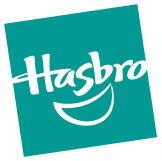
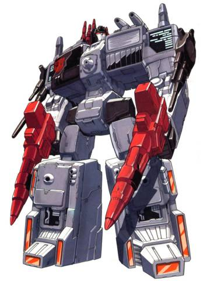

# Война живых роботов
## Вселенная трансформеров

> Больше, чем кажется на первый взгляд.
>
> *Девиз сериала «Трансформеры»*

|               |                                   |
|---------------|-----------------------------------|
|Название мира: |Трансформеры                       |
|Возникновение: |1984 год новой эры нашего мира     |
|Создатель:     |Компания Hasbro, Inc.              |
|Происхождение: |Серия игрушек                      |
|Воплощения:    |Мультсериалы, комиксы, игры, книги |

Трансформеры — явление уникальное. Появившаяся в 1984 году серия игрушек для
детей младшего возраста за пару десятков лет выросла в нечто большее. Сага о
роботах, способных менять свою форму, повзрослела и стала безумно популярной по
всему миру. Красочная вселенная трансформеров — это прежде всего история
бесконечной войны двух фракций роботов, прилетевших на Землю с далекого
Кибертрона.

Далекий 1984 год стал отправным пунктом во вселенной трансформеров. Именно
тогда пробудился вулкан, и подземные толчки запустили бортовой компьютер на
корабле пришельцев с Кибертрона. В этом же году вышли первые игрушки, первый
мультсериал и первые комиксы. Но история трансформеров началась годом раньше.

В 1983 году известный американский производитель игрушек Hasbro встретился на
ежегодной выставке в Нью-Йорке с коллегами из японской фирмы Takara. Взвесив
все «за» и «против», компании решили объединить и доработать популярные
такаровские продукты «Диаклон» и «Микро Перемены» в новую серию,
предназначенную для выпуска на рынке США. Серия называлась просто —
трансформеры. Для новых игрушек была разработана сюжетная линия и расписаны
характеры всех персонажей, которые нашли свое отражение в вышедших в том же
году мультсериале «Трансформеры» и комиксах от Marvel.

Впоследствии вселенная трансформеров обзавелась множеством продолжений — как
новыми игрушками, так и комиксами, и сериалами. Одни были прямыми продолжениями
оригинальной саги, другие повествовали об альтернативной реальности. В этой
статье мы расскажем о самой первой, оригинальной вселенной, которую поклонники
называют G1, или Первым поколением (Generation 1). Другие «поколения» кратко
описаны в одноименной врезке.

## С Кибертрона на Землю

|                           |
|---------------------------|
|  |
|Юникрон, абсолютное зло.   |

Трансформеры — разумные роботы со способностью «трансформироваться», то есть
менять свое тело из одного режима в другой. Большинство трансформеров в
основном режиме похожи на людей — две руки, две ноги, одна голова. А вот
альтернативный режим бывает совершенно невероятный — от банальных машин и
самолетов до экзотических видеокамер и зверей.

Интересен вопрос о происхождении «расы» трансформеров. Существуют две различные
версии об истоках трансформеров и их родной планеты Кибертрона. Первая,
рассказанная в комиксах, гласит: на заре времен некая Единая сущность создала
двух роботов, способных превращаться в целые планеты — Юникрон олицетворял зло,
Праймус — добро. Между ними произошла великая битва, из которой Праймус вышел
безоговорочным победителем. Немного поразмыслив, он решил навсегда остаться
планетой, ныне известной как Кибертрон. Впоследствии Праймус создал на своей
поверхности новую форму жизни — отдал ей частичку себя и назвал трансформерами.

|                               |
|-------------------------------|
|    |
|Кибертрон.                     |

Вторая версия отражена в мультсериале. 12 миллионов лет назад Кибертрон был
фабрикой под управлением Квинтессонов. На фабрике изготавливались роботы для
производственных и военных нужд. Спустя миллион лет они эволюционировали и
восстали против Квинтессонов, изгнав их с планеты. Впоследствии это восстание
нарекли Первой Кибертронской войной.

Но мир не наступил, поскольку военные роботы решили покорить всю планету, а с
ней и мирных роботов. Военные роботы назвали себя десептиконами, а мирные —
автоботами. Благодаря новой разработке, позволившей роботам трансформироваться
в другие формы, автоботы победили десептиконов во Второй Кибертронской войне, и
настал Золотой век Кибертрона.

|                                   |
|-----------------------------------|
|            |
|Гербы автоботов и десептиконов.    |

Десептиконы учли свои ошибки и тайно создали нового уникального трансформера,
своего лидера — Мегатрона. Мегатрон удачно провел ряд наступательных операций,
уничтожил старого лидера автоботов и положил начало Третьей Кибертронской
войне. Новым предводителем автоботов стал Оптимус Прайм.

Гражданская война длилась миллионы лет. Запасы энергии на Кибертроне начали
иссякать. Для поисков новых ресурсов был создан огромный исследовательский
корабль автоботов «Ковчег», который отправился в космос с Оптимусом и группой
автоботов на борту. Коварные десептиконы выждали момент и взяли автоботов на
абордаж со своей «Немезиды». Полуразрушенный «Ковчег» с автоботами и
десептиконами на борту рухнул на Землю, в жерло уснувшего вулкана. Столкновение
было настолько сильным, что все находившиеся на корабле были полностью
деактивированы.

В 1984 году вулкан пробудился, и его вибрации запустили бортовой компьютер
«Ковчега», который отремонтировал роботов и приспособил их альтернативные
режимы к земным условиям. Великая гражданская война трансформеров разгорелась с
новой силой, теперь уже на Земле.

|                               |
|-------------------------------|
|          |
|«Ковчег» против «Немезиды».    |

Неизвестная планета стала новым домом для многих автоботов. Они подружились с
людьми и завели себе надежных союзников. Первыми знакомыми автоботов стала
семья Витвики — молодой Спайк и его отец по кличке Спаркплаг. Сын Спайка Дэниел
сыграл немаловажную роль в событиях 2005 года. Тогда произошла крупная битва
при городе автоботов, в результате которой новым лидером автоботов стал Родимус
Прайм, Мегатрон превратился в Гальватрона, а трансформеры встретились лицом к
лицу со своими старыми врагами — ужасным Юникроном и коварными Квинтессонами.

> ### Другие поколения
>
> |                         |
> |-------------------------|
> |  |
> |Beast Machines.          |
>
> Помимо классического, Первого поколения трансформеров, выходили и другие
> интерпретации этой вселенной. Второе поколение представляло собой новую линию
> игрушек с редизайном старых персонажей. За американскими «поколениями»
> появились японские продолжения. Выбросив последний, четвертый сезон первого
> поколения, японцы продолжили G1 сериалом Headmasters, за которым последовали
> Masterforce и Victory.
>
> После японцев эстафету подхватили канадцы, которые выпустили первый сериал по
> трансформерам с трехмерной графикой. Сериал Beast Wars рассказывал историю о
> конфликте максималов и предаконов, заброшенных на доисторическую Землю.
> Вскоре последовало продолжение — Beast Machines и японские анимешные Beast
> Wars II.
>
> После истории о максималах и предаконах японцы попробовали переосмыслить
> первое поколение в новом ракурсе. В сериале Armada появилась третья,
> нейтральная фракция — миниконы, которые могли объединяться с трансформером и
> увеличивать его силу. Последний сериал, Cybertron, в США еще не показан
> целиком.

## Автоботы

По сути, вся история вселенной трансформеров — это вечная война добрых
автоботов и злых десептиконов. В любой войне всегда есть свои лидеры, генералы,
герои и настоящие легенды. Расскажем вкратце о самых примечательных
трансформерах. И начнем, пожалуй, с автоботов.

### Оптимус Прайм (Optimus Prime)

Самый известный лидер автоботов Оптимус Прайм навсегда останется величайшим
героем трансформеров. Он блестящий ученый, механик и, прежде всего, воин и
стратег. У Оптимуса Прайма лишь одна слабость — он не может позволить живому
существу погибнуть.

Альтернативный режим — трейлер с прицепом. В режиме робота у Прайма есть два
дистанционно управляемых модуля: Роллер (похожий на тележку робот-разведчик) и
Боевая Платформа, которая получается из прицепа при трансформации. В груди
Оптимус Прайм хранит уникальный артефакт автоботов — Матрицу лидерства.

### Родимус Прайм (Rodimus Prime)

Родимус Прайм — это новая, претерпевшая изменения версия трансформера Хот Рода.
Хот Род был простым солдатом под началом у Оптимуса, пылким юношей, мечтавшим о
подвигах и великих битвах. И вот мечта сбылась — в сражении с Юникроном он
унаследовал Матрицу лидерства, изменился и стал новым лидером автоботов.

Хот Род превращался в спортивную машину с окраской из языков пламени по бортам.
Переродившись в Родимуса Прайма, он получил новый альтернативный режим —
модернизированный грузовик с той же «пламенной» окраской.

### Уилджек (Wheeljack)

Безумный ученый и блестящий гонщик, Уилджек часто участвовал в разработке
оружия автоботов. По одной из версий, именно он создал отряд диноботов,
могущественных воинов-автоботов, а также участвовал в разработке аэроботов и
протектоботов. Альтернативный режим — гоночная машина Лансиа Стратос образца
1975 года белого цвета.

### Бамблби (Bumblebee)

Бамблби — младший брат автоботов. Маленький, юркий Бамблби блестяще справляется
с ролью шпиона и разведчика. Хоть его размер и дает ему определенные
преимущества, Бамблби постоянно переживает, что автоботы относятся к нему
именно как к младшему брату, но не равному. Именно поэтому он частенько идет на
неоправданный риск. Бамблби — один из лучших друзей Спайка Витвики и его семьи.
Альтернативный режим — желтый Фольксваген «Жук».

> ### Хронология мультсериалов
>
> 
>
> * Transformers (G1) (1984) — оригинальный фильм и сериал, 98 эпизодов
> * Headmasters (1987) — альтернативное японское продолжение G1, 35 эпизодов
> * Masterforce (1988) — продолжение, 42 эпизода
> * Victory (1989) — продолжение, 32 эпизода
> * Zone (1990) — продолжение, 1 эпизод
> * Beast Wars (1996) — вольное развитие темы, 52 эпизода
> * Beast Machines (1999) — продолжение, 26 эпизодов
> * Beast Wars II (1998) — вольное японское развитие темы, 43 эпизода и фильм
> * Beast Wars Neo (1999) — продолжение, 35 эпизодов
> * Robots in Disguise (Car Robots) (2000) — вольный альтернативный пересказ
>   G1, 39 эпизодов
> * Armada (Micron Legend) (2003) — вольный альтернативный пересказ G1,
>   52 эпизода
> * Energon (Super Link) (2004) — продолжение, 51 эпизод
> * Cybertron (Galaxy Force) (2005) — вольный альтернативный пересказ G1,
>   52 эпизода

## Десептиконы

Если автоботы олицетворяют героизм и благородство, то десептиконы — коварство и
жестокость.

### Мегатрон (Megatron)

Величайший, а главное — бессменный лидер десептиконов. Мегатрон — уникальная
личность. Это настоящий злой гений, отличный стратег, который знает все
достоинства и недостатки своих подчиненных и умело их использует. В 2005 году
Мегатрон был сильно поврежден в схватке с Оптимусом. Его близкий соратник
Старскрим предал его, выбросил в космос и обрек на верную гибель. Юникрон
подобрал дрейфующего Мегатрона и после краткой беседы превратил его в
Гальватрона.

Альтернативный режим — пистолет «Вальтер P38», причем в процессе трансформации
Мегатрон уменьшается в размерах, его может использовать любой другой
трансформер или даже человек. Альтернативный режим Гальватрона — автономная
плазменная пушка.

|                               |
|-------------------------------|
|    |
|Гальватрон.                    |

### Старскрим (Starscream)

«Вечный предатель» и близкий соратник Мегатрона, пожалуй, уступающий в своей
жажде власти только своему лидеру. Если Мегатрон уже глава всех десептиконов,
то Старскрим всего лишь командует их воздушными войсками. Он азартен и готов
пойти на любой риск, лишь бы сместить Мегатрона. Увы, Старскриму не очень-то
везет — каждая его попытка заканчивается неудачей. К счастью для него,
начальство ценит его способности и не собирается уничтожать блестящего воина
раньше времени. Альтернативный режим — истребитель F-15 Eagle красно-белого
цвета.

### Саундвейв (Soundwave)

Один из приближенных Мегатрона. Отличный и верный боец, специалист по связи и
всему, что связано со звуком. В груди Саундвейв носит роботов-кассетников,
трансформирующихся в аудиокассеты. Это превосходные шпионы и диверсанты. Самые
известные среди них — забияки Рамбл и Френзи, пантера Рэведж, летучая мышь
Рэтбет и птички Лазербик и Баззсоу. Альтернативный режим Саундвейва — кассетный
магнитофон.

### Шоквейв (Shockwave)

Хладнокровный, решительный и абсолютно бездушный трансформер. Шоквейв мыслит
исключительно логически, к каждой проблеме подходит с точки зрения задачи,
которую нужно решить. Этот десептикон обладает отличной боевой мощью и
неплохими лидерскими качествами, благодаря чему Мегатрон оставил его своим
заместителем на Кибертроне во время событий на Земле.

Альтернативный режим — лазерное ружье. Шоквейв не попал на Землю вместе с
другими десептиконами из команды Мегатрона, поэтому по размерам он не
приспособлен к земным условиям — высота ружья аж 10 метров.

> ### Hasbro Inc.
>
> 
>
> Основанная в 1923 году компания Hasbro Inc. считается вторым в мире
> производителем настольных игр и игрушек (после Mattel). Головной офис этого
> американского гиганта игровой индустрии располагается в Потакете, штат
> Род-Айленд. Hasbro владеет разветвленной сетью филиалов, в которую входят
> фирмы Avalon Hill, Wizards of the Coast, Milton Bradley и другие. Помимо
> этого, за Hasbro закреплены исключительные права на производство продукции по
> внушительному списку брэндов, в который входят G.I. Joe, «Звездные войны»,
> «Трансформеры», Dungeons & Dragons, «Монополия» и т. п.

## Необычные машины

Большинство трансформеров имеют по одному альтернативному режиму, они
приблизительно одного размера и выполняют разные функции. Но среди огромной
массы автоботов и десептиконов есть свои исключения.

### Гештальты

Термином «гештальт» (от нем. «gestalt» — форма, личность) принято называть
цельную личность, состоящую из множества других «субличностей». У трансформеров
так называется технология, с помощью которых создаются комбинированные роботы,
а также эти роботы. Гештальт — это трансформер, скомпонованный из меньших по
размеру полноценных трансформеров.

|                               |
|-------------------------------|
|   |
|Гештальт Девастейтор.          |

Самый известный гештальт — жестокий, но немного неуклюжий Девастейтор,
состоящий из шести конструктиконов — роботов, чей альтернативный режим —
строительная техника от экскаватора до бульдозера. Девастейтор стал самым
первым успешно созданным гештальтом, и именно он позволил десептиконам добиться
перевеса в силе.

|                           |
|---------------------------|
| |
|Автобот Дефенсор.          |

Вскоре эта технология появилась и у автоботов. В сериале известны три
гештальт-команды автоботов — аэроботы, протектоботы и техноботы. Аэроботы,
превращаясь в самолеты, формируют бесстрашного Супериона. Протектоботы
трансформируются в машины аварийных служб — от скорой помощи до пожарной — и
объединяются в Дефенсора, верного защитника людей. Альтернативная форма
техноботов сильно разнится — от бурильной установки до мотоцикла — но, тем не
менее, вместе они формируют Компьютрона.

Десептиконы-гештальты — это Девастейтор, Менейзор, Брутикус, Абоминус и
Предакинг. Стантиконы (автомобили) формируют Менейзора, комбатиконы (старая
боевая техника) — Брутикуса, террорконы (монстры) — Абоминуса, а предаконы
(робо-животные), соответственно, Предакинга. Почти все десептиконские гештальты
были в состоянии выполнять лишь одну задачу — бездумно разрушать.

### Диноботы и инсектиконы

Некоторые трансформеры превращаются вовсе не в самолеты и поезда, а в подобие
земных форм жизни. Диноботы — отряд автоботов внушительного размера с приличной
огневой мощью и силой. Каждый из диноботов — Слэг, Сладж, Снарл, Свуп и их
бессменный лидер Гримлок — примечательная личность, которая не особо блещет
интеллектом и общается на уровне «моя твоя ударит». Диноботы трансформируют в
динозавров — птеродактиля, трицератопса, стегозавра и других ящеров.

|                           |
|---------------------------|
| |
|Диноботы.                  |

Инсектиконы — группа из трех десептиконов-насекомых. Альтернативный режим
насекомого позволяет этим беспринципным созданиям высасывать энергию напрямую
из растений. Инсектиконы — Бомбшелл, Кикбэк и Шрапнел — прибыли на Землю на
«Немезиде» Мегатрона. В 2005 году они были сильно повреждены в битве и
предательски выброшены в космос. Юникрон превратил инсектиконов в своих новых
воинов, даровав им новое тело и личность.

|                               |
|-------------------------------|
|  |
|Инсектиконы.                   |

### Города-трансформеры

В мире трансформеров размер имеет значение. Особенно если ты способен
превращаться в целый город. Таких роботов всего двое, и они — злейшие враги.
Метроплекс защищает интересы автоботов, а Триптикон воюет за десептиконов.

Метроплекс появился из руин разрушенного города автоботов в 2005 году. Этот
трансформер поразительных размеров проводит большую часть времени в режиме
города, однако при необходимости способен принимать два других облика —
передвижной боевой станции и робота колоссальных размеров. Левая башня
Метроплекса трансформируется в танк Слэммер, центральная башня и шесть пушек —
в маленького робота Сиксгана, а внутри Метроплекса спрятана спортивная машина —
Скэмпер.

Триптикон был создан конструктиконами из частей обычного города. Это
беспощадная и ужасная машина смерти, готовая уничтожить все на своем пути.
Сразу после рождения Триптикон разрушил «Ковчег» автоботов. Как и Метроплекс,
Триптикон имеет три режима — военная база, передвижная станция и тираннозавр
огромных размеров. Его деятельность обслуживают два автономных дроида —
Фулл-Тилт и Брунт.

|                                                           |
|-----------------------------------------------------------|
|     |	
|Метроплекс и Триптикон.                                    |

### Трехрежимники

У обычного трансформера есть два режима — робота и один альтернативный. Но и
здесь есть свои исключения. Трансформеры с двумя альтернативными режимами
называются трехрежимниками.

У каждой стороны по три трехрежимника. У десептиконов это воинственный
Блицвинг, способный трансформироваться в танк и истребитель МиГ-25, и его
соратник Астротрейн. Главная функция Астротрейна — боевой транспорт, и он
успешно с ней справляется в режимах поезда и космического челнока. После битвы
при городе автоботов к ним присоединился Октан, трансформер для перевозки
топлива с режимами бензовоза и самолета-танкера.

Автоботские трехрежимники появились после 2005 года — отважный Спрингер
(вертолет и машина), Сэндсторм (вертолет и песчаный багги) и Броудсайд (самолет
и авианосец).

|                                                           |
|-----------------------------------------------------------|
|    |
|Астротрейн и Блицвинг.                                     |

> ### Русская адаптация
>
> В Россию трансформеры пришли в начале девяностых, когда 6 канал
> Санкт-Петербурга начал трансляцию Masterforce. Сразу же возник вопрос — как
> адаптировать имена персонажей для русского зрителя. Переводчиками был выбран
> следующий вариант: имена «на высоком наречии» вроде Оптимуса Прайма и
> Мегатрона оставили без изменений, а для всех остальных был придуман русский
> эквивалент.
>
> Так, Старскрим стал Скандалистом, Шоквейв — Взрывалой, Бамблби — Шершнем.
> Были и казусы — например, Саундвейв стал Барханом (видимо, переводчики
> расслышали здесь Сэндвейв — «Песчаная волна»), а персонаж Хотспот — вообще
> Компотом.
>
> Автор придерживается позиции, что в данном случае лучшая адаптация имени —
> транслитерация. Поэтому имена произносятся именно так, как они звучат в
> оригинале.
>
> К слову, в России, кроме G1, показывали сериалы Masterforce, Headmasters,
> Victory, Beast Wars (частично), Robots in Disguise.

----

Развитие вселенной трансформеров продолжается и по сей день. Посильный вклад в
расширение саги вносят японские аниматоры, которые в прошедшем году закончили
сериал под названием «Трансформеры: Сила Галактики» (в США — «Трансформеры:
Кибертрон»).

При этом сама Hasbro не перестает подогревать интерес ко вселенной. Она
выпускает новое переиздание классической G1 в серии игрушек под названием
Transformers Universe, превосходных по качеству игрушек-трансформеров на основе
существующих прототипов машин в серии Transformers Alternators и, конечно же,
игрушек по сериалу «Кибертрон». Но главное событие во вселенной трансформеров
нас ждет в 2007 году, когда продюсер Стивен Спилберг и режиссер Майкл Бэй
выпустят полнометражный игровой фильм с простым, но таким близким сердцу
названием «Трансформеры».

Трансформеры — многогранная вселенная с огромным количеством персонажей и
альтернативных историй. Каждая история — полноправная сага, каждый персонаж —
полноценная личность. Простая серия игрушек превзошла все ожидания и вылилась в
целый мир, ставший близким миллионам по всему свету. Ведь трансформеры — это
гораздо больше, чем кажется на первый взгляд.

|                                           |
|-------------------------------------------|
|               |
|Альтернатор Dead End (Dodge Viper SRT-10). |
