# Элрик Мелнибонийский Майкла Муркока и его мир

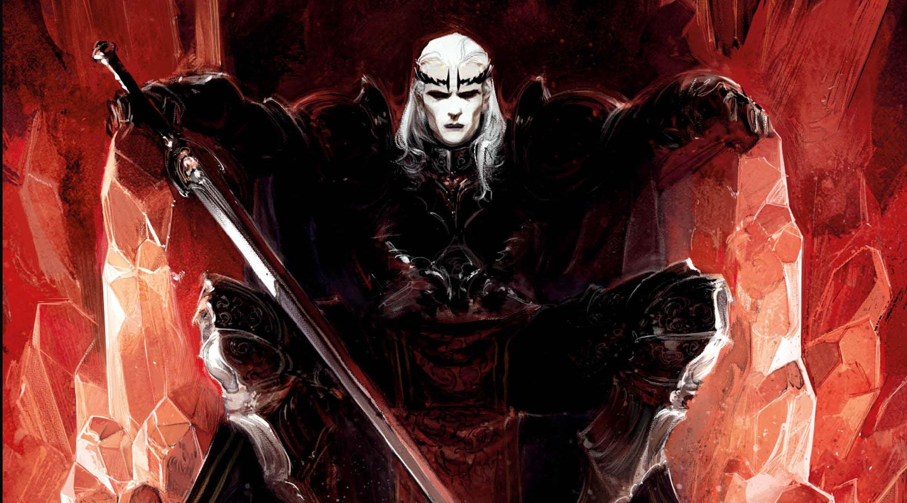

> Я всё ещё не стыжусь своей любви к моим героям, которые скептически относятся
> к власти и её заявлениям.
>
> Майкл Муркок

|               |                           |
|---------------|---------------------------|
|Название мира: |Молодые королевства.       |
|Возникновение: |1961 год.                  |
|Создатель:     |Майкл Муркок.              |
|Происхождение: |Литература.                |
|Воплощения:    |Настольные игры, комиксы.  |

Майкл Муркок, в отличие от большинства авторов фэнтези, пренебрегает детальными
описаниями. Пожалуй, единственная подробно описанная его вселенная — Молодые
королевства, мир самого известного героя Муркока — Элрика Мелнибонийского.

Придумывая этот мир, Майкл Муркок не стремился создать что-то реалистичное или
исторически достоверное. Наоборот, он смешивал реалии различных стран и
народов — здесь можно встретить черты Японии, итальянских городов-государств
раннего средневековья, арабского востока и греческого Крита.

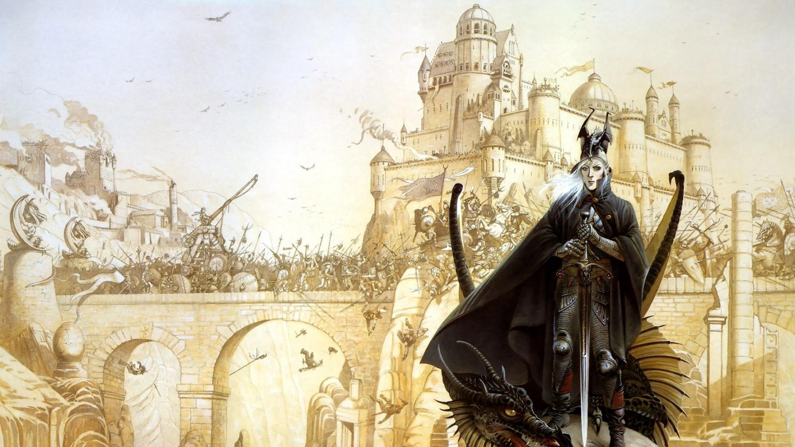

География мира Элрика необычна. Есть три континента, названных без особого
мудрствования Западным, Восточным и Южным, и несколько крупных островов — вот и
вся суша. Зато весь мир «плавает» в море окружающего Хаоса, и понятие Край мира
здесь — не абстрактная фраза, а очень даже определенное место на карте. И
практически во всех этих землях за время своих скитаний побывал Элрик, последний
император-чародей Мелнибонэ.

## Осколок империи

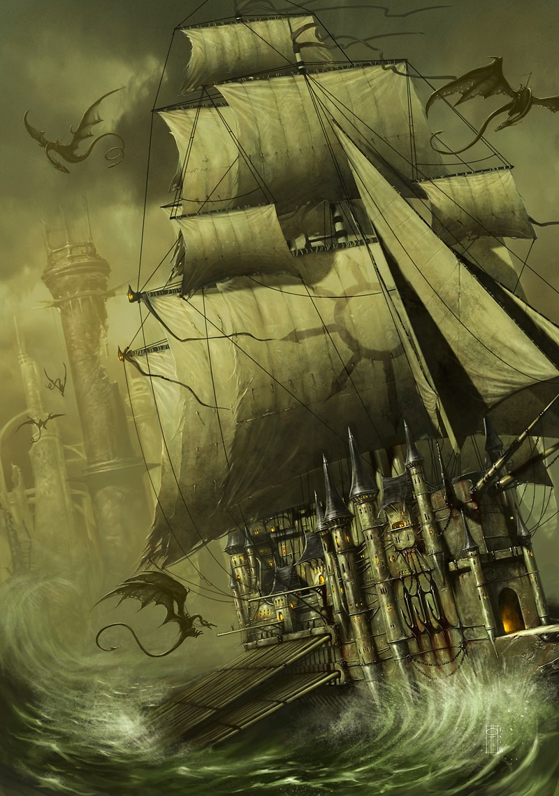

Боевая барка Мелнибонэ

Остров Мелнибонэ — последний осколок империи, которая на протяжении десяти
тысяч лет правила миром. Магией и мечом мелнибонийцы покоряли народ за народом,
уничтожая непокорных и обращая в рабство побежденных. Основной силой были
огромные золотые барки, созданные при помощи колдовства, а также помощь
драконов, чьей поддержкой мелнибонийцы заручились еще в те времена, когда об
империи никто и не думал. Мелнибонийские правители заключили договоры со всеми
элементалями, со всеми сверхъестественными союзниками, с какими только было
можно, и за тысячелетия накопили огромные магические знания. Но даже такая сила
не спасла империю от упадка. Когда он начался, можно только гадать, но в
результате порабощенные страны одна за другой восставали против власти
императоров-чародеев. На момент начала Саги об Элрике только остров Мелнибонэ
напоминает о былом величии. Собственно Молодыми королевствами называются все
земли, кроме самой Империи.

Майкл Муркок рассказывает несколько вариантов истории Острова Драконов. Один,
который упоминается в книгах, гласит, что некогда Владыки Высших Миров решили
заключить договор между собой, и им понадобилось место, где бы можно было
встретиться без помех. Они отправили владыку Хаоса Ариоха, дабы предупредить
жителей одного города, что тем нужно покинуть родные края. Ариох при этом
пообещал изгнанникам свою помощь и слово сдержал. Жители отправились за море,
но шторм вынес их корабли на берега острова, где жили драконы. Так, с помощью
драконов и Ариоха и появился Мелнибонэ.

Второй вариант истории (более правдоподобный) показан в комиксах. В них
говорится, что некогда из другого мира пришел народ, ведомый
побратимами-драконами, и осел на острове, тогда еще не называвшемся Мелнибонэ.
Народ был мирный и первые столетия занимался торговлей, исследовал мир и
сотрудничал с другими странами. Постепенно, не без влияния Ариоха, остров стал
королевством. После гражданской войны, при прямой поддержке Хаоса началось
становление империи.

Мелнибонийцы — не люди, хотя и выглядят почти также; они гораздо более древняя
раса, которая за свою историю неоднократно меняла нормы морали. Современные
мелнибонийцы очень жестоки, но это для них совершенно естественно. То, что
людям кажется ужасным (наслаждение пытками, общение с демонами и т. п.), для
жителей острова Драконов обыденно и привычно, хотя и среди них встречаются
исключения.

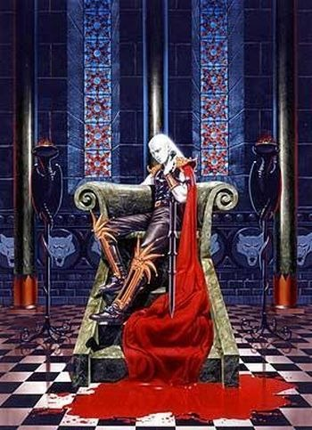

Рубиновый трон императоров

Мелнибонийцы по своей природе консерваторы. Издавна управляемые династией
императоров-чародеев, они даже не думают о том, что можно что-то изменить.
Представители высшего сословия не только обладают немалой колдовской силой, но
и способны летать на огромных драконах, живущих в пещерах рядом со столицей,
Имрриром Прекрасным, торговой столицей всего мира.

Город зовется прекрасным не просто так — ввысь поднимаются огромные
разноцветные башни, которые вместе создают ощущение невероятной красоты, пусть
и построенной на крови других народов. Традиция гласит, что после смерти
императора необходимо снести какую-нибудь старую башню и возвести новую, в
честь умершего.

Элрик уничтожил Имррир, собственную столицу. После чего отправился в странствия
по миру Молодых Королевств.

## Молодые королевства

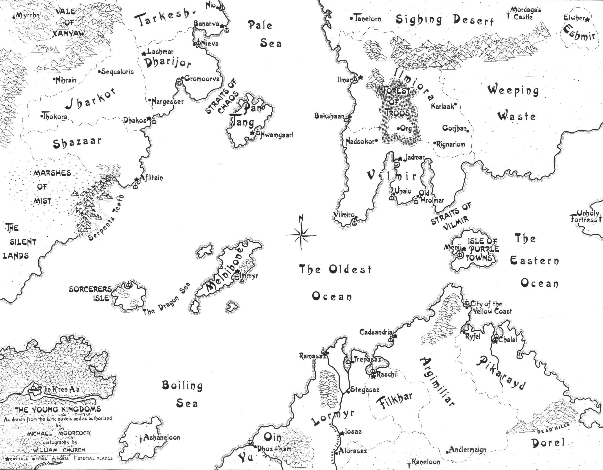

Молодые королевства

### Остров Пурпурных городов

Вторая после Мелнибонэ торговая столица мира получила название из-за оттенка
камня, использованного при строительстве. Обитатели Пурпурных городов —
прославленные мореходы, ради прибыли готовые отправиться в самые рискованные
плавания. И одним из лучших среди них был граф Смиорган Лысый, искренне
симпатизировавший Элрику и погибший во время падения Имррира. В книгах острову
Пурпурных городов уделено не так много внимания, а вот создатели ролевых игр
описали его достаточно подробно.

### Пан-Танг

Крупный остров, расположенный между Западным и Восточным континентом. Часто его
называют островом колдунов, потому что правители острова мечтают стать
наследниками Мелнибонэ — колдовством и силой покорить мир. Во многом это им
удалось. Флот Пан-Танга — один из сильнейших, их триремы — бич торговцев из
других стран, и в магии властители Пан-Танга добились немалых успехов. Островом
правит теократ, в чьем подчинении находится вся армия и флот. Столица —
Хвамгаарл, называемый также городом кричащих статуй из-за скульптур,
расположенных на стенах. Говорят, что это враги теократии Пан-Танга, обращенные
в камень. Именно из этих мест родом двое сильнейших противников Элрика — Телеб
К’аарна, ради мести которому альбинос обошел три континента, и теократ Джагрин
Лерн, чьи амбиции привели к гибели мира.

### Южный континент 

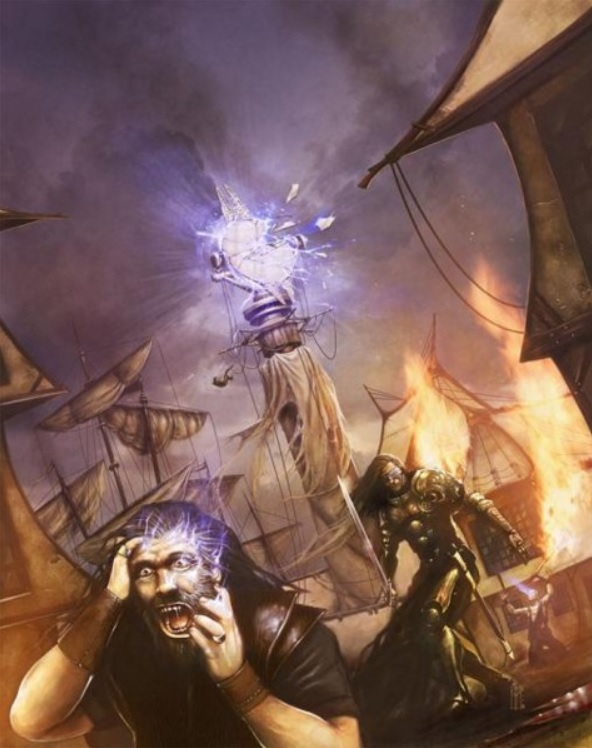

Разрушение Зеркала Памяти.

Страны Юга — самые древние из Молодых королевств. Крупнейшая среди них —
наследственная монархия **Лормир**. Именно Лормир первым сбросил власть
Мелнибонэ, здесь жили прославленные герои, совершавшие великие подвиги. И хотя
армии Лормира — не самые большие на континенте, компенсируется это великолепным
флотом. Вся жизнь страны связана с несколькими полноводными реками, на берегах
которых стоят крупные города — Трепесаз, Стагасаз, а в центре страны —
столица, город Йосаз. Вдали же от речных массивов простираются бесконечные
степи, которые во время зимы укрыты снежным покровом. На дальнем юге среди этих
степей находится таинственный замок Канелун, которым правит Темная госпожа,
бессмертная волшебница на службе Закона. Благодаря ее усилиям мир на протяжении
столетий становился все больше. Темная госпожа соблазняла великих героев, а
затем отправляла их на Край мира, чтобы сильная человеческая воля превращала
Хаос в новые территории.

К юго-западу от Лормира находятся два крошечных бедных государства — **Оин** и
**Ю**, с единой столицей, Дхоз-Камом, который раскинулся по двум берегам реки.
В этом городе укрылся кузен Элрика, защитив себя с помощью Зеркала Памяти. Но
артефакт был разбит, а город захвачен людьми альбиноса. Об остальных странах
Юга известно мало. Филкхар, Аргимилиар и Пикарайд — монархии, причем Аргимилиар
среди них наиболее сильное королевство. На востоке, за Пикарайдом, расположены
Мертвые Холмы — местность, где вообще нет жизни. По легендам, здесь в
незапамятные времена была битва между Хаосом и Законом, после которой не
уцелело ничего.

### Западный континент 

Государства Западного континента разделены на два лагеря. С одной стороны,
**Джаркор** и его союзники — **Таркеш** и **Шазаар**, а с другой —
**Дхариджор**, сильнейшее из государств континента, заручившиеся поддержкой
колдунов из Пан-Танга.

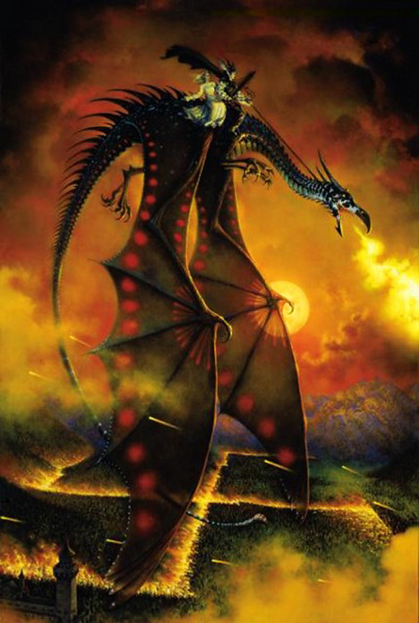

С драконами лучше дружить (художник Дон Мэйтц).

Джаркор разделен на несколько провинций, губернаторы которых напрямую
подчиняются королю. Большая часть флота Джаркора погибла вместе со своим
монархом во время атаки на Имррир. Для защиты от внешних врагов в стране
используются как профессиональная армия, так и ополчение из крестьян и рабов,
которым выдают оружие только в самых крайних случаях. Кроме того, Йишане,
последней королеве Джаркора, подчинялась элитная гвардия — Белые Леопарды, пять
сотен воинов, живущих только ради сражений.

К северу от Дхариджора находится Таркеш — небольшое королевство, промышляющее в
основном торговлей. Таркешиты — храбрые бойцы, хотя их армия почти никогда не
участвовала в крупных битвах.

Равнины Шазаара — родина народа всадников. У них практически нет крупных
городов, зато каждый шазаарит с рождения в седле, и их кавалерия — лучшая в
Молодых королевствах.

Самый необычный народ, обитающий на Западном континенте, — это крылатые люди
Мииррна. Летающие обитатели замков в неприступных горах, они редко появляются
на людях и еще реже участвуют в сварах остальных государств. И тем более
неожиданным стало их решение противостоять Дхариджору и Пан-Тангу вместе с
остальными королевствами.

Южные территории континента — источник разнообразных легенд и сказаний.
Известно, что рядом с Шаааром есть туманные топи — огромные болота, где можно
встретить чудовищ предыдущей эпохи, а за топями — Безмолвные земли, где никто
никогда не жил. Но что находится еще южнее — великая тайна. И только Элрик с
командой бесстрашных моряков пересек Кипящее море и выяснил, что там, в
джунглях, очень похожих на бассейн Амазонки, находятся руины древнейшего города
народа Р’Лин К’Ренн А’а, предков мелнибонийцев.

### Восточный континент

Самый крупный континент мира, географически он разделен на три зоны. В центре —
Плачущая пустошь и Вздыхающая пустыня. Эти обширные безлюдные земли разделяют
западные страны и государства Неведомого Востока, о которых жители Молодых
королевств знают только по рассказам немногочисленных путешественников.

Друг Элрика, Ракхир Красный Лучник, долгие годы прожил в **Фуме**, стране с
кастовой системой. Высшая каста — воины-жрецы, которые посвящают свою жизнь
служению Владыкам Хаоса. Правда, Ракхир отказался от этой тяготы и был изгнан в
Лимб, откуда его и спас Элрик.

Не менее известен второй выходец с Неведомого Востока — Мунглам, неизменный
спутник мелнибонийского чародея на протяжении нескольких лет. Выходец из
Элвера, торговой столицы Востока, и красивейшего города мира, он обошел почти
все Молодые королевства в поисках приключений. Элвер — столица **Эшмира**,
золотого сада Востока, как его чаще называли. Правда, было это до того, как
орды кочевников огнем и мечом прошли по королевствам Востока, уничтожив и
Эшмир, и Окару, и Чангшаи. Только сам Элвер остался непокоренным.

На западе континента расположены Илмиора и Вилмир — две страны, в которых царит
справедливость и Закон. **Вилмир** расположен на полуострове с тем же
названием. После гибели короля Наклона во время взятия Имррира страной правит
регент, но своей мощи она не потеряла. Под протекторатом Вилмира находятся
несколько торговых городов на побережье.

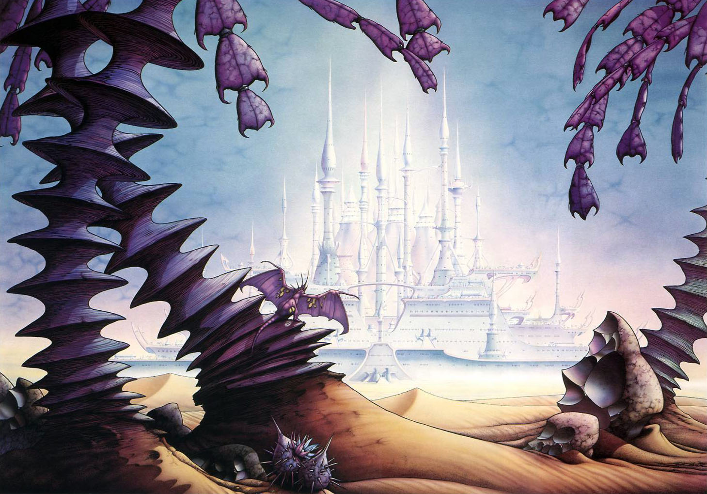

Вечный город (иллюстрация Родни Мэттьюза).

**Илмиора** — оплот демократии в Молодых королевствах. По сути, это союз
независимых городов-государств, крупнейшими из которых являются Бакшаан,
управляемый советом купцов, и Карлаак, где правят сенаторы-торговцы. И если
Илмиора воплощает собой Закон, то находящаяся к северу Вздыхающая пустыня —
воплощенный Хаос. А на границе между ними находится самый необычный город
Молодых королевств — Танелорн.

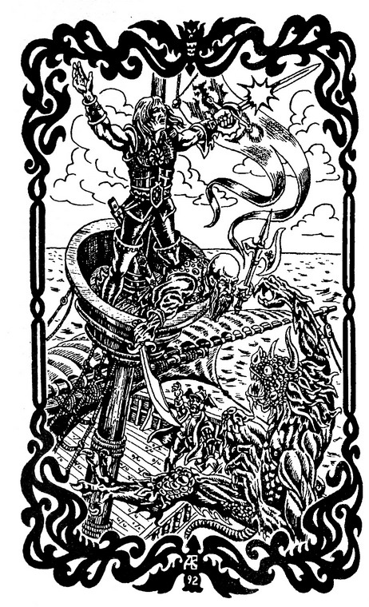

Иногда врата приходится открывать и в экстремальных условиях.

Этот город — воплощение Равновесия, идеал для тех, кто устал от Закона, Хаоса и
вечных сражений. Его жители свободны и счастливы, они обрели спокойствие и мир,
а потому любят свой город превыше всего остального. А так как многие из них
прежде служили Хаосу, то Владыки Энтропии жаждут уничтожить город и готовы
поддержать любого колдуна, который им это пообещает.

Полная противоположность Танелорна — Надсокор, город нищих. Все убогие и
несчастные, все отбросы общества могут легко считать Надсокор своим домом.
Когда-то город был красив, но его обитателей поразила страшная болезнь и они
обратились за помощью к Хаосу. А тот сыграл злую шутку, послав Огненного бога,
который выжег болезнь, а заодно и сам город. Тогда жители воззвали к Закону, и
один из его высших владык заточил Огненного бога. Правда, жителям от этого
лучше не стало — они покинули Надсокор, а на их место пришли нищие. Но огненный
бог и поныне заточен под городом, и нищие скармливают ему пленников.

Между Надсокором и землями Илмиоры лежит странное место — Трооский лес, под
сенью ветвей которого спряталось маленькое королевство Орг. Обитатели Орга —
потомки Обреченного народа, который правил этим миром, но после ужасной
катастрофы выродился и вымер. Окончательное забвение этому народу принес Элрик,
когда, спасаясь бегством из Надсокора, случайно попал в Троос.

### Соседние измерения

В разных частях мира находятся Врата, пройдя сквозь которые, можно попасть в
соседние измерения. Самое необычное из них — мир синего солнца, который в
качестве места ссылки выбрал Саксифа Д’Аана — один из немногих мелнибонийцев,
познавших любовь и муки совести за совершенные деяния.

Другая возможность для колдуна получить доступ к иному миру — открыть врата
самому. Таким образом можно вызвать сверхъестественного союзника или
куда-нибудь переместиться. Именно так Элрик смог попасть в Лимб, где хранились
черные мечи.

> ### Ролевые игры"Мир Элрика Мелнибонийского" Муркока
>
> 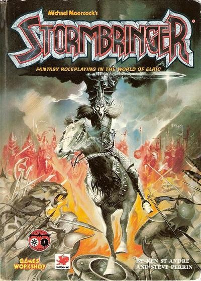
>
> По миру Молодых королевств вышло несколько игр. Наиболее известна
> **Stormbringer**, выпущенная в 1981 году компанией **Chaosium**. Игра 
> выдержала пять редакций (последняя была в 2001 году), переведена на
> несколько языков, включая немецкий и французский, к ней вышло около десятка
> дополнительных модулей, подробнее раскрывающих детали мира. Одна редакция
> игры была переделана под правила d20, но в итоге Chaosium закрыла проект.
> Практически одновременно **Mongoose Publishing** анонсировала игру **Elric of
> Melnibone RPG**, созданную на основе правил RuneQuest.

## Колдовские материи

### Основа чародейства

Магия — неотъемлемая часть мелнибонийской картины мира. Силы, которыми могут
повелевать маги Молодых королевств, делятся на два типа. Первое направление —
призыв элементалей, созданий, которые суть плоть от плоти этого мира.
Элементали — воплощения природных стихий (огня, воды, воздуха и земли), а также
различных растений и животных. И если мелнибонийские чародеи изначально могут
пользоваться помощью этих созданий благодаря договорам, которые заключили
давным-давно их предки, то колдунам-людям необходимо долгие годы учиться, чтобы
просто призвать простейшего из элементалей, не говоря уже о Повелителях огня
или воды.

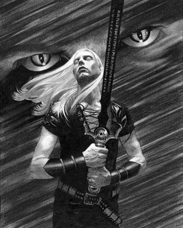

Призыв Ветров-гигантов

А вот второй тип колдовства, обращение к силам Хаоса, Закона или Равновесия, в
принципе, доступен любому заклинателю. Но Закон в мире Элрика непопулярен, а
потому его колдовство практически не встречается. Только изредка смертные
призывают на помощь Белых владык, но последствия почти столь же разрушительны,
как и от присутствия Хаоса. Служители Равновесия редко вмешиваются в дела мира,
а потому их единственное «эксклюзивное» заклинание, которое упоминается в
Саге, — это «чары справедливости». Совсем другое дело силы Хаоса. Хаос с
большим удовольствием ответит на призыв, ведь только так Владыки Энтропии могут
попасть в мир, закрытый для них. Естественно, ни о каком мирном чародействе тут
речь не идет: демоны Хаоса — весьма мерзкие создания, готовые в любой момент
обратиться против вызвавшего их и всегда требующие плату кровью и душами.

Сильнейшие чародеи могут попробовать обратиться не к низшим демонам, а к самим
богам Хаоса. Именно так поступили предки мелнибонийцев, заключившие договор с
герцогом Ариохом, Повелителем Семи Бездн, одним из сильнейших Владык Хаоса.
Весь народ принял его власть, а взамен получил полную поддержку Хаоса.
Вдобавок, Ариох подарил правителю Мелнибонэ два черных рунных клинка —
Буревестника и Утешителя. Благодаря этим подаркам и была создана Империя,
правившая десять тысяч лет. То же самое попытались сделать и жители острова Пан
Танг, правда, с гораздо менее удачным итогом.

### Древнейшие артефакты

Прежде всего — это черные мечи, страшное оружие, выпивающее души врагов и при
этом наполняющее дополнительными силами своего владельца. Элрик, став хозяином
Буревестника, в одиночку выходил против многочисленных противников, владелец же
двух клинков сразу становился фактически неуязвимым полубогом. Но, кроме
плюсов, мечи несли и страшное проклятие — обнажив клинок, его нельзя убрать в
ножны, не напоив кровью. Вдобавок, мечи обладали собственной волей и любили
поражать друзей своего хозяина. Именно из-за Буревестника Элрика и прозвали
«убийцей родичей».

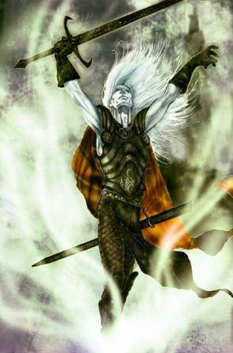

Песнь Буревестника

Другим артефактом прежней эпохи, находившимся у Элрика, было кольцо Королей с
драгоценным камнем Акториосом. Это не только важный символ императорской
власти, но предмет немалой магической силы, используемой, к примеру, для
открытия врат между мирами.

Если есть оружие, должна быть и защита. Такая, как зеленый с серебром круглый
Щит Хаоса в человеческий рост, на котором изображена эмблема Хаоса — восемь
янтарных стрел, расходящихся из одной точки. Щит — единственное средство,
способное оборонить своего владельца от влияния Хаоса. Давным-давно его создал
великан Мордага, бывший в то время богом. Но остальные небожители изгнали его и
обрекли на гибель от руки смертного. Многие столетия Мордага ждал прихода
Элрика, чтобы последний раз попытаться обмануть судьбу.

Вся мудрость мира хранится в Книге мертвых богов — фолианте, созданном великими
древними богами. Осознав, что произойдет, если смертные узнают о своей судьбе,
книгу решили уничтожить, отправив на солнце. Но силы Хаоса ее перехватили и
укрыли в соседнем измерении. Одна из историй об Элрике рассказывает как раз о
поисках этого манускрипта.

В Саге упоминаются и другие магические предметы — аркан плоти, рог Судьбы,
драгоценный камень Нанорион, способный пробуждать от колдовского сна. Но Майкл
Муркок не рассказывает о них подробно, оставляя читателю возможность гадать об
их происхождении самостоятельно.

----

Первый раз финальную точку в цикле об Элрике Майкл Муркок поставил в далеком
1977 году. Затем, подобно фениксу из пепла, цикл не один и не два раза
возрождался, и до сих пор автор никак не может расстаться с любимым героем,
продолжая его историю. Если не в новых романах, то в рассказах и комиксах.

> ### Сага об Элрике Мелнибонийском (циклы расположены в порядке внутренней хронологии сериала)
>
> #### Основная сага (романы и сборники)
> * «Элрик из Мелнибонэ» (Elric of Melniboné, 1972)
> * «Скиталец по морям судьбы» (The Sailor on the Seas of Fate, 1976)
> * «Участь Белого Волка» (The Weird of the White Wolf, 1977) — сборник:
>   * «Грезящий город» (The Dreaming City, 1961)
>   * «Когда боги смеются» (While the Gods Laugh, 1961)
>   * «Поющая цитадель» (The Singing Citadel, 1967)
> * «Спящая волшебница» (The Sleeping Sorceress, 1971)
> * «Проклятие Черного меча» (The Bane of the Black Sword, 1977) — сборник:
>   * «Похититель душ» (The Stealer of Souls, 1962)
>   * «Короли во тьме» (Kings in Darkness, 1962)
>   * «Гирлянда забытых снов» (The Caravan of Forgotten Dreams, 1962)
> * «Буревестник» (Stormbringer, 1977)
> 
> #### Поздние произведения
> * «Элрик на Краю Времени» (Elric at the End of Time, 1981)
> * «Крепость Жемчужины» (The Fortress of the Pearl, 1989)
> * «Месть розы» (The Revenge of the Rose, 1991)
> 
> #### Дополняющие цикл рассказы
> * «Повелитель Хаоса» (Master of Chaos, 1964)
> * «Рассказ о том, как Ракхир, Красный Лучник, получил Стрелы Порядка» (To Rescue Tanelorn, 1962)
> * The Last Enchantment (1978)
> * The White Wolf’s Song (1994)
> * The Roaming Forest (2006)
> * Black Petals (2008)
> 
> #### Сказания об альбиносе
> * «Дочь похитительницы снов» (The Dreamthief’s Daughter, 2001)
> * The Skrayling Tree (2003)
> * The White Wolf’s Son (2005)
> 
> #### Цикл комиксов «Elric: The Making of Sorcerer»
> * The Dream of Earth: Bargains in Blades (2004)
> * The Dream of Water: The Sea King’s Sister (2005)
> * The Dream of Air: The South Wind’s Soul (2006)
> * The Dream of Fire: The Dragon Lord’s Destiny (2006)
> 
> 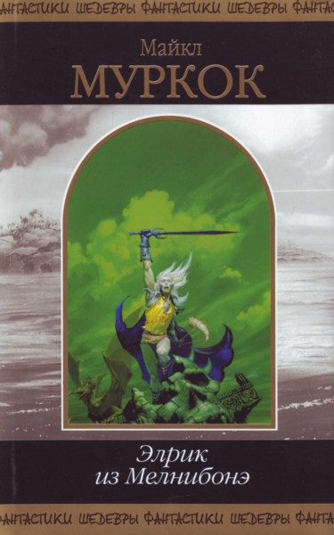 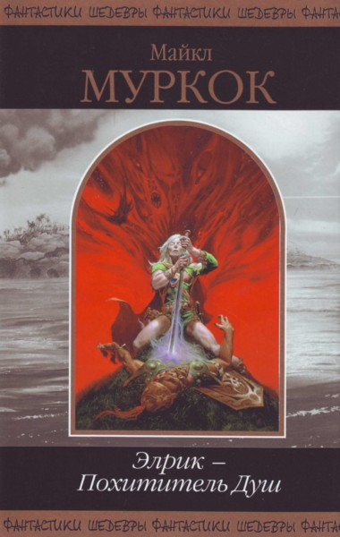
>
> Наиболее удачное издание цикла на русском языке
